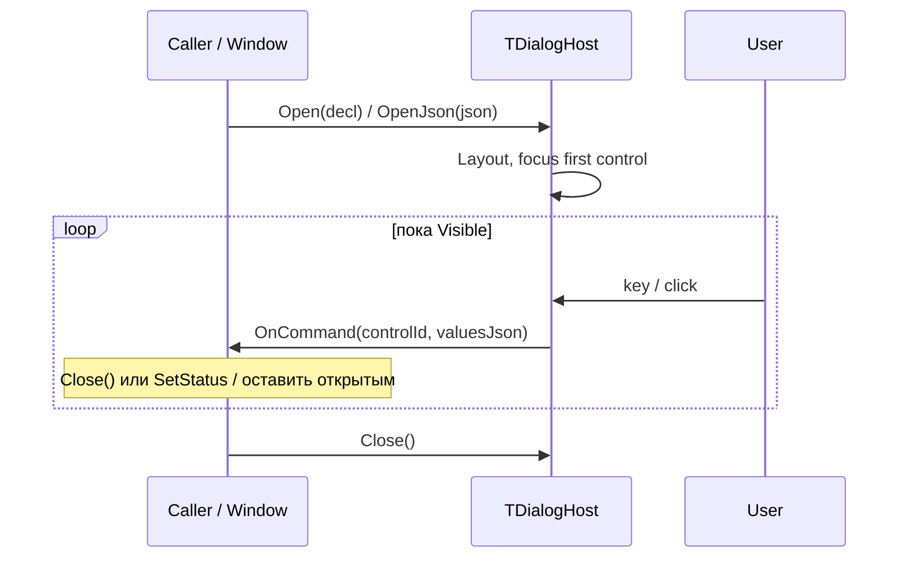

# Взаимодействие Dialog с плагином

> **Роль документа:** контракт модального диалогового окна (декларативный UI).  
> **Серия:** [UI_PRIMITIVES.md](UI_PRIMITIVES.md).  
> **Контекст:** [readme.md](readme.md) §6.2, [ARCHITECTURE.md](ARCHITECTURE.md) §6; дочерние примитивы: [INPUT_PLUGIN.md](INPUT_PLUGIN.md), [STATUS_PLUGIN.md](STATUS_PLUGIN.md).

---

## Статус реализации

| Слой | Состояние |
|---|---|
| **MVP (сейчас)** | In-process: `TDialogHost` + `uDialogJson` + builders `uDialogTypes`. JSON-декларация и values snapshot уже совпадают с будущим cdecl-швом. |
| **DLL stage (цель)** | Экспорты `mtn_dialog_*` / `mtn_plugin_handle_event` (см. §9). Семантика JSON и command-callback не меняется. |

Код: `src/Core/uDialogHost.pas`, `uDialogTypes.pas`, `uDialogJson.pas`. Потребители: Dual Panel, Viewer/Editor (через Host window).

---

## 1. Область и роли

Dialog — контейнер, который Host собирает из декларации (JSON или Pascal-builder). Дочерние контролы — примитивы ядра.

```text
TDialogHost
├── TDialogDeclaration (version, title, width, height, flat controls[])
├── Focus chain / layout (v1 flow | v2 absolute cell boxes)
├── TDialogCommandEvent(controlId, valuesJson)
└── IThemeRenderer (frame, buttons, checkbox, list colors)
```

| Участник | Ответственность |
|---|---|
| **Host (`TDialogHost`)** | Парсинг/build, focus, modal overlay, отрисовка, Enter/Esc/клики → command. |
| **Вызывающий код / будущий плагин** | Декларация layout, начальные значения, реакция на `command` (id + values). В **2.0** — явные `col`/`row`/`width`/`height` контролов. |
| **IThemeRenderer** | `DrawDialogFrame` (white body / black text), `DrawButton`, `DrawCheckBox`, `ResolveDialogRowColors`. MDI windows still use `DrawWindowFrame`. |

Плагин **не** создаёт виджеты императивно и не позиционирует пиксели — только cell-декларация и данные.

---

## 2. Жизненный цикл (MVP)



| Этап | Действие |
|---|---|
| **declare** | Caller отдаёт `TDialogDeclaration` или JSON. |
| **build** | Host копирует controls, clamp size (width ≥ 28, height ≥ 6), focus на первый focusable. |
| **interact** | Только `command` (кнопка / Enter / Esc / Y-N / клик). Событий `change` / `close_query` в MVP нет. |
| **close** | Caller вызывает `Close` после обработки команды (или Host остаётся открытым — например Find + Status). |

DLL-этап добавит `dialog_get_declaration` / `dialog_opened` / `closed` / `ResultCode` — см. §9.

---

## 3. In-process API

```pascal
type
  TDialogCommandEvent = reference to procedure(
    const AControlId: string; const AValuesJson: string);

procedure Open(const ADecl: TDialogDeclaration; AOnCommand: TDialogCommandEvent);
function OpenJson(const ADeclJson: string; AOnCommand: TDialogCommandEvent): Boolean;
procedure Close;
function Visible: Boolean;

function GetValuesJson: string;
function GetInputValue(const AId: string): string;
function GetCheckbox(const AId: string): Boolean;
function GetListSelectedIndex(const AId: string): Integer;
function GetListSelectedText(const AId: string): string;
procedure SetStatus(const AId, AText: string);

procedure Draw(...);
function HandleInput(...): Boolean;
function HandleClick(ALocalCol, ALocalRow: Integer): Boolean;
```

JSON ↔ модель: `TryParseDialogJson` / `DeclarationToJson` (`uDialogJson`).

### 3.1. Пример декларации (protocol 1.0)

```json
{
  "type": "dialog",
  "version": "1.0",
  "title": "Find file",
  "width": 58,
  "height": 15,
  "children": [
    { "type": "label", "text": "A file mask or several file masks:" },
    { "type": "input", "id": "search_mask", "value": "*.*" },
    { "type": "checkbox", "id": "search_subdirs", "text": "Search in subfolders", "checked": true },
    { "type": "status", "id": "search_status", "text": "" },
    {
      "type": "button_row",
      "children": [
        { "type": "button", "id": "btn_start", "text": "Find", "default": true },
        { "type": "button", "id": "btn_cancel", "text": "Cancel", "cancel": true }
      ]
    }
  ]
}
```

Пример с `list` (Copy/Move):

```json
{
  "type": "list",
  "id": "job_existing",
  "selected": 0,
  "items": ["Ask", "Overwrite", "Skip"]
}
```

### 3.1a. Пример декларации (protocol 2.0)

В **2.0** Host не делает flow-layout и не подгоняет высоту окна под контролы: только рисует каждый контрол в заданном box. Координаты — относительно **client area** внутри рамки (`(0,0)` = первая ячейка внутри border).

```json
{
  "type": "dialog",
  "version": "2.0",
  "title": "Find file",
  "width": 58,
  "height": 12,
  "children": [
    { "type": "label", "text": "Mask:", "col": 1, "row": 0, "width": 8, "height": 1 },
    { "type": "input", "id": "search_mask", "value": "*.*", "col": 10, "row": 0, "width": 44, "height": 1 },
    { "type": "checkbox", "id": "search_subdirs", "text": "Subfolders", "checked": true,
      "col": 1, "row": 2, "width": 20, "height": 1 },
    { "type": "button", "id": "btn_start", "text": "Find", "default": true,
      "col": 20, "row": 9, "width": 12, "height": 1 },
    { "type": "button", "id": "btn_cancel", "text": "Cancel", "cancel": true,
      "col": 34, "row": 9, "width": 12, "height": 1 }
  ]
}
```

Синонимы геометрии: `x`/`y`/`w`/`h` ≡ `col`/`row`/`width`/`height`. Если `width`/`height` = 0 или отсутствуют — Host подставляет default по kind (кнопка по тексту, list/radio_group по числу строк, input — до правого края client).

### 3.2. Поля корня

| Поле | MVP |
|---|---|
| `type` | `"dialog"` (опционально для корня) |
| `version` | `"1.0"` (default) или `"2.0"` |
| `title` | string |
| `width` / `height` | размер окна в cell; **1.0**: clamp ≥ 28 / ≥ 6; **2.0**: как в декларации (только clamp к экрану) |
| `children` | массив контролов (предпочтительно) |
| `controls` | плоский fallback, если нет `children` |
| `modal` | **игнорируется** парсером (оверлей всегда модален на уровне Host) |

| `version` | Layout |
|---|---|
| `"1.0"` | Последовательный flow: Host размещает контролы сверху вниз; кнопки в ряд с wrap. Геометрия контролов игнорируется. |
| `"2.0"` | Абсолютный layout: каждый контрол — `col`/`row`/`width`/`height`; Host только отрисовывает в box. |

`button_row` и вложенный `dialog` — только контейнеры: дети flatten в плоский `Controls[]` (в 2.0 у контейнера нет своей геометрии — задавайте box у детей).

### 3.3. Дочерние типы (MVP)

| `type` | Поведение |
|---|---|
| `label` | Статический текст; без `id` в values |
| `input` | [INPUT_PLUGIN.md](INPUT_PLUGIN.md) / `TInputLine`; поля `id`, `value` |
| `checkbox` | `id`, `text`, `checked`; Space / клик переключает |
| `radio` / `radiobox` | `id`, `group`, `text`, `checked`; взаимное исключение внутри `group`; Space / клик выбирает |
| `radio_group` / `radiogroup` | `id`, `text` (подпись), `items[]` или `children` из `radio`, `selected`, опционально `item_ids[]`; Up/Down / клик; в values — id пункта или текст |
| `button` | `id`, `text`, `default`, `cancel` → command |
| `button_row` | Группа кнопок в одну строку (дети flatten) |
| `status` | Однострочный `text` по `id`; обновление через `SetStatus`. Не входит в values. Сегменты STATUS_PLUGIN — вне Dialog MVP. |
| `list` | `id`, `items[]`, `selected` (index); стрелки / клик по строке; в values — **текст** выбранного item |
| `dropdown` / `dropdownlist` / `combo` | `id`, `items[]`, `selected`; свёрнутый combo (текст + `↓`); Space / Alt+Down / F4 / клик открывают popup; Esc закрывает без смены; в values — **текст** |

Не реализовано: `panel` (см. [PANEL_PLUGIN.md](PANEL_PLUGIN.md) отдельно), произвольный `set_control_json` кроме `SetStatus`.

### 3.4. Values snapshot

`GetValuesJson` / аргумент `AValuesJson` в callback:

```json
{
  "search_mask": "*.pas",
  "search_subdirs": true,
  "job_existing": "Ask"
}
```

| Kind | В snapshot |
|---|---|
| `input` | string |
| `checkbox` | bool |
| `list` | selected **text** (не index) |
| `dropdown` | selected **text** (не index); индекс — `GetListSelectedIndex` |
| `radio_group` | selected **item id** (если задан `item_ids` / id у children), иначе text |
| `radio` | один ключ на `group` → id (или text) выбранного radio |
| `label` / `button` / `status` | нет |

---

## 4. Команды и ввод (MVP)

Единственное событие: `TDialogCommandEvent(controlId, valuesJson)`.

| Действие | `controlId` |
|---|---|
| Кнопка (Space / клик / Enter на focused button) | `id` кнопки |
| Enter (не на кнопке) | `default`, иначе `ok`/`yes`, иначе первая не-cancel; list-only → `"ok"` |
| Esc / `[x]` / клик снаружи рамки | `cancel`-кнопка, иначе `"cancel"` |
| `Y` / `N` | `yes`/`ok` или `no` (если такие кнопки есть) |

Caller обычно закрывает диалог в handler; Host сам `Close` не вызывает.

### Клавиатура / мышь (кратко)

- Tab / Shift+Tab — focus chain (input, checkbox, radio, radio_group, button, list, dropdown).
- List / RadioGroup / DropDown (closed): Up/Down/Home/End.
- DropDown: Space / Alt+Down / F4 / клик — открыть popup; Enter/клик по item — выбрать; Esc — свернуть.
- Radio: Space / клик выбирает в группе.
- Input: делегируется `InputLineHandleInput`; Submit → accept, Cancel → `cancel`.
- Dual Panel: при видимом диалоге Enter может вызывать handler напрямую (`ok` / `btn_start`), минуя `FireDefault` — см. `TDualPanelWindow`.

---

## 5. Host builders (`uDialogTypes`)

Layout source of truth: `src/dialogs/*.json` embedded as **RCDATA** via `MTN2.rc`
(`DIALOG_HELP`, `DIALOG_SEARCH`, …). Loaded by `uDialogResources.TryLoadDialogResource`.

Pascal `Build*` functions: load RCDATA → patch runtime fields (title, values, flags);
if the resource is missing, fall back to an in-code layout (used by ExportDialogJson).

| Builder / resource | JSON file | Назначение |
|---|---|---|
| `BuildConfirmDialog` / `DIALOG_CONFIRM` | `confirm.json` | OK / Cancel |
| `BuildHelpDialog` / `DIALOG_HELP` | `help.json` | Справка |
| `BuildInputDialog` / `DIALOG_INPUT` | `input.json` | MkDir / Rename (`name`) |
| `BuildAskSaveDialog` / `DIALOG_ASKSAVE` | `asksave.json` | Yes / No / Cancel |
| `BuildSearchDialog` / `DIALOG_SEARCH` | `search.json` | Alt+F7 Find |
| `BuildCopyMoveDialog` / `DIALOG_COPYMOVE` | `copymove.json` | F5/F6 |
| `BuildGotoLineDialog` / `DIALOG_GOTOLINE` | `gotoline.json` | Viewer/Editor |
| `BuildEncodingDialog` / `DIALOG_ENCODING` | `encoding.json` | Code page list |
| `BuildReplaceDialog` / `DIALOG_REPLACE` | `replace.json` | Replace / All / Cancel |
| `BuildWorkspaceLibraryDialog` / `DIALOG_WORKSPACES` | `workspaces.json` | Библиотека снимков `ws:///` (`Ctrl+Shift+D`) |
| `BuildFileDiffDialog` / `DIALOG_FILEDIFF` | `filediff.json` | Построчный diff Compare Files (`Ctrl+Alt+C`) |

Полный набор — **28** `DIALOG_*` в `src/MTN2Resource.rc` (hotlist, color coding, dirsync, filediff, theme, …). Runtime грузит **только RCDATA**; `src/dialogs/*.json` на диске не читаются. После правки JSON нужен `brcc32` (`src/build.ps1`). Канонический exe — `bin\MTN2.exe`.

JSON-файлы — UTF-8. Строковые литералы в `.pas` — кодовая страница компилятора (обычно Windows-1251): типографское тире в заголовке — `#$2014`, не символ `—` в кавычках (иначе в UI `вЂ"`).

Dual Panel chrome: `TDialogHost.ChromeContext` для списка даёт `fbcDialogList`; `ResolveChromeContext` мапит `THostDialogKind` на отдельные контексты F-bar (`fbcWorkspaceLibrary`, `fbcFolderHotlist`, `fbcColorCoding`, …). Видимый stub рисуется **поверх** диалога (`DispatchDrawOverlays`: dialog → stub → F9 submenu) и перехватывает ввод/клик раньше списка.

Edit layout with **Dialog Designer** (`tools/DialogDesigner`). Re-export from builders:
`tools/ExportDialogJson` → `src/dialogs/*.json`, then rebuild MTN2 (brcc32 packs RCDATA).

Фабрики контролов: `MakeLabel`, `MakeInput`, `MakeCheckbox`, `MakeRadio`,
`MakeRadioGroup`, `MakeButton`, `MakeStatus`, `MakeList`.

---

## 6. Владение состоянием

| Состояние | Владелец |
|---|---|
| Дерево контролов, focus, list selection mirror | **Host** |
| Декларация, семантика команд, валидация | **Caller / плагин** |
| Values во время ввода | **Host** (snapshot на command) |

Динамика MVP: `SetStatus`. Полный `set_control_json` / пересборка — DLL stage.

---

## 7. Потоки

* Декларация и values — UI-поток, без I/O.
* Долгая работа по кнопке (поиск, copy job) — Jobs; диалог может оставаться открытым, Status — через `SetStatus` + invalidate.

---

## 8. Инварианты

1. Плагин не вызывает Canvas и не задаёт координаты в пикселях — только cell-геометрию в декларации (`width`/`height` окна; в **2.0** ещё `col`/`row`/`width`/`height` контролов).
2. Dialog блокирует ввод нижележащим окнам на уровне Host (не OS message-box).
3. Кнопки `default` / `cancel` обрабатывает Host (Enter/Esc) → `command`.
4. Вложенные примитивы подчиняются своим контрактам серии.
5. `list` в values отдаёт текст item; индекс — через `GetListSelectedIndex` у Host.
6. В **2.0** Host не пересчитывает размер окна по содержимому и не делает flow-layout.

---

## 9. Целевой cdecl API (DLL stage)

Ещё не экспортируется. Сохраняется для будущего шва без смены JSON:

```pascal
procedure mtn_dialog_get_declaration(WindowId: Integer;
  OutBuffer: PAnsiChar; MaxLen: Integer); cdecl;

function mtn_dialog_open(WindowId: Integer; Modal: Integer): Integer; cdecl;

procedure mtn_dialog_close(WindowId: Integer; ResultCode: Integer); cdecl;

procedure mtn_dialog_get_values_json(WindowId: Integer;
  OutBuffer: PAnsiChar; MaxLen: Integer); cdecl;

procedure mtn_dialog_set_control_json(WindowId: Integer;
  const ControlId: PAnsiChar; const Json: PAnsiChar); cdecl;

procedure mtn_plugin_handle_event(WindowId: Integer; EventType: Integer;
  Param1: Integer; Param2: Integer); cdecl;

procedure mtn_host_invalidate(WindowId: Integer); cdecl;
procedure mtn_host_close_dialog(WindowId: Integer; ResultCode: Integer); cdecl;
```

### Планируемые EventType

| EventType | Имя | MVP сейчас |
|---|---|---|
| 60 | `command` | Да (через callback, не cdecl) |
| 61 | `change` | Нет |
| 62 | `close_query` | Нет (Esc сразу cancel) |
| 63 | `closed` | Нет |

Payload command (цель):

```json
{ "control_id": "btn_start", "values": { "search_mask": "*.pas" } }
```

### ResultCode (цель)

| ResultCode | Значение |
|---|---|
| 0 | `ok` / default accept |
| 1 | `cancel` |
| ≥ 100 | custom |

В MVP закрытие идентифицируется строковым `controlId` (`ok`, `cancel`, `btn_start`, …), не числовым ResultCode.
