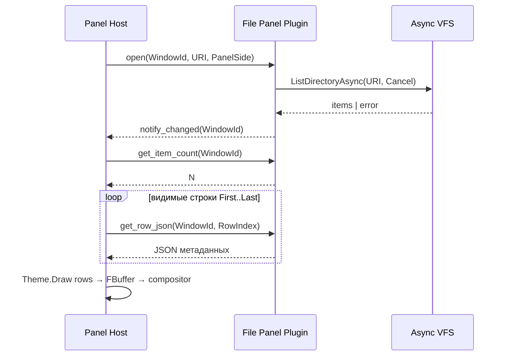
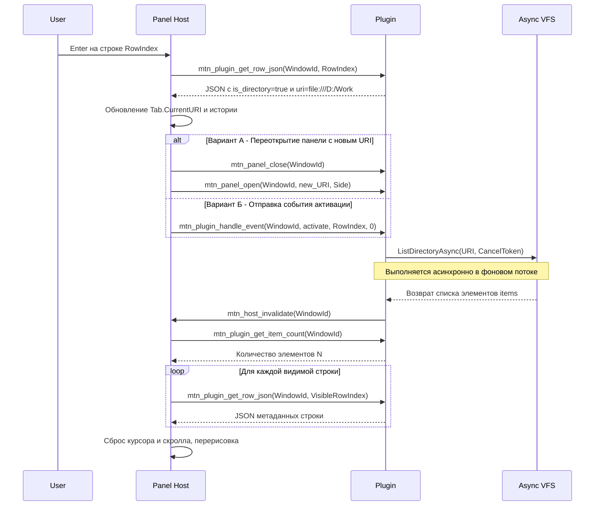

# Взаимодействие файловой панели с плагином

> **Роль документа:** контракт одной файловой панели (одна сторона Dual Panel, активный Panel Tab) с плагином-поставщиком данных.  
> **Серия:** [UI_PRIMITIVES.md](UI_PRIMITIVES.md) (примитив Panel).  
> **Контекст:** [readme.md](readme.md) (SDS §3.3, §6), [ARCHITECTURE.md](ARCHITECTURE.md) (§3, §6).  
> **Связанные примитивы:** [STATUS_PLUGIN.md](STATUS_PLUGIN.md), [TOOLBAR_PLUGIN.md](TOOLBAR_PLUGIN.md), [OVERLAY_PLUGIN.md](OVERLAY_PLUGIN.md).

---

## 1. Область и роли

Документ описывает **одну** файловую панель:

```text
TDualPanelWindow
└── Active Workspace (Dual Panel Tab)
    └── Left | Right  ← эта сторона
        └── Active Panel Tab (TTab)
            ├── CurrentURI
            ├── CursorIndex / ScrollOffset / Selection
            └── Bound Plugin Instance (WindowId)
```

| Участник | Ответственность |
|---|---|
| **Panel Host (ядро)** | Layout списка, scroll, курсор, multi-select, keymap, запрос видимых строк, маршрутизация событий, отрисовка через тему. |
| **File Panel Plugin** | Модель каталога: число элементов, метаданные строк, реакция на логические события (открыть, обновить, изменить URI). Без `TCanvas` и без цветов. |
| **IThemeRenderer** | Стиль строк/рамки/табов по логическим полям (`is_directory`, `is_hidden`, …). |
| **Async VFS / Jobs** | I/O по URI; плагин инициирует загрузку списка, ядро не читает диск из UI-потока. |

Плагин **не рисует** панель. Он отвечает на Pull-запросы и события. Решение «какой плагин обслуживает URI» принимает ядро (по схеме URI / ассоциациям / явному mount).

---

## 2. Привязка плагина к панели

Каждый активный Panel Tab имеет:

* `CurrentURI` — логический путь (`file:///D:/Work`, `sftp://…`, `…zip!/…`);
* `WindowId` — идентификатор экземпляра представления панели в Host API;
* `PluginId` — какой плагин обслуживает этот tab.

### 2.1. Жизненный цикл



| Этап | Кто | Действие |
|---|---|---|
| **open** | Host → Plugin | Создать/привязать модель к `WindowId`, задать URI. Плагин стартует async list. |
| **ready / changed** | Plugin → Host | Сигнал, что модель обновилась (через callback Host API или Event Bus `panel.model.changed`). |
| **pull** | Host → Plugin | Запрос count и строк видимого диапазона. |
| **event** | Host → Plugin | Логические действия пользователя. |
| **close** | Host → Plugin | Отмена pending jobs, освобождение модели `WindowId`. |

Смена Panel Tab или Dual Panel Tab: для уходящего tab — `close` или `deactivate` (кэш модели может сохраняться); для входящего — `open` / `activate` + pull.

---

## 3. Pull-протокол (данные → панель)

Host запрашивает данные **только для видимой области** списка (и при необходимости — строку курсора, если она вне viewport, для статус-бара).

### 3.1. C-совместимый Host API (панельный профиль)

```pascal
// Жизненный цикл
function mtn_panel_open(WindowId: Integer; const URI: PAnsiChar; Side: Integer): Integer; cdecl;
procedure mtn_panel_close(WindowId: Integer); cdecl;

// Pull
function mtn_plugin_get_item_count(WindowId: Integer): Integer; cdecl;
procedure mtn_plugin_get_row_json(WindowId: Integer; RowIndex: Integer;
  OutBuffer: PAnsiChar; MaxLen: Integer); cdecl;

// События (см. §4)
procedure mtn_plugin_handle_event(WindowId: Integer; EventType: Integer;
  Param1: Integer; Param2: Integer); cdecl;

// Плагин → Host: модель изменилась, нужен repaint/pull
procedure mtn_host_invalidate(WindowId: Integer); cdecl;
```

`mtn_panel_open` возвращает `0` при успехе привязки; отрицательный код — ошибка (неподдерживаемая схема, отказ плагина).

### 3.2. JSON строки панели

Плагин возвращает **только логические метаданные**. Поля стиля (`fg_color`, `bold`, …) запрещены.

```json
{
  "id": "file:readme.md",
  "text": "readme.md",
  "size": 38063,
  "size_text": "37.2 KB",
  "is_directory": false,
  "is_parent": false,
  "is_hidden": false,
  "is_readonly": false,
  "is_symlink": false,
  "file_type": "document",
  "modified": "2026-07-18T01:00:00Z",
  "attributes": "A",
  "uri": "file:///D:/Work/Delphi/MTN2/readme.md"
}
```

| Поле | Обязательность | Назначение |
|---|---|---|
| `text` | да | Отображаемое имя в колонке Name |
| `is_directory` | да | Навигация / иконка / тема |
| `is_parent` | нет | Строка `..`; Host может рисовать её особо |
| `size` | нет | Число байт (`-1` для директорий, если не посчитано) |
| `size_text` | нет | Готовая строка для колонки; иначе Host форматирует `size` |
| `uri` | рекомендуется | Полный URI элемента для ассоциаций / операций |
| `file_type` | нет | Логический класс для темы (`executable`, `archive`, …) |
| `id` | нет | Стабильный ключ строки для selection across refresh |

### 3.3. Правила индексации

* Индексы строк — `0 .. Count-1` в порядке, заданном плагином (после его сортировки/фильтра).
* Строка `..` (`is_parent: true`), если есть, обычно имеет индекс `0`.
* Host **не** кэширует JSON между `invalidate`, кроме краткоживущего кэша видимого окна (до следующего `mtn_host_invalidate`).
* `get_row_json` для индекса вне диапазона: пустой буфер / нулевая длина; Host игнорирует строку.

### 3.4. Состояние загрузки и ошибок

Пока async list не завершён, `get_item_count` может возвращать `0`, а панель показывает placeholder (текст задаёт Host/тема: «Чтение…»).

После ошибки VFS плагин вызывает `invalidate` и отдаёт count = 0 **либо** одну служебную строку:

```json
{
  "text": "Access denied",
  "is_directory": false,
  "is_error": true,
  "error_code": "access_denied",
  "uri": "file:///D:/Secret"
}
```

Host не парсит произвольный текст ошибки для логики — только `is_error` / `error_code`.

---

## 4. События (панель → плагин)

Физический ввод (клавиши, мышь) обрабатывает **Host**. Плагину уходят только логические события.

| EventType | Имя | Param1 | Param2 | Семантика |
|---|---|---|---|---|
| 1 | `activate` | `RowIndex` | 0 | Enter / двойной клик по строке |
| 2 | `select` | `RowIndex` | `Mode`† | Изменение выделения |
| 3 | `cursor` | `RowIndex` | 0 | Курсор перемещён (для preview/quick view) |
| 4 | `refresh` | 0 | 0 | Принудительное обновление списка (Ctrl+R) |
| 5 | `set_uri` | 0 | 0 | Новый URI в побочном канале‡ |
| 6 | `back` | 0 | 0 | История назад (Host может сам менять URI tab) |
| 7 | `forward` | 0 | 0 | История вперёд |
| 8 | `close` | 0 | 0 | Tab закрывается |

† `Mode`: `0` = заменить selection, `1` = toggle, `2` = range to cursor.  
‡ При `set_uri` фактический URI передаётся отдельным вызовом:

```pascal
procedure mtn_panel_set_uri(WindowId: Integer; const URI: PAnsiChar); cdecl;
```

Либо Host вызывает `mtn_panel_close` + `mtn_panel_open` с новым URI (проще для MVP).

### 4.1. Сценарий: вход в каталог



* Если `is_directory = false` — Host отдаёт URI в подсистему ассоциаций (Viewer / PTY / ShellExecute); плагин панели может получить `activate` для реакции (например, пометить recent), но открытие файла делает ядро.
* Если `is_parent = true` — Host вычисляет parent URI (или берёт из `uri` строки) и выполняет тот же цикл смены URI.

### 4.2. Сценарий: обновление (Ctrl+R)

1. Host → `handle_event(refresh)`.
2. Плагин отменяет предыдущий list-job (cancel token), стартует новый.
3. По завершении → `invalidate`.
4. Host сохраняет selection по `id` строк, если возможно; иначе сбрасывает.

---

## 5. Что хранит Host, что — плагин

| Состояние | Владелец | Комментарий |
|---|---|---|
| `CurrentURI`, History, HistoryIndex | **Host (`TTab`)** | Источник истины для пути вкладки |
| CursorIndex, ScrollOffset, Selection | **Host** | Чисто UI |
| Порядок/фильтр/сортировка списка | **Плагин** (или Host через команды — см. §7) | MVP: сортировка может жить в системном file-плагине |
| Кэш сырых `TFileAttributes` | **Плагин** | Не в UI-потоке при заполнении |
| Цвета, рамка, колонки layout | **Host + Theme** | Плагин не участвует |
| Pending CancelToken list-job | **Плагин** | Обязательная отмена при `close` / новом list |

Инвариант: после `invalidate` Host заново делает Pull; плагин не пушит готовые «отрисованные» строки.

---

## 6. Потоки и производительность

1. `get_item_count` / `get_row_json` вызываются из **UI-потока** во время rebuild/paint подготовки → должны быть **O(1) / O(visible)** без I/O и без блокировок на сеть/диск.
2. Любой VFS — только в worker; результат кладётся в структуру модели плагина, затем `mtn_host_invalidate` через `TThread.Queue`.
3. Запрещено: читать каталог внутри `get_row_json`.
4. Рекомендуемый кэш плагина: `TArray` или chunked pages; для MVP достаточно полного списка директории в памяти после list.

---

## 7. Колонки и сортировка (контракт расширения)

MVP: Host рисует фиксированный набор колонок (Name, Size, Date, Attr), заполняя их из JSON полей. Текущий режим сортировки Host показывает сам: FAR-глиф в левом верхнем углу рабочего поля файловой панели (`DrawPanelSortLetter` / `PanelSortModeLetter`; не на рамке; контраст из `ResolvePanelChromeColors`). Плагин отвечает только за порядок строк в Pull после события `sort`.

Post-MVP (опционально): плагин может объявить схему колонок при `open`:

```json
{
  "columns": [
    { "id": "name", "title": "Name", "field": "text", "width": 0 },
    { "id": "size", "title": "Size", "field": "size_text", "width": 10 },
    { "id": "date", "title": "Date", "field": "modified", "width": 16 }
  ],
  "sort": { "column": "name", "asc": true }
}
```

Смена сортировки — событие Host → Plugin (`sort`, Param1 = column index, Param2 = 0/1 asc/desc) → перестроение модели → `invalidate`.

---

## 8. Связь с Dual Panel и двумя сторонами

* Левая и правая панели — **два независимых** `WindowId` и два экземпляра модели (даже если URI совпадают).
* Операции Copy/Move между панелями инициирует **ядро** (Jobs + VFS), читая selection URI с активной стороны и `CurrentURI` противоположной. Плагин панели предоставляет URI элементов через Pull; сам копированием не занимается (если это не специальный VFS-плагин с собственным API — вне данного контракта).
* Dual Panel Tab переключает целиком `TDualPanelState`: обе стороны получают `deactivate`/`activate` своих Panel Tab.

---

## 9. Event Bus (опциональные уведомления)

Плагин может публиковать (не вместо `invalidate`):

| EventType | Когда | JSON (пример) |
|---|---|---|
| `panel.model.changed` | Список перестроен | `{"window_id": 3, "uri": "file:///D:/Work", "count": 120}` |
| `panel.uri.changed` | Плагин сам сменил URI (редко; предпочтителен Host) | `{"window_id": 3, "uri": "…"}` |
| `vfs.directory.changed` | Внешнее изменение (watcher, Post-MVP) | `{"uri": "file:///D:/Work"}` |

Host, подписанный на `vfs.directory.changed`, для tab с совпадающим URI шлёт плагину `refresh`.

---

## 10. Минимальный сценарий MVP (системный Local FS plugin)

1. Host открывает tab с `file:///C:/` → `mtn_panel_open`.
2. Плагин → `ListDirectoryAsync` → наполняет массив → `invalidate`.
3. Host тянет строки `ScrollOffset .. ScrollOffset+VisibleRows-1`.
4. Theme рисует имена/размеры; директории — цветом темы.
5. Enter на папке → Host меняет `TTab.CurrentURI` → `open`/`set_uri` → цикл с п.2.
6. Enter на файле → ассоциации ядра; панель остаётся на том же URI.
7. Закрытие tab → `mtn_panel_close` + cancel list-job.

---

## 11. Инварианты контракта

1. Плагин не получает `TCanvas`, `TTerminalGrid` и не выбирает цвета строк.
2. Pull из UI-потока без I/O.
3. Единственный сигнал «перерисуй» от плагина — `mtn_host_invalidate` (или эквивалент на Event Bus).
4. `CurrentURI` вкладки принадлежит Host; плагин не меняет History самостоятельно.
5. Ошибки list доставляются через модель (`is_error`) или пустой список + статус Host, не через исключения через границу DLL.
6. При `close` все cancel-token'ы панели обязаны быть запрошены.
