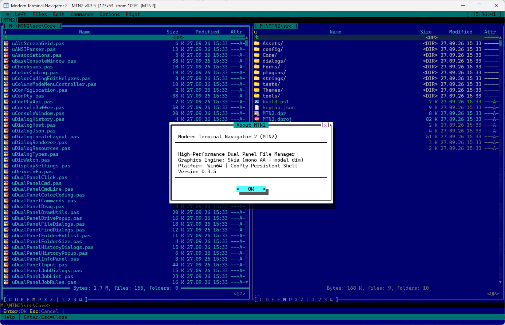

# Modern Terminal Navigator 2 (MTN2)

[English](README.en.md) | [Deutsch](README.de.md) | **Русский** | [中文](README.zh.md) | [한국어](README.ko.md)

Двухпанельный файловый менеджер в духе **Necromancer's DOS Navigator** и **Far Manager** со встроенной консолью,
терминалами, просмотрщиком и редактором. Интерфейс – текстовый (TUI), но рисуется в обычном GUI-окне:
виртуальная сетка символов на холсте Delphi FireMonkey (Skia, с откатом на стандартный холст по `--no-skia`)
с TrueType-шрифтами, Unicode и 32-битным цветом. Китайские, японские и корейские иероглифы
занимают две колонки, как в других терминалах.

[](https://github.com/Laex/MTN2/actions/workflows/ci.yml)
[](LICENSE)



Что нового в каждой версии – [CHANGELOG.md](CHANGELOG.md).

## Возможности

- **Панели:** две панели с вкладками, Brief/Full/колоночные режимы, сортировка, быстрый поиск и живой фильтр,
  выделение по маске, сравнение каталогов, история и избранные папки, длинные пути (> MAX_PATH).
- **Операции с файлами:** копирование, перенос и удаление в фоновых заданиях с прогрессом, атрибуты и даты,
  ссылки, корзина, контрольные суммы, синхронизация каталогов.
- **Консоль и терминалы:** командная строка под панелями, настоящий ConPTY (cmd, PowerShell, pwsh, Git Bash, WSL,
  SSH), ANSI/VT-разбор, альтернативный экран для TUI-программ, рабочие пространства терминалов.
  Консольные программы, запущенные из панели или командной строки, работают во встроенной консоли, и их вывод
  остаётся на экране (`Ctrl+O`).
- **Просмотр и редактирование:** встроенные Viewer (текст, hex, потоковое чтение больших файлов), Editor,
  Quick View (`Ctrl+Q`), просмотр Markdown, внешние просмотрщик/редактор.
- **Виртуальные ФС:** архивы как папки (zip, 7z через `7z.dll`), SFTP по SSH, плагинные VFS.
- **Настройка:** переопределяемые клавиши (`keymap.json`), темы из файлов (Far Classic, Total Commander, Dracula, Nord, Solarized, High Contrast и др.; свои – в редакторе тем),
  меню пользователя (F2), ассоциации файлов, контекстная справка F1.
- **Языки:** интерфейс и справка на английском, русском и немецком; язык выбирается в **Настройки → Шрифт / экран...**
  и применяется без перезапуска. Свой язык можно добавить файлом `strings\<язык>.json` рядом с `MTN2.exe`.
- **Unicode:** иероглифы CJK (основная многоязычная плоскость), хирагана, катакана, хангыль и полноширинные
  формы показываются в консоли, панелях, вкладках и заголовках в две колонки; шрифт подставляется системный.
- **Плагины:** нативные DLL и WebAssembly (через Wasmtime) – свои VFS-схемы и панели для них, пункты меню,
  привязки клавиш, шина сообщений. Протоколы диалогов, оверлеев и строк состояния для плагинов описаны,
  но пока доступны только самой программе – см. [PLUGIN_BOUNDARIES](docs/PLUGIN_BOUNDARIES.md).
- **Обновления:** раз в сутки проверка новой версии на GitHub; загрузка (с проверкой SHA-256), установка
  и перезапуск – только после вопроса пользователю. Меню **≡ → Обновления...**.

Сейчас поддерживается Windows x64; POSIX PTY и сборки под macOS/Linux – в планах.

## Установка

Готовые сборки – на странице [Releases](https://github.com/Laex/MTN2/releases):

- `MTN2-<версия>-win64.zip` – настройки и история хранятся в `%APPDATA%\MTN2`;
- `MTN2-<версия>-win64-portable.zip` – переносная версия: всё хранится рядом с `MTN2.exe`.

Архив достаточно распаковать в любую папку и запустить `MTN2.exe`. Дальше программа обновляется сама
(меню **≡ → Обновления...**). В комплект входит `7z.dll` из [7-Zip](https://www.7-zip.org) (GNU LGPL; тексты лицензий – в
`plugins\mtn.7z\license.txt`, подробности – в [THIRD-PARTY.md](THIRD-PARTY.md)): с ней открываются архивы 7z и другие
форматы 7-Zip. Её можно заменить своей x64-версией в `plugins\mtn.7z\`; zip открывается и без неё.

### Dev-сборки

Пре-релизные (dev) сборки публикуются после каждого изменения в `main` в отдельном репозитории
[Laex/MTN2-dev](https://github.com/Laex/MTN2-dev/releases). Чтобы получать их автоматически, откройте
**≡ → Обновления...** и включите флажок dev-канала; вернуться на стабильные релизы можно, сняв его.
Dev-сборки содержат свежие изменения и могут быть менее стабильными.

## Сборка

Нужны RAD Studio 13 (Delphi, `Studio\37.0`) и Windows x64; для WASM-плагина `mtn.ws` – Rust.

```powershell
./src/build.ps1 -Config Release -Platform Win64   # bin\MTN2.exe + bin\plugins\
./src/tests/run-tests.ps1                          # регрессионные тесты (DUnitX)
```

Запуск: `bin\MTN2.exe [--no-skia] [--fps] [путь]`. Подробности – в [docs/BUILDING.md](docs/BUILDING.md).

## Структура репозитория

| Путь | Содержимое |
|---|---|
| `src/Core` | ядро: панели, VFS, ConPTY, консоль, редактор, диалоги, плагинный хост |
| `src/Forms`, `src/dialogs`, `src/strings`, `src/Assets/themes` | главная форма, JSON-диалоги, локализация, встроенные темы |
| `src/plugins` | встроенные плагины (`mtn.7z`, `mtn.tmp`, `mtn.ws`, WASM-демо) |
| `src/tests` | регрессионные тесты DUnitX по группам и раннер `run-tests.ps1` |
| `src/tools` | DialogDesigner, ExportDialogJson, группа проектов `Group.groupproj`, служебные скрипты |
| `bin/help` | справка F1 (en/ru/de), поставляется вместе с программой |
| `docs` | документация разработчика, скриншоты (`docs/images`) |

## Документация

- [SDS.md](docs/SDS.md) – полная спецификация: концепция, структуры данных, API, дорожная карта.
- [ARCHITECTURE.md](docs/ARCHITECTURE.md) – слои, потоки данных и инварианты.
- [BUILDING.md](docs/BUILDING.md) – сборка, тесты, CI/CD.
- [THEMES.md](docs/THEMES.md) – формат файла темы и роли цветов.
- [HELP.md](docs/HELP.md) – исходный текст справки пользователя одним файлом.
- Плагинные контракты: [PLUGIN_BOUNDARIES](docs/PLUGIN_BOUNDARIES.md), [PANEL](docs/PANEL_PLUGIN.md),
  [DIALOG](docs/DIALOG_PLUGIN.md), [INPUT](docs/INPUT_PLUGIN.md), [OVERLAY](docs/OVERLAY_PLUGIN.md),
  [STATUS](docs/STATUS_PLUGIN.md), [TEXTAREA](docs/TEXTAREA_PLUGIN.md), [TOOLBAR](docs/TOOLBAR_PLUGIN.md),
  [UI_PRIMITIVES](docs/UI_PRIMITIVES.md).

## Как создавался проект

При разработке MTN2 использовались ИИ-ассистенты, в том числе собственной разработки. С их помощью созданы:

- предпроектная документация – спецификация ([SDS.md](docs/SDS.md)), обзор архитектуры, описания протоколов
  плагинов в `docs/`;
- отслеживание дорожной карты и планов работ;
- большинство комментариев в коде;
- регрессионные тесты на DUnitX (`src/tests`);
- выходная текстовая документация: справка F1 (`bin/help`), [CHANGELOG.md](CHANGELOG.md), описания выпусков.

## Лицензия

[Mozilla Public License 2.0](LICENSE).
