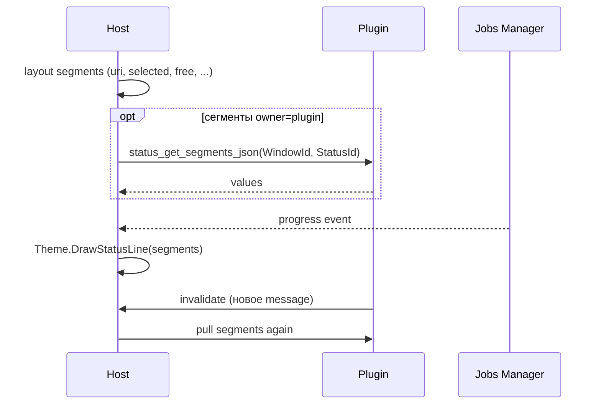

# Взаимодействие Status Line с плагином

> **Роль документа:** контракт строки состояния (Status Line / Status Bar) с плагином.  
> **Серия:** [UI_PRIMITIVES.md](UI_PRIMITIVES.md).  
> **Контекст:** [readme.md](readme.md) §6.2, `IThemeRenderer.DrawStatusLine`; часто рядом с [PANEL_PLUGIN.md](PANEL_PLUGIN.md).

---

## 1. Область и роли

Status Line — одно- или двухстрочный примитив с логическими сегментами (URI, free space, selected count/size, тип файла, прогресс job, сообщение).

```text
TDualPanelWindow / Dialog / Viewer
└── Status Line (StatusId)
    ├── Segment layout (ids)
    ├── Resolved text segments[]
    └── Data sources: Host | Plugin | Jobs
```

| Участник | Ответственность |
|---|---|
| **Host** | Геометрия, состав сегментов по умолчанию, форматирование размеров/дат, progress от Jobs, `DrawStatusLine`. |
| **Плагин** | Опциональные сегменты и значения (`message`, custom metrics); invalidate при изменении. |
| **IThemeRenderer** | Разделители, цвета сегментов по *ролям* (normal/warn/error), не по произвольному RGB от плагина. |

**MVP (сейчас):** строка статуса Dual Panel — Host-only (`TryFormatChromeStatus` / `ResolveChromeContext` в `uDualPanelStatus.pas`). cdecl pull сегментов ещё не экспортируется.

---

## 2. Жизненный цикл



| Этап | Действие |
|---|---|
| **configure** | Декларация или дефолт Host: список id сегментов. |
| **pull** | Host собирает тексты: свои + плагинные. |
| **draw** | Тема раскладывает сегменты в ячейки. |
| **update** | Jobs/плагин/панель → invalidate → pull. |

---

## 3. API и JSON

```pascal
procedure mtn_status_get_segments_json(WindowId, StatusId: Integer;
  OutBuffer: PAnsiChar; MaxLen: Integer); cdecl;

procedure mtn_plugin_handle_event(WindowId: Integer; EventType: Integer;
  Param1: Integer; Param2: Integer); cdecl;

procedure mtn_host_invalidate(WindowId: Integer); cdecl;
```

### 3.1. Декларация (в Dialog или конфиге панели)

```json
{
  "type": "status",
  "id": "panel_status",
  "segments": ["uri", "selected", "free", "file_type", "message"]
}
```

### 3.2. Ответ плагина (только свои / переопределяемые поля)

```json
{
  "message": "Indexing…",
  "message_role": "info",
  "custom": [
    { "id": "branch", "text": "main", "role": "normal" }
  ]
}
```

| Поле / сегмент | Кто наполняет | Смысл |
|---|---|---|
| `uri` | **Host** (`TTab.CurrentURI`) | Текущий путь |
| `selected` | **Host** (selection + pull size) | `3 (1.2 MB)` |
| `free` | **Host** / VFS meta job | Свободное место тома |
| `file_type` | **Host** из row JSON панели | Тип под курсором |
| `progress` | **Host** / Jobs | `45%` / `12 MB / 30 MB` |
| `message` | **Плагин** или Host | Произвольный статус |
| `custom[]` | **Плагин** | Доп. сегменты |

### 3.3. Роли сегментов (для темы)

`normal` | `info` | `warn` | `error` | `progress`

Плагин указывает **роль**, не цвет.

---

## 4. События

| EventType | Имя | Param1 | Param2 | Семантика |
|---|---|---|---|---|
| 90 | `refresh` | StatusId | 0 | Host просит обновить значения |
| 91 | `click_segment` | StatusId | SegmentIndex | Клик по сегменту (если enabled) |

Клик по `uri` может открыть диалог пути (Host); по `branch` — команда плагина.

---

## 5. Владение состоянием

| Состояние | Владелец |
|---|---|
| Layout id сегментов, геометрия | **Host** |
| uri / selected / free / progress | **Host** (+ Jobs/VFS) |
| message / custom | **Плагин** |
| Визуальные разделители | **Theme** |

Инвариант: для файловой панели Status часто обновляется при `cursor` / `select` из [PANEL_PLUGIN.md](PANEL_PLUGIN.md) без участия плагина статуса — Host сам читает row JSON.

---

## 6. Потоки

* Сборка текстов сегментов — UI-поток; `free`/долгие метрики кэшируются из фоновых job.
* Плагин не блокирует UI в `get_segments_json`.

---

## 7. Инварианты

1. Нет RGB/стилей от плагина — только текст + `role`.
2. Progress job рисует Host; плагин не дублирует прогресс-бар копирования, если Jobs уже шлёт в Host.
3. Двухстрочный status: Host передаёт в тему два массива сегментов (`line0`, `line1`) или два StatusId.
4. `DrawStatusLine` получает уже готовые строки сегментов.
