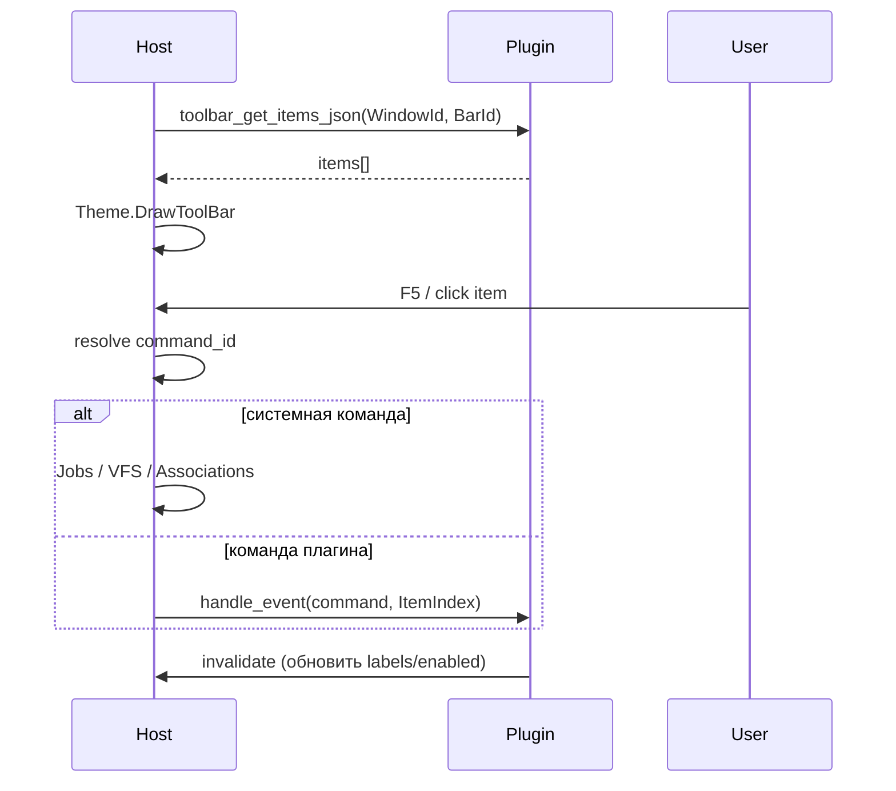

# Взаимодействие Toolbar / Button Bar с плагином

> **Роль документа:** контракт панели инструментов (обычно F1–F12) с плагином.  
> **Серия:** [UI_PRIMITIVES.md](UI_PRIMITIVES.md).  
> **Контекст:** [readme.md](readme.md) §6.2, `IThemeRenderer.DrawToolBar`.

---

## 1. Область и роли

Toolbar (Button Bar) — ряд командных кнопок, привязанных к горячим клавишам. Чаще всего — нижняя/верхняя полоса Dual Panel или контекстная полоса Viewer/Editor.

```text
TDualPanelWindow / TTerminalWindow
└── Toolbar (BarId)
    ├── Items[0..N] (key, label, enabled, command_id)
    └── Bound Plugin or Host keymap provider (WindowId)
```

| Участник | Ответственность |
|---|---|
| **Host** | Размещение bar, клики/горячие клавиши, вызов команд, отрисовка через `DrawToolBar`. |
| **Плагин** | Набор пунктов (или дельта к системному набору), enable/disable, обработка своих `command_id`. |
| **Keymapper** | Глобальные/локальные биндинги; Toolbar отображает актуальные подписи клавиш. |
| **IThemeRenderer** | Внешний вид кнопок и подписей. |

Системные F-клавиши (F3 Viewer, F5 Copy, …) может полностью задавать **ядро**; плагин расширяет или перекрывает пункты для своего режима.

**MVP (сейчас):** нижняя F-строка Dual Panel — Host-only (`uFunctionBar.pas` + `ResolveChromeContext` в `uDualPanelStatus.pas`). Контекст зависит от оверлея (панели / диалог / stub / Change Drive / job). cdecl `mtn_toolbar_get_items_json` ещё не экспортируется.

---

## 2. Жизненный цикл



| Этап | Действие |
|---|---|
| **pull items** | Host запрашивает актуальный список при показе / после invalidate. |
| **invoke** | Физический ввод → логическая команда. |
| **update** | Плагин меняет enabled/text → `invalidate`. |

---

## 3. API и JSON

```pascal
procedure mtn_toolbar_get_items_json(WindowId, BarId: Integer;
  OutBuffer: PAnsiChar; MaxLen: Integer); cdecl;

procedure mtn_plugin_handle_event(WindowId: Integer; EventType: Integer;
  Param1: Integer; Param2: Integer); cdecl;

procedure mtn_host_invalidate(WindowId: Integer); cdecl;
```

### 3.1. JSON набора кнопок

```json
{
  "bar_id": "main",
  "items": [
    { "id": "help", "key": "F1", "text": "Help", "enabled": true, "owner": "host" },
    { "id": "user_menu", "key": "F2", "text": "Menu", "enabled": true, "owner": "host" },
    { "id": "view", "key": "F3", "text": "View", "enabled": true, "owner": "host" },
    { "id": "edit", "key": "F4", "text": "Edit", "enabled": true, "owner": "host" },
    { "id": "copy", "key": "F5", "text": "Copy", "enabled": true, "owner": "host" },
    { "id": "git_status", "key": "F9", "text": "Git", "enabled": true, "owner": "plugin" }
  ]
}
```

| Поле | Назначение |
|---|---|
| `id` | Стабильный `command_id`. |
| `key` | Отображаемая клавиша (факт биндинга — Keymapper). |
| `text` | Подпись кнопки (логическая; стиль — тема). |
| `enabled` | Доступность. |
| `owner` | `host` — выполняет ядро; `plugin` — `handle_event` плагину. |

MVP: Host может игнорировать `owner` и сам решать по таблице команд; поле нужно для пользовательских плагинов.

---

## 4. События

| EventType | Имя | Param1 | Param2 | Семантика |
|---|---|---|---|---|
| 80 | `command` | ItemIndex | BarId | Активация пункта с `owner=plugin` |
| 81 | `refresh` | BarId | 0 | Host просит пересобрать items (смена режима/панели) |

Payload (опционально):

```json
{ "command_id": "git_status", "side": "left", "uri": "file:///D:/Work" }
```

Контекст (активная сторона, selection) добавляет **Host**, чтобы плагин не читал UI напрямую.

---

## 5. Владение состоянием

| Состояние | Владелец |
|---|---|
| Геометрия bar, hit-testing | **Host** |
| Состав пунктов режима / enable | **Host (системные) + Плагин (свои)** |
| Фактические key bindings | **Keymapper (Host)** |

При конфликте `key` побеждает Keymapper; Toolbar только отражает подпись.

---

## 6. Потоки

* `get_items_json` — UI-поток, без I/O.
* Обработчик команды плагина может стартовать Job; UI обновляется через invalidate.

---

## 7. Инварианты

1. Плагин не рисует кнопки — только JSON items.
2. Системные файловые операции (Copy/Move/Delete) инициирует Host (Jobs), даже если подпись на bar обновил плагин.
3. Смена Panel Tab / режима Viewer→Editor → Host шлёт `refresh` или сам переключает bar profile.
4. Цвета «активной» F-клавиши задаёт тема, не плагин.
