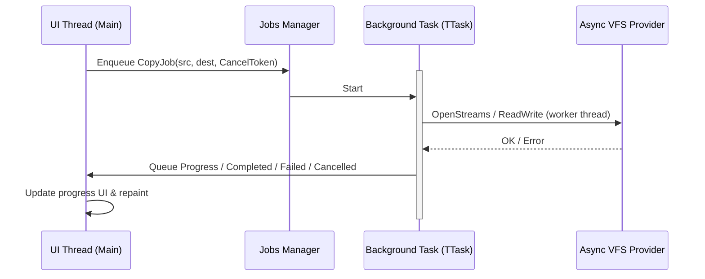

# Architecture Overview — MTN2 (Delphi Edition)

> **Роль документа:** краткий обзор архитектурных решений, инвариантов и потоковой модели.  
> **Детали API, структур данных и roadmap:** см. [readme.md](SDS.md) (System Design Specification).  
> При расхождении формулировок приоритет у SDS (`readme.md`), кроме явно помеченных здесь инвариантов.

В данном документе описываются ключевые архитектурные решения проекта **Modern Terminal Navigator 2 (MTN2)**, реализованного на языке Object Pascal (Delphi) с использованием графического фреймворка FireMonkey (FMX).

**Продуктовый фокус:** повседневный файловый менеджер с базисом **NDN**, дополненный практиками **FAR** и **Total Commander**. Архитектура подчиняется этому фокусу: контракты плагинов обязательны с MVP, но приоритет поставки — сценарии ежедневной работы, не экосистема. Порядок расширений: **родные плагины MTN2 → Far → Total Commander** (SDS §6.0). Подробнее — SDS §1.0.

---

## 1. Архитектурные слои

Приложение разделено на независимые слои для обеспечения модульности, тестируемости и простоты добавления новых возможностей (например, сетевых протоколов VFS или модулей просмотра).

```text
┌──────────────────────────────────────────────────────────┐
│  Input Layer: FMX Form (KeyDown, Mouse) -> Keymapper     │
├──────────────────────────────────────────────────────────┤
│  MDI Window Manager & Compositor                         │
│  (z-order, focus, логические буферы TTerminalGrid)       │
├──────────────────────────────────────────────────────────┤
│  TTerminalRenderer (FMX Canvas & GPU Double Buffering)   │
├──────────────────────────────────────────────────────────┤
│  Async VFS Core (URI)      │ Background Job Queue (PPL)  │
├──────────────────────────────────────────────────────────┤
│  Local Disk (IOUtils)        │ Network VFS (SFTP/S3)     │
└──────────────────────────────────────────────────────────┘
```

| Слой | Назначение |
|---|---|
| **Input / Keymap** | Перехватывает события FMX Form. Транслирует нажатия клавиш и действия мыши во внутренние команды (`uKeymap.pas`). Определяет фокусное окно. |
| **Top Menu Bar** | `TTopMenuBar` (`uTopMenuBar.pas`) — управляемое клавиатурой (F9 / Alt) и мышью верхнее выпадающее меню в стиле NDN / FAR Manager. Горячая буква перевода задаётся маркером `&` в `strings/<locale>.json` (`"&Файлы"`), срабатывает в любой раскладке; цвет горячих букв всех меню — `cMenuHotKeyFg` (`uDualPanelOverlays.pas`). |
| **MDI Compositor** | Хранит список виртуальных консольных окон. Объединяет их индивидуальные текстовые буферы в один результирующий буфер экрана. Использует интерфейс `IThemeRenderer` для стилизации базовых виджетов (рамок, кнопок, скроллбаров, вкладок, панелей инструментов, строк состояния). |
| **TTerminalRenderer** | Принимает результирующий текстовый буфер и рисует его на `TCanvas` формы через закадровый `TBitmap` (ping-pong front/back). GPU-отрисовка, мигание курсора (530 мс), dynamic grid при ресайзе/zoom. Опционально **Skia** (`DCC_Define SKIA`): natural-advance текст, alpha-blit. Ячейки с `TCharCell.IconId` — shell-иконки, загружаемые фоновым потоком (`uShellIcons`, этап 53 SDS). |
| **VFS Core & Registry** | Маршрутизирует запросы по схемам URI (`file://`, `sys://folders`, `recycle://`, `zip://`, `find://`, `ws://`, `sftp://`, …) через `uVfsRegistry.pas`. Кэширует данные архивов (`uZipArchiveCache.pas`). Все операции — асинхронные (callback / job). Сетевой VFS (`sftp://`, Этап 20) — in-process провайдер `uSftpVfs.pas` через `sftp.exe` в batch-режиме, без внешних библиотек; учётные записи — общий с SSH-консолью список `uSshConnections.pas`. Copy/Move с `sftp://` классифицируются как `vtrSftp` (не File VFS); `sftp://`↔`sftp://` — через локальный temp. |
| **Config Location** | `uConfigLocation.pas` — централизованный выбор пути к конфигурации (%APPDATA%\MTN2 или Portable режим с `portable.dat`). В том числе `session.json`, `keymap.json`, `workspaces.json`. |
| **Shell Icons** | `uShellIcons.pas` — кэш Windows shell-иконок по расширению / пути файла; `..` → `parent_up.png`. Извлечение (`SHGetFileInfo`/`ExtractIconEx`) — на выделенном worker-потоке с накачкой оконных сообщений (`MsgWaitForMultipleObjects` + `PeekMessage`), не на UI-потоке — иначе COM-маршалинг shell-расширений (облачные оверлеи, антивирусы) мог бы подвесить поток навсегда. |
| **OLE Drag & Drop** | `uWinFileDragDrop.pas` — мост нативного Windows OLE Drag & Drop (`CF_HDROP`) для перетаскивания файлов между MTN2 и Проводником. |
| **Jobs Manager** | `TPanelJobList` (`uDualPanelJobList.pas`) владеет несколькими `TPanelJobController`. I/O уже в worker (`CopyAsync`/`DeleteAsync` + `TThread.Queue`). Confirm может уйти в **Background**: панели живые, прогресс в статус-строке, overwrite/I/O ask снова модален. Несколько job: `file://`↔`file://` параллельно; один zip/`7z://`/sftp-authority или пересечение URI — очередь (`pjpQueued`). Лимит 8. Список: `kaJobList` (Ctrl+Shift+J). Copy/Move: robocopy-lite options и optional `DestURIs` (`BeginJobPairs`). Directory Sync: `uDualPanelSync`. Поиск — отдельный `TSearchController`, не этот пул. |
| **Process Bridge** | Настоящий Windows **ConPTY** (`CreatePseudoConsole`/`ResizePseudoConsole`/`ClosePseudoConsole` в `uConPty.pas`, безусловно для `Start`/`StartShell`, нет pipe-only fallback пути) с per-profile кодировкой ввода/вывода (`ProfileOutputEncoding`) и pending multi-byte хвостом между чанками; pre-warmed при старте приложения (`TMainForm.FormCreate` → `EnsureConsole` + `EnsureShell`), чтобы первая команда не платила latency запуска шелла. Цель: PTY (POSIX, `forkpty`) — этап 23. |
| **Theme Engine** | `IThemeRenderer` — визуальный стиль ячеек (рамки, кнопки, табы, toolbar, status line). По умолчанию `TNDNTheme`. |
| **Plugin Manager** | Жизненный цикл **родных** плагинов: `uPluginHost` → `uPluginLoader` (DLL `plugins\<id>\*.dll`, ABI v1), реестры VFS/panel/menu/keymap. Операционный план — [PLUGIN_TRANSITION.md](PLUGIN_TRANSITION.md). Far/TC — отдельные мосты после родного API. |
| **Event Bus / Broker** | `IMessageBus` — pub/sub между плагинами и ядром. |
| **ANSI Parser** | `IANSIParser` — VT100/xterm → `TTerminalGrid` + scrollback (TrueColor, later alt screen). См. §8. |
| **Scripting Engine** | Макросы/скрипты (Post-MVP). |
| **Overlay Renderer** | Растровая графика поверх текстовой сетки (превью); запросы идут через ядро, не через Canvas плагина. |
| **Far API Wrapper** | Windows-only мост VFS-плагинов **Far** (после родного Plugin Manager; SDS §6.8.2). |
| **TC Plugin Bridge** | Windows-only мост **Total Commander** WCX/WFX (после родного API; SDS §6.8.3). |

---

## 2. Dynamic Grid (логическое разрешение экрана)

Логическая сетка терминала **не фиксирована**. Число столбцов и строк (`Cols × Rows`) пересчитывается при изменении размера окна FMX и при изменении масштаба (zoom шрифта/ячейки):

```text
  ClientWidth / CellWidth   → Cols
  ClientHeight / CellHeight → Rows
```

1. `TTerminalRenderer` измеряет метрики моноширинного глифа (`CellWidth`, `CellHeight`) для текущего шрифта и zoom-фактора.
2. При `OnResize` / смене zoom ядро пересчитывает `Cols`/`Rows`, пересоздаёт `TTerminalGrid` и уведомляет MDI-композитор (`Resize` всех окон).
3. Физический размер ячейки в пикселях меняется плавно; логическая структура сетки следует за окном и масштабом.

Подробности API рендерера — в SDS, §4.

---

## 3. Dual Panel, Tabs и MDI

Иерархия UI файлового менеджера:

```text
TDualPanelWindow (одно MDI-окно рабочего пространства)
├── TabBar уровня Dual Panel   ← вкладки рабочих пространств (каждая = свой TDualPanelState)
└── Active Dual Panel State
    ├── Left Panel
    │   ├── Panel TabBar       ← вкладки каталогов внутри левой панели
    │   └── File list (active tab)
    └── Right Panel
        ├── Panel TabBar
        └── File list (active tab)
```

| Уровень | Назначение |
|---|---|
| **Dual Panel Tabs** | Вкладки на всё двухпанельное окно. `wkPanels` = полный `TDualPanelState`; `wkDocument` = Viewer/Editor (F3/F4); `wkTerminal` = живая сессия `TTerminalWorkspaceWindow` (`Ctrl+Shift+N`) — все три на одной полосе. Не путать с панелью ссылок `ws:///` и её библиотекой снимков (`Ctrl+Shift+D`). |
| **Panel Tabs** | Вкладки внутри каждой стороны (`Left` / `Right`). Каждая — отдельный `TTab` с `CurrentURI`, историей, курсором и scroll. |
| **Прочие MDI-окна** | Только **Console** (`TConsoleWindow`, Ctrl+O) — отдельное MDI-окно поверх cmdline. Terminal Workspace **не** MDI-окно: с v0.2.7+ он живёт как Dual Panel Tab (`wkTerminal`), как и Viewer/Editor. |

**Chrome Viewer / Editor / Terminal / Console (MVP):** внутри правой кромки рамки — вертикальная полоса прокрутки через `IThemeRenderer.DrawScrollBar` (▲ / трек ░ / бегунок █ / ▼). Текст оставляет правый столбец сетки под scrollbar; клик обрабатывает окно (`HandleClick`), Host (`TMainForm`) маршрутизирует mouse-down на Dual Panel (embedded editor/terminal) или Console MDI. Колёсико → `HandleInput` (Up/Down). Внизу — F-key bar и status line: для `wkTerminal` это теперь **общие** строки Dual Panel (`fbcTerminal`-контекст: `Esc:Close`, `Ctrl+A/C/V`; статус — профиль шелла + Running/Not running), а не собственная строка терминала — та убрана, терминалу отдана освободившаяся высота. **Viewer** = `TEditorWindow` ViewOnly (F3) во вкладке Dual Panel; отдельного `uViewerWindow.pas` нет. Поиск F7/`/` + F3 / Shift+F3; Far: Shift+F7 / Alt+F7. **F6** Viewer↔Editor на той же вкладке; **F8** / **Shift+F8** кодировки; **Alt+F8** goto line (контекстно: этот же чорд в Dual Panel Tab с фокусом на панелях/cmdline — история команд, см. ниже; маршрутизация не конфликтует, т.к. `wkDocument` перехватывает ввод целиком раньше keymap-диспетчера, `TDualPanelWindow.HandleInput`); Editor: Ctrl+C/X/V, Ctrl+Z / Ctrl+Shift+Z (Undo/Redo; **Ctrl+Y** = удалить строку по Far), Ctrl+D/K/N, Ctrl+Left/Right, Ctrl+F7 Replace. Dual Panel: Shift+F6 rename через `MoveAsync`. Кодировки: BOM → UTF-8/UTF-16; иначе UTF-8; иначе ANSI; OEM в цикле F8; raw bytes в `TEditorDoc` для переразбора (`uTextEncoding`). Реализация: `uEditorWindow.pas`, `uEditorDoc.pas`, `uConsoleWindow.pas`, `uTerminalWorkspace.pas`, `uDualPanelWindow.pas`. **F1 Help** (`uHelpViewer.pas`) — тот же `TEditorWindow` (`HelpMode`, контекст F-bar `fbcHelp`) в модальном окне поверх Dual Panel (`TDualPanelWindow.FHelp`: ввод, мышь и отрисовка перехватываются первыми); темы — `bin/help/<язык>/*.md`, переходы по ссылкам Markdown, история «назад».

Связь с композитором: `TDualPanelWindow` — специализированный `TTerminalWindow`. Переключение Dual Panel Tab меняет весь снимок панелей; переключение Panel Tab — только URI/курсор активной стороны.

**Live reload (этап 53 SDS):** локальный (не-streaming, не-архивный) файл, открытый в Viewer/Editor, отслеживается через `TDirectoryWatcher` (`uDirWatch.pas`) на содержащем каталоге и молча перечитывается при расхождении размера/времени записи на диске — но только пока нет несохранённых правок (`FDirty`); собственное сохранение не эхо-триггерит reload. `TEditorDoc.ContentGen` — счётчик перезагрузок содержимого, которым потребители со своим построчным кэшем (Markdown Viewer) проверяют актуальность без реакции на каждый `OnChanged`.

**Повседневные функции (этап 61, [DAILY_USE.md](DAILY_USE.md)):**
- **Quick View текста:** `uQuickTextView.pas` держит один `TEditorWindow` в режиме `Chromeless` (без рамки / F-строки / статуса; `PaintEmbedded` копирует только внутренность, рамку панели не трогает). Документ переключается через `CloseDocument` / `Open` и никогда не освобождается во время загрузки — асинхронный колбэк `TEditorDoc` иначе попал бы в освобождённый объект. Картинки — прежний Overlay.
- **История файлов:** `uFileHistory.pas` (как `uFolderHistory`), запись в `TDualPanelWindow.OpenDocument`.
- **Свойства:** `uShellAssoc.ShellShowProperties`; дескриптор окна есть только у `TMainForm`, поэтому `TDualPanelWindow` отдаёт пути через событие `OnShowProperties`.
- **Даты файлов:** `uWinFileAttr` (`TFileAttrTimes`, `ApplyFileTimes`). Кнопки, оставляющие диалог открытым, возвращают себе вид диалога (`SetKind`): хост сбрасывает его до вызова обработчика команды.

**Panel layout (v0.2.0+ / этап 14.1):** у каждой стороны — `ColumnMode` (Brief…Types), `SortColumn` / направление, `ViewKind` (Files | Info). Файловая панель показывает FAR-глиф сортировки в левом верхнем углу **рабочего поля** (строка заголовков, не рамка): `n`/`x`/`w`/`s`/`u`/`c`/`a`/`t`/`y`, заглавная = descending; цвет — `pcpHotMark` на `pcpColumnHeader` через `ContrastingGlyphFg` (`DrawPanelSortLetter` в `uDualPanelPanelDraw.pas`, `PanelSortModeLetter` в `uPanelColumns.pas`). **Ctrl+3** и **Ctrl+F12** — overlay-меню (`uDualPanelMenus`); геометрия колонок и Brief multi-column — `uPanelColumns` (мин. ширина Brief-колонки 28). **Ctrl+U** меняет местами `LeftPanel` ↔ `RightPanel` с reload моделей; **Ctrl+L** — Info на соседней стороне; **Ctrl+F1/F2** — видимость сторон. Panel polish: Shift+nav invert selection; Gray+/− только файлы (`*.*` = все имена); F3 на каталогах — параллельный folder-size (stub ½ ширины, `PathCompactPathEx`); **Ctrl+Enter** / **Ctrl+Shift+Enter** — имя / путь в cmdline. **F9 / Alt** активирует выпадающее меню (`uTopMenuBar.pas`). **Alt+F1/Alt+F2** открывает Change Drive popup (`uDualPanelDrivePopup.pas`): под списком дисков — разделитель и пронумерованные спецпункты `1. System folders` / `2. Recycle bin` / `3. Temporary` / `4. Workspace` (Enter/клик/цифра 1–4), ведущие в `sys://folders` (`uSysFoldersVfs.pas`, системные папки Windows), `recycle://` (`uRecycleBinVfs.pas`, Корзина; Ctrl+Alt+R restore, F8 = purge), `tmp:///` (плагин) и `ws:///` (`uWorkspaceVfs.pas`, панель ссылок, не копии; F8 = Unlink). Курсор popup — на текущем URI вкладки (`HostPanelPath` = `ActiveTab.CurrentURI`, `DrivePopupCursorIndex`), не на первом диске. `sys://` и `recycle://` синтетические — `..` возвращает не «выше по VFS» (родителя там нет), а в директорию, из которой был выполнен переход (`TDualPanelWindow.HistoryBack` через историю таба), а F-bar переключается в урезанный контекст (`fbcSysFolders`/`fbcRecycleBin`, `uFunctionBar.pas`), скрывающий недоступные там операции. Схема `ws://` всегда в ядре (пункт 4 виден без WASM). Именованные снимки живого набора — `workspaces.json` + диалог **Commands → Workspaces...** (`Ctrl+Shift+D`, `uWorkspaceLibrary.pas`); restore подменяет живой набор целиком. `..` после Enter по каталогу-ссылке возвращает в `ws:///` только на той вкладке панели, которая вошла из Workspace (`TTab.WorkspaceBackUri`). **Alt+F12** — диалог истории посещённых папок (`uFolderHistory.pas`, `folderhistory.json`, до 50 записей, персистится в `folderhistory.json`); **Alt+F8** — диалог истории команд, введённых в cmdline (список берётся из `TDualPanelCmdLineManager.GetHistoryItems`, тот же `history.json`, что и Up/Down в cmdline; `cmdhistory.json`); выбор строки в обоих диалогах подставляет значение (URI / команду), не выполняя его немедленно. Перетаскивание файлов между MTN2 и внешней ОС поддержано через нативный Windows OLE Drag & Drop (`uWinFileDragDrop.pas`). Строки ввода (`TInputLine`) и редактор (`TEditorWindow`) имеют аппаратный мигающий курсор (530 мс). Выделение едино для строк ввода, Viewer/Editor и консолей (`uInputLine.pas`: `TextIsWordChar` / `TextWordStepRight/Left` / `TextWordRangeAt`, `TMouseClickCounter`): Ctrl+Shift+←/→ — до следующего разделителя, двойной щелчок — слово, следующий быстрый щелчок — строка, Shift+щелчок — расширить выделение. **F2** — пользовательское меню и меню папки (`uUserMenu` / `uUserMenuController` / `uDualPanelUserMenu`, см. SDS §6.7). Структуры — SDS §3.3.

Структуры данных — в SDS, §3.3. Модели консоли — §8 ниже и SDS §5.4.

---

## 4. Потоковая модель (Threading Model)

**Инвариант:** UI-поток никогда не выполняет блокирующий I/O. Синхронные вызовы VFS из UI запрещены.



### Правила
1. **Main UI Thread** — ввод, рендер ≤ 60 FPS, применение событий из очереди (`TThreadedQueue<TJobEvent>` или `TThread.Queue`).
2. **Worker Tasks** — весь дисковый/сетевой I/O. Блокирующий `TThread.Synchronize` **запрещён**.
3. **Cancel** — у каждой job есть `IJobCancelToken`; провайдер VFS обязан периодически проверять токен и прерывать операцию.
4. **TProcessOutputReader** — отдельный поток чтения вывода ConPTY (Windows реализовано; POSIX PTY — этап 23); данные в UI только через `TThread.Queue` с epoch/coalesce.

Контракт async VFS и Jobs — в SDS, §5.

---

## 5. Модель рендеринга (FMX Double Buffering)

```text
  TTerminalGrid (логич. cols×rows, опц. IconId)
           │  перерисовка только при FNeedRebuildBuffer
           ▼
  TBitmap frames[0..1] (ping-pong)
           │  каждый FormPaint / Present
           ▼
  ACanvas.DrawBitmap
```

1. **Текстовый слой** — символы и стили в dynamic grid; box-drawing — векторные штрихи.
2. **Иконки** — `IconId` в ячейке → `ShellIconBitmap` → `DrawBitmap` с alpha (прозрачный фон иконок поверх BgColor строки).
3. **Закадровый буфер** — растр; пересобирается только при изменении данных, метрик ячейки или dirty-флаге.
4. **Холст** — одно GPU-копирование готового front-frame на кадр.

Опционально Skia: см. SDS §4.1. Столбец иконок панелей — SDS §4.2.

---

## 6. Паттерн Ядро–Тема–Плагин

| Роль | Ответственность |
|---|---|
| **Ядро** | Layout, focus, z-order, clipping, scrolling, keymap, композитинг, пул Jobs, сборка declarative UI из JSON. |
| **IThemeRenderer** | *Как выглядят* виджеты в ячейках сетки (псевдографика, палитра, состояния). |
| **Плагины (данные)** | *Что показывать*: строки списка, содержимое viewer/editor, ответы на логические события. Без доступа к `TCanvas`. |

Pull-модель: ядро запрашивает у плагина только видимый диапазон строк (JSON / C-API). Подробности — SDS, §6; контракты UI-примитивов — [UI_PRIMITIVES.md](UI_PRIMITIVES.md).

**MVP Host boundaries (in-process, pre-DLL):** Dual Panel lists data through `IPanelModel` / `TFilePanelModel` (Pull: `ItemCount` / `GetRow` for visible rows on paint; plain footer totals cached until model change); form dialogs go through `TDialogHost` + `OpenJson` / `uDialogJson` (DIALOG_PLUGIN subset) + declarative builders (`uDialogTypes`) drawn via `IThemeRenderer`. Overlay chrome uses `uDualPanelOverlays` + `uDualPanelMenus` (User / Sort by / Column modes / stubs); panel-interior chrome (headers / info strip / tabs / empty rows / frame accents / FAR sort-mode letter) via `ResolvePanelChromeColors` (`DrawPanelSortLetter` after column headers: `pcpHotMark` on `pcpColumnHeader`, `ContrastingGlyphFg`). Column geometry — `uPanelColumns` (Brief + icon reserve + `PanelSortModeLetter`; smoke: `tests/panels/TestPanelColumns.dpr`, `tests/panels/TestShellIcons.dpr`, `tests/panels/TestDualPanelPanelDraw.dpr`). Panel row icons — `uShellIcons` / `TCharCell.IconId`. F-bar labels (`uFunctionBar`) must match implemented `HandleInput` bindings for the active modifiers. Overlay chrome context is `ResolveChromeContext` (`uDualPanelStatus`): stub wins over dialog; `THostDialogKind` maps to `fbcWorkspaceLibrary` / `fbcFolderHotlist` / `fbcColorCoding` / `fbcColorCodingEdit` / `fbcDialogList` / `fbcStubEdit` (generic list+buttons must not fall through to `Enter:OK` only). Paint order (`DispatchDrawOverlays`): dialog, then stub on top, then F9 submenu. Dual Panel local `c*` are Theme-nil fallback only.

**Дефолтные JSON-ассеты — RCDATA, не файлы рядом с exe:** диалоги (`DIALOG_*`, 28 шт.), меню (`MENU_MAIN`), дефолтный keymap (`KEYMAP_DEFAULT`) и дефолтная (NDN) тема (`THEME_DEFAULT`) компилируются в `MTN2.rc`/`MTN2Resource.rc` из соответствующих `src/*.json` и грузятся из ресурсов exe — портативный `.exe` не зависит от соседних JSON-файлов. Правка исходных JSON требует пересборки `MTN2.dres` (`brcc32 MTN2Resource.rc`, см. `src/build.ps1`) и самого exe — иначе встроенный ресурс останется старым. Литералы в `.pas` — кодовая страница компилятора: Unicode-пунктуацию (em dash) пишите `#$2014`, не UTF-8 внутри кавычек.

Пользовательский override (файл в конфиг-директории, `uConfigLocation.GetConfigFilePath` — `%APPDATA%\MTN2\` или рядом с exe в portable-режиме) поддерживают два из них, оба — **частичным merge по ключу/имени**, не полной заменой:

| Ассет | RCDATA-имя | Источник | Загрузчик | Override-файл | Семантика override |
|---|---|---|---|---|---|
| Диалоги | `DIALOG_*` (28 шт., в т.ч. `DIALOG_FILEDIFF`) | `src/dialogs/*.json` | `uDialogResources.TryLoadDialogResourceJson` | нет (загрузка с диска явно отключена — см. комментарий в коде) | — |
| Меню | `MENU_MAIN` | `src/config/menu.json` | `uTopMenuBar.LoadMenuFromResource` | нет (есть file-fallback на `config/menu.json` рядом с exe/`src/`, но только когда ресурс не найден — dev-режим без пересборки, не механизм пользовательской настройки) | — |
| Keymap | `KEYMAP_DEFAULT` | `src/keymap.json` | `uKeymap.LoadDefaultKeymapProfile` | `keymap.json` | **Merge по ключу**: `uKeymap.MergeKeymapJson` заменяет только явно перечисленные в файле хоткеи, остальные остаются встроенными дефолтами |
| Тема (раскраска файлов) | `THEME_DEFAULT` | `src/NDNtheme.json` | `uColorCoding.ReloadColorCoding` | активный файл темы (см. ниже) | **Merge по `name`**: см. ниже |
| Меню пользователя (F2) | нет (примеры — код, `uUserMenu.DefaultUserMenu`) | — | `uUserMenu.LoadUserMenu` | `usermenu.json`; меню папки — `.mtn2menu.json` в папке или ближайшем предке | **Полная замена**, не merge: файл — всё меню; пока файла нет, показываются примеры (у меню папки — пустое меню) |

При правке дефолтных значений в `src/*.json` помни: если у пользователя уже есть override-файл в конфиг-директории, он частично перекроет новый дефолт (по ключу/имени) — смена values в `src/*.json` для уже упомянутых в override-файле ключей не подействует, пока пользователь не удалит/не поправит свой файл.

### Раскраска файлов и папок: одна тема, один merge-by-name

Раскраска панельных строк по маске имени принадлежит теме целиком — **нет отдельного тема-агностичного пользовательского слоя** (colorcoding.json больше не существует; см. ниже, почему):

```
GGroups := Merge(THEME_DEFAULT.fileColoring, <активный файл темы>.fileColoring)
```

Где «активный файл темы» — `TMtnSession.ThemeFile` (`session.json`, поле `"themeFile"`), а при его отсутствии — `NDNtheme.json` в конфиг-директории (`uColorCoding.SetActiveThemeFileName` / `GetConfigFilePath`).

`Merge(base, override)` — по полю `name` группы: запись `override` с совпадающим `name` заменяет запись `base` целиком **на её месте** (маска, цвета — всё); запись с новым `name` добавляется **в начало** результата (новые/переопределяющие правила проверяются раньше — первое совпадение маски побеждает, см. `ColorCodingResolve`). Внешний файл темы поэтому обычно перечисляет только те группы, которые добавляет или меняет; крайний случай — файл, переопределяющий вообще все группы, что равносильно полной замене.

**Почему раскраска — часть темы, а не отдельный пользовательский файл (было: `colorcoding.json`):** цвета раскраски обязаны быть согласованы с палитрой конкретной темы (пример: `Archives` — `#FF55FF`, а не жёлтый, потому что жёлтый неотличим от цвета выделения файлов `cSelectedFg = $FFFFFF55` в NDN-теме). Раньше пользовательские правила (`colorcoding.json`) жили отдельно от темы и были обязаны использовать только литеральный `#RRGGBB`, чтобы «пережить» смену темы без битой ссылки на палитру — но литеральный цвет всё равно мог визуально столкнуться с новой палитрой (например, стать неотличим от нового цвета выделения). Раз раскраска живёт в файле самой темы, у каждой темы (`NDNtheme.json`, `FARtheme.json`, …) — свой набор цветов, согласованный с её собственной палитрой; переключение темы переключает и раскраску вместе с ней. Пользователь, желающий переопределить раскраску для конкретной темы, правит именно её файл в конфиг-директории.

**Область реализации сейчас:** `NDNtheme.json.fileColoring` содержит `Archives`, `Executables`, `Temporary`, `Documents`, `Object Pascal`, `Markdown`. `Media` остаётся захардкожен в `TNDNTheme.ResolveFileRowColors` (`TypeFg`) — можно перенести в `NDNtheme.json` тем же способом (добавить группу с `mask`), без изменений кода, когда понадобится.

**Что ещё не реализовано (описанный, но не закодированный дизайн):** файл темы в перспективе может нести не только `fileColoring`, но и полную палитру темы (`palette` — базовые именованные цвета; `roles` — семантические слоты типа `selectedFg`/`cursorBg`; `panelChrome` — цвета рамок/табов/шапки колонок), заменяя хардкод-константы `TNDNTheme.pas`. Алгоритм раскладки псевдографики (где рамка, где тень, какие box-drawing символы) в любом случае остаётся в Pascal-коде конкретной реализации `IThemeRenderer` — JSON описывает только *значения*, не логику отрисовки. Будущие альтернативные темы (`TFARTheme`, `TTotalTheme` и т.п.) реализуют `IThemeRenderer` как обычные Pascal-классы (не loadable-плагины — это отдельный, более поздний этап согласно roadmap Plugin Manager, см. выше); до появления такого класса `ThemeFile` уже позволяет прогнать JSON-рескин (например `FARtheme.json`) через существующий `TNDNTheme`, раз рендерер и файл темы выбираются session.json'ом независимо друг от друга.

### Редактор групп раскраски: Options → Color coding...

`uDualPanelWindow.OpenColorCodingDialog` (менu `tmaOptColorCoding`, `dialogs/colorcoding.json` — список + Add/Edit/Delete/Up/Down/Save/Cancel, зеркалит `Ins`/`F4`/`Del`/`Ctrl+Up`/`Ctrl+Down`/`Ctrl+Space` — тот же приём raw-key interception, что и у `hdkFolderHotlist`) редактирует **эффективный** (уже смёрженный `THEME_DEFAULT` + активный файл темы) список групп — `uColorCoding.GetActiveColorCodingGroups`. Правки живут в `FColorCodingGroups` (рабочая копия) до нажатия Save; Save сравнивает `ColorCodingGroupsToJson` текущей копии с копией на момент открытия и **только если список реально изменился**, пишет `uColorCoding.SaveActiveThemeFileColoring` в активный файл темы (`GetActiveThemeFileName` — `NDNtheme.json` по умолчанию, либо `TMtnSession.ThemeFile`) и перечитывает (`ReloadColorCoding`) для немедленного применения. `dialogs/colorcodingedit.json` — под-диалог одной группы (имя, маска, apply-to, enabled, 3×fg/bg).

Взято у FAR (список приоритетных именованных групп, редактируемых на месте, без выхода из диалога — тот же паттерн, что уже был у directory hotlist) и добавлено сверх FAR (частично по мотивам TC):
- **Enabled — мягкое удаление.** `TColorCodingGroup.Enabled` (JSON `"enabled"`, по умолчанию `true`) — отключённая группа пропускается при матчинге, как будто её нет, но остаётся в списке. Это не косметика: `MergeColorCodingGroups` умеет только заменять/добавлять записи по `name`, но никогда не удалять запись из `THEME_DEFAULT` — поэтому `Delete` в диалоге для группы, присутствовавшей на момент открытия (пришла из `THEME_DEFAULT` и/или файла темы), всегда переводится в `Enabled:=False` (tombstone), а не в реальное удаление; только группу, добавленную в этом же открытии диалога, `Delete` убирает по-настоящему.
- **ApplyTo (TC-style).** `TColorCodingApplyTo` (`ccaFilesAndDirs`/`ccaFilesOnly`/`ccaDirsOnly`, JSON `"applyTo"`) ограничивает группу файлами/папками — условие поверх маски, которого нет у FAR-групп. `ColorCodingResolve` получил параметр `AIsDirectory` (у вызывающей стороны, `uDualPanelDrawUtils.DrawPanelList`, это уже готовое поле `Row.IsDirectory`).

Не реализовано (сознательно, чтобы не раздувать первую версию): условия по атрибутам файла (Hidden/System/ReadOnly — TC такое умеет), Copy/Duplicate группы. Общий Pascal-фреймворк «список + редактор элемента» тоже не выделялся отдельно — переиспользуется существующий паттерн (`Build*Dialog` + `THostDialogKind` + `DialogCommand`-case + raw-key блок), которым уже написаны `FolderHotlist`/`PluginList`; следующий похожий диалог копирует этот же паттерн, а не некий общий базовый класс.

#### Live-превью цвета и диалог выбора цвета

`dckColorSample` (`uDialogTypes.pas`) — новый тип контрола declarative dialog модели, **не завязанный на color coding конкретно** (первый в семье "read-only виджет, который сам читает состояние других контролов" — переиспользуем при следующей потребности). JSON: `{"type":"colorsample","text":"...","fgFrom":"<id>","bgFrom":"<id>","panelState":"normal"|"selected"|"current"}`. При каждой отрисовке (`TDialogHost.Draw`, без перестроения декларации — значит без необходимости "закрыть/переоткрыть диалог на каждое нажатие клавиши") ищет `dckInput`-контролы с id из `fgFrom`/`bgFrom`, парсит их **текущий, ещё не подтверждённый** текст через `uColorCoding.HexToColor` и красит текст `Text` (например " filename.txt ") этими цветами.

Пустой/невалидный канал — не ошибка, а откат к дефолту, и дефолт зависит от `panelState`:
- **`panelState` не задан** (как у `colorpicker.json`'s `preview`, который не привязан к конкретной строке панели) — фиксированный чёрный на нейтральном сером (`$FFC0C0C0`). Не белый: тело диалога у этого Host'а само белое, и белый по умолчанию делал бы границу свотча невидимой (проверено вживую, поймано по скриншоту).
- **`panelState` задан** (`colorcodingedit.json`'s три строки Normal/Selected/Current) и Host открыт с темой — дефолт берётся из `IThemeRenderer.ResolveFileRowColors(..., ASelected, ACursor, ASideActive=True)` для этой строки, т.е. **тот же самый цвет, что реально покажет панель** — не плейсхолдер. Это прямое соответствие `TColorCodingColor.Fg/Bg = 0` ("наследовать тему") — свотч честно показывает, что увидит пользователь, а не абстрактный "не задано".

Непереключаемый (не входит в Tab-обход — не добавлен в фокусируемые `Kind` в `TDialogHost.FirstFocusable`/`NextFocusable`).

В `dialogs/colorcodingedit.json` по одному `colorsample` в каждой из строк Normal/Selected/Current (`fgFrom`/`bgFrom` — статические id, известны заранее; `panelState` — соответствующий). В `dialogs/colorpicker.json` — один `colorsample` с id `preview`, чьи `fgFrom`/`bgFrom` патчатся динамически при открытии (`uDialogResources.DialogSetColorSampleSources`), в зависимости от того, для Fg или Bg открыт пикер; `panelState` у него не задан (пикер не привязан к конкретной строке).

`dialogs/colorpicker.json` (`hdkColorPicker`, `uDialogTypes.BuildColorPickerDialog`) — список из 16 именованных пресетов (`uDualPanelWindow.ColorPickerPresets`, обёртка над `uANSIParser.TANSIParser.StandardAnsiColor` — те же 16 цветов, которыми терминал красит SGR 30-37/90-97, не выдуманная палитра) плюс поле произвольного hex; на OK побеждает hex, если он не пуст, иначе — выделенный пресет. Список и поле синхронизированы **вживую**: `TDualPanelWindow.ColorPickerSyncHexFromPreset` вызывается после каждого relevant input/click (пока фокус на `picker_presets`) и копирует hex выбранного пресета в `picker_hex` через `TDialogHost.SetInputValue` — новый публичный сеттер (пара к `GetInputValue`), обновляющий текст `dckInput` на **уже открытом** диалоге без пересборки декларации; свотч подхватывает новое значение сам на следующей отрисовке, т.к. и так читает `picker_hex` каждый `Draw`. Это единственное место в кодовой базе, где поле правится "на лету" — обычно (см. `RefreshFolderHotlistDialog`) используется приём "закрыть и переоткрыть с новой декларацией", но здесь это происходило бы на каждое нажатие стрелки при просмотре списка, что слишком тяжело/мигающе для этого случая.

Пикер вызывается из `dialogs/colorcodingedit.json` по `F9` на сфокусированном Fg/Bg-поле (`TDialogHost.FocusedControlId` — публичный геттер, в отличие от `FocusedOrDefaultButtonId` никогда не подставляет кнопку вместо реального ответа). Поскольку переход в пикер и обратно **заменяет** `FDialog` целиком (а не патчит одно поле), переход снимает снимок всех 10 полей `colorcodingedit` в `FColorCodingEditFields` (`ColorCodingSnapshotEditFields`) и переоткрывает редактор из него (`ColorCodingReopenEditFromFields`) с одним изменённым полем.

**Ловушка с F9:** `TTopMenuController` глобально перехватывает `F9` для активации верхнего меню — эта проверка (`FTopMenu.HandleInput`) стоит в самом начале `TDualPanelWindow.HandleInput`, раньше любой диалог-специфичной обработки. Без явного исключения F9 в `hdkColorCodingEdit` никогда бы не доходил до пикера. Guard — `(FDialogKind <> hdkColorCodingEdit)` в условии этой ранней проверки. Если у будущего диалога тоже понадобится F9 (или любой другой ключ, уже занятый глобально), это то самое место, которое нужно расширить.

### Выбор активной темы: session.json

`TMtnSession.ThemeName` (поле `"theme"`, выбирает Pascal-класс `IThemeRenderer`) и `TMtnSession.ThemeFile` (поле `"themeFile"`, выбирает JSON-файл с `fileColoring`/будущей палитрой) читаются **независимо друг от друга** и **до** создания `IThemeRenderer`, в `TMainForm.FormCreate` (лёгкий `TryLoadSession`-"peek" через `PeekSessionTheme`, отдельно от полной `TryRestoreSession`, которая выполняется позже — ей нужны уже существующие `FDualPanel`/`FRenderer`). Независимость двух полей — намеренная: `ThemeFile` можно указать без `ThemeName`, чтобы прогнать JSON-рескин через `TNDNTheme` ещё до появления отдельного Pascal-класса темы. `TMainForm.CreateTheme(const AThemeName: string): IThemeRenderer` — фабрика с фолбэком на `TNDNTheme` при пустом/нераспознанном имени; единственная точка расширения под будущие темы (сейчас одна ветка `'NDN'`, без реестра/интерфейса под гипотетические реализации — YAGNI до появления второй темы). `ThemeFile` резолвится отдельно, через `uColorCoding.SetActiveThemeFileName` перед первым `ReloadColorCoding`, и не завязан на `CreateTheme`.

**Input Line / Text Area:** `TInputLine` is the shared single-line primitive (command line, dialogs, Viewer find) with blinking cursor support. Editor is a Host Text Area (`TEditorWindow` + `TEditorDoc` + `uEditorPainter.pas`) — not a plugin API yet; extract TEXTAREA_PLUGIN only if a second multiline consumer appears.

**Stage 29 seams (loader is live; extract of Dual Panel is not):**

| Seam | API | Notes |
|---|---|---|
| Plugin Host | `uPluginHost.StartPluginHost` / `StopPluginHost` | Facade over loader + ABI. `FormCreate` loads `plugins\<id>\*.dll`. |
| Manifest | `uPluginManifest.TryReadPluginManifest` (`plugin.json`) | Optional; `abi` mismatch skips the DLL. |
| VFS Registry | `RegisterPluginScheme` / `UnregisterPlugin` / `IsPluginOwned` / `ClassifyVfsTransfer` | Plugin-owned Copy/Move stay on that backend. Core `file`/`zip`/`find`/`sys`/`recycle`/`ws` routes unchanged. WASM cannot steal `file`/`recycle`/`sys`/`find`/`ws`. |
| Panel registry | `RegisterPlugin` / `UnregisterPlugin` / `ResolvePlugin` | Identity only. Dual Panel still uses `TFilePanelModel`. |
| Panel Pull | `IPanelModel.ItemCount` / `GetRow` / `GetRowJson` / `PluginId` | JSON unused on the paint path; reserved for cdecl Pull (фаза 3). |
| Invalidate | `RegisterInvalidatableWindow` ← Dual Panel | `mtn_host_invalidate` queues a window repaint. |
| Menu / Keymap | `IMenuRegistry` / `IKeymapRegistry` | Menu: new items. Keymap: rebind existing actions only. |
| Dialog / Status / Toolbar | in-process JSON / dry segments | cdecl `mtn_dialog_*` not exported yet. |
| Overlay / Text Area | Host-only | See OVERLAY_PLUGIN.md / TEXTAREA_PLUGIN.md. |
| 7z VFS plugin | `src/plugins/mtn.7z` (`7z://`) | List/exists/read unencrypted `.7z` via a replaceable `7z.dll` next to the plugin. F5 extract to disk is a host copy-bridge (`vtrPluginExtract`). Pack into `7z://` (Shift+F1 / F5 copy onto an open `.7z`) is `CopyItem` + `IOutArchive.UpdateItems` (stage 49). |
| WASM host (stage 30) | `uWasmPluginHost` + optional `wasmtime.dll` | `plugins\<id>\*.wat`/`*.wasm`. Guest ABI is JSON/UTF-8 copies in linear memory (no `THostApiTable` pointers, no WASI). Demo: `mtn.wasm.demo` / `wasmdemo://`. Workspace panel: core `ws:///` (`uWorkspaceVfs.pas`) + optional `mtn.ws` menus; host refuses WASM stealing `file`/`recycle`/`sys`/`find`/`ws`. Named snapshots: `workspaces.json`. Missing runtime skips the WASM module; Change Drive **4** still works. |

Far / TC remain deferred. Plan: [PLUGIN_TRANSITION.md](PLUGIN_TRANSITION.md).

**Media Overlay:** плагин публикует логический запрос превью (URI + bounds в ячейках); ядро/`Overlay Renderer` рисует bitmap. Canvas плагину не отдаётся.

---

## 7. Nested VFS (цепочки URI)

Архивы монтируются прозрачно. Каноническая форма цепочки — **схема + authority/path + сегменты `!/`** (аналог archive-mount):

```text
sftp://server.example/home/user/outer.zip!/inner.tar!/docs/readme.txt
file:///D:/data/bundle.zip!/nested.zip!/a.txt
```

Правила разбора:
1. Левая часть до первого `!/` — базовый URI провайдера (`sftp`, `file`, `sys`, …).
2. Каждый сегмент после `!/` — путь внутри очередного архивного слоя; тип архива определяется по имени/сигнатуре.
3. Host строит стек провайдеров (outer → inner) и отдаёт единый async API.

**Реализовано (`v0.2.0`):** ZIP через `TZipVirtualFileSystem` + `TVfsRouter` поверх `TFileVirtualFileSystem` с кэшированием директорий в `uZipArchiveCache.pas`; грамматика `file:///…zip!/…` и вложенный `…zip!/inner.zip!/`; Enter в `.zip`, листинг/`..`/история, F5 extract на диск; запись внутрь архива — `vecNotSupported`. Схема `sys://folders` (`uSysFoldersVfs.pas`) предоставляет навигацию по виртуальным папкам системных ресурсов Windows; схема `recycle://` (`uRecycleBinVfs.pas`, `IShellFolder2`) — просмотр и восстановление файлов Корзины (в основном read-only; `DeleteAsync` = безвозвратный purge). Результаты Alt+F7 — виртуальная панель `find://session/<id>/` (`TFindVirtualFileSystem`); строки с `TargetURI` = реальный `file://`. Схема `ws:///` (`uWorkspaceVfs.pas`) — панель ссылок (не копий) на реальные файлы и каталоги; виртуальные группы F7 живут только внутри `ws://`. Именованные снимки — `workspaces.json` в конфиг-директории (не `session.json`). Прочие форматы — через **родные** VFS-плагины (этап 29+), затем мосты Far / Total Commander (этапы 31–32).

Альтернативная запись `zip://…` допускается только для однослойного mount; для вложенности обязательна форма с `!/`.

---

## 8. Консоль и терминал

Продуктовая цель трека: сочетать **FAR/NDN cmdline** под панелями с **современным VT-терминалом** (workspaces), не ломая фокус ежедневного FM. Roadmap: SDS §7, этапы 16–18, 21–23, 28.

### 8.1. Три режима (канон)

```text
┌─ Panel Console ─────────────────────────────────────────┐
│  TDualPanelWindow                                        │
│  ├── panels + cmdline (submit → stdin PTY session)       │
│  └── Ctrl+O → показать буфер той же session              │
└──────────────┬──────────────────────────────────────────┘
               │ shared IPtySession (persistent cmd MVP)
               ▼
┌─ Console Window (MDI) ──────────────────────────────────┐
│  TConsoleWindow — chrome как Viewer; scrollback/VT grid  │
└─────────────────────────────────────────────────────────┘

┌─ Terminal Workspace (Dual Panel Tab, wkTerminal) ────────┐
│  TTerminalWorkspaceWindow — без панелей; raw keys→PTY    │
│  профили: CMD / PowerShell / pwsh / WSL; Ctrl+Shift+N    │
│  живёт в TDualPanelWindow.FTerminals, не в FMdi          │
└─────────────────────────────────────────────────────────┘
```

| Режим | Сейчас (`v0.2.7+`) | Цель |
|---|---|---|
| Panel Console | cmdline → **persistent** shell через настоящий **ConPTY**; sync `cd`; ANSI **cell-scrollback** + TrueColor | 2D VT grid для основного экрана панели (сейчас только alt screen — 22) |
| Console Window | MDI `TConsoleWindow` + `TANSIParser` → cell rows (≥10k); выделение/копирование; `Ctrl+O` | тот же session; полный VT-экран для основного буфера (22+) |
| Terminal Workspace | `TTerminalWorkspaceWindow` + profiles через **ConPTY**; raw input; **Dual Panel Tab** (`wkTerminal`), не MDI-окно; эфемерна — не сохраняется/не восстанавливается в session.json (как `wkDocument`) | **Реализовано:** alt screen + 2D VT grid (`uAltScreenGrid.pas`/`uPrimaryScreenGrid.pas`, DECSET/DECRST 1049/47, CUP/CUU/CUD/CUF/CUB) — живой ручной прогон TUI ещё не проводился |

**ConPTY теперь реализован (`31f903c` "Fix console"):** исторически (под pipes, до этого коммита) живым тестированием PowerShell/pwsh было подтверждено, что **любая** ошибка внутри команды (даже пойманная через `try/catch` с `$ErrorActionPreference='Stop'`, даже просто `.ToString()` на объекте ошибки) вешает PTY-сессию навсегда — PowerShell пытается обратиться к состоянию хост-консоли, которого у pipe-сессии нет. Приложенческая митигация (`uShellProfiles.pas`): `ProfileInitCommand` шлёт `$ErrorActionPreference='SilentlyContinue'` при старте профиля (ошибка не виснет, но и не показывается); `PsPipeSafeCommand`/`IsSimplePsExpression` оборачивает **простые** команды (без `;`/`{}`/`=`/ключевых слов) в `| % {"$_"}`, чтобы результат обошёл движок форматирования (тоже вешавший сессию на любом нестроковом объекте — `Get-Date`, `Get-Process`, `Out-String`, `Format-Table`). Эта митигация **оставлена в коде** как defense-in-depth, но `uConPty.pas` теперь безусловно использует настоящий `CreatePseudoConsole`/`ResizePseudoConsole`/`ClosePseudoConsole` для `Start` и `StartShell` (нет отдельного pipe-only пути) — корневая причина зависаний устранена архитектурно и **переподтверждена живым тестированием**: под ConPTY зависание больше не воспроизводится.

### 8.2. Слои реализации

1. **Process bridge** (`TConPtySession` в `uConPty.pas`) — настоящий ConPTY (`CreatePseudoConsole`/`ResizePseudoConsole`/`ClosePseudoConsole`), per-profile decode (OEM для cmd, UTF-8 для PS/pwsh/WSL с pending multi-byte хвостом), coalesce Queue, epoch lifetime, Ctrl+C/`TerminateProcess` (**Esc никогда не останавливает процесс** — только прячет консоль; Ctrl+C — единственный способ прервать команду); упорядоченный `Terminate` (stdin close → `TerminateProcess` → `CancelIoEx` на чтении → join reader с коротким таймаутом → хендлы; `ClosePseudoConsole` — на отдельном потоке, `ReleasePseudoConsole`, т.к. при висящем `ReadFile` он блокирует до ~5 с); pre-warmed при старте приложения. Естественный выход оболочки ловит поток-наблюдатель `StartExitWatcher`; он держит не сессию, а ref-counted `IConPtySessionLife`, который `Destroy` первым делом отвязывает под своим замком — поздно проснувшийся наблюдатель не трогает освобождённую сессию (раньше входил в уже разрушенный `FIoLock`, этап 59). **Stage 16:** `StartShell` + `WriteInput`. **Реализовано:** resize реально меняет размер псевдоконсоли (`ResizePseudoConsole`); alt screen — см. §8.1/§8.3, этап 22.
2. **Buffer (`v0.2.3`):** `TConsoleBuffer` + `TANSIParser` — line-oriented **cell** scrollback (SGR 16/256/TrueColor, EL/ED). Полный 2D `TTerminalGrid` VT + CUP — позже (21–22).
3. **Input routing** — Keymapper: режим FM (Dual Panel) vs raw PTY (Terminal Workspace); системные хоткеи всегда у Host. **Keymap (`v0.2.1`):** `keymap.json` + кэш `ActiveKeymap` / `ReloadKeymap` (`Ctrl+Alt+K`).
4. **Path sync** — смена панели → невидимый `cd` в panel shell; не блокирует UI; ошибка не откатывает URI панели молча без статуса. **По умолчанию выключено** (`session.json` → `autoSyncConsoleCwd`, default `false`): панель и фоновая консоль держат каждая свой каталог. Ручная синхронизация в обе стороны — `Ctrl+Shift+O` (`kaSyncConsoleDir`): активная Dual Panel → каталог панели в консоль; активная консоль → её `WorkingDir` в активную панель.
5. **Естественный выход шелла** — ConPTY не закрывает output pipe сам, когда шелл завершается изнутри (`exit`), в отличие от явного `Terminate` (`TerminateProcess`+`ClosePseudoConsole`); без доп. меры `ReadFile` в reader-потоке блокируется навсегда и `OnExit` не приходит. `TConPtySession.StartExitWatcher` — отдельный поток на дубликате хендла процесса, который сам закрывает псевдоконсоль после выхода процесса, разблокируя reader. Фоновая консоль (`Ctrl+O`) по умолчанию перезапускает шелл на месте (`ConsoleRestartOnExit`, default `true`); вкладка Terminal Workspace (`Ctrl+Shift+N`) по умолчанию закрывается (`TerminalCloseOnExit`, default `true`) — оба флага в `session.json`.
6. **Command history** — единая для cmdline Dual Panel, фоновой консоли и вкладок Terminal Workspace (`Alt+F8`, `TBaseConsoleWindow.OpenCmdHistoryDialog`/`NoteCommandSubmitted`); в консоли/терминале выбор из истории выполняется сразу, там нет своей строки ввода. Команды, набранные прямо в шелле, тоже пишутся в историю — перехват на Enter до отправки в PTY.

### 8.3. Эволюция (не переписывать ядро)

Порядок поставки зафиксирован в roadmap: **persistent shell (16) → VT/scrollback (17) → cmdline UX (18) → workspaces (21) → alt screen (22) → POSIX (23) → IPC `mtn2` (28)**. Архивы и keymap (14–15) идут раньше консольного углубления — инвариант UX (§9.15). Этапы 16–18 и 21 закрыты; ядро этапа **22** (ConPTY + alt screen grid) реализовано в `31f903c`, живой ручной прогон TUI ещё не проведён — формально не закрыт; следующий — **23** (POSIX PTY).

Существующий код (`uConPty` — теперь настоящий ConPTY, не pipes; `uConsoleBuffer` line-buffer + alt-screen grid; `uConsoleWindow`) — фундамент, наращиваемый по мере этапов, не параллельной второй подсистемой вывода.

### 8.4. Карта точек связности с Windows (для будущего этапа 23)

Разработка и отладка сегодня ведутся под Windows, и roadmap намеренно ставит daily-use функции впереди POSIX-порта (§7 readme.md, «Ревизия приоритета»). Это не значит, что новый код может свободно врастать в Winapi.* где угодно — ниже список мест, отмеченных в коде комментарием `CROSS-PLATFORM (Этап 23)`, чтобы порт впоследствии не начинался с археологии. Три категории:

**A. Есть заготовленный шов, но он не используется по назначению**
- `uConPty.pas` — интерфейс `IPtySession` объявлен как раз для подмены бэкенда, но `TBaseConsoleWindow.FPty` (`uBaseConsoleWindow.pas`) типизирован конкретным классом `TConPtySession`, а не интерфейсом. Первый шаг POSIX-порта консоли — сменить тип поля на `IPtySession`, не переписывать сам класс.

**B. Публичный контракт уже платформо-нейтрален, платформенная часть — только реализация**
- `uDirWatch.pas` (`FindFirstChangeNotification` → нужен inotify/kqueue) — `Create`/`SetPath`/`OnChanged` уже не выдают Windows-типов наружу.
- `uConfigLocation.pas` — уже не использует Winapi.* вообще; `GetEnvironmentVariable('APPDATA')` пуст на POSIX и код сам падает на `TPath.GetHomePath`. Не XDG-корректно (`$XDG_CONFIG_HOME` не читается), но и не падает.
- `uVfsUtils.pas` — `CompareNaturalText` сравнивает текстовые участки имён через `CompareStringW` под `{$IFDEF MSWINDOWS}`, иначе `CompareText(..., loUserLocale)`; контракт (натуральный, без учёта регистра, по языку пользователя) платформо-нейтрален.

**C. Функциональность целиком Windows-специфична — порт не переиспользует внутренности, только контракт/схему**
- `uConPtyApi.pas`, `uConPty.pas` — ConPTY; POSIX-эквивалент: `forkpty`/`termios`, за тем же `IPtySession` (см. пункт A).
- `uShellProfiles.pas` — каталог профилей (cmd/PowerShell/pwsh/WSL) сам по себе Windows-специфичен, не только процесс запуска; POSIX — свой каталог (bash/zsh/fish) той же формы (`TShellProfileInfo`/`TShellProfileArray`).
- `uDriveInfo.pas` — буквы дисков не обобщаются на POSIX; там другая UI-модель (примонтированные ФС под одним `/`), не просто другой источник данных.
- `uWinFileDragDrop.pas` — OLE drag-out; на других платформах — опциональная деградация (no-op), не редизайн.
- `uShellIcons.pas` — иконки из Windows Shell; на Linux — freedesktop icon theme, на macOS — `NSWorkspace`; общий контракт — кэш по `IconId`.
- `uRecycleBinVfs.pas` (`recycle://`) — `IShellFolder2`/`CSIDL_BITBUCKET`; Linux — Trash spec freedesktop.org, macOS — `.Trashes`. Отдельный VFS-бэкенд под ту же схему URI.
- `uSysFoldersVfs.pas` (`sys://folders`) — источник списка системных папок платформо-специфичен (Windows API vs XDG user dirs vs `NSSearchPathForDirectoriesInDomains`), контракт (`TargetURI`) общий.
- `uLinkUtils.pas` — junction'ы — чисто NTFS-концепция, порта не будет вообще; symlink/hardlink на POSIX есть, но через `symlink()`/`link()`, не через текущий `kernel32`-код.
- `uWinFileAttr.pas` — атрибуты R/H/S/A, владелец (ACL) и даты (`SetFileTime`) — Windows; POSIX — `chmod`/`chown`/`utimensat`, другой набор атрибутов.
- `uShellAssoc.pas` — уже спроектирован как platform shell association с явной пометкой в заголовке «Windows today, other OS later»; ничего менять не нужно, только использовать как образец для остальных пунктов этого списка.

**Не в списке специально:** десятки файлов, где `Winapi.Windows` встречается только ради `VK_*`-констант клавиш или мелких системных вызовов (`uKeymap.pas`, `uTopMenuBar.pas`, `uDualPanelWindow.pas` и т.п.) — это не архитектурная связность, а мелкие точки, которые обычная FMX-кроссплатформенная сборка (Linux/macOS таргеты уже поддерживаются FireMonkey) сама заставит поправить на этапе первой POSIX-компиляции; помечать их заранее — шум, не сигнал.

---

## 9. Ключевые инварианты архитектуры

1. **Безопасность UI:** любой локальный/сетевой I/O — только через async VFS / Jobs; UI-поток не блокируется.
2. **Отмена и ошибки:** у длительных операций есть cancel-token; ошибки доставляются структурированно (`TVfsError`), не «глотаются» в worker.
3. **Потоковый Viewer:** файлы > `cEditorMaxBytes` (2 МБ) не загружаются в RAM целиком; UI листает по индексу строк + scrollbar Host. **Реализовано (этап 24)** в `uEditorDoc.pas`: фоновый скан LF-оффсетов → `FLineOffsets`, строки читаются seek+read по требованию с FIFO-кэшем. Режим всегда read-only; UTF-16 и бинарники в него не попадают (байтовый скан на LF для них некорректен) и сохраняют прежнюю ошибку "File too large". Регрессия — `TestStreamingViewer.dpr`.
4. **URI-пути:** все пути внутри приложения — URI (`file://`, `sftp://`, цепочки с `!/`).
5. **Сессия:** состояние (Dual Panel Tabs, Panel Tabs, URI, курсоры, zoom, активное MDI) сохраняется в JSON и восстанавливается при старте.
6. **Dynamic Grid:** `Cols×Rows` зависят от размера окна и масштаба.
7. **Делегирование темизации:** виджеты без зашитой псевдографики; стиль — в `IThemeRenderer` (по умолчанию `TNDNTheme`).
8. **View / Model:** ядро + тема = представление; плагины = данные и логика навигации.
9. **Декларативный UI:** кастомные диалоги плагинов описываются JSON; сборку делает ядро.
10. **Process-изоляция:** внешние процессы только через process bridge во внутренний консольный буфер / (позже) VT-grid — не через ad-hoc `ShellExecute` для cmdline.
11. **Прозрачность архивов:** Nested VFS с грамматикой `!/`.
12. **Внутренние ассоциации:** открытие файла решает подсистема MTN2, не ассоциации ОС (если явно не выбран `ShellExecute`).
13. **Ядро как артефакт:** основной продукт — один нативный исполняемый файл ядра; внешние плагины (DLL/SO/WASM) — опциональные расширения, не обязательные runtime-зависимости.
14. **MVP = монолит с контрактами плагинов:** на стадии MVP код системных плагинов живёт в единой кодовой базе, но границы и протоколы взаимодействия с ядром (Pull, Host API, запрет Canvas, async I/O) соблюдаются как при внешней загрузке. После стабилизации **сначала** родные DLL/SO/WASM, **затем** мосты Far и Total Commander — без смены контрактов родного Host API (SDS §6.0).
15. **UX важнее платформы:** решения по roadmap и API проверяются вопросом «улучшает ли это ежедневную работу как у NDN/FAR/TC?». Расширяемость не должна откладывать паритет базовых файловых сценариев.
16. **WASM-изоляция:** песочница Wasmtime без WASI и без прямого доступа к памяти процесса; обмен только копиями UTF-8/JSON в линейной памяти guest (`uWasmPluginHost`). `wasmtime.dll` опционален.
17. **Канон панельной консоли:** cmdline Dual Panel и Console Window работают только через **persistent PTY session** (pre-warmed при старте приложения) с синхронизацией cwd; low-level one-shot `cmd /c` в `uConPty.pas` остаётся только как fallback-примитив на случай недоступности persistent shell — `TConsoleWindow` больше не оркеструет ad-hoc one-shot команды напрямую (`RunOneShot` удалён).
18. **Два input mode:** FM-keymap (панели) и raw-PTY (Terminal Workspace) не смешиваются в одном фокусном окне; системные хоткеи Host остаются выше обоих.
19. **Кодировка исходников:** любой `.pas`/`.dpr`, содержащий не-ASCII символы, обязан быть сохранён в **UTF-8 с BOM**. Без BOM компилятор Delphi читает файл как ANSI, и один такой символ превращается в 2–3 — это не косметика, а тихий функциональный дефект: `Length('…')` даёт 3 (ломает арифметику ширины при обрезке строк), а сравнение `AKeyChar = 'ы'` для `Char` становится сравнением с многосимвольной строкой и **всегда** False (так молча не работали кириллические хоткеи диалогов). Альтернатива для одиночных глифов — объявлять их кодпоинтом (`cEllipsis = #$2026`, `chBoxH = #$2500`), что не зависит от кодировки файла вообще.
