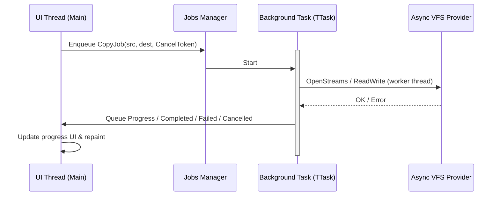

# Architecture Overview – MTN2 (Delphi Edition)

> **Роль документа:** краткий обзор архитектурных решений, инвариантов и потоковой модели.  
> **Детали API, структур данных и roadmap:** см. [SDS.md](SDS.md) (System Design Specification).  
> При расхождении формулировок приоритет у SDS, кроме явно помеченных здесь инвариантов.  
> Документ подготовлен с помощью ИИ-ассистентов (см. [README](../README.md#как-создавался-проект)).

В данном документе описываются ключевые архитектурные решения проекта **Modern Terminal Navigator 2 (MTN2)**, реализованного на языке Object Pascal (Delphi) с использованием графического фреймворка FireMonkey (FMX).

**Продуктовый фокус:** повседневный файловый менеджер с базисом **NDN**, дополненный практиками **FAR** и **Total Commander**. Архитектура подчиняется этому фокусу: контракты плагинов обязательны с самого начала, но приоритет поставки – сценарии ежедневной работы, не экосистема. Порядок расширений: **родные плагины MTN2 → Far → Total Commander** (SDS §6.0). Подробнее – SDS §1.0.

---

## 1. Архитектурные слои

Приложение разделено на независимые слои для обеспечения модульности, тестируемости и простоты добавления новых возможностей (например, сетевых протоколов VFS или модулей просмотра).

```text
┌──────────────────────────────────────────────────────────┐
│  Input Layer: FMX Form (KeyDown, Mouse) -> Keymapper     │
├──────────────────────────────────────────────────────────┤
│  MDI Window Manager & Compositor                         │
│  (z-order, focus, логические буферы TTerminalGrid)       │
├──────────────────────────────────────────────────────────┤
│  TTerminalRenderer (FMX Canvas & GPU Double Buffering)   │
├──────────────────────────────────────────────────────────┤
│  Async VFS Core (URI)      │ Background Job Queue (PPL)  │
├──────────────────────────────────────────────────────────┤
│  Local Disk (IOUtils)        │ Network VFS (SFTP/S3)     │
└──────────────────────────────────────────────────────────┘
```

| Слой | Назначение |
|---|---|
| **Input / Keymap** | Перехватывает события FMX Form. Транслирует нажатия клавиш и действия мыши во внутренние команды (`uKeymap.pas`). Определяет фокусное окно. |
| **Top Menu Bar** | `TTopMenuBar` (`uTopMenuBar.pas`) – управляемое клавиатурой (F9 / Alt) и мышью верхнее выпадающее меню в стиле NDN / FAR Manager. Горячая буква перевода задаётся маркером `&` в `strings/<locale>.json` (`"&Файлы"`), срабатывает в любой раскладке; цвет горячих букв всех меню – `cMenuHotKeyFg` (`uDualPanelOverlays.pas`). |
| **MDI Compositor** | Хранит список виртуальных консольных окон. Объединяет их индивидуальные текстовые буферы в один результирующий буфер экрана. Использует интерфейс `IThemeRenderer` для стилизации базовых виджетов (рамок, кнопок, скроллбаров, вкладок, панелей инструментов, строк состояния). |
| **TTerminalRenderer** | Принимает результирующий текстовый буфер и рисует его на `TCanvas` формы через закадровый `TBitmap` (ping-pong front/back). GPU-отрисовка, мигание курсора (530 мс), dynamic grid при ресайзе/zoom. Опционально **Skia** (`DCC_Define SKIA`): natural-advance текст, alpha-blit. Ячейки с `TCharCell.IconId` – shell-иконки, загружаемые фоновым потоком (`uShellIcons`, «Live reload открытых файлов + фоновая загрузка shell-иконок» SDS). |
| **VFS Core & Registry** | Маршрутизирует запросы по схемам URI (`file://`, `sys://folders`, `recycle://`, `zip://`, `find://`, `ws://`, `sftp://`, …) через `uVfsRegistry.pas`. Кэширует данные архивов (`uZipArchiveCache.pas`). Все операции – асинхронные (callback / job). Сетевой VFS (`sftp://`, «Сетевой VFS») – in-process провайдер `uSftpVfs.pas` через `sftp.exe` в batch-режиме, без внешних библиотек; учётные записи – общий с SSH-консолью список `uSshConnections.pas`. Copy/Move с `sftp://` классифицируются как `vtrSftp` (не File VFS); `sftp://`↔`sftp://` – через локальный temp. |
| **Config Location** | `uConfigLocation.pas` – централизованный выбор пути к конфигурации (%APPDATA%\MTN2 или Portable режим с `portable.dat`). В том числе `session.json`, `keymap.json`, `workspaces.json`. |
| **Shell Icons** | `uShellIcons.pas` – кэш Windows shell-иконок по расширению / пути файла; `..` → `parent_up.png`. Извлечение (`SHGetFileInfo`/`ExtractIconEx`) – на выделенном worker-потоке с накачкой оконных сообщений (`MsgWaitForMultipleObjects` + `PeekMessage`), не на UI-потоке – иначе COM-маршалинг shell-расширений (облачные оверлеи, антивирусы) мог бы подвесить поток навсегда. |
| **OLE Drag & Drop** | `uWinFileDragDrop.pas` – мост нативного Windows OLE Drag & Drop (`CF_HDROP`) для перетаскивания файлов между MTN2 и Проводником. |
| **Jobs Manager** | `TPanelJobList` (`uDualPanelJobList.pas`) владеет несколькими `TPanelJobController`. I/O уже в worker (`CopyAsync`/`DeleteAsync` + `TThread.Queue`). Confirm может уйти в **Background**: панели живые, прогресс в статус-строке, overwrite/I/O ask снова модален. Несколько job: `file://`↔`file://` параллельно; один zip/`7z://`/sftp-authority или пересечение URI – очередь (`pjpQueued`). Лимит 8. Список: `kaJobList` (Ctrl+Shift+J). Copy/Move: robocopy-lite options и optional `DestURIs` (`BeginJobPairs`). Directory Sync: `uDualPanelSync`. Поиск – отдельный `TSearchController`, не этот пул. |
| **Process Bridge** | Настоящий Windows **ConPTY** (`CreatePseudoConsole`/`ResizePseudoConsole`/`ClosePseudoConsole` в `uConPty.pas`, безусловно для `Start`/`StartShell`, нет pipe-only fallback пути) с per-profile кодировкой ввода/вывода (`ProfileOutputEncoding`) и pending multi-byte хвостом между чанками; pre-warmed при старте приложения (`TMainForm.FormCreate` → `EnsureConsole` + `EnsureShell`), чтобы первая команда не платила latency запуска шелла. Цель: PTY (POSIX, `forkpty`) – «PTY на Linux/macOS». |
| **Theme Engine** | `IThemeRenderer` – визуальный стиль ячеек (рамки, кнопки, табы, toolbar, status line). Единственная реализация – `TDataTheme` (`uDataTheme.pas`): цвета, символы и начертания берёт из файла темы (`*.theme.json`, формат – `docs/THEMES.md`); по умолчанию тема `NDN`. |
| **Plugin Manager** | Жизненный цикл **родных** плагинов: `uPluginHost` → `uPluginLoader` (DLL `plugins\<id>\*.dll`, ABI v1), реестры VFS/panel/menu/keymap. Far/TC – отдельные мосты после родного API. |
| **Event Bus / Broker** | `IMessageBus` – pub/sub между плагинами и ядром. |
| **ANSI Parser** | `IANSIParser` – VT100/xterm → `TTerminalGrid` + scrollback (TrueColor, later alt screen). См. §8. |
| **Scripting Engine** | Макросы/скрипты (позже). |
| **Overlay Renderer** | Растровая графика поверх текстовой сетки (превью); запросы идут через ядро, не через Canvas плагина. |
| **Far API Wrapper** | Windows-only мост VFS-плагинов **Far** (после родного Plugin Manager; SDS §6.8.2). |
| **TC Plugin Bridge** | Windows-only мост **Total Commander** WCX/WFX (после родного API; SDS §6.8.3). |

---

## 2. Dynamic Grid (логическое разрешение экрана)

Логическая сетка терминала **не фиксирована**. Число столбцов и строк (`Cols × Rows`) пересчитывается при изменении размера окна FMX и при изменении масштаба (zoom шрифта/ячейки):

```text
  ClientWidth / CellWidth   → Cols
  ClientHeight / CellHeight → Rows
```

1. `TTerminalRenderer` измеряет метрики моноширинного глифа (`CellWidth`, `CellHeight`) для текущего шрифта и zoom-фактора.
2. При `OnResize` / смене zoom ядро пересчитывает `Cols`/`Rows`, пересоздаёт `TTerminalGrid` и уведомляет MDI-композитор (`Resize` всех окон).
3. Физический размер ячейки в пикселях меняется плавно; логическая структура сетки следует за окном и масштабом.

Подробности API рендерера – в SDS, §4.

### Широкие символы (CJK)

Сетка рассчитана на клетку фиксированной ширины, а иероглифы CJK, хирагана, катакана, хангыль и полноширинные формы занимают две колонки.

- **Ширина символа:** единственный источник – `CharDisplayWidth` в `uCharWidth.pas` (2 колонки для перечисленных диапазонов основной таблицы Unicode, 1 для остального). Любой код, который выравнивает, обрезает или считает ширину текста, пользуется `TextDisplayWidth`, `TextFitChars` и `StripWideFillers`, а не `Length`.
- **Пара ячеек:** первая ячейка хранит символ с признаком `ccaWide`, вторая – заполнитель (пробел с признаком `ccaWideTail` и теми же цветами). Запись через `DrawGridChar` создаёт пару, перезапись любой половины гасит вторую, поэтому «осиротевших» половин не бывает. Широкий символ в последней колонке не рисуется.
- **Консоль:** `PutCell` обеих сеток (`TPrimaryScreenGrid`, `TAltScreenGrid`) сдвигает курсор на 2 и переносит символ, не помещающийся в последнюю колонку. Строки истории остаются выровненными по ячейкам, чтобы колонки выделения совпадали; при копировании заполнители убираются.
- **Рендерер:** первая ячейка пары рисуется одним глифом на две колонки; признак ширины входит в ключ кэша глифов. Заполнитель пропускается. Шрифты для CJK подставляет система.
- **Не охвачено:** курсор и выделение в редакторе, поля ввода и подписи диалогов считают по символам; символы вне BMP и комбинирующие знаки не поддерживаются (см. SDS).

---

## 3. Dual Panel, Tabs и MDI

Иерархия UI файлового менеджера:

```text
TDualPanelWindow (одно MDI-окно рабочего пространства)
├── TabBar уровня Dual Panel   ← вкладки рабочих пространств (каждая = свой TDualPanelState)
└── Active Dual Panel State
    ├── Left Panel
    │   ├── Panel TabBar       ← вкладки каталогов внутри левой панели
    │   └── File list (active tab)
    └── Right Panel
        ├── Panel TabBar
        └── File list (active tab)
```

| Уровень | Назначение |
|---|---|
| **Dual Panel Tabs** | Вкладки на всё двухпанельное окно. `wkPanels` = полный `TDualPanelState`; `wkDocument` = Viewer/Editor (F3/F4); `wkTerminal` = живая сессия `TTerminalWorkspaceWindow` (`Ctrl+Shift+N`) – все три на одной полосе. Не путать с панелью ссылок `ws:///` и её библиотекой снимков (`Ctrl+Shift+D`). |
| **Panel Tabs** | Вкладки внутри каждой стороны (`Left` / `Right`). Каждая – отдельный `TTab` с `CurrentURI`, историей, курсором и scroll. |
| **Прочие MDI-окна** | Только **Console** (`TConsoleWindow`, Ctrl+O) – отдельное MDI-окно поверх cmdline. Terminal Workspace **не** MDI-окно: с v0.2.7+ он живёт как Dual Panel Tab (`wkTerminal`), как и Viewer/Editor. |

**Chrome Viewer / Editor / Terminal / Console (сейчас):** внутри правой кромки рамки – вертикальная полоса прокрутки через `IThemeRenderer.DrawScrollBar` (▲ / трек ░ / бегунок █ / ▼). Текст оставляет правый столбец сетки под scrollbar; клик обрабатывает окно (`HandleClick`), Host (`TMainForm`) маршрутизирует mouse-down на Dual Panel (embedded editor/terminal) или Console MDI. Колёсико → `HandleInput` (Up/Down). Внизу – F-key bar и status line: для `wkTerminal` это теперь **общие** строки Dual Panel (`fbcTerminal`-контекст: `Esc:Close`, `Ctrl+A/C/V`; статус – профиль шелла + Running/Not running), а не собственная строка терминала – та убрана, терминалу отдана освободившаяся высота. **Viewer** = `TEditorWindow` ViewOnly (F3) во вкладке Dual Panel; отдельного `uViewerWindow.pas` нет. Поиск F7/`/` + F3 / Shift+F3; Far: Shift+F7 / Alt+F7. **F6** Viewer↔Editor на той же вкладке; **F8** / **Shift+F8** кодировки; **Alt+F8** goto line (контекстно: этот же чорд в Dual Panel Tab с фокусом на панелях/cmdline – история команд, см. ниже; маршрутизация не конфликтует, т.к. `wkDocument` перехватывает ввод целиком раньше keymap-диспетчера, `TDualPanelWindow.HandleInput`); Editor: Ctrl+C/X/V, Ctrl+Z / Ctrl+Shift+Z (Undo/Redo; **Ctrl+Y** = удалить строку по Far), Ctrl+D/K/N, Ctrl+Left/Right, Ctrl+F7 Replace. Dual Panel: Shift+F6 rename через `MoveAsync`. Кодировки: BOM → UTF-8/UTF-16; иначе UTF-8; иначе ANSI; OEM в цикле F8; raw bytes в `TEditorDoc` для переразбора (`uTextEncoding`). Реализация: `uEditorWindow.pas`, `uEditorDoc.pas`, `uConsoleWindow.pas`, `uTerminalWorkspace.pas`, `uDualPanelWindow.pas`. **F1 Help** (`uHelpViewer.pas`) – тот же `TEditorWindow` (`HelpMode`, контекст F-bar `fbcHelp`) в модальном окне поверх Dual Panel (`TDualPanelWindow.FHelp`: ввод, мышь и отрисовка перехватываются первыми); темы – `bin/help/<язык>/*.md`, переходы по ссылкам Markdown, история «назад».

Связь с композитором: `TDualPanelWindow` – специализированный `TTerminalWindow`. Переключение Dual Panel Tab меняет весь снимок панелей; переключение Panel Tab – только URI/курсор активной стороны.

**Live reload («Live reload открытых файлов + фоновая загрузка shell-иконок» SDS):** локальный (не-streaming, не-архивный) файл, открытый в Viewer/Editor, отслеживается через `TDirectoryWatcher` (`uDirWatch.pas`) на содержащем каталоге и молча перечитывается при расхождении размера/времени записи на диске – но только пока нет несохранённых правок (`FDirty`); собственное сохранение не эхо-триггерит reload. `TEditorDoc.ContentGen` – счётчик перезагрузок содержимого, которым потребители со своим построчным кэшем (Markdown Viewer) проверяют актуальность без реакции на каждый `OnChanged`.

**Повседневные функции («Повседневные мелочи: сортировка, история файлов, свойства, даты, Quick View текста»):**
- **Quick View текста:** `uQuickTextView.pas` держит один `TEditorWindow` в режиме `Chromeless` (без рамки / F-строки / статуса; `PaintEmbedded` копирует только внутренность, рамку панели не трогает). Документ переключается через `CloseDocument` / `Open` и никогда не освобождается во время загрузки – асинхронный колбэк `TEditorDoc` иначе попал бы в освобождённый объект. Картинки – прежний Overlay.
- **История файлов:** `uFileHistory.pas` (как `uFolderHistory`), запись в `TDualPanelWindow.OpenDocument`.
- **Свойства:** `uShellAssoc.ShellShowProperties`; дескриптор окна есть только у `TMainForm`, поэтому `TDualPanelWindow` отдаёт пути через событие `OnShowProperties`.
- **Даты файлов:** `uWinFileAttr` (`TFileAttrTimes`, `ApplyFileTimes`). Кнопки, оставляющие диалог открытым, возвращают себе вид диалога (`SetKind`): хост сбрасывает его до вызова обработчика команды.
- **Сортировка имён:** `CompareNaturalText` (`uVfsUtils.pas`) делит имя на участки: цифровые сравниваются как числа, остальные целиком – через `CompareStringW(LOCALE_USER_DEFAULT, NORM_IGNORECASE or SORT_STRINGSORT)`, на других ОС `CompareText(..., loUserLocale)`. Посимвольная схема «ASCII по кодам, остальное по языку» не используется: порядок получился бы нетранзитивным.
- **Контекстная F1:** `uHelpContext.pas` – чистые функции (`THelpScreen`, `HelpTopicForScreen`, `HelpTopicForDialog`); приоритет экранов: меню > диалог > оверлеи > рабочее пространство. Справка открывается поверх меню и диалога, не закрывая их. В консольном режиме F1 получает запущенная программа.
- **Сравнение папок:** `uPanelCompare.ComparePanelRows` – чистая функция над уже загруженными строками панелей, поэтому работает на любой VFS и не читает файлы.
- **Всплывающий список истории:** `uHistoryPopup.pas` – список, привязанный к однострочному полю (командная строка, живой фильтр, поиск в просмотрщике), с теми же клавишами и видом, что у `dckDropDown`; хранилище значений – `uDialogHistory` и `uFolderHistory`.
- **Контрольные суммы:** `uChecksums.pas` – потоковый хеш (`System.Hash`) с отменой, разбор и форматирование строк сумм; `TDualPanelWindow` отвечает за запуск, заглушку «n / N» и диалоги.
- **Клавиши, занимаемые системой:** привязки с Alt проверяются до быстрого поиска по Alt (`DispatchKeymapActionPrimary`), потому что `IsAltQuickSearchChord` принимает и Alt+Enter; Alt+F4 при назначенном действии не доходит до `DefWindowProc` (`TMainForm.TryHandleBoundAltF4`). Правый Alt раскладок с AltGr приходит как Ctrl+Alt, и `TMainForm.KeyDown` снимает фантомный Ctrl.

**Panel layout (v0.2.0+ / «Panel layout / FAR panel chrome»):** у каждой стороны – `ColumnMode` (Brief…Types), `SortColumn` / направление, `ViewKind` (Files | Info). Файловая панель показывает FAR-глиф сортировки в левом верхнем углу **рабочего поля** (строка заголовков, не рамка): `n`/`x`/`w`/`s`/`u`/`c`/`a`/`t`/`y`, заглавная = descending; цвет – `pcpHotMark` на `pcpColumnHeader` через `ContrastingGlyphFg` (`DrawPanelSortLetter` в `uDualPanelPanelDraw.pas`, `PanelSortModeLetter` в `uPanelColumns.pas`). **Ctrl+3** и **Ctrl+F12** – overlay-меню (`uDualPanelMenus`); геометрия колонок и Brief multi-column – `uPanelColumns` (мин. ширина Brief-колонки 28). **Ctrl+U** меняет местами `LeftPanel` ↔ `RightPanel` с reload моделей; **Ctrl+L** – Info на соседней стороне; **Ctrl+F1/F2** – видимость сторон. Panel polish: Shift+nav invert selection; Gray+/− только файлы (`*.*` = все имена); F3 на каталогах – параллельный folder-size (stub ½ ширины, `PathCompactPathEx`); **Ctrl+Enter** / **Ctrl+Shift+Enter** – имя / путь в cmdline. **F9 / Alt** активирует выпадающее меню (`uTopMenuBar.pas`). **Alt+F1/Alt+F2** открывает Change Drive popup (`uDualPanelDrivePopup.pas`): под списком дисков – разделитель и пронумерованные спецпункты `1. System folders` / `2. Recycle bin` / `3. Temporary` / `4. Workspace` (Enter/клик/цифра 1–4), ведущие в `sys://folders` (`uSysFoldersVfs.pas`, системные папки Windows), `recycle://` (`uRecycleBinVfs.pas`, Корзина; Ctrl+Alt+R restore, F8 = purge), `tmp:///` (плагин) и `ws:///` (`uWorkspaceVfs.pas`, панель ссылок, не копии; F8 = Unlink). Курсор popup – на текущем URI вкладки (`HostPanelPath` = `ActiveTab.CurrentURI`, `DrivePopupCursorIndex`), не на первом диске. `sys://` и `recycle://` синтетические – `..` возвращает не «выше по VFS» (родителя там нет), а в директорию, из которой был выполнен переход (`TDualPanelWindow.HistoryBack` через историю таба), а F-bar переключается в урезанный контекст (`fbcSysFolders`/`fbcRecycleBin`, `uFunctionBar.pas`), скрывающий недоступные там операции. Схема `ws://` всегда в ядре (пункт 4 виден без WASM). Именованные снимки живого набора – `workspaces.json` + диалог **Commands → Workspaces...** (`Ctrl+Shift+D`, `uWorkspaceLibrary.pas`); restore подменяет живой набор целиком. `..` после Enter по каталогу-ссылке возвращает в `ws:///` только на той вкладке панели, которая вошла из Workspace (`TTab.WorkspaceBackUri`). **Alt+F12** – диалог истории посещённых папок (`uFolderHistory.pas`, `folderhistory.json`, до 50 записей, персистится в `folderhistory.json`); **Alt+F8** – диалог истории команд, введённых в cmdline (список берётся из `TDualPanelCmdLineManager.GetHistoryItems`, тот же `history.json`, что и Up/Down в cmdline; `cmdhistory.json`); выбор строки в обоих диалогах подставляет значение (URI / команду), не выполняя его немедленно. Перетаскивание файлов между MTN2 и внешней ОС поддержано через нативный Windows OLE Drag & Drop (`uWinFileDragDrop.pas`). Строки ввода (`TInputLine`) и редактор (`TEditorWindow`) имеют аппаратный мигающий курсор (530 мс). Выделение едино для строк ввода, Viewer/Editor и консолей (`uInputLine.pas`: `TextIsWordChar` / `TextWordStepRight/Left` / `TextWordRangeAt`, `TMouseClickCounter`): Ctrl+Shift+←/→ – до следующего разделителя, двойной щелчок – слово, следующий быстрый щелчок – строка, Shift+щелчок – расширить выделение. **F2** – пользовательское меню и меню папки (`uUserMenu` / `uUserMenuController` / `uDualPanelUserMenu`, см. SDS §6.7). Структуры – SDS §3.3.

Структуры данных – в SDS, §3.3. Модели консоли – §8 ниже и SDS §5.4.

---

## 4. Потоковая модель (Threading Model)

**Инвариант:** UI-поток никогда не выполняет блокирующий I/O. Синхронные вызовы VFS из UI запрещены.


```mermaid
sequenceDiagram
    participant UI as UI Thread (Main)
    participant Jobs as Jobs Manager
    participant Task as Background Task (TTask)
    participant VFS as Async VFS Provider

    UI->>Jobs: Enqueue CopyJob(src, dest, CancelToken)
    Activate Task
    Jobs->>Task: Start
    Task->>VFS: OpenStreams / ReadWrite (worker thread)
    VFS-->>Task: OK / Error
    Task->>UI: Queue Progress / Completed / Failed / Cancelled
    UI->>UI: Update progress UI & repaint
    Deactivate Task
```

### Правила
1. **Main UI Thread** – ввод, рендер ≤ 60 FPS, применение событий из очереди (`TThreadedQueue<TJobEvent>` или `TThread.Queue`).
2. **Worker Tasks** – весь дисковый/сетевой I/O. Блокирующий `TThread.Synchronize` **запрещён**.
3. **Cancel** – у каждой job есть `IJobCancelToken`; провайдер VFS обязан периодически проверять токен и прерывать операцию.
4. **TProcessOutputReader** – отдельный поток чтения вывода ConPTY (Windows реализовано; POSIX PTY – «PTY на Linux/macOS»); данные в UI только через `TThread.Queue` с epoch/coalesce.

Контракт async VFS и Jobs – в SDS, §5.

---

## 5. Модель рендеринга (FMX Double Buffering)

```text
  TTerminalGrid (логич. cols×rows, опц. IconId)
           │  перерисовка только при FNeedRebuildBuffer
           ▼
  TBitmap frames[0..1] (ping-pong)
           │  каждый FormPaint / Present
           ▼
  ACanvas.DrawBitmap
```

1. **Текстовый слой** – символы и стили в dynamic grid; box-drawing – векторные штрихи.
2. **Иконки** – `IconId` в ячейке → `ShellIconBitmap` → `DrawBitmap` с alpha (прозрачный фон иконок поверх BgColor строки).
3. **Закадровый буфер** – растр; пересобирается только при изменении данных, метрик ячейки или dirty-флаге.
4. **Холст** – одно GPU-копирование готового front-frame на кадр.

Опционально Skia: см. SDS §4.1; запуск без него – `--no-skia` (§10). Столбец иконок панелей – SDS §4.2.

---

## 6. Паттерн Ядро–Тема–Плагин

| Роль | Ответственность |
|---|---|
| **Ядро** | Layout, focus, z-order, clipping, scrolling, keymap, композитинг, пул Jobs, сборка declarative UI из JSON. |
| **IThemeRenderer** | *Как выглядят* виджеты в ячейках сетки (псевдографика, палитра, состояния). |
| **Плагины (данные)** | *Что показывать*: строки списка, содержимое viewer/editor, ответы на логические события. Без доступа к `TCanvas`. |

Pull-модель: ядро запрашивает у плагина только видимый диапазон строк (JSON / C-API). Подробности – SDS, §6; контракты UI-примитивов – [UI_PRIMITIVES.md](UI_PRIMITIVES.md).

**Host boundaries (in-process, before DLL):** Dual Panel lists data through `IPanelModel` / `TFilePanelModel` (Pull: `ItemCount` / `GetRow` for visible rows on paint; plain footer totals cached until model change); form dialogs go through `TDialogHost` + `OpenJson` / `uDialogJson` (DIALOG_PLUGIN subset) + declarative builders (`uDialogTypes`) drawn via `IThemeRenderer`. Overlay chrome uses `uDualPanelOverlays` + `uDualPanelMenus` (User / Sort by / Column modes / stubs); panel-interior chrome (headers / info strip / tabs / empty rows / frame accents / FAR sort-mode letter) via `ResolvePanelChromeColors` (`DrawPanelSortLetter` after column headers: `pcpHotMark` on `pcpColumnHeader`, `ContrastingGlyphFg`). Column geometry – `uPanelColumns` (Brief + icon reserve + `PanelSortModeLetter`; smoke: `tests/panels/TestPanelColumns.pas`, `tests/panels/TestShellIcons.pas`, `tests/panels/TestDualPanelPanelDraw.pas`). Panel row icons – `uShellIcons` / `TCharCell.IconId`. F-bar labels (`uFunctionBar`) must match implemented `HandleInput` bindings for the active modifiers. Overlay chrome context is `ResolveChromeContext` (`uDualPanelStatus`): stub wins over dialog; `THostDialogKind` maps to `fbcWorkspaceLibrary` / `fbcFolderHotlist` / `fbcColorCoding` / `fbcColorCodingEdit` / `fbcDialogList` / `fbcStubEdit` (generic list+buttons must not fall through to `Enter:OK` only). Paint order (`DispatchDrawOverlays`): dialog, then stub on top, then F9 submenu. Dual Panel local `c*` are Theme-nil fallback only.

**Дефолтные JSON-ассеты – RCDATA, не файлы рядом с exe:** диалоги (`DIALOG_*`, 28 шт.), меню (`MENU_MAIN`), дефолтный keymap (`KEYMAP_DEFAULT`) и встроенные темы (`THEME_<ID>`, восемь шт.) компилируются в `MTN2.rc`/`MTN2Resource.rc` из соответствующих `src/*.json` и `src/Assets/themes/*.theme.json` и грузятся из ресурсов exe – портативный `.exe` не зависит от соседних JSON-файлов. Правка исходных JSON требует пересборки `MTN2.dres` (`brcc32 MTN2Resource.rc`, см. `src/build.ps1`) и самого exe – иначе встроенный ресурс останется старым. Литералы в `.pas` – кодовая страница компилятора: Unicode-пунктуацию (em dash) пишите `#$2014`, не UTF-8 внутри кавычек.

Пользовательский override (файл в конфиг-директории, `uConfigLocation.GetConfigFilePath` – `%APPDATA%\MTN2\` или рядом с exe в portable-режиме) поддерживают два из них, оба – **частичным merge по ключу/имени**, не полной заменой:

| Ассет | RCDATA-имя | Источник | Загрузчик | Override-файл | Семантика override |
|---|---|---|---|---|---|
| Диалоги | `DIALOG_*` (28 шт., в т.ч. `DIALOG_FILEDIFF`) | `src/dialogs/*.json` | `uDialogResources.TryLoadDialogResourceJson` | нет (загрузка с диска явно отключена – см. комментарий в коде) | – |
| Меню | `MENU_MAIN` | `src/config/menu.json` | `uTopMenuBar.LoadMenuFromResource` | нет (есть file-fallback на `config/menu.json` рядом с exe/`src/`, но только когда ресурс не найден – dev-режим без пересборки, не механизм пользовательской настройки) | – |
| Keymap | `KEYMAP_DEFAULT` | `src/keymap.json` | `uKeymap.LoadDefaultKeymapProfile` | `keymap.json` | **Merge по ключу**: `uKeymap.MergeKeymapJson` заменяет только явно перечисленные в файле хоткеи, остальные остаются встроенными дефолтами |
| Тема | `THEME_NDN`, `THEME_NORD` и т. д. (восемь шт.) | `src/Assets/themes/*.theme.json` | `uThemeRegistry` | файлы `themes\*.theme.json` в конфиг-директории – **отдельные пользовательские темы**; встроенные темы только для чтения | Тема **расширяет** другую (`extends`) и перечисляет только то, что меняет; раскраска файлов – merge по `name` |
| Меню пользователя (F2) | нет (примеры – код, `uUserMenu.DefaultUserMenu`) | – | `uUserMenu.LoadUserMenu` | `usermenu.json`; меню папки – `.mtn2menu.json` в папке или ближайшем предке | **Полная замена**, не merge: файл – всё меню; пока файла нет, показываются примеры (у меню папки – пустое меню) |

При правке дефолтных значений в `src/*.json` помни: если у пользователя уже есть override-файл в конфиг-директории, он частично перекроет новый дефолт (по ключу/имени) – смена values в `src/*.json` для уже упомянутых в override-файле ключей не подействует, пока пользователь не удалит/не поправит свой файл.

### Темы: файлы, наследование, раскраска файлов

Внешний вид целиком описан файлом темы (`*.theme.json`): цвета по ролям, символы рамок и меток, начертания, стили Markdown и правила раскраски файлов. Один класс `TDataTheme` рисует любую тему; геометрия виджетов (где заголовок, где кнопка закрытия, как считается ползунок) одна для всех, тема меняет только вид. Формат и список ролей – `docs/THEMES.md`.

- **Встроенные темы** – восемь файлов `src/Assets/themes/*.theme.json`, вшитых в exe как `THEME_<ID>`; только для чтения. `NDN` (классическая Far) – основа: остальные `extends: "NDN"` и перечисляют свои значения.
- **Пользовательские темы** – файлы `<конфиг-директория>\themes\<имя>.theme.json`; идентификатор темы – имя файла без `.theme.json`. `uThemeRegistry` строит список (`GetAvailableThemes`), грузит цепочку баз (`LoadBaseChain`: `extends` – одна тема или список, базы по порядку, поздние перекрывают ранние, общая база учитывается один раз под обеими, защита от циклов и пропавших баз) и сворачивает её в `TThemeSpec` (`uThemeSpec.ResolveThemeSpec`). Роль, которую никто не задал, берёт значение роли-запасной (`ThemeColorRoleFallback`): тема, меняющая только цвета курсора, получает согласованные цвета флажков и выделения в редакторе. Цвет – литерал, имя палитры (наследуется, привязывается там, где записано) или ссылка `@роль` на роль той же темы (разрешается по итоговой теме).
- **Раскраска файлов** – часть темы: `fileColoring` хранит только добавленные и изменённые группы (плюс `fileColoringOrder`, если порядок отличается от порядка слияния), сливается по цепочке баз (`uColorCoding.MergeColorCodingGroups`) и при выборе темы передаётся панелям (`SetActiveColorCodingGroups`). Merge – по полю `name` группы: запись с совпадающим `name` заменяет базовую целиком **на её месте**; запись с новым `name` добавляется **в начало** (первое совпадение маски побеждает, см. `ColorCodingResolve`). Редактор пишет в тему только отличия от баз (`ColorCodingDiff`; удалённая базовая группа – отключённая копия), поэтому новые группы базовой темы доходят до производных.
- **Стили Markdown** – тоже часть темы (`markdown`: `fg`, `bg`, `attrs` для каждого элемента); отдельного пользовательского слоя нет. Элемент без цветов берёт цвета элемента `text`, а тот – цвета окна; подчёркивание ссылок, наклон курсива и зачёркивание задаёт тема (`attrs`), `TMarkdownPainter` рисует стиль как есть. «Цвета Markdown...» правит активную тему так же, как раскраска (`TThemeDialogController.SaveToActiveTheme`).

**Почему раскраска – часть темы, а не отдельный пользовательский файл:** цвета раскраски обязаны быть согласованы с палитрой конкретной темы (пример: `Archives` – `#FF55FF`, а не жёлтый, потому что жёлтый неотличим от цвета отмеченных файлов в NDN). Отдельный слой, не зависящий от темы, после смены темы мог визуально столкнуться с новой палитрой.

**Файлы прежних версий.** `NDNtheme.json` (или файл из `themeFile` в `session.json`) с правилами раскраски и `markdown-colors.json` при первом запуске превращаются в пользовательскую тему «<тема> (imported)» (`uThemeRegistry.ImportLegacyFiles`), а сами файлы переименовываются в `<имя>.migrated`. Формат тем схемы 1 не поддерживается: схема 2 меняет `extends` (список), `markdown` (`attrs` вместо `bold`) и хранение раскраски.

### Редактор групп раскраски: Options → Color coding...

`uDualPanelWindow.OpenColorCodingDialog` (менu `tmaOptColorCoding`, `dialogs/colorcoding.json` – список + Add/Edit/Delete/Up/Down/Save/Cancel, зеркалит `Ins`/`F4`/`Del`/`Ctrl+Up`/`Ctrl+Down`/`Ctrl+Space` – тот же приём raw-key interception, что и у `hdkFolderHotlist`) редактирует **эффективный** (уже слитый по цепочке `extends`) список групп активной темы – `uColorCoding.GetActiveColorCodingGroups`. Правки живут в рабочей копии до нажатия Save; Save сравнивает `ColorCodingGroupsToJson` текущей копии с копией на момент открытия и **только если список реально изменился**, передаёт его теме (`TColorCodingDialogController.OnSave`, обработчик – `TThemeDialogController.SaveColoring`): пользовательская тема обновляется на месте, а для встроенной (только для чтения) открывается запрос имени новой темы, которая расширяет встроенную и хранит эти правила; новая тема сразу выбирается. `dialogs/colorcodingedit.json` – под-диалог одной группы (имя, маска, apply-to, enabled, 3×fg/bg).

Взято у FAR (список приоритетных именованных групп, редактируемых на месте, без выхода из диалога – тот же паттерн, что уже был у directory hotlist) и добавлено сверх FAR (частично по мотивам TC):
- **Enabled – мягкое удаление.** `TColorCodingGroup.Enabled` (JSON `"enabled"`, по умолчанию `true`) – отключённая группа пропускается при матчинге, как будто её нет, но остаётся в списке. Это не косметика: `MergeColorCodingGroups` умеет только заменять/добавлять записи по `name`, но никогда не удалять запись базовой темы – поэтому `Delete` в диалоге для группы, присутствовавшей на момент открытия (пришла из базовой темы или файла темы), всегда переводится в `Enabled:=False` (tombstone), а не в реальное удаление; только группу, добавленную в этом же открытии диалога, `Delete` убирает по-настоящему.
- **ApplyTo (TC-style).** `TColorCodingApplyTo` (`ccaFilesAndDirs`/`ccaFilesOnly`/`ccaDirsOnly`, JSON `"applyTo"`) ограничивает группу файлами/папками – условие поверх маски, которого нет у FAR-групп. `ColorCodingResolve` получил параметр `AIsDirectory` (у вызывающей стороны, `uDualPanelDrawUtils.DrawPanelList`, это уже готовое поле `Row.IsDirectory`).

Не реализовано (сознательно, чтобы не раздувать первую версию): условия по атрибутам файла (Hidden/System/ReadOnly – TC такое умеет), Copy/Duplicate группы. Общий Pascal-фреймворк «список + редактор элемента» тоже не выделялся отдельно – переиспользуется существующий паттерн (`Build*Dialog` + `THostDialogKind` + `DialogCommand`-case + raw-key блок), которым уже написаны `FolderHotlist`/`PluginList`; следующий похожий диалог копирует этот же паттерн, а не некий общий базовый класс.

#### Live-превью цвета и диалог выбора цвета

`dckColorSample` (`uDialogTypes.pas`) – новый тип контрола declarative dialog модели, **не завязанный на color coding конкретно** (первый в семье "read-only виджет, который сам читает состояние других контролов" – переиспользуем при следующей потребности). JSON: `{"type":"colorsample","text":"...","fgFrom":"<id>","bgFrom":"<id>","panelState":"normal"|"selected"|"current"}`. При каждой отрисовке (`TDialogHost.Draw`, без перестроения декларации – значит без необходимости "закрыть/переоткрыть диалог на каждое нажатие клавиши") ищет `dckInput`-контролы с id из `fgFrom`/`bgFrom`, парсит их **текущий, ещё не подтверждённый** текст через `uColorCoding.HexToColor` и красит текст `Text` (например " filename.txt ") этими цветами.

Пустой/невалидный канал – не ошибка, а откат к дефолту, и дефолт зависит от `panelState`:
- **`panelState` не задан** (как у `colorpicker.json`'s `preview`, который не привязан к конкретной строке панели) – фиксированный чёрный на нейтральном сером (`$FFC0C0C0`). Не белый: тело диалога у этого Host'а само белое, и белый по умолчанию делал бы границу свотча невидимой.
- **`panelState` задан** (`colorcodingedit.json`'s три строки Normal/Selected/Current) и Host открыт с темой – дефолт берётся из `IThemeRenderer.ResolveFileRowColors(..., ASelected, ACursor, ASideActive=True)` для этой строки, т.е. **тот же самый цвет, что реально покажет панель** – не плейсхолдер. Это прямое соответствие `TColorCodingColor.Fg/Bg = 0` ("наследовать тему") – свотч честно показывает, что увидит пользователь, а не абстрактный "не задано".

Непереключаемый (не входит в Tab-обход – не добавлен в фокусируемые `Kind` в `TDialogHost.FirstFocusable`/`NextFocusable`).

В `dialogs/colorcodingedit.json` по одному `colorsample` в каждой из строк Normal/Selected/Current (`fgFrom`/`bgFrom` – статические id, известны заранее; `panelState` – соответствующий). В `dialogs/colorpicker.json` – один `colorsample` с id `preview`, чьи `fgFrom`/`bgFrom` патчатся динамически при открытии (`uDialogResources.DialogSetColorSampleSources`), в зависимости от того, для Fg или Bg открыт пикер; `panelState` у него не задан (пикер не привязан к конкретной строке).

`dialogs/colorpicker.json` (`hdkColorPicker`, `hdkMarkdownPicker`, `uDialogTypes.BuildColorPickerDialog`) – один составной элемент `dckColorPicker` (`uColorPickerControl.pas`): сетка оттенков (24 × 9 уровней яркости), серая шкала, ползунки H, S, L, R, G, B и поле hex с образцами «было» и «стало». Состояние (`TColorPickerState`) хранится в самой декларации, `TDialogHost` рисует элемент, передаёт ему клавиши и щелчки и отдаёт итог через `GetColorPickerHex`; синхронизация сетки, ползунков и hex происходит внутри элемента, поэтому диалогу не нужны хуки после ввода. Кнопка «Цвет темы» возвращает пустое значение (поле без своего цвета). `hdkColorPicker` возвращается в диалог группы цветовой разметки, `hdkMarkdownPicker` – в диалог цветов Markdown (`TSettingsDialogController`).

Пикер вызывается из `dialogs/colorcodingedit.json` по `F9` на сфокусированном Fg/Bg-поле (`TDialogHost.FocusedControlId` – публичный геттер, в отличие от `FocusedOrDefaultButtonId` никогда не подставляет кнопку вместо реального ответа). Поскольку переход в пикер и обратно **заменяет** `FDialog` целиком (а не патчит одно поле), переход снимает снимок всех 10 полей `colorcodingedit` в `FColorCodingEditFields` (`ColorCodingSnapshotEditFields`) и переоткрывает редактор из него (`ColorCodingReopenEditFromFields`) с одним изменённым полем.

**Ловушка с F9:** `TTopMenuController` глобально перехватывает `F9` для активации верхнего меню – эта проверка (`FTopMenu.HandleInput`) стоит в самом начале `TDualPanelWindow.HandleInput`, раньше любой диалог-специфичной обработки. Без явного исключения F9 в `hdkColorCodingEdit` никогда бы не доходил до пикера. Guard – `(FDialogKind <> hdkColorCodingEdit)` в условии этой ранней проверки. Если у будущего диалога тоже понадобится F9 (или любой другой ключ, уже занятый глобально), это то самое место, которое нужно расширить.

### Выбор активной темы: session.json

`TMtnSession.ThemeName` (поле `"theme"`) хранит идентификатор темы: встроенный (`NDN`, `Nord`, ...) или имя файла пользовательской темы. Читается **до** создания окон, в `TMainForm.FormCreate` (лёгкий `TryLoadSession`-«peek» через `PeekSessionTheme`, отдельно от полной `TryRestoreSession`, которой нужны уже существующие `FDualPanel`/`FRenderer`). `TMainForm.LoadStartupTheme` загружает тему; если она не найдена (файл удалён или повреждён), применяется классическая `NDN`, а после создания окна показывается сообщение. Поле `themeFile` прежних версий только читается (импорт раскраски, см. выше) и больше не пишется.

**Редактор тем** (`Options → Theme...`, `uDualPanelThemeDialogs.pas`): список тем с кнопками «Настроить», «Создать», «Удалить»; «Настроить» открывает редактор рабочей копии (`TThemeDoc`) – разделы ролей, Markdown, стили текста, символы, рамки, основа (`extends`). Цвета принимают литерал, `@роль` и имя палитры. Каждое принятое значение сразу показывается (`OnThemePreview` -> `TMainForm.ThemePreview`), «Отмена» возвращает активную тему. Встроенные темы не перезаписываются: копия встроенной темы при «Сохранить» просит имя и пишет новый файл, пользовательская тема редактируется на месте («Сохранить как...» – под другим именем). Имя нельзя занять именем встроенной темы или уже существующей.

**Input Line / Text Area:** `TInputLine` is the shared single-line primitive (command line, dialogs, Viewer find) with blinking cursor support. Editor is a Host Text Area (`TEditorWindow` + `TEditorDoc` + `uEditorPainter.pas`) – not a plugin API yet; extract TEXTAREA_PLUGIN only if a second multiline consumer appears.

**Plugin seams (loader is live; extract of Dual Panel is not):**

| Seam | API | Notes |
|---|---|---|
| Plugin Host | `uPluginHost.StartPluginHost` / `StopPluginHost` | Facade over loader + ABI. `FormCreate` only catalogs `plugins\<id>\`. The DLL/WASM loads on the first use of its `plugin.json` scheme or archive extension, or when the top menu / plugin list opens. |
| Manifest | `uPluginManifest.TryReadPluginManifest` (`plugin.json`) | Optional; `abi` mismatch skips the DLL. |
| VFS Registry | `RegisterPluginScheme` / `UnregisterPlugin` / `IsPluginOwned` / `ClassifyVfsTransfer` | Plugin-owned Copy/Move stay on that backend. Core `file`/`zip`/`find`/`sys`/`recycle`/`ws` routes unchanged. WASM cannot steal `file`/`recycle`/`sys`/`find`/`ws`. |
| Panel registry | `RegisterPlugin` / `UnregisterPlugin` / `ResolvePlugin` | Identity only. Dual Panel still uses `TFilePanelModel`. |
| Panel Pull | `IPanelModel.ItemCount` / `GetRow` / `GetRowJson` / `PluginId` | JSON unused on the paint path; reserved for cdecl Pull. |
| Invalidate | `RegisterInvalidatableWindow` ← Dual Panel | `mtn_host_invalidate` queues a window repaint. |
| Menu / Keymap | `IMenuRegistry` / `IKeymapRegistry` | Menu: new items. Keymap: rebind existing actions only. |
| Dialog / Status / Toolbar | in-process JSON / dry segments | cdecl `mtn_dialog_*` not exported yet. |
| Overlay / Text Area | Host-only | See OVERLAY_PLUGIN.md / TEXTAREA_PLUGIN.md. |
| 7z VFS plugin | `src/plugins/mtn.7z` (`7z://`) | List/exists/read unencrypted `.7z` via a replaceable `7z.dll` next to the plugin. F5 extract to disk is a host copy-bridge (`vtrPluginExtract`). Pack into `7z://` (Shift+F1 / F5 copy onto an open `.7z`) is `CopyItem` + `IOutArchive.UpdateItems`. |
| WASM host | `uWasmPluginHost` + optional `wasmtime.dll` | `plugins\<id>\*.wat`/`*.wasm`. Guest ABI is JSON/UTF-8 copies in linear memory (no `THostApiTable` pointers, no WASI). Demo: `mtn.wasm.demo` / `wasmdemo://`. Workspace panel: core `ws:///` (`uWorkspaceVfs.pas`) + optional `mtn.ws` menus; host refuses WASM stealing `file`/`recycle`/`sys`/`find`/`ws`. Named snapshots: `workspaces.json`. Missing runtime skips the WASM module; Change Drive **4** still works. |

Far / TC remain deferred.

### Правила швов плагинной системы

Принцип: `TDualPanelWindow` не режется. Панели, просмотрщик, оверлей и тема остаются в хосте; плагин – поставщик данных и команд, а не владелец окон. Вынос самой панели в DLL (Pull `get_row_json` / `handle_event`) – отдельный шаг, пока не сделан: строки панели плагина идут через VFS (`ListDirectory`), реакция на Enter – `RegisterPanelActivate`.

```text
DLL  ──cdecl──►  THostApiTable (uPluginHostAbi)
                     ├─ RegisterVfsScheme   → IVfsRegistry (plugin-owned)
                     ├─ RegisterPanelPlugin → IPanelPluginRegistry
                     ├─ RegisterMenuItem    → IMenuRegistry
                     ├─ RegisterKeyBinding  → IKeymapRegistry (rebind only)
                     ├─ HostPublish         → IMessageBus
                     └─ HostInvalidate      → Dual Panel / windows
TFilePanelModel  ──Pull──►  IVirtualFileSystem  (CreateDefaultVfs)
```

1. **Схема принадлежит плагину.** Схема, зарегистрированная через `RegisterPluginScheme`, обслуживается плагином. Схемы `file`, `zip`, `find`, `sys`, `recycle`, `ws` – ядро и зарезервированы (`IsReservedVfsScheme`): WASM `register_vfs_scheme` для них хост принимает и игнорирует, нативный `RegisterVfsScheme` возвращает отказ, сам реестр такую регистрацию не принимает.
2. **Перенос внутри одного backend.** Copy и Move, где оба URI принадлежат плагинам и разрешаются в один backend, идут в этот backend. Copy plugin -> `file://` выполняет хост через мост извлечения (`vtrPluginExtract`: ReadBytes плагина, запись на диск); file -> plugin – `CopyItem` плагина. Остальные межсхемные пары (plugin -> zip, Move plugin <-> file) возвращают `vecNotSupported`.
3. **Выгрузка.** `UnloadAll` снимает записи keymap, меню, VFS и панельных плагинов до `FreeLibrary`, поэтому после выгрузки в реестрах не остаётся cdecl-указателей.
4. **Манифест.** `plugins\<id>\plugin.json` необязателен; при `abi` вне диапазона `cPluginMinAbiVersion`..`cPluginAbiVersion` DLL не грузится. Таблица `THostApiTable` растёт только в конце: плагин версии 1 видит префикс таблицы и работает как раньше.
5. **Canvas плагину не отдаётся.** Оверлей, диалог, строка клавиш и строка состояния рисуются хостом по логическим данным плагина.
6. **Клавиши и меню.** Перечисление действий раскладки закрыто, новые действия через DLL не вводятся: плагин переназначает существующие и добавляет пункты меню с cdecl-обработчиком.
7. **Приоритеты обработчиков.** Реестр VFS сортирует обработчики по приоритету (меньше – раньше). Плагин без разрешения получает приоритет не ниже `cPluginMinPriority` (60) и поэтому не обгоняет встроенные `find`, `sys`, `recycle`, `ws`, `sftp` (10–15), цепочку `!/` для zip (20) и расширения `.zip`, `.jar`, `.apk` (50). Замена – через `overrides` манифеста и разрешение пользователя (`plugins\overrides.json`); разрешённый плагин получает приоритет не выше `cOverridePriority` (5) и загружается сразу при `CatalogPlugins`, потому что ленивая загрузка не срабатывает, пока встроенный обработчик отвечает на тот же URI. Разрешение живёт, пока плагин загружен. Замена расширения `.zip` меняет только переход по Enter (`<схема>:///<путь>!/`), `file:///x.zip!/` по-прежнему обслуживает встроенный zip. Архивное расширение плагина ведёт в первую схему из `schemes`.
8. **Команды** (`uCommandRegistry`, ABI 2). Встроенная команда называется как действие раскладки (`Copy`, `View`, `Delete`, ...). Перехватчик (`RegisterCommandHook`) вызывается до встроенного обработчика при нажатии клавиши на панелях (`DispatchPanelFreeInput`), для глобальных клавиш (`HandleInput`), из верхнего меню (`DispatchTopMenuAction`) и для команд просмотрщика и редактора (`DispatchEditorKeysWith`). Он получает имя команды и источник (`key` / `menu`) и возвращает 1, если выполнил команду сам. Перехватчики идут по возрастанию приоритета, первый принявший завершает цепочку; исключение в перехватчике считается отказом; повторный вход в ту же команду из своего перехватчика его не вызывает. Команда плагина получает id, не совпадающий с именем встроенной; сочетание к ней действует, только если встроенное действие эту клавишу не занимает. Плагины, чья работа сводится к перехватчикам и сочетаниям, объявляют `"startup": true`, иначе ленивая загрузка их не запустит.
9. **Открытие файлов** (`uDocumentProviders`, ABI 2). Все открытия просмотрщика и редактора идут через `TDualPanelWindow.OpenDocument`; он спрашивает провайдеров, подходящих по расширению и режиму (view / edit), по возрастанию приоритета. `dokPass` – не мой, `dokHandled` – плагин открыл файл сам, `dokRedirect` – встроенное окно открывает URI, названный плагином (цель редиректа провайдерам повторно не предлагается). Исключение в провайдере считается `dokPass`. Из WASM доступны только `dokPass` и `dokHandled`: редирект и `OpenExternal` (запуск программы через систему) есть только у нативных плагинов, иначе гость мог бы запускать программы. Быстрый просмотр (Ctrl+Q) и справка провайдеров не спрашивают.
10. **Диалоги, строки панели, подписи и статус.** Диалог плагина (`uPluginUi`) – тот же JSON, что у встроенных диалогов; показывается через `TDualPanelWindow.ShowHostDialog` только поверх панелей, одноразовый, ответ не доходит до выгруженного плагина; в WASM значения диалога длиннее 2 КиБ приходят гостю пустыми. Активация строки (`RegisterPanelActivate`) спрашивается до собственной обработки Enter хостом, не для строки `..`; исключение в обработчике – отказ. Подпись команды (`SetCommandCaption`) показывается в нижней строке клавиш, если сочетание команды лежит на F1–F10 с текущими модификаторами и слот свободен (подписи встроенных действий не вытесняются). Сегмент статуса (`SetStatusSegment`, `uPluginChrome`) добавляется после собственных сегментов строки состояния панелей, текст – одна строка до 40 символов, цвета задаёт тема.

**Что в плагины сознательно не выносится:** Dual Panel, редактор и тема; прогресс и отмена `TVfsCallbacksCdecl`, `PreserveTimestamps` и повтор `verNeedsBiggerBuffer` (ABI v1); `.so` и манифест как обязательный файл; мосты Far и Total Commander; обёртка ArcLite / Far ABI (движок архивов – собственный `7z.dll` рядом с плагином, LGPL, в репозиторий не входит).

**Плагин `mtn.7z`.** Раскладка: `<exe>\plugins\mtn.7z\SevenZipPlugin.dll` + `plugin.json` + `7z.dll`. URI: `7z:///<abs-path>!/<inner>` (пустой inner – корень архива). Enter на `.7z`, `.rar`, `.tar`, `.gz`, `.iso` и других, кроме `.zip`, переводит на этот корень; ядро отдаёт zip-модулю только `file://` + `.zip` / `.jar` / `.apk`. ABI v1: list, exists, read; извлечение на диск делает хост (`vtrPluginExtract`); упаковка в `7z://` (файл или дерево в `.7z`) – `CopyItem` через `SevenZipAddLocalPath` / `IOutArchive.UpdateItems`, только формат `.7z`. Move, Delete и WriteText возвращают `verNotSupported`. Пароль -> `verAccessDenied` и диалог хоста. Без `7z.dll` инициализация возвращает -2, ядро работает без схемы.

**Панель ссылок `ws:///`** – встроенный VFS (`uWorkspaceVfs.pas`), а не модуль `mtn.ws`. WASM-плагин `src/plugins/mtn.ws` только добавляет пункты меню (**Commands -> Workspace** / **Clear workspace**), если есть `wasmtime.dll`.

**Проверка швов.** `TestVfsRegistry` (классификация, снятие, маршрут Copy; `7z://` без плагина -> `vtrNotSupported`, plugin -> file при живом плагине -> `vtrPluginExtract`), `TestPanelPluginRegistry`, `TestPluginManifest`, `TestPluginLoader` (после `UnloadAll` схема больше не принадлежит плагину; вспомогательная DLL без `mtn_plugin_*` пропускается), `TestSevenZipUri`, `TestSevenZipPlugin` (нужен `7z.dll`), `TestWasmHost` (ловушка, WASI и выход за границы памяти не валят процесс; нужен `wasmtime.dll`), `TestWorkspacePlugin`, `TestWorkspaceLibrary`.

**Media Overlay:** плагин публикует логический запрос превью (URI + bounds в ячейках); ядро/`Overlay Renderer` рисует bitmap. Canvas плагину не отдаётся.

---

## 7. Nested VFS (цепочки URI)

Архивы монтируются прозрачно. Каноническая форма цепочки – **схема + authority/path + сегменты `!/`** (аналог archive-mount):

```text
sftp://server.example/home/user/outer.zip!/inner.tar!/docs/readme.txt
file:///D:/data/bundle.zip!/nested.zip!/a.txt
```

Правила разбора:
1. Левая часть до первого `!/` – базовый URI провайдера (`sftp`, `file`, `sys`, …).
2. Каждый сегмент после `!/` – путь внутри очередного архивного слоя; тип архива определяется по имени/сигнатуре.
3. Host строит стек провайдеров (outer → inner) и отдаёт единый async API.

**Реализовано (`v0.2.0`):** ZIP через `TZipVirtualFileSystem` + `TVfsRouter` поверх `TFileVirtualFileSystem` с кэшированием директорий в `uZipArchiveCache.pas`; грамматика `file:///…zip!/…` и вложенный `…zip!/inner.zip!/`; Enter в `.zip`, листинг/`..`/история, F5 extract на диск; запись внутрь архива – `vecNotSupported`. Схема `sys://folders` (`uSysFoldersVfs.pas`) предоставляет навигацию по виртуальным папкам системных ресурсов Windows; схема `recycle://` (`uRecycleBinVfs.pas`, `IShellFolder2`) – просмотр и восстановление файлов Корзины (в основном read-only; `DeleteAsync` = безвозвратный purge). Результаты Alt+F7 – виртуальная панель `find://session/<id>/` (`TFindVirtualFileSystem`); строки с `TargetURI` = реальный `file://`. Схема `ws:///` (`uWorkspaceVfs.pas`) – панель ссылок (не копий) на реальные файлы и каталоги; виртуальные группы F7 живут только внутри `ws://`. Именованные снимки – `workspaces.json` в конфиг-директории (не `session.json`). Прочие форматы – через **родные** VFS-плагины («Родные плагины: Plugin Manager + DLL/SO»+), затем мосты Far / Total Commander («Far API Wrapper» – «Total Commander plugin bridge»).

Альтернативная запись `zip://…` допускается только для однослойного mount; для вложенности обязательна форма с `!/`.

### 7.1. Помощник администратора

Защищённые папки (`C:\Program Files` и подобные) обслуживает отдельный процесс с правами администратора, который запускается только после согласия пользователя и обменивается с MTN2 через именованные каналы. Схема – обычный `IVirtualFileSystem`, поэтому панели, задания (`uDualPanelJobs`), создание папки и переименование получают прогресс и ошибки тем же путём, что и для обычных файлов.

| Модуль | Роль |
|---|---|
| `uElevatedVfs.pas` | `TElevatedFileVfs` – клиент: реализует `IVirtualFileSystem` для копирования, переноса, удаления, создания папки и записи текста; чтение, список, `Exists` и свободное место отдаёт обычному провайдеру. Помощник стартует по первому запросу (`ShellExecuteEx`, глагол `runas`, окно скрыто – на экране только запрос UAC), живёт, пока идут запросы, и закрывается сам. Отмену задания передаёт помощнику сообщением `cancel`. |
| `uElevatedHelper.pas` | Сервер: этот же exe с ключом `--elevated-helper <канал> <pid> <SID> <секрет>` (`MTN2.dpr`, до `--wait-pid`; окон и настроек нет). Выполняет запросы кодом `TFileVirtualFileSystem` – тем же, что в панелях – и отвечает прогрессом и одним итоговым сообщением с ошибкой. |
| `uElevatedProtocol.pas` | Сообщения: 4 байта длины + JSON UTF-8. Белый список операций (`TElevatedOp`) и проверка запроса (`ValidateRequest`): только `file://` с абсолютным локальным или UNC-путём, без архивов и виртуальных папок; запуска программ в протоколе нет. |
| `uElevatedWin.pas` | Два канала (`\\.\pipe\mtn2-elev-<GUID>.req` и `.rep`; на каждом направлении свой, чтобы блокирующее чтение не задерживало запись), DACL с единственным разрешённым SID, PID на другом конце канала, чтение и запись сообщений. |
| `uElevation.pas` | `IsProcessElevated`, подпись прав для заголовка окна. |

Что не даёт помощнику стать дырой:
1. Каналы создаёт помощник: `FILE_FLAG_FIRST_PIPE_INSTANCE`, один экземпляр, защищённый DACL (полный доступ только SID пользователя MTN2), удалённые клиенты отклоняются.
2. Помощник принимает соединение только от процесса с PID из командной строки, образ которого – тот же exe (`QueryFullProcessImageName`).
3. MTN2 проверяет, что сервер канала – тот самый процесс, который вернул `ShellExecuteEx` (`GetNamedPipeServerProcessId`), поэтому занять имя канала заранее нельзя.
4. Первое сообщение несёт секрет из командной строки; при несовпадении помощник завершается.
5. Помощник завершается при разрыве соединения, выходе MTN2, сообщении `quit` и через `cElevatedHelperIdleSeconds` без запросов; не дождавшийся клиента – через две минуты.

Граница доверия остаётся прежней: код, выполняющийся в процессе MTN2 или внедрённый в него, может просить помощника о файловых операциях, пока тот жив. Поэтому права выдаются только по явному согласию, без запуска программ и на короткое время.

---

## 8. Консоль и терминал

Продуктовая цель трека: сочетать **FAR/NDN cmdline** под панелями с **современным VT-терминалом** (workspaces), не ломая фокус ежедневного FM. Roadmap: SDS §7.

### 8.1. Три режима (канон)

```text
┌─ Panel Console ─────────────────────────────────────────┐
│  TDualPanelWindow                                        │
│  ├── panels + cmdline (submit → stdin PTY session)       │
│  └── Ctrl+O → показать буфер той же session              │
└──────────────┬──────────────────────────────────────────┘
               │ shared IPtySession (persistent cmd)
               ▼
┌─ Console Window (MDI) ──────────────────────────────────┐
│  TConsoleWindow – chrome как Viewer; scrollback/VT grid  │
└─────────────────────────────────────────────────────────┘

┌─ Terminal Workspace (Dual Panel Tab, wkTerminal) ────────┐
│  TTerminalWorkspaceWindow – без панелей; raw keys→PTY    │
│  профили: CMD / PowerShell / pwsh / WSL; Ctrl+Shift+N    │
│  живёт в TDualPanelWindow.FTerminals, не в FMdi          │
└─────────────────────────────────────────────────────────┘
```

| Режим | Сейчас (`v0.2.7+`) | Цель |
|---|---|---|
| Panel Console | cmdline → **persistent** shell через настоящий **ConPTY**; sync `cd`; ANSI **cell-scrollback** + TrueColor | 2D VT grid для основного экрана панели (сейчас только alt screen – 22) |
| Console Window | MDI `TConsoleWindow` + `TANSIParser` → cell rows (≥10k); выделение/копирование; `Ctrl+O` | тот же session; полный VT-экран для основного буфера (22+) |
| Terminal Workspace | `TTerminalWorkspaceWindow` + profiles через **ConPTY**; raw input; **Dual Panel Tab** (`wkTerminal`), не MDI-окно; эфемерна – не сохраняется/не восстанавливается в session.json (как `wkDocument`) | **Реализовано:** alt screen + 2D VT grid (`uAltScreenGrid.pas`/`uPrimaryScreenGrid.pas`, DECSET/DECRST 1049/47, CUP/CUU/CUD/CUF/CUB) |

**ConPTY теперь реализован (`31f903c` "Fix console"):** под pipes (до этого коммита) в PowerShell/pwsh **любая** ошибка внутри команды (даже пойманная через `try/catch` с `$ErrorActionPreference='Stop'`, даже просто `.ToString()` на объекте ошибки) вешает PTY-сессию навсегда – PowerShell пытается обратиться к состоянию хост-консоли, которого у pipe-сессии нет. Приложенческая митигация (`uShellProfiles.pas`): `ProfileInitCommand` шлёт `$ErrorActionPreference='SilentlyContinue'` при старте профиля (ошибка не виснет, но и не показывается); `PsPipeSafeCommand`/`IsSimplePsExpression` оборачивает **простые** команды (без `;`/`{}`/`=`/ключевых слов) в `| % {"$_"}`, чтобы результат обошёл движок форматирования (тоже вешавший сессию на любом нестроковом объекте – `Get-Date`, `Get-Process`, `Out-String`, `Format-Table`). Эта митигация **оставлена в коде** как defense-in-depth, но `uConPty.pas` теперь безусловно использует настоящий `CreatePseudoConsole`/`ResizePseudoConsole`/`ClosePseudoConsole` для `Start` и `StartShell` (нет отдельного pipe-only пути) – корневая причина зависаний устранена архитектурно: под ConPTY зависание не воспроизводится.

### 8.2. Слои реализации

1. **Process bridge** (`TConPtySession` в `uConPty.pas`) – настоящий ConPTY (`CreatePseudoConsole`/`ResizePseudoConsole`/`ClosePseudoConsole`), per-profile decode (OEM для cmd, UTF-8 для PS/pwsh/WSL с pending multi-byte хвостом), coalesce Queue, epoch lifetime, Ctrl+C/`TerminateProcess` (**Esc никогда не останавливает процесс** – только прячет консоль; Ctrl+C – единственный способ прервать команду); упорядоченный `Terminate` (stdin close → `TerminateProcess` → `CancelIoEx` на чтении → join reader с коротким таймаутом → хендлы; `ClosePseudoConsole` – на отдельном потоке, `ReleasePseudoConsole`, т.к. при висящем `ReadFile` он блокирует до ~5 с). Оболочка фоновой консоли **по умолчанию не стартует с программой**: первый **Ctrl+O** или первая команда из командной строки (`session.json` → `consoleStartOnLaunch`, default `false`; флажок в **Команды → Фоновая консоль**). Включённый флажок возвращает прежний pre-warm в `FormCreate`. Естественный выход оболочки ловит поток-наблюдатель `StartExitWatcher`; он держит не сессию, а ref-counted `IConPtySessionLife`, который `Destroy` первым делом отвязывает под своим замком – поздно проснувшийся наблюдатель не трогает освобождённую сессию (раньше входил в уже разрушенный `FIoLock`, «Корректное завершение»). **Persistent shell:** `StartShell` + `WriteInput`. **Реализовано:** resize реально меняет размер псевдоконсоли (`ResizePseudoConsole`); alt screen – см. §8.1/§8.3, «Alternate Screen Buffer + интерактивные TUI».
2. **Buffer (`v0.2.3`):** `TConsoleBuffer` + `TANSIParser` – line-oriented **cell** scrollback (SGR 16/256/TrueColor, EL/ED). Полный 2D `TTerminalGrid` VT + CUP – позже (21–22).
3. **Input routing** – Keymapper: режим FM (Dual Panel) vs raw PTY (Terminal Workspace); системные хоткеи всегда у Host. **Keymap (`v0.2.1`):** `keymap.json` + кэш `ActiveKeymap` / `ReloadKeymap` (`Ctrl+Alt+K`).
4. **Path sync** – смена панели → невидимый `cd` в panel shell; не блокирует UI; ошибка не откатывает URI панели молча без статуса. **По умолчанию выключено** (`session.json` → `autoSyncConsoleCwd`, default `false`): панель и фоновая консоль держат каждая свой каталог. Ручная синхронизация в обе стороны – `Ctrl+Shift+O` (`kaSyncConsoleDir`): активная Dual Panel → каталог панели в консоль; активная консоль → её `WorkingDir` в активную панель.
5. **Естественный выход шелла** – ConPTY не закрывает output pipe сам, когда шелл завершается изнутри (`exit`), в отличие от явного `Terminate` (`TerminateProcess`+`ClosePseudoConsole`); без доп. меры `ReadFile` в reader-потоке блокируется навсегда и `OnExit` не приходит. `TConPtySession.StartExitWatcher` – отдельный поток на дубликате хендла процесса, который сам закрывает псевдоконсоль после выхода процесса, разблокируя reader. Фоновая консоль (`Ctrl+O`) по умолчанию перезапускает шелл на месте (`ConsoleRestartOnExit`, default `true`); вкладка Terminal Workspace (`Ctrl+Shift+N`) по умолчанию закрывается (`TerminalCloseOnExit`, default `true`) – оба флага в `session.json`.
6. **Command history** – единая для cmdline Dual Panel, фоновой консоли и вкладок Terminal Workspace (`Alt+F8`, `TBaseConsoleWindow.OpenCmdHistoryDialog`/`NoteCommandSubmitted`); в консоли/терминале выбор из истории выполняется сразу, там нет своей строки ввода. Команды, набранные прямо в шелле, тоже пишутся в историю – перехват на Enter до отправки в PTY.

### 8.3. Эволюция (не переписывать ядро)

Порядок поставки зафиксирован в roadmap: **persistent shell → VT/scrollback → cmdline UX → workspaces → alt screen → POSIX → IPC `mtn2`**. Архивы и keymap идут раньше консольного углубления – инвариант UX (§9.15). Persistent shell, VT/scrollback, cmdline UX и workspaces закрыты; ядро alt screen (ConPTY + alt screen grid) реализовано; следующий – POSIX PTY.

Существующий код (`uConPty` – теперь настоящий ConPTY, не pipes; `uConsoleBuffer` line-buffer + alt-screen grid; `uConsoleWindow`) – фундамент, наращиваемый по мере развития, не параллельной второй подсистемой вывода.

### 8.4. Карта точек связности с Windows (для будущего «PTY на Linux/macOS»)

Разработка и отладка сегодня ведутся под Windows, и roadmap намеренно ставит daily-use функции впереди POSIX-порта (§7 SDS). Это не значит, что новый код может свободно врастать в Winapi.* где угодно – ниже список мест, отмеченных в коде комментарием `CROSS-PLATFORM`, чтобы порт впоследствии не начинался с археологии. Три категории:

**A. Есть заготовленный шов, но он не используется по назначению**
- `uConPty.pas` – интерфейс `IPtySession` объявлен как раз для подмены бэкенда, но `TBaseConsoleWindow.FPty` (`uBaseConsoleWindow.pas`) типизирован конкретным классом `TConPtySession`, а не интерфейсом. Первый шаг POSIX-порта консоли – сменить тип поля на `IPtySession`, не переписывать сам класс.

**B. Публичный контракт уже платформо-нейтрален, платформенная часть – только реализация**
- `uDirWatch.pas` (`FindFirstChangeNotification` → нужен inotify/kqueue) – `Create`/`SetPath`/`OnChanged` уже не выдают Windows-типов наружу.
- `uConfigLocation.pas` – уже не использует Winapi.* вообще; `GetEnvironmentVariable('APPDATA')` пуст на POSIX и код сам падает на `TPath.GetHomePath`. Не XDG-корректно (`$XDG_CONFIG_HOME` не читается), но и не падает.
- `uVfsUtils.pas` – `CompareNaturalText` сравнивает текстовые участки имён через `CompareStringW` под `{$IFDEF MSWINDOWS}`, иначе `CompareText(..., loUserLocale)`; контракт (натуральный, без учёта регистра, по языку пользователя) платформо-нейтрален.

**C. Функциональность целиком Windows-специфична – порт не переиспользует внутренности, только контракт/схему**
- `uConPtyApi.pas`, `uConPty.pas` – ConPTY; POSIX-эквивалент: `forkpty`/`termios`, за тем же `IPtySession` (см. пункт A).
- `uShellProfiles.pas` – каталог профилей (cmd/PowerShell/pwsh/WSL) сам по себе Windows-специфичен, не только процесс запуска; POSIX – свой каталог (bash/zsh/fish) той же формы (`TShellProfileInfo`/`TShellProfileArray`). Копия профиля – идентификатор `<профиль>#N`: `NormalizeShellProfileId` сводит его к профилю (оболочка и поведение те же), `CanonicalShellProfileId` оставляет суффикс.
- `uShellProfileOptions.pas` – `shellprofiles.json`: копии профилей, порядок списка и режим клавиш профиля (авто / терминал / хост). `TBaseConsoleWindow.KeysToProgram` решает, получает ли программа клавиши, которые окно тоже занимает (F1, F9, Alt+буква); оставляет окну только `IsKeyboardCaptureExitAction` (выход из консоли, полный экран, вкладки, новый терминал). `uTerminalKeys.pas` кодирует F-клавиши, Alt/Ctrl-сочетания и стрелки с модификаторами в xterm-последовательности.
- `uDriveInfo.pas` – буквы дисков не обобщаются на POSIX; там другая UI-модель (примонтированные ФС под одним `/`), не просто другой источник данных.
- `uWinFileDragDrop.pas` – OLE drag-out; на других платформах – опциональная деградация (no-op), не редизайн.
- `uShellIcons.pas` – иконки из Windows Shell; на Linux – freedesktop icon theme, на macOS – `NSWorkspace`; общий контракт – кэш по `IconId`.
- `uRecycleBinVfs.pas` (`recycle://`) – `IShellFolder2`/`CSIDL_BITBUCKET`; Linux – Trash spec freedesktop.org, macOS – `.Trashes`. Отдельный VFS-бэкенд под ту же схему URI.
- `uSysFoldersVfs.pas` (`sys://folders`) – источник списка системных папок платформо-специфичен (Windows API vs XDG user dirs vs `NSSearchPathForDirectoriesInDomains`), контракт (`TargetURI`) общий.
- `uLinkUtils.pas` – junction'ы – чисто NTFS-концепция, порта не будет вообще; symlink/hardlink на POSIX есть, но через `symlink()`/`link()`, не через текущий `kernel32`-код.
- `uWinFileAttr.pas` – атрибуты R/H/S/A, владелец (ACL) и даты (`SetFileTime`) – Windows; POSIX – `chmod`/`chown`/`utimensat`, другой набор атрибутов.
- `uShellAssoc.pas` – уже спроектирован как platform shell association с явной пометкой в заголовке «Windows today, other OS later»; ничего менять не нужно, только использовать как образец для остальных пунктов этого списка.

**Не в списке специально:** десятки файлов, где `Winapi.Windows` встречается только ради `VK_*`-констант клавиш или мелких системных вызовов (`uKeymap.pas`, `uTopMenuBar.pas`, `uDualPanelWindow.pas` и т.п.) – это не архитектурная связность, а мелкие точки, которые обычная FMX-кроссплатформенная сборка (Linux/macOS таргеты уже поддерживаются FireMonkey) сама заставит поправить при первой POSIX-компиляции; помечать их заранее – шум, не сигнал.

### 8.5. Возврат в панели и фоновый запуск

Три случая не пересекаются: возврат по завершению команды, возврат по таймеру и «остаться в консоли».

| Случай | Откуда запущена команда | Как устроено |
|---|---|---|
| Возврат по завершению | Командная строка под панелями, обычный Enter, при включённом `GConsoleSettings.ReturnToPanels`; пункт F2 с `umrReturn` или с `umrDefault` при том же флажке | `TDualPanelWindow.RunConsoleCommand` вызывает `OnReturnWhenDone`; `TConsoleWindow.ReturnToPanelsWhenDone` запоминает число приглашений оболочки (`CountPrompts`), а `OutputAppended` возвращает панели, когда оно выросло |
| Возврат по таймеру | Alt+Shift+Enter (`kaRunInBackground`) | `TDualPanelWindow.RunInBackground` отправляет команду через `SendConsoleCommand` (без `OnReturnWhenDone`) и вызывает `OnRunInBackground`; `TMainForm.FPeekTimer` работает `GConsoleSettings.BackgroundShowMs` (0,5–10 с), `PeekTimerTick` возвращает панели, если консоль ещё впереди. Нажатие клавиши (`FormKeyDown`) или щелчок (`FormMouseDown`) гасят таймер. Окончание команды раньше срока ничего не меняет |
| Остаться в консоли | Команда набрана в самой консоли (в `RunConsoleCommand` не попадает); обычный Enter при выключенном флажке; пункт F2 с `umrStay` | Ни один из двух механизмов не включается |

Отдельно от трёх случаев – **Ctrl+Alt+Enter** (`kaRunInNewTab`): `TDualPanelWindow.RunInNewTab` открывает вкладку терминала (`OpenTerminal`) с оболочкой фоновой консоли (`OnGetConsoleProfile`, по умолчанию cmd) и отправляет туда команду (`TTerminalWorkspaceWindow.SendCommand`); консоль и возврат в панели не участвуют, вкладка остаётся открытой.

Прочее:
- Командная строка при фокусе принимает любое сочетание с Enter за Enter (`InputLineHandleInput`), поэтому `TDualPanelWindow.HandleCmdLineInput` сначала спрашивает keymap (`MatchActiveAction`), не привязан ли этот ввод к `kaRunInBackground` или `kaRunInNewTab`.
- Вставка в консоль (`TBaseConsoleWindow.WritePasteText`) переводит LF и CRLF в CR (`LineBreaksToEnter`): голый LF оболочка (PSReadLine) принимает за «добавить строку», и после вставленной команды остаётся приглашение продолжения.
- Настройки в `session.json`: `consoleReturnToPanels`, `consoleBackgroundShowMs`. У пункта меню пользователя ключ `returnToPanels`: `true` – вернуться, `false` – остаться, нет ключа – как в настройках консоли (`TUserMenuReturnMode`).

---

## 9. Ключевые инварианты архитектуры

1. **Безопасность UI:** любой локальный/сетевой I/O – только через async VFS / Jobs; UI-поток не блокируется.
2. **Отмена и ошибки:** у длительных операций есть cancel-token; ошибки доставляются структурированно (`TVfsError`), не «глотаются» в worker.
3. **Потоковый Viewer:** файлы > `cEditorMaxBytes` (2 МБ) не загружаются в RAM целиком; UI листает по индексу строк + scrollbar Host. **Реализовано («Quick View, Hex и потоковый Viewer»)** в `uEditorDoc.pas`: фоновый скан LF-оффсетов → `FLineOffsets`, строки читаются seek+read по требованию с FIFO-кэшем. Режим всегда read-only; UTF-16 и бинарники в него не попадают (байтовый скан на LF для них некорректен) и сохраняют прежнюю ошибку "File too large". Регрессия – `TestStreamingViewer.pas`.
4. **URI-пути:** все пути внутри приложения – URI (`file://`, `sftp://`, цепочки с `!/`).
5. **Сессия:** состояние (Dual Panel Tabs, Panel Tabs, URI, курсоры, zoom, активное MDI) сохраняется в JSON и восстанавливается при старте.
6. **Dynamic Grid:** `Cols×Rows` зависят от размера окна и масштаба.
7. **Делегирование темизации:** виджеты без зашитой псевдографики; стиль – в `IThemeRenderer` (`TDataTheme` по файлу темы, по умолчанию `NDN`).
8. **View / Model:** ядро + тема = представление; плагины = данные и логика навигации.
9. **Декларативный UI:** кастомные диалоги плагинов описываются JSON; сборку делает ядро.
10. **Process-изоляция:** внешние процессы только через process bridge во внутренний консольный буфер / (позже) VT-grid – не через ad-hoc `ShellExecute` для cmdline.
11. **Прозрачность архивов:** Nested VFS с грамматикой `!/`.
12. **Внутренние ассоциации:** открытие файла решает подсистема MTN2, не ассоциации ОС (если явно не выбран `ShellExecute`).
13. **Ядро как артефакт:** основной продукт – один нативный исполняемый файл ядра; внешние плагины (DLL/SO/WASM) – опциональные расширения, не обязательные runtime-зависимости.
14. **Монолит с контрактами плагинов:** пока код системных плагинов живёт в единой кодовой базе, но границы и протоколы взаимодействия с ядром (Pull, Host API, запрет Canvas, async I/O) соблюдаются как при внешней загрузке. После стабилизации **сначала** родные DLL/SO/WASM, **затем** мосты Far и Total Commander – без смены контрактов родного Host API (SDS §6.0).
15. **UX важнее платформы:** решения по roadmap и API проверяются вопросом «улучшает ли это ежедневную работу как у NDN/FAR/TC?». Расширяемость не должна откладывать паритет базовых файловых сценариев.
16. **WASM-изоляция:** песочница Wasmtime без WASI и без прямого доступа к памяти процесса; обмен только копиями UTF-8/JSON в линейной памяти guest (`uWasmPluginHost`). `wasmtime.dll` опционален.
17. **Канон панельной консоли:** cmdline Dual Panel и Console Window работают только через **persistent PTY session**. По умолчанию сессия стартует при первом Ctrl+O или первой команде из командной строки; `consoleStartOnLaunch` (диалог «Фоновая консоль») возвращает pre-warm при старте программы. Синхронизация cwd – по `autoSyncConsoleCwd` / Ctrl+Shift+O. Low-level one-shot `cmd /c` в `uConPty.pas` остаётся только как fallback-примитив на случай недоступности persistent shell – `TConsoleWindow` больше не оркеструет ad-hoc one-shot команды напрямую (`RunOneShot` удалён).
18. **Два input mode:** FM-keymap (панели) и raw-PTY (Terminal Workspace) не смешиваются в одном фокусном окне; системные хоткеи Host остаются выше обоих.
19. **Кодировка исходников:** любой `.pas`/`.dpr`, содержащий не-ASCII символы, обязан быть сохранён в **UTF-8 с BOM**. Без BOM компилятор Delphi читает файл как ANSI, и один такой символ превращается в 2–3 – это не косметика, а тихий функциональный дефект: `Length('…')` даёт 3 (ломает арифметику ширины при обрезке строк), а сравнение `AKeyChar = 'ы'` для `Char` становится сравнением с многосимвольной строкой и **всегда** False (так молча не работали кириллические хоткеи диалогов). Альтернатива для одиночных глифов – объявлять их кодпоинтом (`cEllipsis = #$2026`, `chBoxH = #$2500`), что не зависит от кодировки файла вообще.

---

## 10. Ключи запуска

Разбор аргументов – `StartupPathArgument`, `NoSkiaRequested` и `FpsRequested` в `uUpdater.pas`. Сравнение имён ключей без учёта регистра. `--wait-pid` забирает себя и следующий аргумент, `--no-skia` и `--fps` – только себя; первый оставшийся аргумент считается путём.

| Аргумент | Когда действует | Что делает |
|---|---|---|
| `<путь>` | `TMainForm.FormCreate`, после восстановления сессии | Существующий каталог или файл открывается **новой вкладкой** активной панели (`OpenPathAsNewTab`): каталог – переход в него, файл – курсор на этом файле в его папке. Вкладки из `session.json` не заменяются. Несуществующий путь игнорируется. |
| `--no-skia` | `MTN2.dpr`, до `Application.Initialize` | `GlobalUseSkia := False`: холст – штатный GDI/FMX, сборка при этом остаётся с `DCC_Define SKIA`. `sk4d.dll` рядом с exe по-прежнему нужен. Диалог «О программе» показывает «Standard GDI/FMX Renderer». Ветки `{$IFDEF SKIA}` (шрифт по умолчанию, сила тени, глубина modal dim) от ключа не зависят. |
| `--fps` | `TMainForm.FormCreate` | Раз в секунду дописывает в заголовок окна `[N fps  compose a/b  render a/b  paint a/b ms]` – кадров за секунду и среднее/максимальное время этапов (`uFrameStats.pas`): **compose** – сборка сетки (`ComposeScene`), **render** – растеризация сетки в кадр (`TTerminalRenderer.OnRasterized`, обычно самый дорогой), **paint** – вывод кадра на холст (`FormPaint`; у GDI/FMX вывод отложен, там ≈0). Цикла кадров нет: в покое 0 fps, число кадров – это число перерисовок, запас показывают миллисекунды. Заголовок, а не экран: смена заголовка не перерисовывает клиентскую область и не искажает замер. |
| `--wait-pid <pid>` | `MTN2.dpr`, до проверки единственного экземпляра | Служебный ключ автообновления (`RestartApplication`). Процесс ждёт завершения `<pid>` до 30 с (`WaitForSingleObject`), затем берёт блокировку единственного экземпляра и подчищает `*.old`. Следующий аргумент – число, не путь. |
| `--elevated-helper <канал> <pid> <SID> <секрет>` | `MTN2.dpr`, после `--self-check`, до `--wait-pid` | Служебный ключ помощника администратора (§7.1): процесс без окна, обслуживает файловые операции запустившего его MTN2 по именованным каналам. Вручную не запускается: без совпадающего PID и секрета процесс завершается. |
| `--self-check` | `MTN2.dpr`, первым делом – до `--wait-pid` и проверки единственного экземпляра | Служебный ключ проверки релиза (`uSelfCheck.pas`, `src/tools/check-release.ps1`). Проверяет встроенные ресурсы (меню, клавиши, тема, иконка; все `DIALOG_*` и `STRINGS_*` – валидный JSON), `help\<язык>\index.md` для каждого языка из `AvailableLocales`, загрузку `sk4d.dll` (`wasmtime.dll` – только предупреждение) и `plugins\<id>\plugin.json` с модулем. Отчёт – строки `OK`/`WARN`/`FAIL` в stdout, код выхода 0/1. Окно не открывается, настройки не читаются и не пишутся. |

Если экземпляр уже запущен, второй процесс передаёт путь через `WM_COPYDATA` и завершается ещё до `Application.Initialize` (`uSingleInstance`). `--no-skia` на уже открытое окно не действует. Если окно первого экземпляра ещё не опубликовано, второй процесс стартует как обычно.

```text
MTN2.exe D:\Work
MTN2.exe --no-skia
MTN2.exe --no-skia "D:\My Folder"
MTN2.exe --fps --no-skia
MTN2.exe --wait-pid 12345
```

## 11. Редактор и просмотр: поиск и замена

`uEditorSearch.pas` – чистый движок: простой текст, слова целиком, регулярные выражения (`System.RegularExpressions`, PCRE), обратный поиск; совпадение не пересекает строку. `FindInLine` / `FindLastInLine` дают совпадение и его длину (у регулярного выражения она не равна длине шаблона), поверх них `FindInText`, `FindNextWrapped`, `FindPrevWrapped`, `ReplaceMatch` (в замене `$0`..`$9`, `$$`) и `ReplaceAllInLine`. Параметры – `GEditorSearchOptions` (регистр, слова, регулярные выражения хранятся в `session.json` как `editorSearchCase` / `editorSearchWords` / `editorSearchRegex`; обратный поиск – до закрытия программы). F7 открывает диалог `editfind.json` (`TEditorDialogController.OpenFind`), Ctrl+F7 – `replace.json`; кнопки «Слово» и «Выделение» не закрывают диалог, а заполняют поле через колбэки окна (`WordAtCursor`, `SelectionForSearch`). `TEditorWindow.FindMatch` выделяет найденное и ставит курсор в его конец, поэтому следующий поиск вперёд идёт от курсора, а назад – от начала выделения.

Кнопка «Заменить» диалога замены запускает пошаговую замену (`TReplaceSession` в `TEditorWindow`): `ReplaceNextMatch` ищет следующее совпадение от `PosRow/PosCol` построчно (`FindInLine` / `FindLastInLine`), выделяет его и открывает вопрос `replaceask.json` (искомое, замена с подставленными группами и строка с совпадением); ответ «Заменить» применяет замену и ищет дальше, «Пропустить» сдвигает позицию, «Все» переводит сессию в `AllMode` (дальше без вопросов), «Отмена» завершает. Если поиск начался не с края текста, в конце задаётся вопрос о продолжении с другого края; после обхода принимаются только совпадения до начальной позиции. Вся сессия – одна запись отмены (`PushUndo` при первой замене), в конце курсор возвращается на сохранённое место (с поправкой на замены в его строке). Кнопка «Все» самого диалога заменяет весь текст без вопросов (`ReplaceInDocument`) и показывает число замен.
