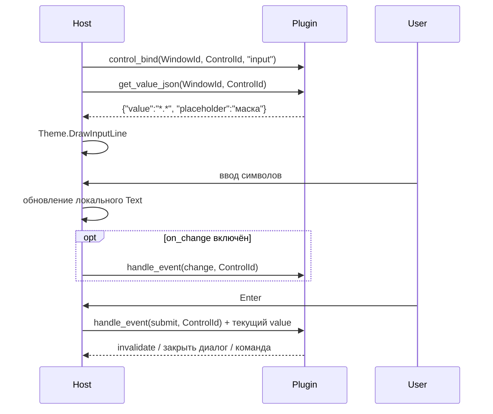

# Взаимодействие Input Line с плагином

> **Роль документа:** контракт однострочного текстового поля (Input Line) с плагином.  
> **Серия:** [UI_PRIMITIVES.md](UI_PRIMITIVES.md).  
> **Контекст:** [readme.md](SDS.md) §6.2, [ARCHITECTURE.md](ARCHITECTURE.md) §6.

---

## 1. Область и роли

Input Line — однострочный примитив ввода. Типичные вхождения:

* командная строка под Dual Panel;
* поле внутри Dialog (маска поиска, имя файла);
* быстрый фильтр / quick search панели.

```text
Host Window / Dialog
└── Input Line (ControlId)
    ├── Text / Caret / Selection
    ├── History (опционально, Host или плагин)
    └── Bound Plugin (WindowId) — владелец логики submit
```

| Участник | Ответственность |
|---|---|
| **Host** | Фокус, каретка, выделение, вставка из буфера, отрисовка через тему, keymap (Enter/Esc/стрелки/история). |
| **Плагин** | Начальное значение, валидация, реакция на submit/change; опционально — подсказки (completion). Без Canvas. |
| **IThemeRenderer** | Стиль поля, курсора, disabled/focused. |

---

## 2. Жизненный цикл



| Этап | Кто | Действие |
|---|---|---|
| **bind** | Host → Plugin | Привязать `ControlId` к модели плагина. |
| **pull value** | Host → Plugin | Начальное / восстановленное значение. |
| **edit** | Host | Локальное редактирование в UI (по умолчанию без round-trip на каждый символ). |
| **submit / cancel** | Host → Plugin | Логическое подтверждение или отмена. |
| **unbind** | Host → Plugin | Снять привязку при закрытии родителя. |

---

## 3. API и JSON

```pascal
function mtn_input_get_json(WindowId, ControlId: Integer;
  OutBuffer: PAnsiChar; MaxLen: Integer): Integer; cdecl;

procedure mtn_input_set_text(WindowId, ControlId: Integer;
  const Text: PAnsiChar); cdecl;  // Host → Plugin (программная установка)

procedure mtn_plugin_handle_event(WindowId: Integer; EventType: Integer;
  Param1: Integer; Param2: Integer); cdecl;
// Param1 = ControlId для событий input

procedure mtn_host_invalidate(WindowId: Integer); cdecl;
```

### 3.1. JSON состояния поля

```json
{
  "value": "*.pas",
  "placeholder": "Маска файлов",
  "max_length": 260,
  "read_only": false,
  "password": false,
  "notify_change": false
}
```

| Поле | Назначение |
|---|---|
| `value` | Текущий текст (источник при bind / после программного set). |
| `placeholder` | Подсказка при пустом value (рисует Host/тема). |
| `max_length` | Ограничение длины; Enforce делает Host. |
| `notify_change` | Если `true` — Host шлёт `change` после правок (с debounce на стороне Host). |

Во время обычного набора **источник истины для текста — Host**. Плагин получает актуальное значение в момент `submit` / `change` (через побочный буфер или `mtn_host_get_control_text`).

```pascal
procedure mtn_host_get_control_text(WindowId, ControlId: Integer;
  OutBuffer: PAnsiChar; MaxLen: Integer); cdecl;
```

---

## 4. События

| EventType | Имя | Param1 | Param2 | Семантика |
|---|---|---|---|---|
| 20 | `submit` | ControlId | 0 | Enter |
| 21 | `cancel` | ControlId | 0 | Esc (если поле не в модале с отдельным cancel) |
| 22 | `change` | ControlId | 0 | Текст изменился (`notify_change`) |
| 23 | `complete` | ControlId | Direction† | Запрос автодополнения (Tab / ↓) |
| 24 | `history_prev` | ControlId | 0 | История вверх |
| 25 | `history_next` | ControlId | 0 | История вниз |

† `Direction`: `0` = next candidate, `1` = prev.

### Completion (опционально)

Плагин на `complete` вызывает `invalidate` или отдаёт список через:

```pascal
function mtn_input_get_completion_count(WindowId, ControlId: Integer): Integer; cdecl;
procedure mtn_input_get_completion_json(WindowId, ControlId, Index: Integer;
  OutBuffer: PAnsiChar; MaxLen: Integer); cdecl;
```

```json
{ "text": "readme.md", "insert": "readme.md" }
```

Host показывает popup-список (примитив Panel в режиме выбора) или подставляет единственный вариант.

---

## 5. Владение состоянием

| Состояние | Владелец |
|---|---|
| Текст во время редактирования, caret, selection | **Host** |
| Начальное value, правила валидации, history (если плагинная) | **Плагин** |
| Отрисовка | **Host + Theme** |

---

## 6. Потоки

* `get_json` / обработка `submit` в UI-потоке — без I/O.
* Тяжёлая валидация / completion по VFS — worker + `invalidate`.

---

## 7. Инварианты

1. Плагин не рисует каретку и не задаёт цвета поля.
2. Submit всегда идёт через Host (клавиша/кнопка), не через прямой вызов UI плагином.
3. Командная строка Dual Panel — тот же контракт; `submit` маршрутизируется в PTY / внутренние команды ядра по решению Host+ассоциаций. Канон панельной консоли (persistent shell + sync cwd) — [readme.md](SDS.md) §5.4, [ARCHITECTURE.md](ARCHITECTURE.md) §8; Tab-complete / вставка путей — roadmap этап 18.
