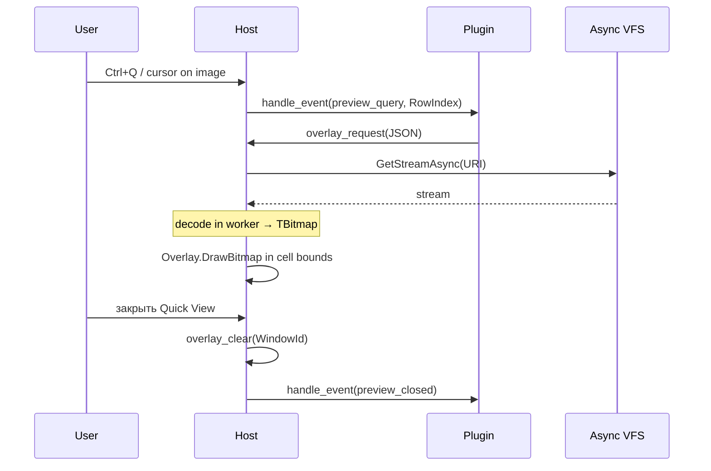

# Взаимодействие Media Overlay с плагином

> **Роль документа:** контракт графического оверлея (растровое превью поверх текстовой сетки) с плагином.  
> **Серия:** [UI_PRIMITIVES.md](UI_PRIMITIVES.md).  
> **Контекст:** [readme.md](SDS.md) §6.2, [ARCHITECTURE.md](ARCHITECTURE.md) (Overlay Renderer).

---

## 1. Область и роли

Media Overlay — слой FMX Canvas **поверх** `TTerminalGrid`. Единственный легальный путь показать bitmap (фото, PDF page, video frame) без нарушения инварианта «плагин без Canvas».

```text
FMX Form
├── TTerminalRenderer (текстовая сетка)
└── Overlay Renderer
    ├── Requests[] (uri, cell bounds, z)
    └── Bitmaps (decoded by Host worker)
         ▲
         │ logical request
    Plugin (Quick View / preview)
```

| Участник | Ответственность |
|---|---|
| **Host / Overlay Renderer** | Приём заявок, декод изображений в worker, `TCanvas.DrawBitmap`, клиппинг, z-order поверх grid. |
| **Плагин** | Логический запрос превью: URI + желаемые границы в **ячейках** + режим. Без доступа к Canvas. |
| **Async VFS** | Поток файла для декодера Host. |

---

## 2. Жизненный цикл



| Этап | Действие |
|---|---|
| **request** | Плагин или Host формирует заявку на оверлей. |
| **load** | Host грузит и декодирует в worker. |
| **present** | Отрисовка поверх grid на каждом кадре / при dirty. |
| **clear** | Снятие оверлея при смене URI, ресайзе, закрытии QV. |

Плагин **не** передаёт сырые пиксели в MVP (слишком тяжёлый маршалинг). Он передаёт URI; декод — в ядре. Post-MVP: опциональный shared-memory / host-side cache id.

---

## 3. API и JSON

```pascal
// Плагин → Host
function mtn_overlay_request(WindowId: Integer;
  const RequestJson: PAnsiChar): Integer; cdecl;

procedure mtn_overlay_clear(WindowId: Integer;
  const RequestId: PAnsiChar); cdecl;  // пустой id = clear all for window

// Host → Plugin
procedure mtn_plugin_handle_event(WindowId: Integer; EventType: Integer;
  Param1: Integer; Param2: Integer); cdecl;

procedure mtn_host_invalidate(WindowId: Integer); cdecl;
```

### 3.1. Заявка на превью

```json
{
  "request_id": "qv-left",
  "uri": "file:///D:/Photos/cat.png",
  "bounds": { "left": 40, "top": 2, "right": 78, "bottom": 22 },
  "fit": "contain",
  "priority": 10,
  "mime_hint": "image/png"
}
```

| Поле | Назначение |
|---|---|
| `request_id` | Идемпотентный ключ (повторный request заменяет предыдущий). |
| `uri` | Источник через VFS. |
| `bounds` | Прямоугольник в **логических ячейках** текущего grid. |
| `fit` | `contain` \| `cover` \| `stretch` \| `center` |
| `priority` | Порядок при нескольких оверлеях. |
| `mime_hint` | Подсказка декодеру. |

Коды возврата `mtn_overlay_request`: `0` ok, `-1` unsupported type, `-2` busy, `-3` invalid bounds.

### 3.2. Статус (Pull, опционально)

```pascal
procedure mtn_overlay_get_status_json(WindowId: Integer;
  const RequestId: PAnsiChar; OutBuffer: PAnsiChar; MaxLen: Integer); cdecl;
```

```json
{
  "request_id": "qv-left",
  "state": "ready",
  "width_px": 1920,
  "height_px": 1080,
  "error_code": ""
}
```

`state`: `loading` | `ready` | `error` | `cleared`.

---

## 4. События

| EventType | Имя | Param1 | Param2 | Семантика |
|---|---|---|---|---|
| 100 | `preview_query` | RowIndex | 0 | Host спрашивает: нужно ли превью для строки |
| 101 | `preview_closed` | 0 | 0 | Оверлей снят |
| 102 | `bounds_changed` | 0 | 0 | Dynamic grid resize — плагин может переиздать request |
| 103 | `overlay_failed` | 0 | 0 | Декод/VFS ошибка; детали в status JSON |

Частый MVP-путь **без** плагина превью: Host сам по `file_type`/`uri` панели делает `overlay_request` для Quick View. Плагинный путь нужен для нестандартных источников (DB blob, генерация диаграммы).

---

## 5. Владение состоянием

| Состояние | Владелец |
|---|---|
| Bitmap cache, decode jobs, фактическая отрисовка | **Host** |
| Решение «что превьюить» и `request_id` | **Плагин** или Host QV |
| Bounds в ячейках | Задаёт заявитель; при resize Host шлёт `bounds_changed` |

---

## 6. Потоки и производительность

1. Декод и VFS — только worker.
2. `DrawBitmap` — UI-поток в связке с FormPaint (после текста или в отдельном overlay pass).
3. Смена курсора в панели отменяет предыдущий decode через cancel token.
4. Большие изображения — downscale до размера bounds×cell в worker.

---

## 7. Связь с dynamic grid

При изменении `Cols`/`Rows` или zoom Host:

1. пересчитывает pixel-rect из cell bounds;
2. шлёт `bounds_changed`;
3. либо сохраняет request_id и только перерисовывает, либо ждёт обновлённый request от плагина.

---

## 8. Инварианты

1. Плагин **никогда** не получает `TCanvas` / `TBitmap` handle.
2. Оверлей не заменяет текстовую сетку и не участвует в `TCharCell`.
3. Клиппинг и z-order относительно MDI — за Host (оверлей обычно в пределах окна Quick View / панели).
4. Ошибка декода не обязана ломать панель — status `error` + текстовый fallback в Status Line.
5. Post-MVP WASM: только URI/request JSON через Host API, без shared framebuffer от модуля.
