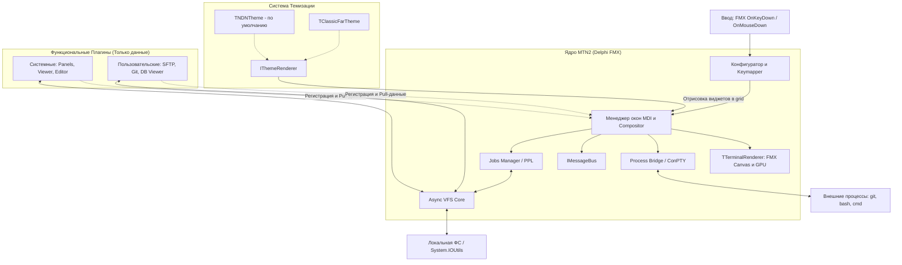

## Техническое описание проекта (System Design Specification)

### Проект: Modern Terminal Navigator 2 (MTN2) – Delphi Edition

> **Роль документа:** полная спецификация (концепция, структуры данных, API, roadmap).
> **Краткий обзор слоёв, потоков и инвариантов:** см. [ARCHITECTURE.md](ARCHITECTURE.md).
> **Сборка, тесты, CI/CD:** см. [BUILDING.md](BUILDING.md). **Лицензия:** [MPL-2.0](../LICENSE).
> При расхождении формулировок приоритет у этого SDS, кроме инвариантов, явно зафиксированных в Architecture.

**MTN2** – кроссплатформенный двухпанельный файловый менеджер (TUI в GUI-окне) с MDI, ориентированный на **повседневную эксплуатацию**. Визуальный и сценарный базис – **Necromancer's DOS Navigator (NDN)**; удачные практики дополняются из **FAR Manager** и **Total Commander**. Реализация – Delphi / FireMonkey: виртуальная текстовая сетка на GPU-холсте.

---

### 1. Введение и концепция

#### 1.0. Продуктовый фокус

MTN2 – в первую очередь **ежедневный файловый менеджер**, а не демонстрация плагинной платформы и не «ещё один терминал».

| Ориентир            | Что берём                                                                                                                                          |
| ------------------- | -------------------------------------------------------------------------------------------------------------------------------------------------- |
| **NDN (базис)**     | MDI, ощущение интерфейса и диалогов, тема по умолчанию (`TNDNTheme`), плотность TUI, работа «клавиатурой вперёд».                                  |
| **FAR**             | Предсказуемый keymap и панели (F-клавиши, `Ctrl+O`, user menu / ассоциации), качественный Viewer/Editor, привычные сценарии навигации и выделения. |
| **Total Commander** | Архивы как папки, вкладки и удобные массовые операции, сравнение каталогов, Multi-Rename, практичный поиск, стабильные copy/move с прогрессом.     |

**Приоритет развития:** паритет повседневных сценариев (навигация, копирование/удаление, поиск, сессии, ассоциации, архивы, сеть) → затем платформа расширений. Порядок экосистемы плагинов: **1) родные плагины MTN2** → **2) Far** → **3) Total Commander** (см. §6.0). Архитектурные контракты соблюдаются с MVP, но **не опережают** UX файлового менеджера.

Критерий готовности к ежедневной замене NDN/FAR на локальных дисках: пользователь может провести рабочий день в MTN2 без возврата к другому FM для базовых операций.

#### 1.1. Отказ от классической консоли в пользу GUI-TUI гибрида

Вместо запуска приложения внутри системной консоли (cmd.exe, bash) программа создает стандартное окно GUI (FMX Form). Внутри этого окна рендерится **динамическая** виртуальная текстовая сетка: число столбцов и строк (`Cols × Rows`) пересчитывается при изменении размера окна и масштаба (zoom) шрифта/ячейки.

**Ключевые преимущества этого подхода:**

- **Абсолютная переносимость**: Одинаковое поведение графики, шрифтов и клавиатурных сочетаний на Windows, macOS и Linux без необходимости адаптироваться к различиям raw-mode терминалов. *(Windows: интерактивный ConPTY реализован (`31f903c`); POSIX PTY – roadmap, этап 23.)*
- **Использование современных шрифтов**: Поддержка TrueType/OpenType моноширинных шрифтов с лигатурами и Unicode (включая эмодзи и иконки Powerline; вне BMP – через grapheme/cluster-aware раскладку ячеек).
- **Свобода цвета**: Полноценная поддержка 32-битного RGBA-цвета, градиентов, эффектов размытия и теней для перекрывающихся окон.
- **Высокая производительность**: Отрисовка текстового буфера средствами GPU (DirectX, Metal, OpenGL/Vulkan) с частотой 60+ FPS.

#### 1.2. Целевые показатели производительности

| Метрика                      | Целевой показатель (v0.1) | Описание / Механизм реализации                                                                                                                 |
| ---------------------------- | ------------------------- | ---------------------------------------------------------------------------------------------------------------------------------------------- |
| **Оперативная память (RSS)** | ≤ 15 МБ                   | Delphi компилирует в оптимизированный нативный код с минимальным оверхедом рантайма                                                            |
| **Рендеринг кадра**          | ≤ 16 мс (60 FPS)          | Аппаратное ускорение FMX + двойная буферизация на текстуре (Bitmap)                                                                            |
| **Открытие файлов до 10 ГБ** | < 0.5 сек (первый экран)  | Потоковый Viewer на базе `TFileStream` с фоновым индексированием строк и ленивой загрузкой                                                     |
| **Бинарный артефакт ядра**   | Один исполняемый файл     | Нативное ядро без обязательных внешних runtime-зависимостей (кроме системных библиотек графики). Плагины DLL/SO/WASM – опциональные расширения |

---

### 2. Архитектура системы

MTN2 использует модульную архитектуру с разделением логики представления (TUI/GUI рендерер) и логики работы с данными (VFS, Jobs). Обзор слоёв и инвариантов – в [ARCHITECTURE.md](ARCHITECTURE.md).



#### Основные слои

1. **FMX Event / Input Layer**: Перехватывает события клавиатуры и мыши и транслирует их во внутренние команды.
2. **MDI Window Manager & Compositor**: Виртуальные окна (Dual Panel, Viewer, Editor, диалоги), z-order, фокус; общий экранный буфер ячеек.
3. **FMX Canvas Renderer (**`TTerminalRenderer`**)**: Dynamic grid + двухбуферная отрисовка на GPU.
4. **Async VFS**: Единый слой для URI (`file://`, `sftp://`, цепочки архивов через `!/`). Только неблокирующие операции с cancel и ошибками.
5. **Background Jobs (PPL)**: Очередь долгих операций (копирование, удаление, поиск) без зависания UI.
6. **Process Bridge**: Неблокирующий запуск процессов и вывод во внутренний консольный буфер (Windows: настоящий ConPTY; POSIX PTY – цель, этап 23).
7. **Theme Engine**: Делегирование стиля виджетов в `IThemeRenderer` (NDN по умолчанию).

#### Разделение ответственности (кратко)

| Роль                            | Отвечает за                                              |
| ------------------------------- | -------------------------------------------------------- |
| **Ядро**                        | Layout, focus, compositing, keymap, Jobs, declarative UI |
| **Тема (**`IThemeRenderer`**)** | Внешний вид виджетов в ячейках сетки                     |
| **Плагины**                     | Данные и логика («что показать»), без `TCanvas`          |

---

### 3. Спецификация структур данных (Object Pascal)

#### 3.1. Ячейка терминала и экранный буфер

Каждая позиция на экране представлена структурой `TCharCell`. Для символов вне BMP и emoji ядро использует grapheme-aware раскладку (кластер может занимать одну или несколько логических ячеек).

```pascal
type
  TCharCellAttribute = (ccaBold, ccaItalic, ccaUnderline, ccaBlink, ccaReverse);
  TCharCellAttributes = set of TCharCellAttribute;

  TCharCell = record
    CharValue: Char;               // Базовый UTF-16 code unit; кластеры – на уровне раскладчика
    FgColor: TAlphaColor;          // Цвет текста (32-bit RGBA)
    BgColor: TAlphaColor;          // Цвет фона (32-bit RGBA)
    Attributes: TCharCellAttributes;
  end;

  TTerminalRow = array of TCharCell;
  TTerminalGrid = array of TTerminalRow;
```

#### 3.2. Оконный менеджер (MDI)

Каждое окно (Dual Panel, редактор, диалог) инкапсулирует логику взаимодействия и делегирует стилизацию виджетов в `IThemeRenderer`. Локальный буфер `FBuffer` кэширует визуальное представление окна.

```pascal
type
  TWindowState = (wsNormal, wsMaximized, wsMinimized);

  TRectI = record
    Left, Top, Right, Bottom: Integer;
    function Width: Integer;
    function Height: Integer;
  end;

  TTerminalWindow = class
  private
    FId: Cardinal;
    FTitle: string;
    FArea: TRectI;
    FZIndex: Integer;
    FIsFocused: Boolean;
    FState: TWindowState;
    FBuffer: TTerminalGrid;           // Кэшированный буфер отрендеренного окна
    FTheme: IThemeRenderer;           // Ссылка на глобальный/локальный плагин темы
  public
    // Вызывает методы FTheme для отрисовки рамки и элементов во внутренний FBuffer
    procedure RebuildBuffer; virtual;
    procedure Resize(AWidth, AHeight: Integer); virtual;
    // Копирует кэшированный FBuffer в общий буфер композитора
    procedure Paint(const ACompositorBuffer: TTerminalGrid); virtual;
    procedure HandleInput(var AKey: Word; AShift: TShiftState; var AHandled: Boolean); virtual;
  end;
```

#### 3.3. Dual Panel, вкладки и панели

Иерархия (см. также Architecture, §3):

```text
TDualPanelWindow (MDI)
├── Dual Panel Tabs          – вкладки рабочих пространств
└── Active TDualPanelState
    ├── Left:  Panel Tabs → TTab (URI, history, cursor)
    └── Right: Panel Tabs → TTab
```

- **Dual Panel Tabs** – вкладки на всё двухпанельное окно; каждая хранит полный снимок `TDualPanelState`.
- **Panel Tabs** – вкладки каталогов внутри каждой стороны (`Left` / `Right`).
- Viewer / Editor – Dual Panel Tab (`wkDocument`) на той же полосе, что Home/Work; Console – отдельный `TTerminalWindow`.
- **Контракты UI-примитивов (плагин ↔ ядро):** [UI_PRIMITIVES.md](UI_PRIMITIVES.md).

```pascal
type
  TTab = record
    Id: Cardinal;
    Title: string;            // Подпись Panel Tab (home, documents, …)
    CurrentURI: string;       // Например, 'file:///D:/Work'
    History: TArray<string>;  // История переходов (назад/вперед)
    HistoryIndex: Integer;
    CursorIndex: Integer;     // Индекс выделенного элемента
    ScrollOffset: Integer;    // Смещение прокрутки панели
    SelectedURIs: TArray<string>; // multi-select по URI строки
  end;

  TPanelSide = (psLeft, psRight);
  TPanelViewKind = (pvkFiles, pvkInfo); // Ctrl+L – Info на соседней стороне
  TPanelColumnMode = (pcmBrief, pcmSize, pcmDate, pcmFull, pcmCreated, pcmTypes);
  TPanelSortColumn = (pscNone, pscName, pscExt, pscSize, pscModified,
    pscCreated, pscAccessed, pscAttr, pscType);

  TPanelState = record
    Tabs: TArray<TTab>;
    ActiveTabIndex: Integer;
    DriveDirs: array['A'..'Z'] of string; // last path per drive (Alt+F1/F2, Ctrl+←/→)
    ColumnMode: TPanelColumnMode;         // Ctrl+3 – меню режимов
    SortColumn: TPanelSortColumn;         // Ctrl+F3..F9 / Ctrl+F12 / клик заголовка
    SortDescending: Boolean;              // заглавная буква в углу рабочего поля
    ViewKind: TPanelViewKind;
  end;

  TDualPanelState = record
    LeftPanel: TPanelState;
    RightPanel: TPanelState;
    ActiveSide: TPanelSide;
    LeftVisible: Boolean;   // Ctrl+F1
    RightVisible: Boolean;  // Ctrl+F2
  end;

  // Одна вкладка уровня Dual Panel = полный снимок панелей или документ
  TWorkspaceKind = (wkPanels, wkDocument);

  TDualPanelWorkspaceTab = record
    Id: Cardinal;
    Title: string;
    Kind: TWorkspaceKind;   // wkPanels | wkDocument (Viewer/Editor)
    State: TDualPanelState;
  end;

  TDualPanelWindowState = record
    WorkspaceTabs: TArray<TDualPanelWorkspaceTab>;  // Dual Panel Tabs
    ActiveWorkspaceIndex: Integer;
  end;
```

`TDualPanelWindow` – наследник `TTerminalWindow`, владеющий `TDualPanelWindowState`. Геометрия колонок, Brief multi-column, icon reserve и hit-test – `uPanelColumns.pas`. Shell-иконки строк – `uShellIcons.pas` (§4.2). Overlay-меню Sort / Column modes / User menu – `uDualPanelMenus.pas`.

**FAR-буква сортировки.** У каждой файловой панели (`pvkFiles`) в левом верхнем углу **рабочего поля** (первая клетка строки заголовков колонок, `Left+1` / `Top+1` — не на рамке) рисуется глиф текущего `SortColumn`: `n` имя, `x` расширение, `w` время записи, `s` размер, `u` без сортировки, `c` создан, `a` доступ, `t` атрибуты, `y` тип. Заглавная буква — `SortDescending`. Цвет — акцент темы `pcpHotMark` на фоне `pcpColumnHeader`, с запасным контрастом через `ContrastingGlyphFg` (`uThemeDrawing.pas`), чтобы глиф читался на любой палитре. Info / Quick View букву не показывают. `PanelSortModeLetter` — `uPanelColumns.pas`; отрисовка после заголовков — `DrawPanelSortLetter` в `uDualPanelPanelDraw.pas` (`DispatchDrawPanelFiles`).

Верхняя полоса выпадающего меню (F9 / Alt / мышь) управляется `uTopMenuBar.pas`; структура грузится из встроенного ресурса `MENU_MAIN` (RCDATA ← `src/config/menu.json`), с fallback на файл рядом с exe/в исходниках и захардкоженную структуру, если ресурса нет.

Смена диска (Alt+F1/Alt+F2, `uDualPanelDrivePopup.pas`) – под списком дисков разделитель и пронумерованные спецпункты `1. System folders` / `2. Recycle bin` / `3. Temporary` / `4. Workspace` (выбор Enter/клик/цифра 1–4). Курсор popup ставится на **текущий** URI активной вкладки панели (`HostPanelPath` = `ActiveTab.CurrentURI`, индекс — `DrivePopupCursorIndex` / глиф `DriveBarGlyphFromUri`: буква диска или `1`–`4`), а не всегда на первый диск. Переход к системным виртуальным папкам Windows (Рабочий стол, Документы, Загрузки и др.) – `sys://folders` VFS (`uSysFoldersVfs.pas`); просмотр и восстановление файлов Корзины – `recycle://` VFS (`uRecycleBinVfs.pas`, `IShellFolder2`/`IFileOperation`; Ctrl+Alt+R restore, F8 = безвозвратный purge); `tmp:///` – плагин Temporary (пункт 3, если схема зарегистрирована); `ws:///` – панель ссылок ядра (`uWorkspaceVfs.pas`, пункт 4, F8 = Unlink). Листинги `sys://` и `recycle://` синтетические: `..` возвращает не «на уровень выше внутри VFS» (родителя там нет), а в директорию, из которой был сделан переход (через историю табов, `TDualPanelWindow.HistoryBack`). F-bar (`uFunctionBar.pas`) в этих листингах переключается на урезанный контекст (`fbcSysFolders`/`fbcRecycleBin`), скрывающий недоступные операции (Copy/Move/MkDir и т.п.).

Оверлеи Dual Panel рисуются снизу вверх (`DispatchDrawOverlays` в `uDualPanelPanelDraw.pas`): Change Drive / jobs / меню / поиск → **диалог** → **stub поверх диалога** → подменю F9. Ввод и клик — в обратном порядке (`uDualPanelWindow` / `uDualPanelClick.pas`): сначала stub, потом диалог. F-bar берёт контекст из `ResolveChromeContext` (`uDualPanelStatus.pas`): видимый stub важнее диалога; вид диалога (`THostDialogKind`) даёт свой набор подписей (`fbcWorkspaceLibrary`, `fbcFolderHotlist`, `fbcColorCoding`, `fbcColorCodingEdit`, списки — `fbcDialogList`), а не общий `Enter:OK`. Строковые литералы в `.pas` идут в кодовой странице компилятора (обычно Windows-1251): типографское тире задавайте как `#$2014`, иначе в UI получится `вЂ"`.

Взаимодействие с внешними окнами ОС по перетаскиванию файлов реализовано нативным мостом Windows OLE Drag & Drop (`uWinFileDragDrop.pas`).

Отрисовка аппаратного мигающего курсора (интервал 530 мс) интегрирована в `TInputLine` (командная строка, поля ввода диалогов) и `TEditorWindow` (редактор/просмотрщик).

История каталогов (Alt+F12) – `uFolderHistory.pas` + dialog `folderhistory.json`.

История введённых команд (Alt+F8) – хранится в `TDualPanelCmdLineManager` (`uDualPanelCmdLine.pas`, `history.json`) + dialog `cmdhistory.json`, единая для cmdline Dual Panel, фоновой консоли (`Ctrl+O`) и вкладок Terminal Workspace (`Ctrl+Shift+N`) – `TBaseConsoleWindow` (`uBaseConsoleWindow.pas`) даёт Alt+F8 обоим наследникам через `OnGetCmdHistory`/`OnCommandExecuted`, а сам ввод хоста-моста в `TMainForm`/`TDualPanelWindow` (`ConsoleGetCmdHistory`/`RecordConsoleCommand`). В Dual Panel выбор строки подставляет её в командную строку (без немедленного запуска); в консоли/терминале – своей строки ввода нет, поэтому команда выполняется сразу (`ExecuteCommandNow`). Команды, набранные прямо в шелле консоли/терминала (Enter на непустой строке ввода, вне alt-screen TUI), тоже пишутся в эту историю – перехват на Enter через `TConsoleBuffer.GetInputAfterPrompt`/`NoteCommandSubmitted`, до отправки в PTY.

---

### 4. Реализация рендерера на FireMonkey (FMX)

Рендеринг – двухбуферный, с **dynamic grid**: `Cols`/`Rows` зависят от клиентской области формы и масштаба ячейки.

#### 4.1. Опциональный движок рендеринга Skia (Skia4Delphi)

По умолчанию рендеринг выполняется штатным графическим движком FMX Canvas (Direct2D/Metal/OpenGL) с минимальными требованиями к бинарному размеру и окружению.

Для повышения четкости моноширинных шрифтов на HiDPI и субпиксельного сглаживания внедрена опциональная поддержка **Skia4Delphi** с легким откатом:
* **Включение Skia**: в `MTN2.dproj` должен быть `DCC_Define` с `SKIA`; в `MTN2.dpr` – `uses FMX.Skia` и `GlobalUseSkia := True` под `{$IFDEF SKIA}`.
* **Откат (Rollback)**: уберите `SKIA` из `DCC_Define` и блоки `FMX.Skia` / `GlobalUseSkia` в `MTN2.dpr`. Юниты с `{$IFDEF SKIA}` вернутся на ветки без Skia-оптимизаций; canvas – штатный FMX.

**Что даёт Skia в MTN2 сейчас (поверх общего FMX→Skia canvas):**

1. **Текст без растяжения** – глифы центрируются в snapped-ячейке (natural advance), без `Scale` matrix, которая размывала AA.
2. **Шрифт** – при наличии `CascadiaMono.ttf` выбирается Cascadia Mono, иначе Consolas.
3. **Тени диалогов** – затемнение исходных Fg/Bg ячеек (сохраняется содержимое под тенью), а не плоская серая заливка.
4. **Modal dim** – перед рамкой диалога затемняется весь грид вне bounds (FAR-стиль).
5. **Shell-иконки в панелях** – blit `TBitmap` с alpha в ячейки (`TCharCell.IconId`); HighSpeed=False, чтобы прозрачный фон (`parent_up.png`) просвечивал цвет строки.

Архитектура Host/Theme/cell-grid сохраняется: иконки – гибрид (cell + bitmap overlay в рендерере). Полноценный Quick View / превью медиа – этап 24; отдельный Skia-only paint всего грида – только если профилирование это оправдает.

#### 4.2. Столбец shell-иконок в панелях

Первый столбец списка файлов – растровые иконки Windows (не emoji):

| Элемент | Источник |
| --- | --- |
| Обычные файлы | `SHGetFileInfo` по расширению (`*.ext` + `SHGFI_USEFILEATTRIBUTES`) |
| `.exe` / `.dll` / `.ico` / `.lnk` / … | сначала иконка из файла по URI; иначе – по расширению |
| Каталог | системная folder-icon |
| `..` (parent) | `Assets/parent_up.png` (RCDATA `ICON_PARENT_UP`; зелёная стрелка, прозрачный фон) |

**Загрузка — фоновая (этап 53).** `SHGetFileInfo`/`ExtractIconEx` уходят на выделенный worker-поток (`TShellIconWorker`), не на UI: `ShellIconIdForRow` при промахе кэша лишь ставит задачу в очередь и сразу возвращает `0` (fallback-глиф остаётся на месте), готовая иконка приходит в кэш через `TThread.Queue` и триггерит `NotifyChanged` (реальный repaint формы). Worker выкачивает оконные сообщения (`MsgWaitForMultipleObjects` + `PeekMessage`/`DispatchMessage`) — без этого COM-маршалинг некоторых shell-расширений (иконки-оверлеи облачных клиентов, антивирусов) мог бы подвесить поток навсегда. `ShellIconIdForRowWait` — синхронный резолв в обход очереди, только для smoke-тестов без message loop.

**Юниты:** `uShellIcons.pas` (кэш id→bitmap + фоновый worker), `uPanelColumns` (`PanelIconReserve` = 2 ячейки иконки + 1 gap), `TTerminalRenderer` (blit по `IconId`), `TDualPanelWindow.DrawList`.

**Smoke:** `src/tests/panels/TestPanelColumns.dpr`, `src/tests/panels/TestShellIcons.dpr` (покрывает и синхронный, и асинхронный путь резолва). При сборке `build.ps1` копирует `parent_up.png` в `bin/Assets/` (file-fallback рядом с exe).

```pascal
type
  TTerminalRenderer = class
  private
    FBackBuffer: TBitmap;
    FGrid: TTerminalGrid;
    FCols: Integer;
    FRows: Integer;
    FFontName: string;
    FFontSize: Single;
    FZoom: Single;                 // Масштаб (1.0 = 100%)
    FCellWidth: Single;
    FCellHeight: Single;
    FNeedRebuildBuffer: Boolean;
    procedure CalculateCellMetrics(ACanvas: TCanvas);
    procedure RecalcGridDimensions(AClientWidth, AClientHeight: Single);
    procedure RenderGridToBitmap;
  public
    constructor Create;
    destructor Destroy; override;
    procedure Resize(AWidth, AHeight: Single; ACanvas: TCanvas);
    procedure SetZoom(AZoom: Single; AClientWidth, AClientHeight: Single; ACanvas: TCanvas);
    procedure Draw(ACanvas: TCanvas; const ADestRect: TRectF);
    property Grid: TTerminalGrid read FGrid write FGrid;
    property Cols: Integer read FCols;
    property Rows: Integer read FRows;
  end;
```

- **Механика отрисовки**:
  1. `Resize` / `SetZoom` → `CalculateCellMetrics` → `RecalcGridDimensions` (`Cols = Trunc(ClientWidth / CellWidth)`, аналогично для `Rows`) → пересоздание `FGrid` и `Resize` окон композитора.
  2. `RenderGridToBitmap` выполняется только при изменении содержимого или метрик (`FNeedRebuildBuffer`); ping-pong front/back frame.
  3. `Draw` в `OnPaint` копирует готовый front frame через `ACanvas.DrawBitmap`.
  4. Символы – `FillText` (под Skia без stretch); box-drawing – вектор; `IconId` – alpha-blit shell-иконки.
  5. WordWrap у текста ячеек отключён.

---

### 5. Асинхронные операции и Виртуальная ФС (VFS)

#### 5.1. Контракт Async VFS и схемы URI

UI-поток **не вызывает** блокирующие методы провайдера. Все операции выполняются в worker-потоке Jobs Manager и завершаются callback'ом / событием job.

**Поддерживаемые схемы URI в ядре (`v0.2.x`):**

- `file://` – локальная файловая система (`uFileVfs.pas`).
- `sys://folders` – системные виртуальные каталоги Windows (Рабочий стол, Документы, Загрузки, Изображения, Музыка, Видео, Профиль, System32, Program Files и др.) (`uSysFoldersVfs.pas`). Элементы сопоставляются с реальными целевыми путями `TargetURI`.
- `zip://` и `!/` – прозрачные ZIP-архивы (`uZipVfs.pas`) с кэшированием структуры через `uZipArchiveCache.pas`.
- `find://` – виртуальные панели результатов поиска (`uFindVfs.pas`).
- `recycle://` – Корзина Windows (`uRecycleBinVfs.pas`, через `IShellFolder2`, канонический корень `recycle:///`). В основном read-only (`ListDirectoryAsync`/`ExistsAsync`); `DeleteAsync` – настоящая безвозвратная очистка (purge, не повторная отправка в Корзину); `MoveAsync`/`CopyAsync`/`WriteTextAsync` → `vecNotSupported` (для возврата файла используйте `RestoreRecycleBinItem`, Ctrl+Alt+R).
- `ws://` – панель ссылок на файлы и каталоги (`uWorkspaceVfs.pas`, корень `ws:///`). Не копии: F5 записывает reference, F8 снимает его (Unlink). Виртуальные группы — F7. Change Drive **4**. Именованные снимки живого набора — `workspaces.json` + **Commands → Workspaces...** (`Ctrl+Shift+D`); см. `src/plugins/mtn.ws/readme.md`. Схема в ядре; WASM `mtn.ws` только регистрирует меню.

**Схемы плагинов (появляются, только если модуль загружен):** `7z://` (`mtn.7z`), `wasmdemo://` (`mtn.wasm.demo`), `tmp:///` (Temporary, Change Drive **3**). WASM-хост отклоняет `register_vfs_scheme` для ядерных `file` / `recycle` / `sys` / `find` / `ws`, чтобы пустая панель не падала в file VFS с «Invalid path».

**Централизованный резолвер конфигурации (`uConfigLocation.pas`):**

Разрешает пути к файлам настроек (`keymap.json`, `session.json`, `history.json`, `workspaces.json`, `associations.json`, `usermenu.json`):
- **Portable режим**: при наличии файла `portable.dat` в директории приложения конфиг читается/пишется рядом с `.exe`.
- **Стандартный режим**: по умолчанию используется `%APPDATA%\MTN2\`.

**Дефолтные JSON-ассеты – встроенные ресурсы, не файлы рядом с exe.** Диалоги (`DIALOG_*`), меню (`MENU_MAIN`) и дефолтный профиль хоткеев (`KEYMAP_DEFAULT`) компилируются как RCDATA в `MTN2.rc`/`MTN2Resource.rc` из `src/dialogs/*.json`, `src/config/menu.json`, `src/keymap.json` соответственно и грузятся из ресурсов exe при старте (`uDialogResources.pas`, `uTopMenuBar.LoadMenuFromResource`, `uKeymap.LoadDefaultKeymapProfile`) – портативный `.exe` не зависит от соседних файлов. Только `keymap.json` дополнительно поддерживает **пользовательский override**: если в конфиг-директории (`GetConfigFilePath`) лежит собственный `keymap.json`, он подмешивается поверх встроенного дефолта через `MergeKeymapJson` – заменяются только явно перечисленные там хоткеи, остальное остаётся от ресурса. При изменении `menu.json`/`keymap.json`/`dialogs/*.json` в исходниках нужно пересобрать `MTN2.dres` (`brcc32 MTN2Resource.rc`, см. `src/build.ps1` или Pre-build в `MTN2.dproj`), иначе изменения не попадут в скомпилированный ресурс. Канонический вывод — `bin\MTN2.exe` (`DCC_ExeOutput=..\bin`); `src\Win64\Debug\MTN2.exe` может остаться со старым `.dres` (типичный симптом: `Dialog resource "DIALOG_WORKSPACES" not found`).

```pascal
type
  TVfsEntry = record
    Name: string;
    Size: Int64;
    IsDirectory: Boolean;
    CreationTime: TDateTime;
    ModificationTime: TDateTime;
  end;

  TVfsErrorCode = (
    vecOk,
    vecNotFound,
    vecAccessDenied,
    vecAlreadyExists,
    vecNotSupported,
    vecCancelled,
    vecIOError
  );

  TVfsError = record
    Code: TVfsErrorCode;
    Message: string;
    URI: string;
  end;

  IJobCancelToken = interface
    ['{C3E1A7D0-2F4B-4A9E-9C11-6B0E8D2A1F40}']
    function IsCancellationRequested: Boolean;
    procedure Cancel;
  end;

  TVfsListCallback = reference to procedure(const AItems: TArray<TVfsEntry>; const AError: TVfsError);
  TVfsBoolCallback = reference to procedure(const ASuccess: Boolean; const AError: TVfsError);
  TVfsStreamCallback = reference to procedure(const AStream: TStream; const AError: TVfsError);
  TVfsProgressCallback = reference to procedure(const ACopied, ATotal: Int64);

  IVirtualFileSystem = interface
    ['{B18C8B56-B101-44B9-A23F-2621C11F490A}']
    procedure ListDirectoryAsync(const AURI: string; ACancel: IJobCancelToken; AOnDone: TVfsListCallback);
    procedure FileExistsAsync(const AURI: string; ACancel: IJobCancelToken; AOnDone: TVfsBoolCallback);
    procedure CreateDirectoryAsync(const AURI: string; ACancel: IJobCancelToken; AOnDone: TVfsBoolCallback);
    procedure DeleteAsync(const AURI: string; ACancel: IJobCancelToken; AOnDone: TVfsBoolCallback);
    procedure RenameAsync(const AFromURI, AToURI: string; ACancel: IJobCancelToken; AOnDone: TVfsBoolCallback);
    procedure GetStreamAsync(const AURI: string; AMode: Word; ACancel: IJobCancelToken; AOnDone: TVfsStreamCallback);
  end;

  // Реестр VFS-провайдеров (file://, sys://folders, sftp://, …)
  TVFSRegistry = class
  public
    class procedure RegisterProvider(const AScheme: string; const AProvider: IVirtualFileSystem);
    class function GetProvider(const AURI: string): IVirtualFileSystem;
  end;
```

Правила:
- Callback'и маршалятся в UI-поток через `TThread.Queue` / очередь событий Jobs.
- Провайдер обязан проверять `ACancel.IsCancellationRequested` в циклах чтения/записи.
- При отмене: `AError.Code = vecCancelled`.
- Владение `TStream` из `GetStreamAsync` переходит вызывающему; закрытие – в `finally` на стороне job.

#### 5.2. Прозрачные архивы (Nested VFS) и кэширование

Архивы (ZIP, TAR, 7Z, …) монтируются как папки. Каноническая грамматика цепочки – сегменты `!/`:

```text
sftp://server.example/home/user/outer.zip!/inner.tar!/docs/readme.txt
file:///D:/data/bundle.zip!/nested.zip!/a.txt
```

1. Часть до первого `!/` – базовый URI (`file`, `sys`, `sftp`, …).
2. Каждый следующий сегмент – путь внутри архивного слоя; тип определяется по имени/сигнатуре.
3. `TVFSRegistry` / Plugin Manager строит стек провайдеров outer → inner.
4. Запись `zip://host/path/archive.zip/entry` допустима только для **однослойного** mount; для вложенности обязательна форма с `!/`.
5. Кэширование оглавления архивов (`uZipArchiveCache.pas`) устраняет повторный разбор структуры при навигации по вложенным папкам.

**Поставка провайдеров:** ZIP в ядре (этап 14); прочие форматы и контейнеры – **родные** VFS-плагины MTN2; затем опционально мосты Far / Total Commander (WCX). Порядок – §6.0.

#### 5.3. Фоновые задачи (Background Jobs)

Долгие операции (копирование, удаление, pack/unpack) оформляются как job с progress, result и cancel. I/O идёт в worker-потоке; UI держит job только пока он **foreground** или в ask. Кнопка **Background** в Copy/Delete отпускает панели (как в Total Commander). Несколько job: локальный `file://` может идти параллельно; один и тот же архив, тот же `sftp://` authority или пересекающиеся URI — в очередь. Список job — Ctrl+Shift+J / клик по статус-строке (`kaJobList`). Поиск по-прежнему на своём контроллере, не в этом списке.

```pascal
uses
  System.Threading;

procedure CopyFileAsync(const ASourceURI, ADestURI: string;
  ACancel: IJobCancelToken;
  AOnProgress: TVfsProgressCallback;
  AOnDone: TVfsBoolCallback);
begin
  TTask.Run(
    procedure
    var
      SourceStream, DestStream: TStream;
      Buffer: array[0..65535] of Byte;
      ReadBytes: Integer;
      TotalCopied, TotalSize: Int64;
      Error: TVfsError;
      CopiedSnapshot, TotalSnapshot: Int64;
    begin
      Error.Code := vecOk;
      Error.Message := '';
      Error.URI := ASourceURI;
      TotalCopied := 0;
      TotalSize := 0;
      SourceStream := nil;
      DestStream := nil;
      try
        // Получение потоков – внутри worker (через sync-обёртку провайдера
        // либо вложенные async-completion; UI не участвует)
        SourceStream := VFSOpenStreamBlocking(ASourceURI, fmOpenRead, ACancel, Error);
        if Error.Code <> vecOk then
        begin
          FinishCopy(False, Error, AOnDone);
          Exit;
        end;
        DestStream := VFSOpenStreamBlocking(ADestURI, fmCreate, ACancel, Error);
        if Error.Code <> vecOk then
        begin
          FinishCopy(False, Error, AOnDone);
          Exit;
        end;

        TotalSize := SourceStream.Size;
        while True do
        begin
          if ACancel.IsCancellationRequested then
          begin
            Error.Code := vecCancelled;
            Error.Message := 'Cancelled';
            FinishCopy(False, Error, AOnDone);
            Exit;
          end;

          ReadBytes := SourceStream.Read(Buffer, Length(Buffer));
          if ReadBytes = 0 then
            Break;
          DestStream.WriteBuffer(Buffer, ReadBytes);
          Inc(TotalCopied, ReadBytes);

          // Снимки для замыкания: не захватывать TotalCopied напрямую из цикла
          CopiedSnapshot := TotalCopied;
          TotalSnapshot := TotalSize;
          TThread.Queue(nil,
            procedure
            begin
              if Assigned(AOnProgress) then
                AOnProgress(CopiedSnapshot, TotalSnapshot);
            end);
        end;

        FinishCopy(True, Error, AOnDone);
      finally
        SourceStream.Free;
        DestStream.Free;
      end;
    end
  );
end;

procedure FinishCopy(const ASuccess: Boolean; const AError: TVfsError; AOnDone: TVfsBoolCallback);
var
  SuccessSnap: Boolean;
  ErrorSnap: TVfsError;
begin
  SuccessSnap := ASuccess;
  ErrorSnap := AError;
  TThread.Queue(nil,
    procedure
    begin
      if Assigned(AOnDone) then
        AOnDone(SuccessSnap, ErrorSnap);
    end);
end;
```

#### 5.4. Командная строка и эмуляция терминала (PTY)

Поскольку MTN2 – графическое приложение (FMX), запуск консольных программ идёт через process bridge во внутренний буфер. Детали моделей и эволюции – в [ARCHITECTURE.md](ARCHITECTURE.md) §8.

##### Текущее состояние (`v0.2.8`, после дефект-фикс прохода `31f903c` "Fix console")

1. **Одна Command Line** – только у `TDualPanelWindow` (общая для панелей и консольного режима).
2. **Не путь → команда**: Host включает `ConsoleMode` у Dual Panel (панели не рисуются, cmdline/F-keys/status остаются), показывает MDI-`TConsoleWindow` над cmdline; **persistent** shell через настоящий **ConPTY** (`StartShell` + `WriteInput`, см. п.9); one-shot команда – тот же `LaunchProcess`/ConPTY-путь без keep-stdin.
3. `Ctrl+O` **(FAR-style)**: Console MDI над общей cmdline; нижняя линия рамки Console – граница над cmdline. Обратно – обычные панели; shell не убивается.
4. **Буфер**: `TConsoleBuffer` + `TANSIParser` – построчный cell-scrollback (≥10 000) с SGR (16/256/**TrueColor**), EL/ED, OSC strip (с лимитом длины `FOscLen`/`cMaxOscLen` и принудительным `ResetState` при превышении – не виснет на оборванном OSC), tab-раскрытие до 8-колоночного табстопа, lone-CR overwrite; `TConsoleWindow` рисует `TCharCell` Fg/Bg. **Плюс** alternate screen (DECSET/DECRST `1049`/`47`) поверх отдельного 2D `TAltScreenGrid`/`TPrimaryScreenGrid` (`uAltScreenGrid.pas`, `uPrimaryScreenGrid.pas`) с CUP/CUU/CUD/CUF/CUB (`MoveAbs`/`MoveRel`) и save/restore cursor – ядро этапа 22, детали ниже. Выделение мышью / Shift+стрелки, Ctrl+A, Ctrl+C.
5. **Cmdline UX (`v0.2.4`)**: Tab-complete по именам активной панели; Up/Down – история (`history.json`); Ctrl+Enter / Ctrl+Shift+Enter – имя / путь.
6. **F5 robocopy-lite (`v0.2.5`)**: Only newer / Retry / Exclude mask / Preserve timestamps / Follow symlinks.
7. **Directory Sync (`v0.2.5` / `v0.3.6` / `v0.3.5`)**: one-way Active→Inactive или two-way ⇄ (`Ctrl+Alt+S`); сравнение по дате или по содержимому; dry-run / Synchronize через copy job с `DestURIs`; конфликты two-way (оба изменились с прошлого sync) не копируются.
8. **Terminal Workspaces (`v0.2.7`, доработано после закрытия)**: `TTerminalWorkspaceWindow` с профилями (CMD/PS/pwsh/WSL), raw input, `Ctrl+Shift+N`. **Больше не плавающее MDI-окно** – живёт как Dual Panel Tab (`wkTerminal` в `TWorkspaceKind`, владеет `TDualPanelWindow.FTerminals`), наравне с `wkPanels`/`wkDocument`; открывается/закрывается/рисуется тем же путём, что и Viewer/Editor. **Эфемерна** – как `wkDocument`, не сохраняется и не восстанавливается в `session.json` (старое поле `terminals: [{profile,cwd}]` убрано вместе с всей связанной save/restore-логикой в `uMainForm.pas`/`uSession.pas`). Высота вкладки – на 2 строки меньше полной, снизу видны общие F-key bar и status line Dual Panel (контекст `fbcTerminal`: `Esc:Close`, `Ctrl+A/C/V`; статус – профиль + Running/Not running) вместо собственной строки статуса терминала (убрана). `F10` в Panel Console (`Ctrl+O`) больше не закрывает консоль (только `Esc`/`Ctrl+O`). Process bridge теперь настоящий ConPTY (см. п.9), не pipes. **Enter-последовательность профиль-зависима** (`ProfileReturnSeq`, `uShellProfiles.pas`): cmd/PS/pwsh – CRLF (piped stdin без CRLF не сабмитит строку); WSL – одиночный LF (CRLF под Linux `icrnl` доходит как два Enter подряд, второй пустой перерисовывает промпт – было видно как дублирование промпта после каждой команды в WSL-консоли). **Исторически** (под pipes, до перехода на ConPTY в `31f903c`) PowerShell/pwsh виснул навсегда на любой ошибке команды, не лечилось `try/catch`/`$ErrorActionPreference='Stop'`; приложенческая митигация – `ProfileInitCommand` (`$ErrorActionPreference='SilentlyContinue'` при старте профиля) + `PsPipeSafeCommand`/`IsSimplePsExpression` (безопасно оборачивает простые команды в `| % {"$_"}`, чтобы результат обошёл движок форматирования) – **оставлена в коде как defense-in-depth**; сама причина (pipes без реального console-handle) устранена переходом на `CreatePseudoConsole`, и это **подтверждено живым тестированием под ConPTY** – зависаний PowerShell/pwsh на ошибках команд больше нет.
9. **Process bridge**: `uConPty.pas` / `TConPtySession` – настоящий **ConPTY** (`CreatePseudoConsole`/`ResizePseudoConsole`/`ClosePseudoConsole`), безусловно для `Start`/`StartShell` (нет отдельного pipe-only fallback пути); `Resize` реально меняет размер псевдоконсоли. `Terminate` – упорядоченное закрытие: close stdin → `TerminateProcess` → `ClosePseudoConsole` → join reader-потока с таймаутом 2 сек (не блокирует UI навсегда) → закрытие хендлов; per-profile кодировка ввода/вывода (`ProfileOutputEncoding`, cmd – OEM/CP866, PS/pwsh/WSL – UTF-8) с pending multi-byte хвостом (`FDecodeTail`) между чанками `ReadFile`.
10. **Синхронизация cwd**: смена локального URI активной панели → тихий `cd /d` в живой shell (`OnShellCwdSync`), **по умолчанию выключено** (`session.json` → `autoSyncConsoleCwd`, default `false` – консоль и активная панель держат каждая свой каталог). Ручная синхронизация в обе стороны по `Ctrl+Shift+O` (`kaSyncConsoleDir`, keymap.json): при активной Dual Panel – каталог активной панели → консоль (`TDualPanelWindow.SyncConsoleDirNow`); при активной фоновой консоли – её `WorkingDir` → активная панель (`TConsoleWindow.OnSyncDirToPanels` → `TMainForm.ConsoleSyncDirToPanels` → `TDualPanelWindow.SetActivePanelDir`), пункт меню Commands → "Sync console dir".
11. **Viewer / Editor**: `TEditorWindow` + `TEditorDoc` как Dual Panel Tab (`OpenDocument`); F3 = ViewOnly, F4 = edit. Документ целиком в RAM (потоковый Viewer – цель этапа 24 / инвариант Architecture). **Live reload** (этап 53): локальный файл без несохранённых правок молча перечитывается при внешнем изменении на диске (`TDirectoryWatcher` на содержащем каталоге); `ContentGen` – счётчик перезагрузок для инвалидации внешних кэшей (например, Markdown fence-индекса).
12. **Panel icons**: первый столбец – shell-иконки Windows (`uShellIcons`), загрузка фоновая (этап 53, не блокирует UI); `..` → `parent_up.png`; gap перед Name (§4.2).
13. **Skia** (`DCC_Define SKIA`): чёткий mono-текст, modal dim, alpha-blit иконок (§4.1).
14. **Alt+F12**: история папок (`folderhistory.json` / dialog `DIALOG_FOLDERHISTORY`).
15. **Alt+F8**: история введённых команд (`cmdhistory.json` / dialog `DIALOG_CMDHISTORY`), источник – тот же `history.json`, что и Up/Down в cmdline (п.5). Доступен и в cmdline Dual Panel (выбор строки подставляет её, не запускает), и в фоновой консоли/вкладках Terminal Workspace (`TBaseConsoleWindow.OpenCmdHistoryDialog`, свой `TDialogHost`), где выбор строки выполняет её сразу (`ExecuteCommandNow`) – там нет своей строки ввода для правки.
16. **Естественный выход шелла из фоновой консоли**: ConPTY не закрывает write-конец output pipe, пока сам процесс жив внутри псевдоконсоли – после `exit` внутри шелла блокирующий `ReadFile` в reader-потоке не получает EOF сам по себе (в отличие от `Terminate`, который явно зовёт `TerminateProcess`+`ClosePseudoConsole`). Ватчер `TConPtySession.StartExitWatcher` ждёт выход процесса на собственном дубликате хендла и сам закрывает псевдоконсоль, разблокируя `ReadFile` → штатный `QueueExit`/`OnExit`. Фоновая консоль после этого **по умолчанию перезапускает шелл** на последнем `cwd` (`TConsoleWindow.RestartOnExit`, default `true`, `session.json` → `consoleRestartOnExit`); вкладка Terminal Workspace (`Ctrl+Shift+N`) по умолчанию **закрывается** (`TTerminalWorkspaceWindow.CloseOnExit`, default `true`, `session.json` → `terminalCloseOnExit`).

##### Целевые модели (канон после этапов 16–22)

| Режим                  | Назначение                                   | Shell                                        | Ввод                                                        |
| ---------------------- | -------------------------------------------- | -------------------------------------------- | ----------------------------------------------------------- |
| **Panel Console**      | FAR-практика: cmdline под панелями + вывод   | Долгоживущий `cmd.exe` (MVP); PS/WSL – позже | Команды с cmdline; `cd` синхронизируется с URI панели       |
| **Console Window**     | MDI-окно вывода/сессии (как Viewer)          | Тот же session Panel Console или отдельный   | Scroll; Esc/F10; `Ctrl+O` → панели                          |
| **Terminal Workspace** | Мультиплексор (Windows Terminal / tmux-like) | Профиль: CMD / PowerShell / WSL              | Raw passthrough в PTY (кроме системных хоткеев вкладок/MDI) |

**Инвариант:** для cmdline под панелями канон – **persistent shell + sync** `cd`, а не бесконечная серия one-shot `cmd /c`. One-shot (`v0.1.13`–`0.1.14`) – промежуточный MVP.

##### Механизм (целевой)

1. **Command Line Widget** – ввод под панелями; submit → запись в stdin фонового PTY (или очередь, пока shell занят).
2. **Вывод** – VT-поток → `IANSIParser` → экранный `TTerminalGrid` + scrollback; `Ctrl+O` показывает этот буфер (панели скрыты или Console MDI на переднем плане – UX FAR-toggle).
3. **Синхронизация пути**: при смене каталога панели Host невидимо отправляет в shell `cd /d "<path>"` (cmd) / эквивалент профиля; ошибки sync не ломают панели.
4. **PTY-мост**: ConPTY (Windows) / `forkpty` (POSIX); resize PTY при изменении сетки окна.
5. **Чтение**: worker/`TProcessOutputReader` → только `TThread.Queue` в UI.

##### Ключевые типы (целевые)

```pascal
type
  IANSIParser = interface
    ['{E43B3674-325A-4B6A-B6D7-90C3664C268E}']
    procedure ParseChunk(const ABytes: TBytes; const AScreen: TTerminalGrid);
  end;

  // Долгоживущая PTY-сессия (panel console / terminal workspace).
  IPtySession = interface
    ['{A7C2E901-4B1D-4F0A-9C3E-2D8F6B1A0E55}']
    function StartShell(const AProfile, ACwd: string; ACols, ARows: Word): Boolean;
    procedure WriteInput(const AText: string);
    procedure Resize(ACols, ARows: Word);
    procedure Terminate;
    function IsRunning: Boolean;
  end;

  // Профиль оболочки для Terminal Workspace.
  TShellProfile = (spCmd, spPowerShell, spPowerShellCore, spWsl);
```

Реализации сегодня: `uConPty.pas` (pipe capture; имя историческое), `uConsoleBuffer.pas` (line-buffer), `uConsoleWindow.pas`. Целевые `IANSIParser` / VT-grid / `IPtySession`+ConPTY – этапы 16–22.

---

### 6. Плагины и расширяемость

MTN2 реализует микроядерную плагинную архитектуру на основе **Model-View-Presenter (MVP)** с **Pull-моделью** данных. Контракты примитивов: [UI_PRIMITIVES.md](UI_PRIMITIVES.md).

#### 6.0. Приоритет экосистемы плагинов

Расширения поставляются в таком порядке (более поздний слой **не** заменяет предыдущий):

| Приоритет        | Слой                        | Назначение                                                                                                                                                                                                 |
| ---------------- | --------------------------- | ---------------------------------------------------------------------------------------------------------------------------------------------------------------------------------------------------------- |
| **1 (основной)** | **Родные плагины MTN2**     | Host API / Pull / JSON / `IVirtualFileSystem` из §6.1–6.3. Панели, темы, Viewer/Editor, VFS (SFTP, дополнительные архивы, «заход внутрь» контейнеров). Сначала in-process, затем DLL/SO, опционально WASM. |
| **2**            | **Плагины Far Manager**     | Мост (Windows): VFS/`OpenPlugin` → модель панели MTN2. После стабильного родного Plugin Manager.                                                                                                           |
| **3**            | **Плагины Total Commander** | Мост (Windows): packer **WCX** / file-system **WFX** → тот же Nested VFS / панель. После Far-моста или параллельно, но не раньше родного API.                                                              |

**Инвариант:** любой внешний формат (RAR, 7Z, ISO, «плагин открывает файл как папку») в продукте должен уметь жить как **родной** VFS/panel-плагин. Мосты Far/TC – совместимость с уже написанной экосистемой, не единственный путь поддержки форматов.

Встроенный ZIP (этап 14) – часть ядра; прочие архивы и контейнеры – через родной VFS-плагин (или позже через Far/TC-мост).

#### Стратегия поставки плагинов (MVP → Post-MVP)

На стадии **MVP / daily FM** разработка ведётся в виде **единой кодовой базы** (монолитный исполняемый файл): системные «плагины» (панели, Viewer/Editor, тема, локальный VFS и т.д.) компилируются вместе с ядром как обычные Delphi-модули/классы. При этом **все требования взаимодействия плагинов и ядра обязательны уже сейчас** – границы Host API, Pull-модель, запрет Canvas у плагинов, async VFS, `invalidate`, контракты из [UI_PRIMITIVES.md](UI_PRIMITIVES.md). Цель: не смешивать UI и данные даже внутри одного бинарника.

После **стабилизации** ежедневного FM (`0.2.x`) порядок выноса такой:
1. **Родной Plugin Manager + DLL/SO** – вынос отработанных модулей и приём сторонних родных плагинов (в т.ч. VFS для архивов/контейнеров).
2. **WASM Host** – изолированная песочница для безопасных родных плагинов.
3. **Far API Wrapper**, затем **Total Commander packer/FS bridge** – совместимость, не замена родного API.

Смена формы поставки не должна ломать контракты: те же вызовы, JSON и жизненный цикл, что отработаны в монолите.

#### 6.1. Разделение обязанностей: Ядро, Тема и Плагины

1. **Ядро (Core)**: Layout MDI, сетка ячеек, размеры, клиппинг, focus, keymap, пул Jobs, declarative UI. Ядро решает *структуру* экрана («где и что за контейнер»).
2. **Системный плагин темизации (**`IThemeRenderer`**)**: Визуальный стиль в ячейках – рамки, кнопки, скроллбары, палитра. Тема решает *как выглядят* виджеты.
3. **Остальные плагины (системные и пользовательские)**: Только *что отображать* (сухие данные).
  - Системные модули: панели файлового менеджера, Viewer, Editor.
  - Пользовательские: SFTP, Git, просмотрщики БД.
  - Без доступа к Canvas/текстуре; только Pull-данные и логические события.

#### 6.2. Базовые визуальные контейнеры ядра и Декларативный UI

Плагин может описать кастомный диалог **JSON-декларацией**; ядро парсит и собирает UI из примитивов.

Оглавление контрактов плагин ↔ ядро: [UI_PRIMITIVES.md](UI_PRIMITIVES.md).

**Основные компоненты ядра:**

1. **Панель (Panel)** – список с scroll, курсором, multi-select (внутри Dual Panel + Panel Tabs). Контракт: [PANEL_PLUGIN.md](PANEL_PLUGIN.md).
2. **Текстовое поле (Input Line)**. Контракт: [INPUT_PLUGIN.md](INPUT_PLUGIN.md).
3. **Текстовая область (Text Area)** – Viewer / Editor. Контракт: [TEXTAREA_PLUGIN.md](TEXTAREA_PLUGIN.md).
4. **Диалоговое окно (Dialog)**. Контракт: [DIALOG_PLUGIN.md](DIALOG_PLUGIN.md).
5. **Панель инструментов (Toolbar / Button Bar)** – обычно F1–F12. Контракт: [TOOLBAR_PLUGIN.md](TOOLBAR_PLUGIN.md).
6. **Строка состояния (Status Line / Status Bar)** – одно- или двухстрочный примитив с логическими сегментами (текущий URI, свободное место, число/размер выделенных, тип файла под курсором, прогресс job). Данные поставляет Host или плагин (сухой текст/метрики); внешний вид сегментов и разделителей задаёт `IThemeRenderer`. В декларативном UI: `{ "type": "status", "id": "panel_status", "segments": ["uri", "selected", "free"] }`. Контракт: [STATUS_PLUGIN.md](STATUS_PLUGIN.md).
7. **Графический оверлей (Media Overlay)** – растровые превью поверх сетки. Плагин запрашивает превью логически (URI + bounds); рисует ядро/`Overlay Renderer`, не плагин. Контракт: [OVERLAY_PLUGIN.md](OVERLAY_PLUGIN.md).

**Пример JSON-декларации:**

```json
{
  "type": "dialog",
  "title": "Поиск файлов",
  "width": 50, "height": 10,
  "children": [
    { "type": "label", "text": "Маска поиска:" },
    { "type": "input", "id": "search_mask", "value": "*.*" },
    { "type": "checkbox", "id": "search_subdirs", "text": "В подпапках", "checked": true },
    { "type": "button", "id": "btn_start", "text": "Начать поиск" }
  ]
}
```

#### 6.3. Протокол взаимодействия и Pull-модель данных

1. Пользователь прокручивает список в Панели.
2. Ядро вычисляет видимый диапазон строк.
3. Ядро запрашивает у плагина только эти строки.
4. Плагин возвращает текстовые/JSON метаданные (без цветов и стилей).

##### Пример C-совместимого API (DLL/SO; WASM Host – целевой контракт Post-MVP)

```pascal
function mtn_plugin_get_item_count(WindowId: Integer): Integer; cdecl;

procedure mtn_plugin_get_row_json(WindowId: Integer; RowIndex: Integer;
  OutBuffer: PAnsiChar; MaxLen: Integer); cdecl;

procedure mtn_plugin_handle_event(WindowId: Integer; EventType: Integer;
  Param1: Integer; Param2: Integer); cdecl;
```

##### Пример JSON строки панели

```json
{
  "text": "my_document.pdf",
  "size": "14.2 MB",
  "is_directory": false,
  "file_type": "document",
  "is_hidden": false,
  "is_readonly": true
}
```

*Примечание: плагин не возвращает* `fg_color` */* `bg_color` */* `bold`*. Стилизацию решают ядро и активная тема.*

#### 6.4. Системный плагин темизации (`IThemeRenderer`)

```pascal
type
  TThemeWidgetFlag = (twFocused, twPressed, twHovered, twDisabled, twSelected);
  TThemeWidgetState = set of TThemeWidgetFlag;

  IThemeRenderer = interface
    ['{8A5D3F6A-4E2B-4A1C-8DF0-DF29D55C7B7D}']
    // Палитра/фон рабочего стола композитора.
    function DesktopColor: TAlphaColor;
    procedure DrawDesktop(const AGrid: TTerminalGrid; const ABounds: TRectI);

    procedure DrawWindowFrame(const AGrid: TTerminalGrid; const ABounds: TRectI;
      const ATitle: string; AState: TThemeWidgetState);

    procedure DrawButton(const AGrid: TTerminalGrid; const ABounds: TRectI;
      const AText: string; AState: TThemeWidgetState);

    procedure DrawCheckBox(const AGrid: TTerminalGrid; const ABounds: TRectI;
      const AText: string; AChecked: Boolean; AState: TThemeWidgetState);

    procedure DrawScrollBar(const AGrid: TTerminalGrid; const ABounds: TRectI;
      APosition, AMax: Integer; AVertical: Boolean; AState: TThemeWidgetState);

    procedure DrawTabBar(const AGrid: TTerminalGrid; const ABounds: TRectI;
      const ATabNames: TArray<string>; AActiveTabIndex: Integer;
      AState: TThemeWidgetState; AKind: TTabBarKind = tbkPanel);
    // AKind: tbkWorkspace = Dual Panel Tabs; tbkPanel = Panel Tabs внутри стороны.

    procedure DrawToolBar(const AGrid: TTerminalGrid; const ABounds: TRectI;
      const AItems: TArray<string>; AState: TThemeWidgetState);

    // Отрисовка строки состояния (сегменты – уже отформатированный текст от Host)
    procedure DrawStatusLine(const AGrid: TTerminalGrid; const ABounds: TRectI;
      const ASegments: TArray<string>; AState: TThemeWidgetState);
  end;
```

##### Реализации

- **TNDNTheme (по умолчанию, стиль Necromancer's DOS Navigator)** – тёмно-синие панели, двойные рамки, MDI-кнопки, табы в стиле NDN, цветовая кодировка типов файлов.
- **TClassicFarTheme (Post-MVP)** – псевдографика и палитра FAR Manager.
- **TModernUnicodeTheme (Post-MVP)** – скруглённые рамки, TrueColor, графические значки состояния.
- **TASCIIOnlyTheme (опционально, Post-MVP)** – только ASCII (`+`, `-`, `|`) для минималистичного GUI-стиля без псевдографики Unicode; **не** для системной консоли (её в архитектуре нет).

#### 6.5. Внутренняя шина сообщений (`IMessageBus`)

```pascal
type
  TMessageListener = reference to procedure(const AEventType: string; const AJSONData: string);

  IMessageBus = interface
    ['{884A4CF9-8F74-4C2E-B4C2-CD77ED20EA7F}']
    procedure Publish(const AEventType: string; const AJSONData: string);
    procedure Subscribe(const AEventType: string; AListener: TMessageListener);
    procedure Unsubscribe(const AEventType: string; AListener: TMessageListener);
  end;
```

#### 6.6. Подсистема скриптинга и макросов (Post-MVP)

Движок скриптинга (PascalScript, Lua или QuickJS) для макросов без компиляции DLL/WASM. Скрипты работают с Event Bus, клавишами и VFS.

#### 6.7. Внутренние ассоциации файлов и Пользовательское меню

При `Enter` / `F4` ядро сверяет RegEx-ассоциации и маршрутизирует:
- встроенный модуль (Viewer / Hex / Editor);
- внешний процесс через PTY;
- системный `ShellExecute` (если явно задано).

**Пользовательское меню (F2)** – дерево собственных команд пользователя в духе NDN/FAR (этап 58): пункты-команды с горячей клавишей, вложенные подменю и разделители.

- **Где хранится.** Главное меню – `usermenu.json` в каталоге конфигурации (`uConfigLocation`). Меню папки – `.mtn2menu.json` в самой папке; действует на неё и на все вложенные, выигрывает ближайшее вверх по дереву (меню в корне проекта работает в любой его подпапке). Файл перечитывается при каждом открытии, ручная правка применяется без перезапуска. Пока главное меню не сохранено, показываются примеры (Проводник, Блокнот, SHA-256, подменю Git).
- **Формат.** `{"version":1,"items":[{"kind":"command","hotkey":"E","caption":"...","command":"..."},{"kind":"separator"},{"kind":"submenu","hotkey":"G","caption":"Git","items":[...]}]}`. Поле `kind` необязательно: строка с `items` считается подменю.
- **Клавиши в меню.** Enter / → – выполнить или войти в подменю; горячая клавиша пункта – то же (в любой раскладке: «Ф» = `A`); ← / Esc – на уровень выше, Esc на верхнем уровне закрывает; Ins – новый пункт перед курсором; F4 – изменить; Del – удалить (с подтверждением); Ctrl+↑/↓ – переставить; **Shift+F2** – переключить меню папки ↔ главное (в папке без меню открывается пустое, первый Ins создаёт `.mtn2menu.json` в текущей папке). Мышь: щелчок по строке – выполнить/войти, вне меню – закрыть.
- **Выполнение.** Команда выполняется в консоли панели (как набранная в командной строке, с видимым выводом), рабочий каталог – папка активной панели; текст командной строки не очищается. Оболочка консоли может быть cmd, PowerShell или WSL – синтаксис команды пользователь выбирает под свой профиль.
- **Подстановки** (имена FAR Manager, `uUserMenu.ExpandUserMenuCommand`):

| Подстановка | Значение |
| --- | --- |
| `!!` | символ `!` |
| `!.!` | имя файла под курсором с расширением |
| `!` | то же без расширения |
| `!\` | папка панели с завершающим `\` |
| `!:` | диск папки панели (`C:`) |
| `!&` | выделенные имена (или текущее), через пробел, в кавычках при необходимости |
| `!@!` | путь к временному UTF-8 файлу со списком полных путей выделенного (`%TEMP%\MTN2\list-*.txt`, файлы старше суток удаляются при создании следующего) |
| `!?Вопрос?ответ!` | спросить у пользователя перед запуском (отдельный диалог ввода на каждый запрос; отмена любого запроса отменяет команду) |
| `!#` / `!^` | последующие подстановки относятся к пассивной / активной панели |

- **Код.** Модель, JSON и подстановки – `uUserMenu.pas`; всплывающее меню (навигация, отрисовка, клавиши редактирования) – `uUserMenuController.pas`; диалоги редактирования/удаления/запросов, выбор главного меню или меню папки и запуск – `uDualPanelUserMenu.pas`; диалог пункта – `src/dialogs/usermenuedit.json` (`DIALOG_USERMENUEDIT`). Контекст панелей для подстановок собирает `TDualPanelWindow.HostUserMenuContext`, запуск – `HostRunUserMenuCommand`.

#### 6.8. Родные VFS-плагины и совместимость Far / Total (Post-MVP)

##### 6.8.1. Родные плагины MTN2 (приоритет 1)

Целевой путь расширения Nested VFS и «захода внутрь» файлов:
- реализация `IVirtualFileSystem` (или panel-плагин с URI) по контрактам §5–§6;
- регистрация в Plugin Manager / `TVFSRegistry` по схеме, расширению или сигнатуре;
- грамматика `!/` общая с ядром (как у ZIP этапа 14);
- поставка: in-process → DLL/SO (этап 29) → опционально WASM (этап 30).

Примеры: TAR/7Z/RAR, ISO, «документ как папка», сетевые схемы beyond `file://` (`sftp://` – этап 20, **реализовано** in-process, `uSftpVfs.pas`; остальные протоколы (S3 и т.п.) – через внешний родной плагин, не сделано).

##### 6.8.2. Плагины Far Manager (приоритет 2, Windows)

**Far API Wrapper** загружает VFS-плагины FAR (`*.dll`), эмулирует `PluginStartupInfo` и транслирует `PluginPanelItem` → JSON / Pull MTN2.

- **Поддерживаются:** VFS-плагины (архивы, FTP, Network, Registry) – «открыть как панель / каталог».
- **Не поддерживаются:** кастомные диалоги FAR и прямая работа с консольным экранным буфером.
- **Зависимость:** стабильный родной Host API и Plugin Manager (этап 29+); см. этап 31.

##### 6.8.3. Плагины Total Commander (приоритет 3, Windows)

**TC Plugin Bridge** подключает экосистему Total Commander после (или вслед за) Far-мостом:

| Тип TC                | Роль в MTN2                                                                  |
| --------------------- | ---------------------------------------------------------------------------- |
| **WCX** (packer)      | Архив/контейнер как слой Nested VFS (`…file.ext!/…`); list / extract наружу. |
| **WFX** (file system) | Виртуальная ФС как panel/VFS URI (сеть, облака, специальные пространства).   |
| **WDX / WLX / и пр.** | Вне обязательного минимума; позже по потребности (колонки, Lister).          |

- **Зависимость:** родной Plugin Manager; желательно уже работающий Far-мост как образец адаптации чужого ABI (этап 32).
- Неподдерживаемые UI-колбэки TC отвергаются явно, без краша ядра.

---

### 7. Этапы разработки (Roadmap)

> Справка для пользователя (клавиши, меню, настройки) – `HELP.md` в корне репозитория (исходник). По **F1** открывается окно справки (`uHelpViewer.pas`): темы – Markdown-файлы `bin/help/<язык>/` (`index.md` – титульная страница с содержанием, одна тема на раздел `HELP.md`; есть `ru` и `en` с одинаковыми именами файлов; при отсутствии папки языка интерфейса берётся `en`, затем `ru`). Окно – модальное поверх Dual Panel, внутри – `TEditorWindow` в `HelpMode` (Markdown-просмотр): Tab/Shift+Tab – выбор ссылки, Enter/щелчок – переход (`тема.md`, `тема.md#якорь`, `#якорь`), Backspace/Alt+← – назад, F1 – содержание, Esc/F10 – закрыть. Окно отстоит на 10 ячеек от каждой границы окна программы. В Markdown-просмотре ссылка `[текст](адрес)` показывается только подчёркнутым текстом (`ccaUnderline`, рисует `TTerminalRenderer`), адрес – в `TMdSpan.Target`.

Порядок отражает продуктовый фокус (§1.0). Каждый этап заканчивается **запускаемым билдом** и явным чеклистом проверки. Следующий этап начинается только после прохождения теста предыдущего. Контракты плагин↔ядро соблюдаются с первого содержательного UI-этапа (монолит, см. §6).

**Версии:** `0.1.x` – путь к ежедневному локальному FM (бывший MVP); `0.2.x` – паритет NDN/FAR/TC + консоль/терминал; `0.3.x` – платформа: родные плагины → WASM → Far → Total Commander.

**Треки** `0.2.x` **(после этапа 13 / 13.1; polish 13.2 уже в дереве):**

| Трек                         | Этапы            | Суть                                                                     |
| ---------------------------- | ---------------- | ------------------------------------------------------------------------ |
| **FM паритет**               | 14, 15, 19, (20) | архивы, keymap из файла, sync; Multi-Rename и сеть (20) – отложены       |
| **Консоль / терминал**       | 16–18, 21–23, 28 | persistent shell, VT, cmdline UX, workspaces, alt screen, POSIX PTY, IPC |
| **Просмотр / автоматизация** | 24–27            | потоковый Viewer / Quick View/Hex, Markdown, макросы, темы               |
| **Платформа**                | 29–32            | родные DLL/SO → WASM → Far → Total Commander                             |
| **UI / локализация**         | 54, 55           | язык; шрифт и прочие визуальные параметры (без перезапуска)              |
| **Ввод / меню**              | 56–59            | акцентные буквы в переводах, выделение мышью и по словам, меню F2, выход  |

Консольный трек **не блокирует** архивы и keymap (этапы 14–15 сразу после MVP daily). Полноценный VT и Terminal Workspaces идут после базового FM `0.2`, когда панельный shell уже канонизирован (§5.4).

**Текущая точка:** `v0.2.8` (этапы 0–19 Sync; **21 Terminal Workspaces**; Multi-Rename и этап **20 (сетевой VFS)** отложены). Коммит `31f903c` ("Fix console") добавил настоящий **ConPTY** (PowerShell/pwsh-hang класс дефекта переподтверждён живым тестом как устранённый) и ядро **этапа 22 (Alternate Screen)**. **Этап 22 закрыт** – живой прогон TUI в GUI проведён. **Этап 24 закрыт** – Quick View (`Ctrl+Q`), Hex и потоковый Viewer реализованы, прогнаны вживую и покрыты регрессией `TestStreamingViewer.dpr`; долг этапа 9 (F3 на файлах ≫ десятков МБ) тем самым тоже закрыт. **Этап 28 закрыт вне очереди** (реализован по прямому запросу, до этапов 39/33/36/38/37, которые в «Рекомендованной очереди» ниже стоят перед ним по продуктовому приоритету, не по технической зависимости) – single-instance IPC (`uSingleInstance.pas`, `WM_COPYDATA`), живой прогон реальными процессами проведён.

**Ревизия приоритета (после этапа 24):** формальный порядок нумерации (следующий по счёту – **23, POSIX PTY**) **не совпадает** с продуктовым приоритетом «функции и возможности повседневного использования под Windows» – разработка и отладка сегодня ведутся под Windows, и функции, которые пользователь увидит здесь и сейчас, важнее POSIX-порта (23) и экосистемы сторонних плагинов (29–32). **Проект остаётся кроссплатформенным по цели** – очередь ниже не отменяет этап 23, а откладывает его после daily-use функций; при этом код, добавляемый сейчас, не должен закрывать путь к будущему POSIX-порту (см. §8.4 в ARCHITECTURE.md – карта точек связности с Windows и то, что уже помечено в коде). Порядок выполнения **пересмотрен** ниже; сама нумерация/содержание этапов не меняется – меняется только очередь.

> Аудит повседневных возможностей (2026-09-24) и план ближайших пунктов — [DAILY_USE.md](DAILY_USE.md).

**Рекомендованная очередь для повседневного Windows-FM (после `v0.2.8`):**

| Очередь | Этап | Что даёт | Почему в этом месте |
| --- | --- | --- | --- |
| 1 | **39** – Показ/скрытие Hidden/System (`v0.3.10`) | Toggle на клавишу | Самая частая операция в FAR/TC, которой сейчас нет вообще; минимальный объём (флаг + фильтр строк) |
| 2 | **33** – Grep по содержимому (`v0.3.4`) | Alt+F7 ищет и текст внутри файлов | Топ-1 недостающая функция поиска; переиспользует `find://`-панель этапа 11 |
| 3 | **36** – Подсветка синтаксиса (`v0.3.7`) | Цветной код в Editor/Viewer | Ежедневно заметна каждому, кто открывает `.pas`/`.py`/`.json`/`.md`; переиспользует потоковый Viewer этапа 24 |
| 4 | **38** – Reverse-search истории (Ctrl+R) (`v0.3.9`) | Живой фильтр `history.json` | Дешёвое расширение уже готовой истории (Alt+F8, п.15 §5.4) |
| 5 | **37** – Цветовая раскраска строк по маске (`v0.3.8`) | `*.zip → жёлтый` и т.п. | Визуальная навигация по панели, конфиг в духе уже принятого `keymap.json`/`menu.json` |
| 6 | **28** – Single-instance IPC `mtn2 <path>` (`v0.2.14`) | Вызов из терминала открывает вкладку в уже запущенном MTN2 | Прямая ежедневная выгода при работе из встроенного Terminal Workspace / внешней cmd |
| 7 | **26** – Макросы/скриптинг (`v0.2.12`) | Автоматизация повторяющихся действий | Требует уже стабильного keymap/командной модели (этапы 15/18) – не раньше |
| 8 | **35** – Двунаправленная синхронизация (`v0.3.6`) | `⇄` к уже готовому one-way Sync | Расширение живой ежедневной функции (этап 19), а не новая подсистема |
| 9 | **34** – Diff-каталогов по содержимому (`v0.3.5`) | Построчный diff вместо «просто разные» | Реже нужен, чем сам факт различия (уже есть в этапе 19) |
| 10 | **25** – Markdown Viewer (`v0.2.11`) | Рендер `.md` вместо plain text | Полезно, но нишевее прямого редактирования кода (36) |
| 11 | **27** – Дополнительные темы (`v0.2.13`) | Смена облика | Косметика – не блокирует ни одну рабочую задачу |
| 12 | **55** – Шрифт и визуальные параметры (`v0.3.26`) | Диалог Font/Display: гарнитура, кегль, zoom, курсор, иконки | Тема уже выбирается (27); шрифт сейчас зашит (Cascadia/Consolas), zoom только хоткеями |
| 13 | **54** – Мультиязычность UI (`v0.3.25`) – **реализовано**; справка F1 переведена отдельно (этап 60) | EN+RU, смена языка без перезапуска | Не блокирует операции с файлами; та же live-switch модель, что у тем (этап 27), но по всей строковой поверхности TUI |

**Сознательно откладывается за пределы Windows-daily-use приоритета** (не убрано из плана, но не в очереди выше):
- **23 – PTY на Linux/macOS**: цель остаётся (проект кроссплатформенный), но реализация – только после daily-use очереди выше, т.к. под Windows её не видно ни одному текущему пользователю. До реализации – не регрессировать: новый код в консольном/VFS-слое не должен намертво завязываться на Windows API там, где portable-абстракция дешева (см. ARCHITECTURE.md §8.4).
- **29–32 – Родные плагины / WASM / Far / Total Commander bridge**: инфраструктура под сторонний экосистемный контент, а не функция, которую видит пользователь при обычной работе с файлами/консолью. Имеет смысл после того, как основной набор daily-use функций (очередь 1–13 выше) закрыт и стало ясно, каких конкретно плагинов не хватает.

**Очередь этого прохода (этап 52):** диалог изменения атрибутов и владельца (`Ctrl+Shift+A`). Остальное (этап **36** синтаксис, **26** макросы, Multi-Rename, **23** POSIX PTY, **31/32** Far/TC bridges) **отложено**; **20** SFTP реализован вне очереди.

**Открытые долги вне этапной сетки:** закрыты этапами 45–51. Старый список F3/F4/Hex/read-only/Select folders больше не актуален.
**Закрыто:**

- **Верхнее меню на вкладке Viewer/Editor и категория Edit.** F9 / клик по строке 0 открывают тот же бар, что на панелях. Категория Edit вернула Goto / Find / Replace / Encoding / Undo / Redo / Hex↔Text; пункты серые по режиму (на панелях и в терминале Edit недоступен; в Viewer нет Replace/Undo/Redo; Left/Files/Commands серые вне `wkPanels`).
- **`TestRunnerAll.dpr` удалён.** Дублировал 8 проверок, каждая из которых уже жила в своём файле (`TestMessageBus`, `TestDualPanelInput`, `TestDualPanelTabs`, `TestEditorSearchUndo`, `TestVfsUtils`, `TestFileVfsScanner`, `TestPluginHostAbi`, `TestShellProfiles`), плюс сам не компилировался (`TTab`/`TVfsEntry` без `uDualPanelTypes`/`uVfsTypes` в `uses`). Реального покрытия не терял: `TestDualPanelInput.dpr` и `TestEditorSearchUndo.dpr` тоже сейчас битые (устаревшие сигнатуры `TranslateShortcut`/`TEditorUndoBuffer`) независимо от него – это отдельный, ещё не тронутый долг. Ссылка на `TestRunnerAll.dpr` убрана также из `src/tools/run-panel-smoke.ps1`.
- **`TestDualPanelCmdLine.dpr` – исправлен, не удалён.** Падал на строке `prompt suffix`, ожидая `'> '` с пробелом; тест был неправ, а не код (`cPromptSuffix = '>'` без пробела – фактическое, проверенное вручную поведение консоли). Это не тест консоли/PTY, а тест логики самой командной строки (разбор путь-или-команда: `dir /o`, `git checkout feature/bar` не должны приниматься за путь; Tab-автодополнение с циклом; история) – область, которую ручная проверка не покрывает.

---

#### Этап 0 – Каркас приложения (`v0.1.0`)

**Цель:** пустое FMX-окно MTN2 собирается и запускается (целевая платформа – **Windows x64**).

**Состав**

- [x] Проект Delphi FMX (Windows **x64** / Win64), точка входа, главная форма (`src/MTN2.dpr`, `src/Forms/uMainForm.`*).
- [x] Заголовок окна, базовый About/версия в caption и меню Help → About (`v0.1.0`).

**Проверка**

- [x] Сборка Release/Debug без ошибок (`src/build.ps1`).
- [x] Запуск: окно открывается, закрывается крестиком, не падает при ресайзе.

---

#### Этап 1 – Рендерер сетки (`v0.1.1`)

**Цель:** на форме видна текстовая сетка с GPU double buffer и dynamic grid.

**Состав**

- [x] `TTerminalRenderer`: `TBitmap` back-buffer, `OnPaint` → `DrawBitmap` (`src/Core/uTerminalRenderer.pas`, типы – `uTerminalTypes.pas`).
- [x] Пересчёт `Cols×Rows` при resize; zoom: Ctrl+Wheel, Ctrl+Plus/Minus, меню View.
- [x] Демо-заполнение сетки (латинница, кириллица, рамка ASCII/Unicode).

**Проверка**

- [x] Запуск: сетка заполняет клиентскую область (Win64 Debug/Release).
- [x] Ресайз меняет число столбцов/строк; double buffer без полной перерисовки текста каждый Paint.
- [x] Zoom меняет размер ячейки и перестраивает сетку (caption показывает `cols×rows` и zoom%).
- [x] Кириллица / Consolas в демо-строке.

---

#### Этап 2 – Тема и одно окно (`v0.1.2`)

**Цель:** одно `TTerminalWindow` рисуется через `TNDNTheme`.

**Состав**

- [x] `IThemeRenderer` + `TNDNTheme` (рамка, заголовок, MDI-кнопки-заглушки, desktop/status/toolbar/tabs/scrollbar) – `src/Core/uThemeTypes.pas`, `src/Themes/uNDNTheme.pas`.
- [x] `TTerminalWindow.RebuildBuffer` / `Paint` в общий grid через локальный `FBuffer` – `src/Core/uTerminalWindow.pas`.
- [x] Хук `TTerminalRenderer.OnCompose` / `Recompose`: композитинг desktop + окна вместо демо-заполнения.
- [x] Фокус окна (визуально по клику), обработка Esc (закрытие) / Enter (открытие).

**Проверка**

- [x] Запуск: окно в стиле NDN (двойная рамка, заголовок, MDI-заглушки) на dotted-desktop.
- [x] Ресайз/зум формы пересчитывает область окна (grid rebuild → recompose).
- [x] Клик внутри/снаружи меняет фокус (цвет рамки/заголовка); Esc/Enter скрывают/показывают окно.

---

#### Этап 3 – MDI-композитор (`v0.1.3`)

**Цель:** несколько окон, z-order и фокус.

**Состав**

- [x] Список окон, hit-test, активация по клику/Tab – `src/Core/uMdiCompositor.pas`.
- [x] Перекрытие окон, перерисовка по z-order (paint bottom→top, hit-test top→bottom).
- [x] Горячие клавиши: Tab / Shift+Tab – следующее/предыдущее окно; Esc – закрыть активное; Enter – восстановить все.

**Проверка**

- [x] Запуск: 3 демо-окна (Files / Viewer / Editor) каскадом.
- [x] Клик по нижнему выводит его наверх и даёт фокус (cyan-рамка).
- [x] Tab / Shift+Tab переключают фокус; буфер активного окна пересобирается корректно.

---

#### Этап 4 – Dual Panel shell + вкладки (мок-данные) (`v0.1.4`)

**Цель:** каркас двух панелей с Dual Panel Tabs и Panel Tabs без реального диска.

**Состав**

- [x] `TDualPanelWindow` + структуры `TDualPanelWindowState` / `TTab` – `uDualPanelTypes.pas`, `uDualPanelWindow.pas`.
- [x] TabBar уровня workspace и tab bar на каждой стороне (тема `DrawTabBar`).
- [x] Список с курсором/scroll на мок-строках (`MockRowsForURI`, Pull-совместимая `TPanelRow`).
- [x] Toolbar F1–F12 (подписи есть, команды – no-op).
- [x] Status Line (сторона / URI / позиция курсора).

**Проверка**

- [x] Запуск: две панели, Tab переключает сторону, стрелки/PgUp/PgDn двигают курсор со scroll.
- [x] Ctrl+Tab – Dual Panel (workspace) tab; Ctrl+T – Panel Tab на активной стороне.
- [x] Toolbar и status видны, стиль NDN (cyan-курсор, жёлтые каталоги).

---

#### Этап 5 – Локальный VFS: только просмотр (`v0.1.5`)

**Цель:** реальный список каталога `file://` через async VFS.

**Состав**

- [x] `IVirtualFileSystem` / `file://`: `ListDirectoryAsync`, ошибки, cancel.
- [x] Системный panel-плагин (монолит): open → list → invalidate → Pull.
- [x] Строка `..`, сортировка по имени (минимум), индикация «Чтение…» / access denied.
- [x] Стартовый URI (например, домашний каталог / диск).

**Проверка**

- [x] Запуск: видны реальные файлы текущей машины.
- [x] Обновление (Ctrl+R): список перечитывается, UI не зависает на большом каталоге.
- [x] Каталог без прав → понятная ошибка, приложение живо.
- [x] Быстрое переключение папок не устраивает гонку (побеждает последний list / cancel).

---

#### Этап 6 – Навигация по ФС (`v0.1.6`)

**Цель:** повседневное «ходить по дискам» как в NDN/FAR.

**Состав**

- [x] Enter в каталог / на `..`; история назад/вперёд на Panel Tab.
- [x] Смена диска/корня (минимум: ввод пути или простой диалог).
- [x] Независимые URI левой и правой панели; Panel Tabs с разными путями.
- [x] Выделение: курсор, Ins/toggle, select all (минимум).

**Проверка**

- [x] Запуск: пройти вглубь дерева и вернуться назад/через `..`.
- [x] Левая и правая панели независимы; вкладки панели помнят свой URI.
- [x] Выделение нескольких файлов отображается темой; selection не теряется при scroll (в пределах вкладки).

---

#### Этап 7 – Jobs: copy / move / delete (`v0.1.7`)

**Цель:** безопасные файловые операции с прогрессом (практика TC/FAR).

**Состав**

- [x] Jobs Manager: copy, move, delete; `IJobCancelToken`; progress в UI/Status.
- [x] Диалоги подтверждения (Dialog-примитив, монолит).
- [x] Refresh панелей по завершении; ошибки `TVfsError` пользователю.
- [x] F5/F6/F8 (или NDN-эквиваленты) на Toolbar реально вызывают команды.

**Проверка**

- [x] Запуск: скопировать файл между панелями; прогресс виден; cancel обрывает job.
- [x] UI отзывчив во время копирования крупного файла.
- [x] Delete в корзину или с подтверждением (как зафиксируете) – без падения и с обновлением списка.
- [x] Конфликт имени (уже есть) – предсказуемый диалог/ошибка, не молчаливая порча данных.

---

#### Этап 8 – Keymap, ассоциации, User Menu (`v0.1.8`)

**Цель:** клавиатурный каркас «как FAR/NDN» для ежедневных действий.

**Состав**

- [x] Дефолтный keymap (F3/F4/F5/F6/F7/F8, Tab, Alt+F1/F2 – по возможности).
- [x] Внутренние ассоциации: Enter на файле → правило (пока: view/edit/shell).
- [x] Минимальный User Menu (F2): пункты-заглушки + 1–2 реальных действия.
- [x] Командная строка (Input Line) под панелями: отображение, фокус, пока без полного PTY.

**Проверка**

- [x] Запуск: горячие клавиши совпадают с памяткой в Toolbar.
- [x] Enter на `.txt` открывает заглушку Viewer или Editor по ассоциации.
- [x] F2 открывает меню; Esc закрывает; фокус возвращается на панель.
- [x] Фокус на command line и обратно (клавиша/клик) стабилен.

---

#### Этап 9 – Viewer F3 (`v0.1.9`)

**Цель:** просмотр файлов в MDI (режим view).

**Состав**

- [x] Text Area в режиме view; Dual Panel Tab через `TEditorWindow` (ViewOnly), отдельного `uViewerWindow` нет.
- [x] Открытие с панели (F3); документ загружается в память (`TEditorDoc`) – потоковый Viewer для крупных файлов отложен (этап 24).
- [x] Вертикальная полоса прокрутки (NDN: ▲/▼/бегунок) справа внутри рамки; клик + клавиши/колёсико.
- [x] Поиск в файле: F7 или `/` – prompt; Enter/F3 – next; Shift+F3 – previous.
- [x] Chrome: F-key bar + status (позиция / размер / find).
- [x] Закрытие Viewer, возврат фокуса на панель.

**Проверка**

- [x] Запуск: F3 на небольшом тексте – читаемый просмотр.
- [x] Полоса прокрутки отражает позицию; клик по ▲/▼/треку листает текст.
- [x] F7 → ввод → Enter находит строку; F3 повторяет поиск.
- [x] Несколько Viewer подряд открываются/закрываются без утечки окон в композиторе.
- [x] *(долг закрыт в этапе 24)* F3 на файле ≫ десятков МБ без полной загрузки в RAM – потоковый line-index Viewer в `uEditorDoc.pas`; замер на 100 МБ: первый экран ~3.2 с, прирост рабочего набора +8.5 МБ, UI не блокируется.

---

#### Этап 10 – Editor F4 (`v0.1.10`)

**Цель:** простой редактор небольших файлов + сохранение.

**Состав**

- [x] Text Area mode edit; load/save через async VFS.
- [x] Вертикальная полоса прокрутки (как Viewer/Console); клик + клавиши/колёсико; горизонтальный сдвиг курсора – `FLeftCol`.
- [x] Chrome: F-key bar + status (строка/колонка, dirty).
- [x] Ctrl+C/X/V – clipboard по выделению (строка / блок); Ctrl+Z / Ctrl+Shift+Z – Undo/Redo; Ctrl+Y – удалить строку (Far).
- [x] Dirty-флаг, confirm при закрытии.
- [x] Ассоциация F4 / Enter для текстовых типов.

**Проверка**

- [x] Запуск: открыть, изменить, сохранить, переоткрыть – изменения на диске.
- [x] Закрытие с dirty → диалог; Cancel оставляет окно.
- [x] Полоса прокрутки листает длинный файл; курсор остаётся в модели документа.
- [x] Ctrl+C/V и Undo работают; dirty сохраняется корректно.
- [x] Файл read-only → понятная ошибка save, редактор не падает.

---

#### Этап 11 – Поиск файлов (`v0.1.11`)

**Цель:** поиск по маске в фоне (диалог из §6.2).

**Состав**

- [x] Dialog «Поиск»: маска, подпапки, старт/отмена.
- [x] Job поиска; результаты как виртуальная панель `find://session/<id>/` (Pull/VFS); `..` → корень поиска; F3/F5 по `file://`.
- [x] Status/progress во время поиска; пустой результат – сообщение в overlay.

**Проверка**

- [x] Запуск: найти `*.pas` / `*.md` в тестовом дереве.
- [x] Cancel останавливает обход; UI не завис.
- [x] Enter на результате / `..` из find-панели.

---

#### Этап 12 – Сессия (`v0.1.12`)

**Цель:** продолжить работу на следующий день с теми же панелями.

**Состав**

- [x] Save/load JSON: Dual Panel Tabs, Panel Tabs, URI, курсоры, zoom, активная сторона.
- [x] Автосохранение при выходе; загрузка при старте (с безопасным fallback).

**Проверка**

- [x] Запуск → настроить панели/вкладки/zoom → выход → запуск: состояние восстановлено.
- [x] битый/старый session-файл не препятствует старту (дефолтная сессия).

---

#### Этап 13 – Console + Ctrl+O (Windows) → **MVP daily local** (`v0.1.13`)

**Цель:** замыкание ежедневного локального контура FAR-практики на Windows.

**Состав**

- [x] One-shot `cmd /c` через pipes (не ConPTY): вывод в line-buffer; Esc прерывает.
- [x] MDI-`TConsoleWindow` над общей cmdline Dual Panel; нижняя ═ рамки Console – граница над cmdline.
- [x] `Ctrl+O` / команда: `ConsoleMode` (панели не рисуются, cmdline/F-keys/status те же); обратно – панели.
- [x] Неблокирующее чтение с coalesce/throttle; Terminate при закрытии окна/приложения.

**Проверка**

- [x] Запуск: `dir` / `git status` из той же cmdline → вывод в Console; панели скрыты, cmdline на месте.
- [x] `Ctrl+O` туда-обратно; следующая команда с той же cmdline; граница Console над cmdline видна.
- [x] Долгий вывод не блокирует UI; ошибочная команда показывает текст ошибки cmd.

**Критерий «можно жить на локальных дисках»:** этапы 0–13 пройдены; базовый рабочий день (навигация, copy/delete, view/edit, поиск, сессия, простая команда) без другого FM.

> **Дальше:** one-shot `cmd /c` заменяется persistent shell (этап 16); полноценный VT – этап 17. См. §5.4.

---

#### Этап 13.1 – MVP UX gaps (`v0.1.14`)

**Цель:** закрыть дыры ежедневного UX после формального MVP daily.

**Состав**

- [x] Rename: Shift+F6 (и User Menu) через `MoveAsync` в тот же каталог.
- [x] Колонковые заголовки Name/Size/Date под Panel Tabs.
- [x] Viewer in-file find (F7/`/`, F3 next / Shift+F3 prev).
- [x] Editor clipboard + Undo/Redo.
- [x] Ассоциации: исходники → Edit; plain text → View; бинарники/медиа → View; User Menu без мёртвых заглушек.

**Проверка**

- [x] Shift+F6 переименовывает; курсор на новое имя после refresh.
- [x] Заголовки колонок видны; клик по списку совпадает с геометрией.
- [x] Поиск в Viewer / clipboard+Undo в Editor – см. этапы 9–10.

---

#### Этап 13.2 – UX polish после MVP (`v0.1.14+`)

**Цель:** зафиксировать улучшения ежедневного UX, сделанные после формального закрытия 13.1 (без смены major roadmap-трека).

**Состав**

- [x] Диалоги Host / overlays: FAR-тень (затемнение клеток под окном, слегка видимые символы); клик по `[x]` = Cancel.
- [x] Буквы дисков на нижней кромке панели; клик и **Ctrl+Left/Right** – смена диска; per-drive last path в сессии (`driveDirs`).
- [x] Delete: F8 → Recycle Bin (`IFileOperation` + UAC prompt при необходимости); Shift+F8 – permanent wipe.
- [x] Просмотр/восстановление Корзины: `recycle://` VFS (`uRecycleBinVfs.pas`); пункт `2. Recycle bin` в Change Drive popup (`uDualPanelDrivePopup.pas`, под списком дисков рядом с `1. System folders`; позже добавлены `3. Temporary` / `4. Workspace`, цифры 1–4); Ctrl+Alt+R restore, F8 = безвозвратный purge; `..` в этом листинге и в `sys://folders` возвращает в директорию, откуда был сделан переход (`TDualPanelWindow.HistoryBack`), а не «наверх» внутри VFS; F-bar подстраивается под контекст (`fbcSysFolders`/`fbcRecycleBin` в `uFunctionBar.pas`).
- [x] Console: выделение мышью / Shift+стрелки, Ctrl+A, Ctrl+C (копирование при выделении).
- [x] Клавиши доп. клавиатуры для буфера обмена (`Shift+Ins` вставить, `Ctrl+Ins` копировать, `Shift+Del` вырезать) – во всех местах ввода текста: `TInputLine` (cmdline/диалоги/поиск Viewer), редактор/Viewer (`uEditorWindow.pas`), Panel Console и Terminal Workspace (`Ctrl+V` в Panel Console – новое, раньше вставки не было вовсе).
- [x] Dir-watch reload пишет в сторону, которую обновляет (не портит активную панель); курсор неактивной панели – слабая подсветка.
- [x] Сессия: zoom, вкладки, URI, курсоры, `driveDirs` в `%APPDATA%\MTN2\session.json`. Для панели ссылок `ws:///` — `lastWorkspaceId` / `restoreWorkspaceOnStart` (сами узлы в `workspaces.json`, не в сессии).

**Проверка**

- [x] Диалог (F7 mkdir / confirm) – тень на списке файлов; `[x]` закрывает.
- [x] Ctrl+Left/Right меняет диск активной панели; повторный заход на букву восстанавливает путь.
- [x] F8 → корзина; отказ доступа даёт понятное сообщение (не «code 120»).
- [x] Ручной UX доп.-клавиатурных clipboard-биндингов в запущенном приложении – пока только сборка без ошибок (`dcc64`), живые нажатия не проверялись.

**Дальше по плану:** этап 16 (persistent shell); 14.1 / 15 уже в дереве.

---

#### Этап 14 – Прозрачные архивы (`v0.2.0`)

**Цель:** архив как папка (практика TC).

**Состав**

- [x] Nested VFS, грамматика `!/`, ZIP (минимум); Enter в `.zip`.
- [x] Копирование файла из архива наружу (read path); запись внутрь – `vecNotSupported`.

**Проверка**

- [x] Запуск: зайти в ZIP как в каталог, выйти через `..`/историю.
- [x] Извлечь файл copy на диск; UI и cancel работают как в этапе 7.
- [x] Вложенный ZIP (`a.zip!/b.zip!/…`) – хотя бы один уровень вложенности стабилен.

---

#### Этап 14.1 – Panel layout / FAR panel chrome (`v0.2.0+`)

**Цель:** паритет режимов колонок и панельных хоткеев FAR без смены major roadmap-трека.

**Состав**

- [x] Режимы колонок (`TPanelColumnMode`): Brief / Size / Date / Full / Created / Types; сохранение в сессии (`columnMode`).
- [x] Первый столбец – shell-иконки Windows (`uShellIcons` / `SHGetFileInfo`, 2 ячейки + gap перед Name):
  - по расширению; для `.exe/.dll/.ico/.lnk/.msi…` – попытка иконки из файла по URI;
  - `..` – `Assets/parent_up.png` (RCDATA `ICON_PARENT_UP`; зелёная стрелка, прозрачный фон);
  - fallback-глиф в ячейке, если bitmap недоступен; smoke `TestShellIcons`.
- [x] **Ctrl+3** – overlay «Column modes» (как Ctrl+F12 «Sort by»): выбор режима, hotkeys B/S/D/F/C/T, текущий отмечен ●.
- [x] Brief multi-column: column-major заполнение; мин. ширина колонки **28** ячеек (`cBriefMinColW`); вертикальные `│` между колонками.
- [x] Сортировка: Ctrl+F3..F9, **Ctrl+F12** Sort by, клик по заголовку (asc → desc → none).
- [x] FAR-буква режима сортировки в левом верхнем углу рабочего поля файловой панели (строка заголовков, не рамка): `n`/`x`/`w`/`s`/`u`/`c`/`a`/`t`/`y`; заглавная = обратный порядок. Цвет — `pcpHotMark` на `pcpColumnHeader` через `ContrastingGlyphFg`. `PanelSortModeLetter` (`uPanelColumns.pas`), `DrawPanelSortLetter` (`uDualPanelPanelDraw.pas`). Info / Quick View — без буквы.
- [x] **Ctrl+L** – Info-панель на соседней стороне (диск / память); **Ctrl+F1/F2** – hide/show стороны.
- [x] **Ctrl+U** – обмен местами левой и правой панелей (состояние + reload списков; ActiveSide остаётся на той же физической стороне).
- [x] Геометрия колонок / hit-test вынесены в `uPanelColumns.pas`; меню – `uDualPanelMenus.pas`.
- [x] F-bar (Ctrl+): подписи `3:Modes`, `U:Swap`, `L:Info`, `F12:Sort` (+ Cons/Refr/All/PTab; `Ent:Name` / `SEnt:Path`) совпадают с `HandleInput`.
- [x] Help (F1) / About: хоткеи 14.1 + panel polish (Shift-select, multi-F3, Ctrl+Enter, Brief) в `dialogs/help.json`.
- [x] Smoke-тест Brief geometry: `src/tests/panels/TestPanelColumns.dpr`.
- [x] Panel polish (14.1+): Shift+Arrows/Home/End/Pg* – инверсия выделения; Brief Shift+Left/Right – span без landing; Gray+/− – только файлы; `*.`* = все имена (в т.ч. без точки); F3 на каталоге(ах) – параллельный размер выделенных папок, stub ≈½ ширины, путь через `PathCompactPathEx`; **Ctrl+Enter** / **Ctrl+Shift+Enter** – имя / полный путь в cmdline; smoke `src/tests/panels/TestPanelSelect.dpr`.

**Проверка**

- [x] Ctrl+3 открывает меню; выбор меняет layout активной панели; Esc закрывает без смены.
- [x] Brief: при ширине ≥ 56 появляется ≥2 колонки; курсор Left/Right/Pg* и клик попадают в нужную ячейку.
- [x] Ctrl+U меняет URI/вкладки сторон; фокус остаётся на той же стороне экрана.
- [x] Ctrl+L / Ctrl+F1/F2 не ломают layout и dir-watch.
- [x] Удержание Ctrl показывает Modes/Swap/Info/Sort на F-bar; F1 Help перечисляет те же сочетания.
- [x] `TestPanelColumns` – все checks OK (в т.ч. таблица FAR-глифов `PanelSortModeLetter`).
- [x] `TestDualPanelPanelDraw` – буква в `(Left+1, Top+1)` рабочего поля, не на рамке; Fg≠Bg.
- [x] `TestPanelSelect` – маски `*.*`/`*`, skip folders, `ShiftNavInvertRange` OK.
- [x] F3 на нескольких выделенных каталогах заполняет Size в списке; footer `Selected:` учитывает суммы; Esc отменяет пачку.
- [x] Ctrl+Enter / Ctrl+Shift+Enter вставляют имя / путь в cmdline (кавычки при пробелах).

**Отложено (не polish 14.1):** filter panels. Select folders для Gray+/− и F3 при курсоре на файле с выделенными каталогами – этап **46**. Quick View больше форматов – этап **50**.

**Дальше по плану:** этап 16 (persistent shell).

---

#### Этап 15 – Конфигурация keymap / профили (`v0.2.1`)

**Цель:** пользователь меняет клавиши без пересборки.

**Сейчас (в коде):** дефолтный профиль хоткеев встроен в exe как ресурс `KEYMAP_DEFAULT` (RCDATA ← `src/keymap.json`) и грузится через `uKeymap.LoadDefaultKeymapProfile`; если в конфиг-директории (`GetConfigFilePath`, `%APPDATA%\MTN2` или portable) лежит пользовательский `keymap.json`, он применяется **поверх** дефолта через `MergeKeymapJson` – переопределяются только явно перечисленные там actions, остальное остаётся от встроенного профиля. Кэш `ActiveKeymap` / `ReloadKeymap` (без чтения файла на каждый ключ); F-bar panels берёт подписи из профиля; `Ctrl+Alt+K` – hot-reload (сообщение отличает «reloaded: overrides from user file» от «no user keymap.json – using embedded default»).

**Состав**

- [x] JSON конфиг; профили «NDN» / «FAR» (дефолт NDN).
- [x] Дефолт – встроенный ресурс `KEYMAP_DEFAULT`, не файл рядом с exe; пользовательский `keymap.json` – частичный override поверх него (`ParseKeymapJson`/`MergeKeymapJson` делят общий цикл применения биндингов, `ApplyBindingsFromRootObj`).
- [x] Перезагрузка конфига (`ReloadKeymap` / `Ctrl+Alt+K`) без рестарта.
- [x] F-bar подписи синхронизированы с фактическими биндингами (panels).

**Проверка**

- [x] Отсутствующий/битый пользовательский `keymap.json` → остаётся встроенный дефолт (`MergeKeymapJson` fail-soft: профиль, уже загруженный из ресурса, не трогается); отсутствие самого ресурса → `GetDefaultNDNProfile` (хардкод, последний рубеж).
- [x] `TestKeymap` – parse/match/cache OK (перепрогнан после рефакторинга `ParseKeymapJson`/`MergeKeymapJson`).

**Отложено (smoke позже):** ручная смена биндинга в файле → `Ctrl+Alt+K` → новое поведение в UI.

**Дальше по плану:** этап 18 (cmdline UX); этапы 16–17 закрыты.

---

#### Этап 16 – Панельный persistent shell + FAR Ctrl+O (`v0.2.2`)

**Цель:** канон Panel Console (§5.4): долгоживущий `cmd.exe`, cmdline под панелями, синхрон cwd.

**Сейчас (в коде):** persistent shell через настоящий ConPTY (`StartShell` / `WriteInput`, реализовано в `31f903c`, изначально – pipes + `cmd.exe /d /q`); ANSI cell-scrollback – этап 17.

**Состав**

- [x] `IPtySession` + `TConPtySession.StartShell`: `cmd.exe` без `/c`; команды с cmdline → stdin; один session на Dual Panel Console.
- [x] Невидимый `cd /d "<path>"` при смене URI активной панели (`OnShellCwdSync`); archive/find – без sync; ошибка sync – status, панели живы.
- [x] `Ctrl+O`: FAR-toggle – панели ↔ экран того же session-буфера (MDI Console; shell не убивается).
- [x] Отказ от one-shot `cmd /c` как основного пути (fallback при недоступности session).

**Проверка**

- [x] `TestPtySession` – StartShell, две команды в одном процессе, Terminate, one-shot fallback.
- [x] Sync cwd: `NavigateSideTo` / `SwitchSide` / `SwapPanels` → `SyncWorkingDir` (если shell уже жив).
- [x] `Ctrl+O` hide/show не вызывает `Terminate`; выход MTN2 / CloseConsole – завершает процесс.

**Дальше по плану:** этап 17 (закрыт как `v0.2.3`) → 18.

---

#### Этап 17 – VT/ANSI parser + scrollback + TrueColor (`v0.2.3`)

**Цель:** вывод shell/утилит с цветами и длинным scrollback (не plain-текст лог).

**Сейчас (в коде):** `uANSIParser.pas` + cell-rows в `TConsoleBuffer`; `TConsoleWindow` рисует `TCharCell`; `Resize` теперь реально меняет размер псевдоконсоли (`ResizePseudoConsole`, было hook/no-op под pipes до `31f903c`).

**Состав**

- [x] `IANSIParser` / `TANSIParser`: SGR (16 / 256 / **24-bit** `38;2`/`48;2`), EL (`K`), ED (`J`), OSC strip; CR/LF/BS.
- [x] Scrollback ≥ 10 000 строк (`TConsoleBuffer`, trim); видимые строки – массив `TCharCell` (RGBA уже в модели ячейки).
- [x] `TConsoleWindow` рисует через parser/cells; wheel / PgUp|PgDn / Home|End – scrollback (не в PTY).
- [x] Resize окна → `TConsoleWindow.SyncPtySize` → `IPtySession.Resize` (было no-op под pipes при закрытии этапа 17; с `31f903c` реально вызывает `ResizePseudoConsole`).

**Проверка**

- [x] `TestANSIParser`: SGR / TrueColor / erase / 12k→10k trim / scroll viewport.
- [x] Сборка MTN2 Win64 Debug; Console paint использует `GetVisibleRows` (цвета, не escape-мусор в UI).
- [x] Ресайз Console вызывает `Resize` без падения последующего вывода.
- [x] **Найдено и исправлено 5 багов** `TConsoleBuffer` (`uConsoleBuffer.pas`), общих для Panel Console и Terminal Workspace (обе используют один и тот же класс):
  1. Вставка текста, начинающегося с `X:\`, на строку с промптом принималась за входящий shell-prompt и уезжала на новую строку (`AppendLocalInput` + флаг `AIsLocalInput` в `AppendOutputEx` – локальный ввод больше не проходит эвристику «похоже на новый prompt»).
  2. Пачка backspace/`\b \b`-идиома (эрейз одного символа) в одном PTY-чанке ошибочно принималась за «приклеенный новый контент» и стирала строку (`HasPrintableChar` – control-символы и пробел-как-эрейз больше не считаются «настоящим» контентом).
  3. CR-редрав строки (или контент, приходящий во время отложенного `FPendingEraseToEOL`) резался на фантомную вторую строку с потерей префикса промпта (`FixPromptNewlines` получил обход для CR-ведомых чанков и pending-erase состояния).
  4. `GetInputAfterPrompt`'s upward-scan не имел нижней границы – после `CommitInputLine` мог найти **старую** уже отправленную команду в scrollback и принять её за текущий незавершённый ввод, ломая вторую и последующие команды в сессии (новое поле `FInputLineStart`).
  5. WSL дублировал промпт после каждой команды (см. этап 21) – тот же класс проблемы, другая причина (`ProfileReturnSeq`, не буфер).
  - Регрессия: 10 `Test*.dpr` (включая новый `TestConsoleBuffer`/`TestConsoleBufferCmd`/`TestCmdBackspaceFlow` кейсы) – `exit=0`; живые PTY-сессии cmd/PowerShell/WSL.

**Отложено (не этап 17):** полные CSI cursor (CUP/CUU/…) и 2D VT-экран / alt screen – этапы 21–22; настоящий ConPTY `ResizePseudoConsole` – с ConPTY.

**Дальше по плану:** этап 18 закрыт (`v0.2.4`); этап 19 – Directory Sync (`v0.2.5`).

---

#### Этап 18 – Cmdline UX: Tab-complete и вставка путей (`v0.2.4`)

**Цель:** FAR-удобства ввода без ухода в полноценный shell-autocomplete движок.

**Сейчас (в коде):** `TDualPanelCmdLineManager` – Tab-complete по именам активной панели; Up/Down – `history.json`; Ctrl+Enter уже в 14.1+.

**Состав**

- [x] `Tab` на cmdline: дополнение по VFS/списку активной панели (имена файлов/папок, кавычки при пробелах; повторный Tab циклит).
- [x] `Ctrl+Enter` / `Ctrl+Shift+Enter`: подставить имя / абсолютный путь (panel polish 14.1+).
- [x] История cmdline (Up/Down), файл `%APPDATA%\MTN2\history.json` (или portable), до 100 записей.

**Проверка**

- [x] `TestDualPanelCmdLine` – resolve + quote/token/filter + Tab cycle + history Up.
- [x] Ctrl+Enter вставляет имя; Ctrl+Shift+Enter – полный путь.

**Дальше по плану:** этап 19 (Directory Sync); Multi-Rename отложен.

---

#### Этап 19 – Directory Sync (`v0.2.5`)

**Цель:** one-way синхронизация каталогов Active → Inactive (TC-класс, без Multi-Rename).

**Состав**

- [x] F5 robocopy-lite: Preserve timestamps, Only newer, Retry (0/1/3), Exclude mask, Follow symlinks.
- [x] Directory Synchronizer (`uDualPanelSync`): missing | newer; dry-run / Synchronize; только `file://`.
- [x] Job API: optional `DestURIs` parallel to `Sources` (`BeginJobPairs`).
- [ ] Multi-Rename Tool – **отложено** (после этапа 19).

**Проверка**

- [x] F5: флаги читаются из `copymove.json` и влияют на skip/retry.
- [x] Sync: preview counts; dry-run без записи; apply копирует недостающее/новее.
- [ ] Multi-Rename – n/a (отложено).

**Дальше по плану:** этап 20 (сеть) реализован; **21 (Terminal Workspaces)** закрыт как `v0.2.7`; следующий – **22**.

---

#### Этап 20 – Сетевой VFS (`v0.2.6`) – **реализовано**

**Цель:** ежедневная работа по SFTP или FTP.

**Статус:** реализовано in-process (без плагина/DLL/WASM), тем же способом, что `ws://`/`sys://`/`recycle://`. Протокол — SFTP (общий с SSH-консолью, см. Этап 21), по системному `sftp.exe` в batch-режиме — без новых внешних зависимостей.

**Состав**

- [x] Провайдер SFTP (один протокол end-to-end); URI `sftp://[user@]host[:port]/path`, list/exists/mkdir/delete/read/write/copy/rename. `src/Core/uSftpVfs.pas`, зарегистрирован в `uVfsRegistry.pas`. F5/F6 Copy/Move с участием `sftp://` идут в `vtrSftp` (`ClassifyVfsTransfer`), а не в File VFS — иначе `SftpGetToLocal`/`SftpPutFromLocal` никогда не вызывались. Навигация (`..`, заголовки вкладок, сравнение URI) — `uVfsTypes.pas` (`IsSftpUri`/`SftpAuthorityOf`/`SftpRemotePathOf`/`MakeSftpUri`, вплетены в `ParentVfsUri`/`JoinVfsUri`/`VfsUriTitle`/`SameVfsUri`/`IsVfsUriNavigationRoot`). Прямой ввод `sftp://user@host/path` в командной строке панели — `uDualPanelCmd.pas` (generic `scheme://` passthrough).
- [x] Диалог соединения — **SSH/SFTP Connections...** (`Ctrl+Alt+Shift+N`, `src/Core/uDualPanelSshConnections.pas`, JSON `src/dialogs/sshconnections.json` + `sshconnectionedit.json`), общий с SSH-консолью (Этап 21) список подключений `src/Core/uSshConnections.pas` (`sshconnections.json` в каталоге конфига). Пароль/ключ — **только ключ** (identity file) или ssh-agent/`~/.ssh/config`; пароли не хранятся и не запрашиваются (`sftp.exe` в batch-режиме идёт с `-o BatchMode=yes`, поэтому парольная аутентификация для этой панели принципиально недоступна — нужен ключ на сервере; для интерактивной SSH-консоли пароль работает как обычно, там честный ConPTY).

**Проверка**

- [x] Запуск: подключение к живому серверу (ключевая аутентификация), листинг директории — подтверждено вручную.
- [x] Скачать/залить файл (F5 между `file://` и `sftp://`) — `vtrSftp` + `SftpTransfer`; progress/cancel; list-таймаут 20 с, transfer — 30 мин; одно повторное подключение на transient (timeout / dropped / unreachable / refused). Регрессия маршрута: `TestVfsRegistry` (`file↔sftp`, `sftp↔sftp`, archive+sftp отвергается). Живой F5 по-прежнему зависит от ключа на сервере.
- [x] Обрыв сети → ошибка job, UI жив; повтор — `ConnectTimeout=15` + `ConnectionAttempts=1` + retry; cancel убивает `sftp.exe`. Сообщения: нет ключа / host key / unknown host / refused / timeout — `ClassifySftpFailure` (`TestSftpVfs`). Диалог ошибки job показывает `sftp://…`, не пустой локальный путь.

**Известные ограничения:** парсинг `sftp ls -la` эвристический (эмпирически формат OpenSSH-сервера); нестандартные SFTP-серверы могут не распарситься. Пароль в панели по-прежнему недоступен (`BatchMode=yes`) — только ключ / ssh-agent; интерактивный пароль — в SSH-консоли. `sftp://` ↔ `sftp://` идёт через локальный temp (у OpenSSH batch нет remote-to-remote copy).

**Дальше по плану:** этап 21 (Terminal Workspaces).

---

#### Этап 21 – Terminal Workspaces + профили оболочек (`v0.2.7`)

**Цель:** вкладка «чистый терминал» (мультиплексор), без панелей.

**Состав**

- [x] `TTerminalWorkspaceWindow` (`uTerminalWorkspace.pas`): PTY-экран + scrollback (буфер этапа 17); полный клиент без shared cmdline.
- [x] Профили (`uShellProfiles`): CMD, PowerShell Desktop, PowerShell Core, WSL – только доступные в списке.
- [x] SSH-профиль (`ssh:<connection-id>`, `v0.2.6`, вместе с Этапом 20): сохранённые подключения из общего списка **SSH/SFTP Connections...** (`Ctrl+Alt+Shift+N`) появляются в этом же диалоге профилей, строят `ssh.exe -tt [-p port] [-i identity] user@host`. Аутентификация — ключ/agent/`~/.ssh/config`, как у обычного `ssh` в консоли; пароль работает интерактивно (честный ConPTY), в отличие от SFTP-панели Этапа 20.
- [x] Создание: **Ctrl+Shift+N** / Commands → New terminal… → диалог профиля.
- [x] Input mode **raw**: клавиши → ConPTY stdin; Host-исключения (Ctrl+Tab, F10, zoom, NewTerminal).
- [x] **Переработано после первого закрытия этапа:** терминал – не отдельное MDI-окно, а Dual Panel Tab (`wkTerminal`). `TDualPanelWindow.OpenTerminal`/`FTerminals` мирроит существующий `OpenDocument`/`FDocuments` паттерн (создание, рендер `Term.Paint` в общий `Buffer`, диспетчеризация ввода/мыши, закрытие через `TerminalCloseRequest`/`RemoveWorkspaceTabAt`). Вкладка на 2 строки короче полной высоты – снизу общие F-key bar/status line Dual Panel (контекст `fbcTerminal`); прежняя собственная строка статуса терминала убрана. `uMainForm.pas` лишился `FTerminals`/`OpenTerminalWorkspace`/`TerminalContentChanged`/`CloseTerminalWorkspace` и завязанных на них веток мышиного/клавиатурного диспетчера (терминал больше никогда не бывает `FMdi.Active`).
- [x] Session: терминалы **эфемерны** – как `wkDocument`, не сохраняются/не восстанавливаются. Старое поле `terminals: [{profile,cwd}]` в `session.json` убрано (`uSession.pas`) вместе с `CollectTerminalSession`/`RestoreTerminalSession`.
- [x] Настоящий ConPTY (`CreatePseudoConsole`) – **реализовано** в `31f903c` ("Fix console"), позже первоначального закрытия этапа. `uConPty.pas` теперь безусловно использует `CreatePseudoConsole`/`ResizePseudoConsole`/`ClosePseudoConsole` для `Start` и `StartShell` (нет отдельного pipe-only пути); `Terminate` переписан на корректный порядок закрытия (stdin → `TerminateProcess` → `ClosePseudoConsole` → join reader с таймаутом → хендлы). **Причина, по которой это было нужно** (задокументирована при первом закрытии этапа, подтверждена живым тестированием под pipes): любая ошибка внутри PowerShell/pwsh-команды вешала PTY-сессию навсегда (не лечилось ни `try/catch`, ни `$ErrorActionPreference='Stop'`, ни `2>&1`); митигация – `ProfileInitCommand` + `PsPipeSafeCommand`/`IsSimplePsExpression` (`uShellProfiles.pas`) – **оставлена в коде** как defense-in-depth; **переподтверждено живым тестированием под новым ConPTY-путём** – зависание больше не воспроизводится.

**Проверка**

- [x] Сборка Win64; открытие профиля; несколько вкладок-терминалов + панели в одном Dual Panel Tab bar; закрытие убивает PTY.
- [x] Регрессия на 11 `Test*.dpr` (включая новый `TestPsPipeSafeCommand.dpr`) – `exit=0`; live-PTY проверка typing/Enter/ошибок/сложных объектов через реальный `TTerminalWorkspaceWindow.HandleInput` и реальные cmd/PowerShell/WSL-процессы.
- [x] Ручной UX в запущенном GUI (мышь/клавиатура) – не проверялось; для этого десктоп-приложения нет автоматизации. Все проверки выше – программные вызовы тех же методов, не буквальный клик/клавиша в окне.
- [x] Fix: WSL-профиль дублировал промпт после каждой команды (`ProfileReturnSeq` слал `\r\n` для WSL так же, как для cmd/PS; под Linux `icrnl` превращает `\r` в `\n`, и `\r\n` долетает как два Enter подряд – второй, пустой, просто перерисовывает промпт). Теперь `ProfileReturnSeq` шлёт для WSL одиночный `\n`; cmd/PS/pwsh не изменились. Проверено на живой WSL-сессии (`uShellProfiles.pas`).
- [x] Fix: `F10` в Panel Console (`Ctrl+O`) закрывал консоль – отключено, `F10` теперь no-op там (`uConsoleWindow.pas`, `uFunctionBar.pas`).

**Дальше по плану:** этап 22 (alt screen); ConPTY желателен до fullscreen TUI.

---

#### Этап 22 – Alternate Screen Buffer + интерактивные TUI (`v0.2.8`)

**Цель:** `vim` / `htop` / `less` в Terminal Workspace (и panel console при запуске TUI).

**Сейчас (в коде, `31f903c` "Fix console"):** ядро реализовано и подключено (не заглушка) – `uAltScreenGrid.pas`/`uPrimaryScreenGrid.pas` дают отдельный 2D-грид под alt screen; `uConsoleBuffer.pas` (`FAltGrid`/`FAltActive`) переключает вывод между обычным line-buffer и alt-grid. ConPTY-миграция, ради которой затевался этап, живым тестированием подтверждена (PowerShell/pwsh-hang устранён). **Живой ручной прогон TUI в запущенном GUI проведён и подтверждён разработчиком** – этап закрыт полностью.

**Состав**

- [x] Alternate screen (DECSET/DECRST `1049`/`47`): переключение буферов через `FAltActive` (`uConsoleBuffer.pas`); `1049` и `47` трактуются одинаково (вход/выход в тот же грид, без отдельного save/restore курсора под `1049` – достаточно для vim/htop/less, целевого набора этапа). Выход восстанавливает scrollback/history view (line-buffer остаётся нетронутым, пока активен alt grid).
- [x] Курсорная адресация на alt grid: CUP/CUU/CUD/CUF/CUB через `MoveAbs`/`MoveRel`, save/restore cursor (DECSC/DECRC) через `TAltScreenGrid.SaveCursor`/`RestoreCursor`, `EraseLine`/`EraseDisplay` на alt grid.
- [x] Минимальный ввод для fullscreen apps (стрелки, Ctrl+C) – переиспользует raw-input путь Terminal Workspace из этапа 21 (клавиши → PTY stdin); специально под alt screen новых клавиш не добавлялось. Мышь – не реализована, опционально позже.
- [x] Проверка на WSL или Git Bash / native, что доступно в CI/dev – проведена живым прогоном в GUI.
- [x] Регрессия: новый `TestPrimaryScreenGrid.dpr` (`src/tools/`) в наборе `Test*.dpr`.

**Проверка**

- [x] Запуск `vim` или `nano` в реальном GUI → fullscreen; выход (`:q` / Ctrl+X) возвращает обычный scrollback – **проверено живым прогоном, работает**. PowerShell/pwsh-hang класс дефекта, который и требовал ConPTY, отдельно переподтверждён живым тестированием – устранён.
- [x] История команд до TUI не потеряна – проверено вместе с пунктом выше.

---

#### Этап 23 – PTY на Linux/macOS (`v0.2.9`)

**Цель:** паритет panel console + terminal workspace на POSIX.

**Состав**

- [ ] PTY (`forkpty` / аналог); те же контракты `IPtySession` / parser.
- [ ] Паритет сценариев этапов 16–18 и базовый workspace (этап 21) на целевой ОС.

**Проверка**

- [ ] Запуск на Linux или macOS: cmdline + `Ctrl+O` + цветной вывод.
- [ ] Интерактивный процесс (`less`/`nano`) принимает ввод; выход предсказуем.

---

#### Этап 24 – Quick View, Hex и потоковый Viewer (`v0.2.10`)

**Цель:** быстрый просмотр медиа/бинарников и Viewer без полной загрузки крупных файлов в RAM.

**Состав**

- [x] Media Overlay + `Ctrl+Q` для изображений – **реализовано**, второй проход после ревью UX: показывает превью в **противоположной** панели с live-обновлением по курсору – канон NC/NDN/FAR/TC (не плавающая рамка поверх активной панели и не ручной toggle per-move, как в первой версии). `uOverlayRenderer.pas` (Host-only MVP путь из OVERLAY_PLUGIN.md §4, без cdecl-API плагина – тот Post-MVP, этап 29+): `ReadBytesAsync` (лимит 32 МБ) в фоне; decode (`TBitmap.LoadFromStream`) и blit-scale в `Draw` – на UI-потоке (FMX `TBitmap`/`TCanvas` не потокобезопасны), без пред-масштабирования – `Draw` каждый кадр скейлит полный битмап под текущий pixel-rect, поэтому resize не требует re-decode (`UpdateOverlayBounds` – дешёвое обновление геометрии без decode, вызывается на каждой перерисовке). Новый `TPanelViewKind.pvkQuickView` (`uDualPanelTypes.pas`) – тот же механизм, что `pvkInfo`/Ctrl+L: `Ctrl+Q` переводит **противоположную** от активной панель в `pvkQuickView` (`TDualPanelWindow.ToggleQuickView`, "один спецпанель за раз" – сбрасывает `pvkInfo`, если был); `DrawPanel`/`DrawQuickViewContent` на **каждой** перерисовке берут строку курсора активной панели и переиздают запрос при смене URI – живой follow без повторного `Ctrl+Q`. Не-картинка под курсором – текстовая заглушка `(no preview: .ext)`/`(directory)` в самой quick-view панели (cell-grid, не canvas). Выход из режима: повторный `Ctrl+Q`, `Esc` (перехват раньше cmdline-clear/Console-toggle), или переключение `Tab`/`SwitchSide` на панель, где сейчас включён Quick View (`SwitchSide` явно закрывает его – панель не может одновременно вести курсор и зеркалить чужой). `DrawPanel` дополнительно самовосстанавливается (`IsQuickViewTarget` требует `ASide <> ActiveSide`), если какой-то из ~30 прямых мест присвоения `ActiveSide` в файле обойдёт `SwitchSide` – не аудировалось поштучно. Canvas-pass в `uMainForm.FormPaint` – как раньше, под гейтом `TDualPanelWindow.QuickViewVisible` (теперь проверяет `pvkQuickView` на любой стороне, а не факт декодированной картинки). Пункт меню есть (Files → "Quick View (image)...", `menu.json`). **Живой прогон проведён и подтверждён разработчиком.** Расширения whitelist – этап **50** (GIF/ICO/TIFF/WEBP/JFIF вдобавок к PNG/JPEG/BMP).
- [x] Hex-режим Viewer (`TEditorWindow`): авто для файлов с NUL; F4 / Ctrl+H переключение Hex↔Text; F8 – принудительный decode как текст; лимит `cEditorMaxBytes` (16 МБ, см. ниже).
- [x] Потоковый текстовый Viewer (долг этапа 9) – **реализовано** в `uEditorDoc.pas`: локальные (`file://`) текстовые файлы `> cEditorMaxBytes` вместо ошибки "File too large" открываются в режиме line-index (фоновый скан на LF-байтах → `FLineOffsets`, строки читаются seek+read по требованию с FIFO-кэшем `cStreamCacheCap` строк). Только для View (F3) – режим всегда read-only, `uEditorWindow.pas` не менялся (публичный контракт `LineCount`/`GetLine` не изменился). Живой прогон на файлах 2.2 МБ … 100 МБ (UTF-8 / CP1251 / CP866 / UTF-16 / бинарник / файл без завершающего перевода строки) проведён. **Дефект, найденный этим прогоном и исправленный:** сниффер кодировки читает первые `cStreamSampleBytes` (64 КБ), и произвольный срез регулярно рассекал многобайтовую UTF-8 последовательность – `IsLikelyUtf8` браковал валидный UTF-8, определение откатывалось на CP1251/CP866, и весь файл показывался кракозябрами. Лечится `TrimUtf8SampleTail` (`uTextEncoding.pas`), которая отбрасывает незавершённый хвост сэмпла перед определением.
  **Развитие после первой итерации** (три ограничения, изначально оставленные вне неё, сняты одно за другим в отдельной сессии): `cEditorMaxBytes` поднят 2 МБ → **16 МБ**; архивные записи (`zip://…`) больше лимита теперь тоже стримятся – извлекаются во временный файл через тот же `CopyAsync`, которым F5 уже вытаскивает файл из архива (`TEditorDoc.StartStreamingOpenFromArchive`), временный файл удаляется в `Close`; UTF-16 (LE/BE) файлы больше лимита теперь стримятся тоже – построчный индекс сканирует пары байт по 2-байтовой сетке code unit'а вместо однобайтового `0x0A` (`Utf16PairIsLF`), обрезка завершающего перевода строки в `StreamingGetLine` стала кодировко-зависимой (2 байта для UTF-16, как раньше – 1 байт для остального), а гэйт `ApplyEncoding` для потокового документа обобщён на «нельзя менять ширину code unit'а» (было – «нельзя переключать именно в UTF-16»), так что LE↔BE переключение теперь разрешено, а переход на однобайтовую кодировку из UTF-16-потока – по-прежнему нет.
  **Долги этапа 24, закрытые позже:** F4 на потоковом документе – этап **47**; hex-редактирование – этап **51**; снять OS read-only – этап **48**. Piece table/rope по диску по-прежнему вне плана.

**Проверка**

- [x] Запуск: `Ctrl+Q` на PNG/JPEG – картинка в bounds, смена файла обновляет превью – **проверено живым прогоном**.
- [x] Hex: F3 на `.dll`/бинарнике – dump offset|hex|ASCII, scroll, Esc закрывает; F4/Ctrl+H на тексте → Hex.
- [x] F3 на файле > 50 МБ – первый экран быстро; рабочий набор не растёт пропорционально размеру файла. Замер на 100 МБ: открытие ~3.2 с, прирост рабочего набора +8.5 МБ, процесс отвечает всё время индексации.
- [x] Регрессия: `TestStreamingViewer.dpr` (`src/tools/`) – 72 проверки: обрезка UTF-8 сэмпла, line-index и произвольный доступ, вытеснение кэша строк, файл без завершающего `\n`, многобайтовый символ ровно на границе сэмпла, отказ бинарника, потоковый UTF-16 LE/BE (line-index, вытеснение кэша, отсутствие завершающего `\n`, симметричный гейт `ApplyEncoding`), неизменность обычного пути для файлов < лимита, read-only гарантии. Проверено, что тест падает (11 проверок) при отключённом `TrimUtf8SampleTail`. Архивная ветка стриминга – отдельная регрессия `TestStreamingArchiveViewer.dpr` (15 проверок: line-index большой записи в zip, отсутствие утечки временного файла после `Close`, неизменность обычного пути для маленьких записей).

---

#### Этап 25 – Markdown Viewer (`v0.2.11`)

**Цель:** cell-aware F3 для `.md`.

**Состав**

- [x] Парсер → строки + spans; стили темы; картинки через Overlay. **Реализовано Host-only** (по прецеденту Media Overlay из этапа 24 – `TEXTAREA_PLUGIN.md` §3.2 явно называет плагинный cdecl-контракт для этого Post-MVP/этап 29+, здесь его нет намеренно). Новый `src/Core/uMarkdownParser.pas` (`TMarkdownParser.ParseLine`) – чистый построчный парсер без I/O: заголовки ATX `#`…`######` (H3–H6 схлопнуты в один визуальный ярус `mskH3to6` – в TUI-палитре нет запаса на 6 разных весов), fenced code block ```` ``` ````/`~~~` (состояние `TMdFenceState.InFence` переносится между вызовами `ParseLine` – единственное, что нужно помнить между строками), blockquote `>`, списки `-`/`*`/`+`/`N.`, HR (`---`/`***`/`___`, с пробелами или без), инлайн `**bold**`/`*italic*`/`` `code` ``/`~~strike~~`/`[text](url)` и отдельная строка `` под Overlay. Обрамляющие маркеры `**bold**`/`***bold+italic***` **вырезаются** из `DisplayText` (остаётся только сам текст, окрашенный span'ом) – это единственный инлайн-случай, где отображаемый текст отличается от исходной строки помимо заголовков; `*italic*`/`` `code` ``/`~~strike~~`/`[text](url)` красятся токеном целиком, включая разделители (сознательное упрощение, см. "Развитие" ниже). Одна исходная строка = одна экранная строка (без reflow), как и в обычном Viewer – единственное отступление от этого правила специально для картинок (см. ниже). Новый `src/Core/uMarkdownIndex.pas` (`TMarkdownFenceIndex`) даёт ленивое восстановление fence-состояния для больших файлов: помнит, докуда доскроллил (`FLastLine`/`FLastState`), плюс редкие чекпоинты каждые 500 строк, так что открытие файла не парсит его целиком и прыжок (Goto/Ctrl+End) сканирует только от ближайшего известного чекпоинта, а не от начала файла. Новый `src/Core/uMarkdownPainter.pas` (`TMarkdownPainter.DrawLine`) – тот самый механизм "текст + spans → цветные ячейки", которого в кодовой базе раньше не было нигде (`uColorCoding.pas` красит только целую строку панели целиком): резолвит цвет каждого вида span'а через тему один раз на все 15 `TMdSpanKind` и раскладывает по `TCharCell`. **Стили из темы**: `IThemeRenderer.ResolveMarkdownStyleColors` (новый метод, `uThemeTypes.pas`) реализован во всех 8 встроенных темах (`uNDNTheme`, `uModernUnicodeTheme`, `uASCIITheme`, `uTotalCommanderTheme`, `uSolarizedDarkTheme`, `uDraculaTheme`, `uNordTheme`, `uHighContrastTheme`) из уже объявленной в каждой теме палитры, плюс механический forwarding в `uThemeProxy.pas` – тот же паттерн, что этап 27 использовал для добавления тем как таковых. Важная находка в процессе: `TTerminalRenderer` реально рисует из `TCharCellAttributes` только `ccaBold` – `ccaItalic`/`ccaUnderline` не имеют визуального эффекта нигде в кодовой базе, поэтому markdown-стили опираются на цвет/фон/bold, а не на italic/underline. **Картинки через Overlay**: переиспользован тот же `uOverlayRenderer.pas`, что и Ctrl+Q Quick View из этапа 24 (`RequestOverlayPreview`/`UpdateOverlayBounds`/`ClearOverlayPreview`, тот же паттерн вычисления `AbsBounds = LocalBounds + Area.Left/Top`, что `TDualPanelWindow.DrawQuickViewContent`) – сам `uOverlayRenderer.pas` не тронут, он уже был свободен от `TDualPanelWindow`. Путь к картинке резолвится относительно папки самого `.md`-файла (`TEditorWindow.ResolveMarkdownImageUri`, только локальные `file://`/обычные пути – HTTP(S)-ссылки на этот VFS не отображаются, контролируемый fallback текстом). Стандалон-строка `` – единственное исключение из правила "одна строка = один ряд": под неё резервируется блок `cMdImageRows = 8` экранных строк (иначе картинка была бы высотой в один символ). Интеграция – `src/Core/uEditorWindow.pas`: новый `FMarkdownMode: Boolean` (по образцу существующего `FHexMode`, взаимоисключающие), авто-включается при первом `DocChanged` после открытия `.md` через F3 (только для Viewer, F4/Editor всегда остаётся сырым текстом); `Ctrl+M` – ручной тоггл Markdown-рендер ↔ raw text; `DrawMarkdownContent` – третья ветка диспетчинга в `DrawContent` рядом с `DrawHexContent`; курсор – одна мигающая ячейка в начале первой визуальной строки текущей строки (не подсветка всей строки – см. "Развитие" ниже; посимвольного выделения/копирования в этом режиме по-прежнему нет – view-only). `src/Forms/uMainForm.pas` `FormPaint` получил параллельный `QuickViewVisible` гейт `TEditorWindow.MarkdownImageOverlayVisible`, дергающий тот же `DrawOverlayPreview`. `src/Core/uFunctionBar.pas` получил `fbcViewerMarkdown` (F4 показывает "Raw" вместо "Hex", подсказка `M:Raw`).
  **Развитие после первой итерации** (доработки по прямой обратной связи разработчика после первого прохода): (1) курсор был целиком закрашивающей строку подсветкой фона – заменён на одну мигающую ячейку в начале строки (`FCursorVisible`, тот же блинк, что у text/hex режимов), поскольку `DisplayText` в общем случае больше не совпадает по колонкам с исходной строкой (см. п.2) и точная позиция курсора не имеет смысла для view-only рендера – курсор теперь чисто "текущая строка"-индикатор, не caret. (2) `**bold**`/`***bold+italic***` – обрамляющие `*` теперь **вырезаются** из отображаемого текста (раньше красился весь токен целиком, включая звёздочки); `uMarkdownParser.ParseInline` переписан с прямого посимвольного span'а над исходной строкой на билдер, который параллельно собирает новый `Text` и `Spans` в его координатах (`TMdInlineResult`) – вырезание применяется только к bold/bold+italic, `*italic*`/`` `code` ``/`~~strike~~`/`[]()` по-прежнему копируются с разделителями (сознательно, по прямому запросу – не унифицировано на все инлайн-конструкции). (3) HR (`---`/`***`/`___`) теперь рисуется настоящей горизонтальной чертой (`chBoxH`, `─`) на всю ширину – не разработчиком в парсере (тот как и раньше отдаёт `mskHRule`-span на исходный текст), а в `uMarkdownPainter.TMarkdownPainter.DrawLine`: при `Kind = mskHRule` символ ячейки подменяется на `chBoxH` независимо от того, что реально лежит в `DisplayText` на этой позиции (работает и в зоне паддинга за концом строки). (4) Перенос длинных строк – `DrawMarkdownContent` больше не рисует одну исходную строку в один экранный ряд без остатка: длинная строка режется на чанки через новый `TMarkdownParser.ComputeWrapStarts(AText, AWidth)`, каждый чанк красится отдельным вызовом `TMarkdownPainter.DrawLine` с новым параметром `AStartCharIndex` (тот же приём горизонтального среза, что `TEditorPainter.DrawTextLine` уже использует для скролла). Сознательно **не** взят путь обычного Viewer (`MapDisplayRowToLine`/`FTopLine`-как-display-row) – тот пересканирует все строки документа на каждый вызов, что свело бы на нет ленивость Markdown-режима на больших файлах; вместо этого перенос считается прямо во время того же последовательного прохода по исходным строкам, которым уже пользуются картинки (`FTopLine` остаётся индексом исходной строки, а не экранной строки – из этого вытекает единственный принятый компромисс: `EnsureCursorVisible` использует наивную построчную арифметику и может на кадр-другой промахнуться с точным положением курсора рядом с картинкой/длинной перенесённой строкой – не блокирующий, самоисправляющийся при дальнейшем скролле дефект, сознательно не устранялся). (5) Баг, найденный разработчиком: одиночное `_` внутри идентификатора вроде `WM_COPYDATA` ошибочно считалось началом `*italic*` (а при наличии второго идентификатора с `_` на той же строке – вроде `WM_COPYDATA` и `WM_USER` – оба подчёркивания спарились бы в один огромный ложный italic-span между ними). Исправлено правилом CommonMark "intraword underscore": `_`/`__` считаются валидным разделителем эмфазиса, только если не зажаты буквой/цифрой/`_` с обеих сторон (`IsWordChar`, проверка в `TryMarker` слева от открывающего и справа от закрывающего маркера) – у `*`/`**`/`***` такого ограничения в CommonMark нет и здесь оно не добавлялось. Регрессия расширена до 83 проверок (+5): одиночный и парный intraword-`_` не создают span, легитимные `_italic_`/`__bold__` на границах слов по-прежнему работают.
  **Второй проход по (4)** (отдельный запрос разработчика – перенос по разделителям, а не посимвольно): `ComputeWrapStarts` изначально резал строго по ширине (`ceil(len/TextW)`, как готовый `GetWrappedRowCount` обычного text-Viewer); переписан на перенос по границе слова – ищет самый правый разделитель (пробел, таб, `. , ; : ! ? - ) ] } / \`, `IsWrapBreakChar`) в пределах ширины и переносит сразу после него (разделитель остаётся на закрываемой строке), с откатом на жёсткий разрыв только если во всём диапазоне ширины разделителя вообще нет (например длинный URL без пробелов). Поскольку чанк теперь может быть КОРОЧЕ ширины (перенос произошёл раньше правого края), `TMarkdownPainter.DrawLine` получил второй параметр среза `AEndCharIndex` (по умолчанию `MaxInt` – «до конца строки») – без него хвост чанка стал бы дорисовываться символами уже следующего чанка в те же ячейки. Паддинг за `AEndCharIndex` теперь красится цветом последнего фактически нарисованного в этом вызове символа (а не последнего символа всей строки, как было) – так, чтобы код-блок/заголовок/HR оставался закрашен на всю ширину на каждой перенесённой строке, а обрыв посреди абзаца хвостом не тянул чужой цвет. Регрессия расширена до 78 проверок: 5 новых на `ComputeWrapStarts` (перенос по пробелам, откат на жёсткий разрыв для строки без разделителей, `"cat dog elephant"@6` явно показывает разрыв по границе слова вместо середины "dog", пустая строка, `AWidth<=0`) и 2 на `TMarkdownPainter` (`AEndCharIndex` обрезает чанк, не давая следующему чанку "просочиться" в те же ячейки).

**Проверка**

- [x] Запуск: F3 на `.md` с заголовками/списками/code – визуально отличается от raw. Сборка Win64 через `src/build.ps1` проходит чисто. Регрессия `src/tests/editor/TestMarkdownParser.dpr` (по образцу `TestStreamingViewer.dpr`) – 83 проверки парсера, `ComputeWrapStarts`, `TMarkdownPainter` и `TMarkdownFenceIndex` (заголовки всех уровней, fence-состояние через несколько вызовов `ParseLine` включая незакрытый fence на EOF, blockquote/списки/HR, инлайн bold/italic/bold+italic/strike/code/link со снятием разделителей для bold, unmatched-маркеры не роняют парсер, картинки standalone/inline/пустой alt, HR-рендер как `chBoxH`, срез по `AStartCharIndex` для word-wrap, ленивый fence-индекс – прямой и обратный прыжок, переиспользование чекпоинта, `Reset`) – все проходят. **Живой ручной прогон в запущенном GUI (F3/Ctrl+M/F6, картинка+fallback, большой файл) не проверялся** – как и во всех остальных этапах, для этого десктоп-приложения нет автоматизации мыши/клавиатуры в этой среде; сделан только smoke-запуск `MTN2.exe` (стартует и держится без падения). Разработчику стоит вручную проверить: F3 на `readme.md` → рендер отличим от raw; `Ctrl+M` переключает в raw и обратно; `F6` уходит в Editor с сырым текстом.
- [x] Картинка из MD отображается или даёт контролируемый fallback – путь реализован (`RequestOverlayPreview` для поддерживаемых расширений, текстовый `[image: alt]` для остального/неразрешимых ссылок), живым прогоном не подтверждено (см. выше).
- [x] Очень большой `.md` не блокирует UI на открытии (ленивый parse/pull) – `TMarkdownFenceIndex` сканирует только вперёд от последнего известного чекпоинта, открытие никогда не парсит файл целиком; регрессия проверяет корректность на файле с fence на 1200+ строк и прыжками вперёд/назад. Замер на реальном большом файле в GUI (по методике этапа 24) не проведён.

---

#### Этап 26 – Макросы / скриптинг (`v0.2.12`)

**Цель:** автоматизация уровня FAR (базовый набор).

**Состав**

- [ ] Движок (PascalScript / Lua / QuickJS – выбор при реализации).
- [ ] 2–3 демо-макроса: переход в путь, выделение по маске, запуск команды.

**Проверка**

- [ ] Запуск: назначить макрос на клавишу → повторяемый эффект.
- [ ] Ошибка скрипта не роняет процесс; сообщение пользователю.

---

#### Этап 27 – Дополнительные темы (`v0.2.13`)

**Цель:** переключение облика без смены логики.

**Состав**

- [x] `TClassicFarTheme`, `TModernUnicodeTheme`; опционально `TASCIIOnlyTheme` – и ещё 5 сверху. **Реализовано**: существовавший `TNDNTheme` (`src/Themes/uNDNTheme.pas`) – это и есть классическая FAR/VGA-палитра, переименовывать не стали (17 файлов/тестов на него ссылаются, имя давно стало историческим – см. комментарий в самом файле). К нему добавлено семь новых `IThemeRenderer`: `src/Themes/uModernUnicodeTheme.pas` (`TModernUnicodeTheme`: тёмная палитра вместо VGA, однолинейная unicode-псевдографика `chBox*` везде, включая рамки окон/диалогов, которые у NDN двулинейные `chDbl*`), `src/Themes/uASCIITheme.pas` (`TASCIIOnlyTheme`: палитра один-в-один как у NDN, но глифы только ASCII – `+`/`-`/`|`, `^v<>`, `#`/`:` – для терминалов/шрифтов без псевдографики), `src/Themes/uTotalCommanderTheme.pas` (`TTotalCommanderTheme`: светлая серебристо-серая классика вместо синих панелей FAR, чёрный текст, отметка файлов – красным текстом как в TC, а не жёлтым на синем), `src/Themes/uSolarizedDarkTheme.pas` (`TSolarizedDarkTheme`: канонический Solarized Dark – base03/base0/blue/yellow и т.д., один в один с оригинальной палитрой Ethan Schoonover), `src/Themes/uDraculaTheme.pas` (`TDraculaTheme`: канонический Dracula – #282a36/purple/pink/cyan), `src/Themes/uNordTheme.pas` (`TNordTheme`: канонический Nord – холодные polar night/frost/aurora) и `src/Themes/uHighContrastTheme.pas` (`THighContrastTheme`: accessibility-тема – чистый чёрный фон, белый/жёлтый текст, никаких приглушённых тонов даже у скрытых файлов/неактивной панели, двулинейная псевдографика для максимальной видимости границ). Все восемь реализуют один и тот же `IThemeRenderer` и одинаковую 3-ячеечную геометрию кнопки закрытия `[x]` (её хит-тест в `uThemeDrawing.WindowFrameCloseHit` жёстко на это рассчитан). `src/Core/uThemeRegistry.pas` – единый каталог `{Id, DisplayName}` (`CreateThemeByName`/`GetAvailableThemes`/`DefaultThemeId`), которым пользуются и `TMainForm.CreateTheme`, и диалог выбора, чтобы не разъезжались; список тем в диалоге («Theme...» в Options) вырос с 3 до 8 пунктов без единой правки самого диалога/контроллера – это и есть проверка того, что регистр действительно единая точка правды.
- [x] Выбор темы в конфиге/диалоге. **Реализовано**: живое переключение без пересоздания окон – новый `src/Core/uThemeProxy.pas` (`TThemeProxy`), прозрачно форвардящий все методы `IThemeRenderer` на подменяемый `FInner`. Каждое окно/диалог/контроллер получает `IThemeRenderer` один раз в конструкторе и хранит именно эту ссылку всю жизнь (`uMdiCompositor`, `uTerminalWindow`, `uDialogHost`, `uTopMenuBar`, поповер-контроллеры…) – пересоздавать десятки живых окон ради смены темы не вариант, поэтому `TMainForm.FormCreate` выдаёт всем один и тот же `TThemeProxy`; `TMainForm.SwitchTheme` вызывает `FThemeProxy.SetInner(...)`, и все держатели этой ссылки перерисовываются новой темой на следующий кадр без единого каскадного вызова. (В контроллерах уже были заготовленные, но нигде не вызывавшиеся методы `SetTheme` – `uSortMenuController`, `uDualPanelJobs` и др. – прокси делает их ненужными для этой задачи, трогать не стали.) Диалог выбора – новый `src/dialogs/theme.json` (список + OK/Cancel, тот же паттерн, что `folderhistory.json`), зарегистрирован как `DIALOG_THEME` в `MTN2.rc`/`MTN2Resource.rc`, `cResDialogTheme` в `uDialogResources.pas`, `BuildThemeDialog` в `uDialogTypes.pas`. Пункт меню «Theme...» в Options (F9) – `tmaOptTheme` в `uTopMenuBar.TTopMenuAction` (+ `StringToTopMenuAction` + резервный хардкод категории) и `config/menu.json`; `TDualPanelWindow.OpenThemeDialog` строит список из `uThemeRegistry.GetAvailableThemes`, текущую тему узнаёт через новый pull-колбэк `OnGetActiveThemeId`, выбор сообщает наверх через новый `OnThemeSelect` – `TMainForm` подписывается на оба и переключает `FThemeProxy`. Активная тема сохраняется в `session.json` (`ThemeName`) – раньше это поле только загружалось и молча сохранялось как было («No live theme-switch UI yet» – комментарий в `PersistSession` убран), теперь `PersistSession` пишет туда live `FThemeName`.

**Проверка**

- [x] Запуск: смена темы перерисовывает панели/диалоги; те же данные и keymap. **Подтверждено визуально живым прогоном** (вопреки более ранней записи в этом же разделе – `GetWindowRect` на конкретном окне действительно возвращает нулевой прямоугольник в этой среде, как и было задокументировано в Этапе 28, но полноэкранный снимок через `SystemInformation.VirtualScreen` + `CopyFromScreen` работает; клавиатурный ввод – `SendKeys` после клика по окну для гарантированного фокуса). Прогон: запуск `MTN2.exe` → F9 → `Right×3` до категории Options → `T` открывает диалог «Theme» со списком всех 8 тем и корректно предвыбранной текущей (`OnGetActiveThemeId`) → выбор `Dracula` и Enter → скриншот подтвердил, что панели, вкладки и рамки перекрасились в палитру Dracula (тело панели `#282A36`, активная вкладка воркспейса `#BD93F9` – совпадает с константами `uDraculaTheme.pas` попиксельно). `session.json` после закрытия содержит `"theme":"..."` с последним выбранным id – `FThemeName`/`FThemeProxy`/`PersistSession` работают end-to-end. Данные (VFS-модель) и keymap тема не трогает по архитектуре – `IThemeRenderer` красит уже готовую сетку символов, не касается ни `TPanelModel`, ни `uKeymap`.
- [x] Нет «дыр» в отрисовке tab/status/toolbar на каждой теме. Все семь новых классов реализуют весь `IThemeRenderer` (`DrawTabBar`, `DrawStatusLine`, `DrawToolBar`, `DrawMenuBar`, `DrawScrollBar`, `ResolvePanelChromeColors` – все ветви `TPanelChromePart`, включая `pcpWorkspaceTabActive/Idle`, `pcpPanelTabActive/Idle`) – структура тел скопирована с `TNDNTheme`/`TModernUnicodeTheme`, поменялись только константы цвета и глифов; компилятор подтверждает полноту реализации интерфейса (все восемь тем и весь проект собираются чисто, `src/build.ps1`). Общая для всех тем «хостовая» обвязка – предупреждающий диалог, тень окна, дым бэкдропа (`uThemeDrawing.pas`) – темой не переопределяется ни в одной из восьми (архитектурное решение до этого этапа, не задача Этапа 27). `THighContrastTheme` дополнительно не приглушает вообще ничего (даже скрытые файлы и неактивная панель остаются на чётко различимых, не «тёмных» тонах).
  **Найдены и исправлены реальные «дыры» именно живым прогоном + аудитом по его следам** – по просьбе визуально проверить диалог темы, а затем прицельно проверить остальной UI на такие же дыры:
  1. Верхняя pull-down меню-панель (F9: «Left Files Commands Options Right» + часы) и её саб-меню (`TTopMenuController.DrawTopBar`/`DrawSubmenu`, `uTopMenuBar.pas`) красились восемью жёстко закодированными константами («Cyan top bar (NDN style)» и т.п.) и вообще не читали поле `FTheme` – оно только присваивалось в конструкторе/`SetTheme` и нигде не использовалось. На скриншоте с активной темой Dracula верхняя панель осталась бирюзовой NDN (`#00AAAA`), пока остальной UI уже перекрасился.
  2. Тот же аудит (`grep` по `TAlphaColor($FF` вне `Themes/`/`uThemeDrawing.pas`, затем проверка – используется ли константа только за guard'ом `Assigned(Theme)` как фолбэк, или безусловно) нашёл ещё три места в `uDualPanelWindow.pas`, где хардкод использовался **безусловно**, а не как фолбэк: F-key бар (`DrawFunctionKeys` – `Colors.Fg/Bg/HotFg/RuleFg` были `cFileFg`/`cPanelBg`/`cMenuHot`/`cRuleFg`, из-за чего левый «hint»-сегмент и заливка всей полосы оставались NDN-синими на любой теме – баг был скрыт годами, потому что до Этапа 27 `cPanelBg` случайно совпадал с единственной существовавшей NDN-палитрой), командная строка (`DrawCommandLine` – `Colors.Fg/Bg` = `cCmdFg`/`cCmdBg`, курсор/выделение = `cCursorFg`/`cCursorBg`), и индикатор `DROP` при drag-and-drop поверх панели. Все остальные проверенные файлы (`uDualPanelDrawUtils.pas`, `uJobPopupRenderer.pas`, `uSortMenuController.pas`, `uUserMenuController.pas`, `uStubController.pas`, `uColumnModeMenuController.pas`, `uDualPanelDrivePopup.pas`, `uDualPanelSearch.pas`, `uEditorWindow.pas`, `uConsoleWindow.pas`) оказались корректно завязаны на тему – либо через `Assigned(ATheme) then ATheme.ResolveX(...) else <NDN-фолбэк>`, либо через общие хелперы `DrawHostOverlayFrame`/`ResolveOverlayTextColors`/`PutOverlayText` (`uDualPanelOverlays.pas`), которым `FTheme` действительно передаётся и используется.
  3. Заодно (менее заметно, но по той же причине) – панель информации по Ctrl+L (`DrawPanelInfoContent`): фон (`ABodyBg`/`AFrame`) уже приходил от темы через вызывающий код, а вот цвета ключа/значения (`Fg`/`ValFg`) были хардкодом `cFileFg`/`cHeaderFg`.

  Исправлено единообразно – там, где у `IThemeRenderer` нет выделенного метода под конкретный элемент (top-bar, F-key бар, командная строка, DROP-бейдж, info-панель), переиспользованы уже существующие роли `ResolvePanelChromeColors`/`ResolveDialogRowColors` (`pcpWorkspaceTabIdle/Active`, `pcpHotMark`, `pcpListBody`, `pcpColumnHeader`, `pcpInfoStrip`, курсорная пара диалога) вместо добавления нового метода в интерфейс (это потребовало бы правки всех восьми тем ради одного вызывающего места). Саб-меню `TTopMenuController.DrawSubmenu` дополнительно упрощено – рамка больше не рисуется вручную, а идёт через `FTheme.DrawDialogFrame`, так что выглядит как любой другой диалог темы.

  Пересобрано и переподтверждено тем же живым прогоном (F9 → Options → Theme → Dracula, `SendKeys` + полноэкранный `CopyFromScreen`, т.к. `GetWindowRect` на конкретном окне в этой среде действительно возвращает нулевой прямоугольник – но полноэкранный снимок работает): цвета верхней панели, саб-меню, F-key бара и командной строки на скриншоте с Dracula (`#282A36` – `cBackground`, `#44475A` – `cCurrentLine`, `#FF79C6` – `cCursorBg`) совпали с константами `uDraculaTheme.pas` попиксельно; до фиксов эти же элементы были твёрдо NDN-синими/бирюзовыми независимо от выбранной темы.

  4. **Ещё один заход после пользовательского репорта** «не меняется тема для строки главного меню»: попиксельная проверка (после исправления №1) показала, что цвет ТЕКСТА верхней полосы действительно менялся строго по константам темы (`#AAAAAA` у NDN → `#FFFFFF` у High Contrast, ровно `cTabNormalFg` каждой), но роль `pcpWorkspaceTabIdle`, выбранная для «состояния покоя» полосы, в большинстве тем нарочно приглушённая (неактивная вкладка не должна кричать) – и фон при этом у NDN и `THighContrastTheme` совпал буквально до бита (`#000000` у обеих), так что при сравнении именно этой пары тем разница на глаз действительно не читалась, хотя механизм был исправен. Это же откатило исторический вид NDN-полосы (раньше – сплошной цвет `cCyan`, а не почти чёрный). Заменено на `pcpPanelTabActive` – роль, которая в каждой из восьми тем гарантированно яркая и узнаваемая (у NDN это и есть тот самый цвет `cCyan`, у Dracula – `cPurple`, у Nord – фростовый cyan, у `THighContrastTheme` – `cYellow`); открытая категория красится инверсией той же пары (Fg↔Bg) – отдельной «нажатой» роли в `IThemeRenderer` нет, а инверсия – стандартный текстовый способ показать это. Пересобрано, живым прогоном подряд сняты NDN (сплошной cyan), High Contrast (сплошной yellow) и Dracula (сплошной purple) – все три визуально и однозначно разные.
  5. **Регрессия от исправления №4, замеченная пользователем по следующему скриншоту**: убрав акцент `pcpHotMark` для буквы горячей клавиши (полностью, из опасения жёлтого-на-жёлтом в `THighContrastTheme`), заодно погасили сам акцент везде, где конфликта не было – буква перестала визуально выделяться в «Left/Files/Commands/…» на NDN (осталась жирность без смены цвета, а `ccaBold` в этом рендере – единственный реально отрисовываемый атрибут ячейки; `ccaUnderline`/`ccaReverse` в `uTerminalRenderer.pas` не применяются, только в отдельном ANSI/консольном пути). Отдельно пользователь отметил, что в выпадающем саб-меню акцент сменился с красного (`cSubHotFg` в старом хардкоде) на жёлтый (`pcpHotMark.Fg` = `cToolKeyFg`) – это осознанный выбор, не баг: жёлтый – это уже используемый по всей NDN-теме акцент «это горячая клавиша» (F-key бар, ...), а красный был точечным цветом, нигде больше не переиспользуемым, только для этого выпадающего меню. Проверил конфликт `pcpHotMark.Fg` с `pcpPanelTabActive.Bg` по всем восьми темам построчно (не только визуально) – совпадает не только у `THighContrastTheme`, но и у `TModernUnicodeTheme` (`cBlueAccent` у обеих) и `TNordTheme` (`cNord8` у обеих); та же коллизия отдельно проверена для выделенной строки саб-меню (`pcpHotMark.Fg` против курсорного фона `ResolveDialogRowColors(True,...).Bg`) – совпадает там же. Исправлено точечно: акцент `pcpHotMark` возвращён везде, а там, где он совпадает с текущим фоном сегмента/строки (проверка по значению, не по имени темы), буква вместо этого красится жирным в уже читаемом цвете самого текста – вместо того, чтобы гасить акцент целиком для всех тем ради трёх коллизий.
  6. **По прямой просьбе пользователя красный в саб-меню возвращён явно, а не через тему**: новая константа `cSubmenuHotFg = $FFC00000` (тот же тёмно-красный, что был в исходном хардкоде) – сознательно НЕ через `IThemeRenderer`, только для буквы горячей клавиши обычной (не под курсором) строки саб-меню; фон этой строки (`SubBg` = `ResolveDialogRowColors(False,...)`) ни у одной из восьми тем не красноватый, так что коллизии читаемости здесь нет. Строка под курсором в саб-меню по-прежнему красится через тему (тот же жёлтый акцент с защитой от коллизии из п.5) – это соответствует историческому поведению NDN (жёлтая горячая клавиша на синем выделении), которое пользователь просил оставить как есть.
  7. **Ещё два захода после визуальной проверки живым прогоном**: сначала пользователь показал скриншот Modern Unicode, где буква горячей клавиши в главном меню не выделялась вообще (последствие защиты от коллизии из п.5 – на трёх темах акцент гасился до простого bold без смены цвета, что на скриншоте читалось как «нет выделения»). Заменил на инверсию Fg/Bg самой ячейки буквы – гарантированно видно в любой теме, без стороннего акцентного цвета, который мог бы с чем-то совпасть. Затем пользователь попросил не трогать фон вовсе, а красить букву тем же красным, что и в саб-меню (`cSubmenuHotFg`) – сделал именно так, и в главном меню, и в выделенной строке саб-меню (обычная строка саб-меню и так уже была красной с п.6); фон нигде больше не трогается, только цвет буквы.
  8. **Пользователь заметил синий фон заголовка колонок в `TTotalCommanderTheme`** (`pcpColumnHeader`): было `AFg=White, ABg=Navy` – сплошной цветной блок, не соответствующий настоящему Total Commander/классическому Windows Explorer, где заголовок списка – светло-серая «кнопочная» полоса с тёмным текстом, а не цветной блок. Заменено на `AFg=Black, ABg=cFaceHighlight` (та же светлая грань, что и в `cTitleFgNormal`/оконной хроме этой темы).
  9. **Пользователь заметил, что разделительная линия над строкой «Bytes: …/files: …/folders: …»** (`uDualPanelWindow.pas`, между списком файлов и info-полосой) везде рисуется двойной линией для активной панели, хотя у пяти из восьми тем (`TModernUnicodeTheme`, `TSolarizedDarkTheme`, `TDraculaTheme`, `TNordTheme` и `TASCIIOnlyTheme`) сама рамка панели – только одинарная, независимо от фокуса (только NDN, `TTotalCommanderTheme` и `THighContrastTheme` красят активную панель двойной линией). Эта конкретная линия – Host-код, не тема, и раньше жёстко предполагала NDN-конвенцию. Добавлен новый метод в `IThemeRenderer` – `function UsesDoubleLineForActivePanel: Boolean` (реализован во всех восьми темах и в `TThemeProxy`, единственное расширение интерфейса за весь этап на тот момент – остальные фиксы обошлись переиспользованием существующих методов) – Host теперь спрашивает у активной темы, а не считает двойную линию универсальной.
  10. **Исправление ошибки в самом этом аудите, найденное пользователем через полгода** («у редактора (F4) и просмотра (F3) не устанавливается выбранная тема»): пункт 2 выше утверждал, что `uEditorWindow.pas` «корректно завязан на тему» – это было неверно. На деле `TEditorWindow` красил тело (текст/курсор/выделение/статус-строку/рамку/скроллбар/подсветку поиска) полностью захардкоженным NDN-бирюзовым набором констант (`cTextFg`, `cCursorFg`/`cCursorBg`, `cSelFg`/`cSelBg`, `cStatusFg`/`cStatusBg`, `cHintFg`, `cFrameFocus`/`cFrameIdle`, `cScrollFg`/`cScrollThumb`, `cMatchFg`/`cMatchBg`, унаследованный `BodyBg` из `TTerminalWindow` – тоже хардкод, `$FF0000A8`) – тема красила только оконную рамку через `Theme.DrawWindowFrame`, всё содержимое внутри оставалось неизменным при любой смене темы. Аудит образца grep искал только *безусловный* хардкод вне `Assigned(Theme)`-гварда, но здесь `Theme` не читался вовсе – ни безусловно, ни через фолбэк, поэтому паттерн поиска этот случай не поймал. Исправлено новым методом `IThemeRenderer.ResolveEditorColors(out AColors: TEditorThemeColors)` (третье за весь этап расширение интерфейса, после `ResolveMarkdownStyleColors` этапа 25 и `UsesDoubleLineForActivePanel` из п.9) – реализован во всех восьми темах, каждая просто переэкспортирует уже объявленные константы того же смысла (`cText`/`cWindowBg`, `cCursorFg`/`cCursorBg`, `cSelectedFg`/`cSelectedBg`, `cStatusFg`/`cStatusBg`, `cBorderFocus`/`cBorderNormal`, `cScrollFg`/`cScrollThumb`, `cToolKeyFg` – новых цветов не придумывалось). `TEditorWindow` получил поле `FThemeColors`, обновляемое `Theme.ResolveEditorColors(FThemeColors)` первой строкой `DrawContent` (единая точка входа, из которой синхронно вызываются все `Draw*Content`/`DrawScrollBar`/`DrawFunctionKeys`/`DrawAppStatusLine` – значения свежие для всех них в одном кадре); старые модульные константы удалены целиком. Пересобрано (`build.ps1`, чисто), регрессия `TestMarkdownParser.dpr` (83 проверки, включая фейковую тему `TFakeTheme`, которая теперь тоже реализует `ResolveEditorColors`) проходит без изменений в поведении. **Живым прогоном смены темы конкретно на F3/F4 не подтверждено** – как и остальные пункты этого раздела, требующие интерактива, в текущей автоматизированной среде это недоступно; нужна ручная проверка (открыть файл F3, F9→Options→Theme→любая нестандартная тема, убедиться что текст/курсор/статус-строка тоже перекрасились, не только рамка).
  11. **Продолжение находки №10, замеченное пользователем следом**: нижняя граница окна Viewer/Editor (`DrawWindowBottomBorder`) осталась двойной линией (`chDblBL`/`chDblBR`/`chDblH`) безусловно на всех темах – тот же класс бага, что и №9 (панельный разделитель), просто на этот раз в `uEditorWindow.pas`, а не в `uDualPanelWindow.pas`, поэтому фикс из №9 его не затронул. Причина отдельная от №10: верх/бока окна красит `Theme.DrawWindowFrame` (уже корректно одинарный/двойной по теме – у пяти из восьми тем изнутри всегда одинарный), а нижнюю границу дорисовывает сам Host отдельно, поверх которой садятся F-key бар и статус-строка – так исторически сложилось ещё до Этапа 27, и этот Host-код никогда не спрашивал тему. Исправлено тем же способом, что и №9: `Theme.UsesDoubleLineForActivePanel`, и только когда окно ещё и в фокусе (`IsFocused`) – на неактивном Viewer/Editor граница одинарная даже на NDN/TotalCommander/HighContrast, как и everywhere else в приложении. Новых методов интерфейса не потребовалось – переиспользован метод из п.9. Пересобрано, `build.ps1` чисто; регрессия `TestMarkdownParser.dpr` не затронута (это чистый Host-рендеринг, вне тестируемой парсер/painter-поверхности). Живым прогоном не проверялось – по той же причине, что и №10.

---

#### Этап 28 – Single-instance IPC (`mtn2 .`) (`v0.2.14`)

**Цель:** вызов из встроенного терминала/внешней оболочки открывает вкладку в уже запущенном MTN2.

**Состав**

- [x] Mutex/single-instance; IPC (WM_COPYDATA): путь/URI → новая Dual Panel tab. **Реализовано**: новый `src/Core/uSingleInstance.pas` – именованный мьютекс (`Local\...`, не `Global\`, это per-user desktop-приложение) детектит уже запущенный инстанс; вместо `FindWindow` по классу/заголовку (класс окна FMX не стабильный публичный контракт, заголовок динамический) HWND первого инстанса публикуется в маленький именованный file mapping, второй инстанс читает его напрямую и шлёт `WM_COPYDATA` (блокирующий `SendMessage` – доставка подтверждена до выхода второго процесса). Приём – новый `case WM_COPYDATA` в уже существующем хуке `MainFormWndProc` (`uMainForm.pas`, тот же, что уже обрабатывал `WM_QUERYENDSESSION`/`WM_ENDSESSION`), новый `TMainForm.HandleActivateRequest` восстанавливает окно (`ShowWindow`+`SW_RESTORE` при `IsIconic`, `SetForegroundWindow`) и открывает путь. Открытие пути – новый публичный `TDualPanelWindow.OpenPathAsNewTab` (новая вкладка на активной стороне; для каталога – `NavigateActiveTo`, для файла – уже существующий `GotoFileLocation`, который и так делает «перейти в родительскую папку + выделить файл»), общий для двух входных точек: `FormCreate` (после `TryRestoreSession` – `ParamStr(1)`, новая вкладка не трогает восстановленные из сессии) и `HandleActivateRequest`.
- [x] Перехват `mtn2 <path>` из Terminal Workspace и из внешней cmd без второго UI-процесса (второй процесс сразу делегирует и выходит) – **не потребовало отдельного кода**: `mtn2 <path>`, набранный во встроенном Terminal Workspace, запускает реальный `mtn2.exe` через реальный PTY-шелл точно так же, как из внешнего терминала, и проходит тот же путь `TryAcquireSingleInstance` → делегирование → выход (`MTN2.dpr`, до `Application.Initialize`, второй процесс никогда не трогает FMX/платформенный слой). Предполагает `mtn2.exe` в `PATH` – вопрос установки, вне кода.

**Проверка**

- [x] При уже запущенном MTN2: `mtn2 D:\foo` активирует окно и открывает путь. **Проверено живым прогоном** (реальные процессы, не юнит-тест – `TDualPanelWindow`/`TMainForm` не тестируются в изоляции, см. паттерн Этапа 24): второй `mtn2.exe` с путём выходит с кодом 0 в пределах секунд, ни разу не создав второе окно (подтверждено по числу процессов); первый инстанс получает и открывает путь новой вкладкой – подтверждено через `session.json` после штатного закрытия (`TDirectory`-путь и путь к файлу оба дали новую вкладку с ожидаемым URI/курсором, второй прогон отдельно проверил именно файловый случай через `GotoFileLocation`). Восстановление из свёрнутого состояния (`ShowWindow`+`SW_RESTORE`) и вывод на передний план (`SetForegroundWindow`) реализованы тем же Win32 API, что уже используется в кодовой базе (`uShellAssoc.pas:189`), но визуально не подтверждены – среда прогона не даёт надёжный доступ к реальному window manager (`GetWindowRect` возвращает нулевой прямоугольник даже для валидного видимого окна), так что это не итог живого прогона, а соответствие уже проверенному паттерну.
- [x] Без запущенного – обычный старт с путём; порты/handles не текут. **Проверено**: без инстанса путь открывается при обычном старте; при запущенном – без пути активирует окно без новой вкладки (`session.json` не меняется), с несуществующим путём – не падает, вкладка не создаётся; после закрытия во всех сценариях `Get-Process` подтверждает 0 оставшихся процессов `MTN2.exe`.

---

#### Этап 29 – Родные плагины: Plugin Manager + DLL/SO (`v0.3.0`)

**Цель:** форма поставки **родных** плагинов MTN2 после стабилизации ежедневного FM. Far/TC-мосты – только после этого этапа.

Операционный план и текущие швы: [PLUGIN_TRANSITION.md](PLUGIN_TRANSITION.md).

**Состав**

- [x] Plugin Manager: загрузка/выгрузка родного плагина (DLL Win32), опциональный манифест `plugin.json`, версии Host API (`cPluginAbiVersion`). SO/POSIX — не в этой фазе.
- [x] Загрузка ≥1 бывшего in-process плагина как DLL/SO (например panel или VFS). ZIP остаётся в ядре; первый реальный VFS-плагин — новый `mtn.7z`, не вынос модуля.
- [x] Регистрация VFS-провайдеров: `RegisterPluginScheme` / `UnregisterPlugin`; plugin-owned Copy/Move идут в backend плагина. Copy plugin→file — хостовый extract-мост (`vtrPluginExtract`).
- [x] Родной VFS DLL `src/plugins/mtn.7z`: схема `7z://`, list / exists / read незашифрованных `.7z` через локальный `7z.dll` (LGPL, рядом с плагином, не из Far). F5 extract на диск — фаза 4 (хост). Pack — вне этапа 29.
- [x] Тот же Host API / Pull; регрессия этапов 5–14 на внешней сборке. Pull cdecl (`get_row_json` / `handle_event`) не экспортируется.

**Проверка**

- [x] Запуск ядра без опционального плагина: нет `7z.dll` → `mtn_plugin_init` −2, хост пропускает плагин; helper DLL без `mtn_plugin_*` не валит загрузчик.
- [x] Файловая панель через DLL проходит smoke: list, navigate, copy. Для `7z://` list/navigate + F5 extract на диск (`TestSevenZipPlugin`).
- [x] Demo родной VFS-плагин монтируется через схему: Enter на `.7z` → `7z:///<abs>!/`; ZIP по-прежнему `file://…zip!/`.
- [x] Выгрузка/ошибка загрузки плагина не роняет ядро (`TestSevenZipPlugin` UnloadAll; `7z.dll` = skip).

---

#### Этап 30 – WASM Host для родных плагинов (`v0.3.1`)

**Цель:** изолированная песочница **родного** контракта MTN2 (не Far/TC ABI).

**Состав**

- [x] Wasmtime C API (`wasmtime.dll` v26, опционально, как `7z.dll`) + demo-плагин `mtn.wasm.demo` (read-only fake VFS `wasmdemo://`). **Реализовано**: `src/Core/uWasmtimeApi.pas` — динамический `LoadLibrary` без обязательной зависимости ядра; `src/Core/uWasmPluginHost.pas` — store на плагин, fuel + limiter, linker **без WASI**; `TPluginLoader` грузит `plugins\<id>\*.wat`/`*.wasm` рядом с DLL. Demo — `src/plugins/mtn.wasm.demo/plugin.wat` (wat2wasm в рантайме). Гостевой ABI — не таблица указателей `THostApiTable`, а импорты `mtn_host.register_vfs_scheme` / `register_panel_plugin` / `register_menu_item` / `publish` и экспорты `mtn_vfs_list` / `exists` / `read_text` / `copy` / `mkdir` / `delete`: UTF-8 копируется в линейную память по i32-смещениям, размер результата — `mtn_last_size`, host scratch — последние 32 KiB guest memory. Plugin-id берёт хост из имени папки, модуль его не передаёт. Нет `wasmtime.dll` → `plrSkippedNoRuntime`, ядро живёт. Fetch: `src/tools/fetch-wasmtime.ps1`. Workspace: `src/plugins/mtn.ws` (`cargo` → `plugin.wasm`).

**Проверка**

- [x] Запуск: demo WASM отвечает на Pull; падение модуля изолировано. **`TestWasmHost.dpr`**: list `wasmdemo:///` отдаёт `hello.txt` + `docs/`, ReadText — `hello, wasm`; модуль с `unreachable` в `mtn_plugin_init` даёт `plrInitFailed`, в LoadedPluginIds не остаётся, процесс жив. **Workspace panel** `ws:///` — встроенный VFS ядра (`uWorkspaceVfs.pas`): панель **ссылок** на исходные файлы и каталоги (не копии содержимого); F5 добавляет reference, F8 снимает его, оригинал на диске не трогается. Иерархия: `ws:///folder/file` + виртуальные каталоги (F7). Change Drive **4** (курсор popup на текущем URI, в т.ч. на пункте 4, если уже открыт `ws:///`). WASM `mtn.ws` только меню (**Commands → Workspace** / **Clear workspace**); хост отклоняет `register_vfs_scheme` для `file`/`recycle`/`sys`/`find`/`ws`. Библиотека снимков: `workspaces.json`, диалог **Commands → Workspaces...** (`Ctrl+Shift+D`), save (`Ctrl+Alt+Shift+D`); restore подменяет живой набор; при старте — `session.json` → `lastWorkspaceId` / `restoreWorkspaceOnStart`. Ins на пустом наборе не закрывает список: поверх — stub `Nothing to save`, Esc возвращает к списку. F-bar диалога — `fbcWorkspaceLibrary` (`Enter:Go` / `Ins:Save` / `Del:Del`). Пользовательская справка: `src/plugins/mtn.ws/readme.md`. **`TestWorkspacePlugin.dpr`**, **`TestWorkspaceLibrary.dpr`**, chrome/оверлеи — **`TestDualPanelStatus.dpr`**, **`TestDualPanelPanelDraw.dpr`**, **`TestDualPanelClick.dpr`**.
- [x] Нет прямого доступа WASM к памяти процесса (контракт API). **Подтверждено контрактом + тестом**: в guest не передаются host-указатели, только смещения; OOB `register_vfs_scheme(ptr=2147483647)` хост отвергает bounds-check'ом, схему не регистрирует, не падает; импорт `wasi_snapshot_preview1` не инстанцируется (файловой системы хоста у модуля нет).

---

#### Этап 31 – Far API Wrapper (`v0.3.2`)

**Цель:** совместимость с VFS-плагинами **Far Manager** (Windows), после родного Plugin Manager.

**Состав**

- [ ] Эмуляция `PluginStartupInfo` / `PluginPanelItem` → JSON / Pull MTN2.
- [ ] Проверка на 1–2 известных VFS-плагинах FAR (архив/FTP – какие доступны).

**Проверка**

- [ ] Запуск: листинг панели FAR-плагина в MTN2.
- [ ] Неподдерживаемые (UI/console buffer) плагины отвергаются явно, без краша.

---

#### Этап 32 – Total Commander plugin bridge (`v0.3.3`)

**Цель:** совместимость с packer/FS-плагинами **Total Commander** (Windows), после родного API и желательно после Far-моста.

**Состав**

- [ ] WCX → Nested VFS слой (list / extract); Enter в поддерживаемый тип → `…ext!/`.
- [ ] WFX → panel/VFS URI (минимум: list + navigate + copy наружу, где применимо).
- [ ] Проверка на 1–2 известных WCX/WFX (архив / виртуальная ФС).

**Проверка**

- [ ] Запуск: заход в архив через WCX как в каталог; выход через `..`.
- [ ] WFX: листинг и навигация без краша; неподдерживаемые колбэки – явный отказ.

---

#### Этап 33 – Поиск по содержимому файлов (grep) (`v0.3.4`)

**Цель:** находить файлы по тексту внутри, не только по маске имени – Alt+F7 в FAR/TC ищет и «где встречается строка X». Диалог, job и результирующая `find://` панель уже существовали (заложены ещё в этапе 11/14) с plain-text содержимым; отсутствовали только regex-режим и показ номера строки/фрагмента совпадения – этап добавляет ровно эти два пункта.

**Состав**

- [x] Диалог поиска (`dialogs/search.json`, `uFileFind.pas`): поле «Текст внутри файла» (уже было) + новый чекбокс **Regex** рядом с Whole words; case-sensitive и «искать в подпапках» – как раньше.
- [x] Job поиска в фоне (уже было, `FindFilesAsync`, off-thread, `TThread.Queue` прогресс/результат) – расширен: `TFindOptions.UseRegex`, построчный грep через `System.RegularExpressions.TRegEx` при regex-режиме или прежний `TextContainsAbs` при обычном; байтовый лимит на файл (`cFindMaxContentBytes` = 4 МБ) не менялся.
- [x] Regex-паттерн валидируется один раз до старта обхода (`ValidateRegexPattern`) – `TRegEx.Create` сам по себе ленивый и не компилирует паттерн, поэтому валидатор форсирует компиляцию через холостой `IsMatch('')`; без этого форсирования битый паттерн не бросал исключение и job просто находил 0 файлов молча. Ошибочный паттерн теперь выводится как `Invalid regex: <текст ошибки>` мгновенно, без запуска обхода.
- [x] Результат – та же `find://session/<id>/` виртуальная панель (этап 11/14), теперь через `TFindHit` (`Path`+`Line`+`Snippet`) вместо голых путей; номер строки и фрагмент первого совпадения текут через `TVfsEntry.MatchLine/MatchSnippet` → `TPanelRow.MatchLine/MatchSnippet` и заменяют размер/дату в инфо-строке панели (`L<N>: <фрагмент>`), когда курсор стоит на найденном файле.

**Проверка**

- [x] Живое тестирование (screenshot-автоматизация): `*.pas` + `TFindHit` (plain) в `src/Core` – ровно 5 файлов, где строка реально встречается; инфо-строка на `uDualPanelSearch.pas` показала `L15: const AHits: TArray<TFindHit>): Boolean;`.
- [x] Regex `TFind(Hit|Session)` – 6 файлов (включая `uFindVfs.pas`, совпавший только по «Session»); инфо-строка на `uFileFind.pas` показала `L30: TFindHit = record`.
- [x] Битый паттерn `TFind(Hit` с включённым Regex – мгновенно `Invalid regex: Error in regular expression at offset 9: missing )`, job не стартовал, приложение осталось отзывчивым (`Responding: True`).
- [x] Cancel останавливает обход на середине дерева – не менялось этим этапом, унаследовано от `FindFilesAsync`'s `JobCancelRequested` checks (этап 11).

---

#### Этап 34 – Сравнение каталогов по содержимому (diff-каталогов) (`v0.3.5`)

**Цель:** показать, чем именно отличаются файлы двух каталогов – не только «новее / отсутствует», как Directory Sync (этап 19), а построчный diff, по аналогии с directory-compare в TC.

**Состав**

- [x] Directory Synchronizer (`uDualPanelSync.pas`): режим сравнения по содержимому (хэш/побайтово) в дополнение к текущему сравнению по дате/размеру. Radio group `compare_by` (Date / size | Content) в `dirsync.json`; переключение пересобирает превью на месте. Одинаковые mtime, разные байты → `srContentDiff` (`[!=]`), one-way копирует Active→Inactive, two-way оставляет для ручного выбора.
- [x] Построчный diff двух файлов под курсором – расширение существующего Compare Files (`Ctrl+Alt+C`): `BuildTextDiff` (Myers) → unified-префиксы `-`/`+` в диалоге `filediff.json`. Бинарные файлы по-прежнему «differ at offset».

**Проверка**

- [x] `TestDualPanelSync`: два файла с одинаковой датой и разным содержимым – date-режим пропускает, content-режим помечает `srContentDiff`; identical bytes не попадают в список.
- [x] `TestFileCompare`: diff `old`/`new` показывает `- old` и `+ new` на фоне неизменного контекста.

---

#### Этап 35 – Двунаправленная синхронизация каталогов (`v0.3.6`)

**Цель:** two-way режим Directory Sync – этап 19 закрыт как one-way Active→Inactive, TC и FAR-плагины обычно дают и режим «в обе стороны».

**Состав**

- [x] Directory Synchronizer: режим «⇄» – направление копирования каждого файла определяется тем, чья версия новее (`srNewer` / `srNewerOnDst` / missing с каждой стороны). Конфликты (оба mtime отличаются от снимка последней успешной синхронизации в `dirsync-state.json`) получают `srConflict` и **не** попадают в copy job – в превью отдельным тегом `[!]`, в статусе `N conflict(s)`.
- [x] UI: переключатель One-way (→) / Two-way (⇄) в диалоге Directory Sync (`dirsync.json`, radio group `sync_mode`); one-way по-прежнему копирует только Active→Inactive. Снимок пары каталогов пишется после успешного job (или сразу, если копировать нечего), конфликтные пути сохраняют старые ticks.

**Проверка**

- [x] `TestDualPanelSync.dpr`: файл новее слева → `srNewer` (направо); новее справа → `srNewerOnDst` (налево); two-way job за один проход собирает обе стороны (`CollectDirSyncJobPairs(..., True)` = 5 пар), one-way фильтрует до → только.
- [x] Тот же тест: оба файла изменены относительно snapshot → `srConflict`, `[!]` в превью, conflict в статусе, в job-парах конфликт отсутствует. `TestDialogJson` парсит radio one-way/two-way.

---

#### Этап 36 – Подсветка синтаксиса в редакторе/Viewer (`v0.3.7`)

**Цель:** цветной код вместо монохромного текста для распространённых языков – FAR Colorer, TC Lister-плагины.

**Состав**

- [ ] Простой построчный tokenizer по расширению файла (`.pas`/`.cs`/`.py`/`.json`/`.md`/…) – keywords/строки/комментарии/числа через SGR-цвета текущей темы.
- [ ] Интеграция в `uEditorWindow.pas`/`uEditorDoc.pas` построчно, совместимо с потоковым Viewer (этап 24) – подсветка не требует загрузки файла целиком в RAM.

**Проверка**

- [ ] Открыть `.pas` – keywords/строки/комментарии разного цвета.
- [ ] Неизвестное расширение – обычный монохромный текст, без ошибок.

---

#### Этап 37 – Цветовая раскраска строк панели по типу файла (`v0.3.8`)

**Цель:** TC «Color coding» / FAR highlighting – свой цвет строки в списке файлов панели по расширению/маске, поверх темы. По ходу реализации переработано в FAR-стиль: именованные группы с масками и раздельными цветами на три визуальных состояния (Normal/Selected/Current), а не плоское «маска → цвет».

**Состав**

- [x] Конфиг правил – `colorcoding.json` (embedded resource `COLORCODING_DEFAULT` + опциональный user-override в конфиг-папке), формат FAR highlight-групп: `{ "name", "mask", "normal"/"selected"/"current": { "fg", "bg" } }`. Парсинг и резолюция – новый юнит `uColorCoding.pas` (`TColorCodingGroup`, `ColorCodingResolve`, `ReloadColorCoding`).
- [x] Применение цвета к строке панели – `uDualPanelDrawUtils.pas` (`DrawPanelList` → внутренняя `ApplyColorCoding`, вызывается в конце `ResolveRowColors`, после того как цвет темы уже выбран). Normal-цвет группы перекрывает цвет темы безусловно; Selected/Current – опционально: если группа их не задаёт, подсветка выделения/курсора остаётся штатной (цвет темы).
- [x] Детерминированный порядок разрешения зафиксирован: группы проверяются сверху вниз, первая совпавшая по маске побеждает целиком (не ищем более специфичную дальше по списку).
- [x] Дополнительные группы по запросу: `Documents` (`*.doc;*.docx;*.rtf;*.txt`, `#00AAAA`), `Object Pascal` (`*.pas;*.dpr;*.dproj`, `#55FFFF`), `Markdown` (`*.md`, `#FF5555`). Цвета подобраны так, чтобы не совпадать ни с соседними группами, ни со встроенными цветами темы (`Themes/uNDNTheme.pas`, `TNDNTheme.ResolveFileRowColors`) – в частности, `Object Pascal` не белый (`cDirFg` у директорий тоже белый), а `Markdown` не светло-пурпурный (это цвет `media`-типа темы, которым уже красятся `*.pdf` и картинки/видео).

**Проверка**

- [x] Группа `Archives` (`*.zip;*.rar;*.7z;...`) красит архивы жёлтым в панели, не трогая остальную тему; `Executables`/`Temporary` аналогично – проверено сборкой и визуально в рамках сессии.
- [x] Несколько групп с пересекающимися масками – первая по списку побеждает; группа без `selected`/`current` не перекрывает штатную подсветку выделения/курсора.
- [x] `Documents`/`Object Pascal`/`Markdown` проверены вживую: `*.md` красный (`#FF5555`, отличим от `*.pdf`), `*.pas`/`*.dpr`/`*.dproj` голубые (`#55FFFF`, отличимы от белых директорий), `*.doc(x)`/`*.rtf`/`*.txt` бирюзовые (`#00AAAA`).

---

#### Этап 38 – Инкрементальный поиск по истории командной строки (`v0.3.9`)

**Цель:** live-фильтрация истории команд прямо в уже открытом диалоге `Alt+F8` – раньше список был полным и без фильтра, сужать приходилось глазами; Up/Down browse в cmdline (без диалога) не менялся.

**Состав**

- [x] Живой фильтр набирается прямо в открытом диалоге `Alt+F8` (не отдельный режим/хоткей запуска) – `TDualPanelWindow.HandleCmdHistoryFilterInput`/`FCmdHistFilter` (Dual Panel, `uDualPanelWindow.pas`) и `TBaseConsoleWindow.HandleCmdHistoryFilterInput` (Console, `uBaseConsoleWindow.pas`), включаются, пока `FDialogKind = hdkCmdHistory`.
- [x] Печатные символы дописывают фильтр и сразу пересобирают список (`RefreshCmdHistoryDialog`); `Backspace` укорачивает фильтр посимвольно. Совпадение – по подстроке (регистронезависимо, `Pos(LowerCase(Filter), LowerCase(Item))`), не только по префиксу.
- [x] Заголовок диалога отражает текущий фильтр (`'Command history: ' + FCmdHistFilter`).
- [x] Enter – подставляет выбранную строку в cmdline (Dual Panel) или выполняет сразу (консоль/терминал), как и обычный выбор из `Alt+F8` без фильтра.

**Проверка**

- [x] `Alt+F8`, ввод `git` – список сужается до команд с `git` в истории (подстрока в любом месте, не только в начале); заголовок диалога показывает `Command history: git`.
- [x] `Esc` закрывает диалог без изменения текущей строки ввода (штатное поведение `Alt+F8`, фильтр не переживает диалог – сбрасывается при следующем открытии).

---

#### Этап 39 – Показ/скрытие скрытых и системных файлов по хоткею (`v0.3.10`)

**Цель:** стандартный toggle Hidden/System атрибутов в листинге панели, как в FAR/TC. Атрибут уже читается и попадает в модель строки (`TVfsEntry.IsHidden`/`IsSystem`, `uFileVfs.pas`/`uPanelModel.pas`), но фильтра «не показывать» пока нет – обе категории всегда видны в списке.

**Состав**

- [x] Хоткей `Ctrl+H` (`kaToggleHidden`, `uKeymap.pas`/`keymap.json`) – toggle показа Hidden/System-файлов в активной панели.
- [x] Фильтрация на уровне построения строк панели, не в VFS-слое – `TFilePanelModel.FShowHidden`/`SetShowHidden`/`ShowHidden` (`uPanelModel.pas`): при `FShowHidden = False` строки с `IsHidden` или `IsSystem` исключаются из отображаемого списка, кроме родительской `..`.
- [x] Персистентность – per-panel, поле `showHidden` в `session.json` (`uSession.pas`, по умолчанию `True`, как и Windows Explorer/FAR из коробки).

**Проверка**

- [x] `Ctrl+H` скрывает/показывает файлы с атрибутом Hidden/System без перезапуска приложения.
- [x] Настройка переживает перезапуск (хранится в `session.json` per-panel).

---

#### Этап 40 – Ctrl/Shift+Gray+/− выделения файлов как в FAR (`v0.3.11`)

**Цель:** голые `Gray+`/`Gray−` (выделение/снятие по маске через диалог) и `Gray*` (инверсия) уже работали; модификаторы `Ctrl`/`Shift` не были подключены и полностью игнорировались (клавиша проваливалась как обычный ввод). Довести до полного соответствия FAR (`@SelectFiles`).

**Состав**

- [x] `Ctrl+Gray+` / `Ctrl+Gray−` – мгновенное (без диалога) выделение/снятие файлов с тем же расширением, что у файла под курсором; `TDualPanelWindow.ApplySelectByExtension`, маска `'*'+Ext` (`'*.'` для файлов без расширения), переиспользует `TabSelectByMask`/`TabUnselectByMask` – папки, как и у голого `Gray+/−`, не участвуют.
- [x] `Shift+Gray+` / `Shift+Gray−` – мгновенное выделение/снятие **всех** файлов панели; `TDualPanelWindow.ApplySelectAllFiles`, маска `'*'` через тот же `TabSelectByMask`/`TabUnselectByMask`.
- [x] Обработчики подключены в `HandleInput` сразу за существующим hardcoded-блоком голых `Gray+/−/*` (после `RestoreGrayOpKey`, который восстанавливает `AKey` для numpad-клавиш, физически зажатых под FMX-модификаторами).
- [x] `Alt+Gray+/−` (выделение по имени) – этап **45**.

**Проверка**

- [x] Живое тестирование (screenshot-автоматизация): курсор на `.pdf`-файле, `Ctrl+Gray+` выделил все 4 `.pdf` в панели (не тронув `.docx`/`.md`/`.png`), `Ctrl+Gray−` снял выделение с них же.
- [x] `Shift+Gray+` выделил все 13 файлов панели (статусбар `Selected: 1.2 M, files: 13`), `Shift+Gray−` снял выделение полностью.
- [x] Приложение оставалось отзывчивым (`Responding: True`) на каждом шаге; сборка через `build.ps1` без ошибок.

---

#### Этап 41 – Раскраска файлов переезжает в тему: `NDNtheme.json`, `ThemeFile` (`v0.3.12`)

**Цель:** двусмысленность в имени `theme.json` (какая тема? единственная ли?) и риск, что отдельный тема-агностичный пользовательский слой раскраски (`colorcoding.json`, Этап 37) визуально столкнётся с палитрой темы после её смены (литеральный `#RRGGBB` не спасает – цвет может стать неотличим от нового выделения). Готовим почву под вторую тему (`FARtheme.json`) заранее, а не постфактум.

**Состав**

- [x] `src/theme.json` переименован в `src/NDNtheme.json` (embedded resource остался `THEME_DEFAULT`); `src/colorcoding.json` и ресурс `COLORCODING_DEFAULT` удалены целиком – раскраска слита в `NDNtheme.json`'s `"fileColoring"` как единственный слой.
- [x] `uColorCoding.ReloadColorCoding` упрощён до одного merge: `THEME_DEFAULT.fileColoring` + активный файл темы на диске (было: тема-слой отдельно смёрженный с пользовательским слоем, потом смёрженные между собой).
- [x] `TMtnSession.ThemeFile` (`session.json`, поле `"themeFile"`) – какой файл на диске использовать как override активной темы; независим от `TMtnSession.ThemeName` (тот выбирает Pascal-класс `IThemeRenderer`), по умолчанию `NDNtheme.json` (`uColorCoding.SetActiveThemeFileName`/`GetActiveThemeFileName`). Независимость полей – намеренная: `ThemeFile` можно указать без смены `ThemeName`, чтобы прогнать JSON-рескин через уже существующий `TNDNTheme` до появления отдельного класса темы.
- [x] `TColorCodingGroup` осталась read-only моделью на этом этапе (запись файла темы обратно на диск – уже следующий, Этап 42).

**Проверка**

- [x] `TestColorCodingMerge.dpr` – при написании юнит-тестов на новую однослойную схему пойман и исправлен реальный баг: `TJSONObject.TryGetValue<Boolean>` обнулял `Enabled`-подобные поля при отсутствии ключа в JSON (актуально для следующего этапа, где `Enabled` добавился в модель) – без теста всплыло бы только визуально.
- [x] Полная сборка (`build.ps1`), запуск `MTN2.exe` без падений.

---

#### Этап 42 – Редактор групп раскраски и диалог выбора цвета (`v0.3.13`)

**Цель:** до этого раскраску файлов (Этап 37/41) можно было поменять только руками правя `NDNtheme.json` в конфиг-папке. Нужен UI – по образцу FAR "File highlighting", плюс то полезное из TC, что реально стоило перенять.

**Состав**

- [x] `Options → Color coding...` (`tmaOptColorCoding`, `dialogs/colorcoding.json`) – список групп с Add/Edit/Delete/Up/Down/Save/Cancel (`Ins`/`F4`/`Del`/`Ctrl+Up`/`Ctrl+Down`/`Ctrl+Space` – тот же raw-key приём, что у directory hotlist). Редактирует **эффективный** (уже смёрженный) список – `uColorCoding.GetActiveColorCodingGroups`; Save сравнивает сериализованный JSON текущей рабочей копии с копией на момент открытия и пишет на диск (`SaveActiveThemeFileColoring`, новая функция – раньше `uColorCoding.pas` только парсил, не сериализовал) **только если список реально изменился**.
- [x] `TColorCodingGroup.Enabled` (JSON `"enabled"`, по умолчанию `true`) – мягкое удаление: `MergeColorCodingGroups` не умеет удалить запись `THEME_DEFAULT`, только заменить/добавить по `name`, поэтому `Delete` группы, присутствовавшей на момент открытия диалога, всегда становится `Enabled:=False` (tombstone); группу, добавленную в этом же открытии, `Delete` убирает по-настоящему.
- [x] `TColorCodingGroup.ApplyTo` (`ccaFilesAndDirs`/`ccaFilesOnly`/`ccaDirsOnly`, JSON `"applyTo"`) – условие по типу строки поверх маски, которого нет у FAR-групп (взято по мотивам TC); `ColorCodingResolve` получил параметр `AIsDirectory`.
- [x] `dialogs/colorcodingedit.json` – редактор одной группы: имя, маска, apply-to, enabled, 3×(Fg/Bg) с live-превью справа от каждой пары.
- [x] `dckColorSample` (`uDialogTypes.pas`) – новый тип контрола declarative dialog модели: свотч, каждую отрисовку заново парсящий текущий (ещё не подтверждённый) текст указанных `fgFrom`/`bgFrom` полей. Дефолт для незаданного канала – не плейсхолдер: при указанном `panelState` (Normal/Selected/Current) берётся **реальный цвет темы** для этой строки (`IThemeRenderer.ResolveFileRowColors`), т.е. свотч показывает именно то, что увидит пользователь в панели.
- [x] `dialogs/colorpicker.json` (`F9` на сфокусированном Fg/Bg-поле) – 16 именованных ANSI-пресетов (`uANSIParser.TANSIParser.StandardAnsiColor` – та же палитра, которой красится сам терминал, не выдуманная) + поле произвольного hex; список синхронизирован с полем hex вживую (`TDualPanelWindow.ColorPickerSyncHexFromPreset` + новый `TDialogHost.SetInputValue` – живая правка поля на уже открытом диалоге, обычно в этой кодовой базе такое делается закрытием/переоткрытием).
- [x] Побочная находка и фикс: глобальный перехват `F9` для активации верхнего меню (`TTopMenuController`) стоял раньше диалог-специфичной обработки в `HandleInput` и глушил `F9` пикера – добавлен guard `FDialogKind <> hdkColorCodingEdit`.

**Проверка**

- [x] `TestDialogJson.dpr` (расширен) – весь набор диалогов, включая новые, парсится; `colorsample`-контролы находятся с правильными `FgSourceId`/`BgSourceId`.
- [x] `TestColorSampleRender.dpr` (новый) – headless-рендер через реальный `TDialogHost.Draw` в `TTerminalGrid`: свотч без темы даёт серый дефолт, с `TNDNTheme` – Normal/Selected/Current дают три разных, соответствующих классической FAR-палитре цвета (серый/жёлтый/чёрный на синем/синем/голубом); `SetInputValue` + стрелки в списке пресетов проверены на реальном движении выбора.
- [x] Живое тестирование по скриншотам пользователя нашло и поправило то, что headless-тесты не покрывали: ширины полей не умещались в диалог (`colorpicker.json`, 1 ячейка переполнения – найдено расчётом, не угадыванием), белый дефолт свотча сливался с белым телом диалога (→ серый), поля Name/Mask/Apply to были уже, чем позволяла ширина окна.

---

#### Этап 43 – Убрана задвоенная тень у кнопок диалогов (`v0.3.14`)

**Цель:** по скриншоту пользователя – тень под кнопками читалась как две наложенные друг на друга (символьный ▄▀-хвост поверх дополнительного размытия под Skia). Затрагивает все диалоги (кнопки есть почти в каждом), не только Color coding – найдено и исправлено попутно при визуальной проверке нового диалога.

**Состав**

- [x] `uThemeDrawing.DrawButtonShadow` красил ▄▀ **двумя** тонами затемнения (тёмная "ближняя" половина глифа + отдельная светлая "дальняя" половина фона) – второй, более светлый слой вместе со сглаживанием краёв под Skia читался как тень на тени. Убран до одного тона.
- [x] Константа силы затемнения (`cShadowCover`, уже была Skia-специфично подобрана в `DrawDialogShadow`) вынесена в общее место и переиспользована в `DrawButtonShadow` – раньше это были две независимые константы, рисковавшие разойтись.

**Проверка**

- [x] Полная сборка (`build.ps1`), запуск `MTN2.exe` без падений. Визуальное подтверждение самим пользователем после фикса не запрашивалось отдельно – фикс выведен из чтения кода рендер-пайплайна (`uTerminalRenderer.pas`, спец-путь заливки ▄▀ точным прямоугольником) и скриншота, приложенного к исходному репорту.

---

#### Этап 44 – Настраиваемый режим колонок Custom (`v0.3.15`)

**Цель:** шесть готовых пресетов `TPanelColumnMode` не покрывают случай, когда нужен произвольный набор колонок – например, сразу три даты (Modified/Created/Accessed) одновременно, чего нет ни в одном пресете. Пользователь сам решает в диалоге, какие поля показывать.

**Состав**

- [x] `pcmCustom` – седьмое значение `TPanelColumnMode` (`uDualPanelTypes.pas`). Набор видимых полей – не per-panel, а общий на всё приложение (`GCustomColumnsConfig: TCustomColumnsConfig`, `uPanelColumns.pas`), как Theme/Zoom, а не как остальные пресеты; сам режим (`pcmCustom`) при этом остаётся per-panel, как и раньше.
- [x] `TCustomColumnsConfig` – 7 независимых булевых флагов (Ext/Size/Modified/Created/Accessed/Type/Attr); в отличие от пресетов (ровно одна колонка даты) может показывать сразу все три даты одновременно. `BuildCustomColumnDefs` – единый источник истины (заголовок/ширина/ключ сортировки на поле, канонический порядок Ext→Size→Modified→Created→Accessed→Type→Attr), которым пользуются `PanelColumnWidths`/`FormatPanelRowMeta`/`HitPanelSortColumn`/`DrawPanelColumnHeaders`, чтобы эти 4 места не разошлись в трактовке "что значит ShowXxx".
- [x] `Options → Columns...` (`tmaOptColumnsConfig`, `dialogs/columnsconfig.json`, `hdkColumnsConfig`) – диалог с 7 чекбоксами; `BuildColumnsConfigDialog`/`TDualPanelWindow.OpenColumnsConfigDialog`/`DialogCommand` по образцу существующих `Build*Dialog`/`hdkTheme`/`hdkDirSync`.
- [x] **Ctrl+Shift+F7** (`kaColumnCustom`) – прямое переключение активной панели в Custom тем же путём, что Ctrl+Shift+F1..F6 (`ApplyColumnMode`); также добавлен пункт "Custom" в overlay `Ctrl+\`` (`uColumnModeMenuController.BuildItems`).
- [x] `GCustomColumnsConfig` сохраняется в сессии (`session.json`, объект `"customColumns"`) – `TMtnSession.CustomColumns`, `uSession.pas`; читается/пишется в `TMainForm.TryRestoreSession`/`PersistSession` тем же способом, что `ThemeName`/`Zoom`.
- [x] Побочный фикс, найденный при живом тесте Custom: `FormatPanelRowName` дублировал расширение и в Name, и в Ext (баг был и в `pcmTypes`, просто раньше это было негде включить/выключить отдельно). Новый параметр `AStripExt` отрезает хвост Name длиной `ARow.Extension`, когда рядом уже есть отдельная колонка Ext (`pcmTypes` или `pcmCustom` с `ShowExt`).
- [x] Второй фикс от того же источника: у директорий с точкой в имени (`My.Folder`) в `Name` оставалась висячая точка при включённом Ext. Причина – `MakePanelRowFromEntry` (`uDualPanelTypes.pas`) довычисляет `Extension` из `AEntry.Name` без проверки `IsDirectory`, а `Text` директории несёт добавленный `/` (`RowsFromVfsItems`) – рассинхронизация длин ломала `Copy` в `AStripExt`. Исправлено в двух местах: `MakePanelRowFromEntry` больше не трогает `Extension` для директорий, и `FormatPanelRowName` дополнительно исключает `IsDirectory`/`IsParent` из стрипа как defense-in-depth.

**Проверка**

- [x] Ctrl+Shift+F7 переключает активную панель в Custom с дефолтным набором (Size+Modified+Attr, как у `pcmFull`).
- [x] Ctrl+` содержит пункт "Custom"; Options → "Columns..." открывает диалог, отражающий текущий `GCustomColumnsConfig`.
- [x] Одновременное включение Modified+Created+Accessed показывает все три колонки дат сразу; клик по каждой сортирует и подсвечивает нужную стрелку.
- [x] При включённом Ext расширение больше не дублируется в Name (тот же фикс работает и для `pcmTypes`).
- [x] Перезапуск приложения восстанавливает и режим Custom, и выбранный набор колонок из `session.json`.
- [x] Полная сборка (`build.ps1`) без ошибок; живое тестирование пользователем – подтверждено ("Все работает правильно").

---

#### Этап 45 – Alt+Gray+/−: выделение по имени (`v0.3.16`)

**Цель:** FAR `Alt+Gray+` / `Alt+Gray−` – мгновенно выделить/снять файлы с тем же *именем без расширения*, что у строки под курсором (`readme.txt` → `readme.md` / `readme`). Папки участвуют только если включён Select folders (этап 46).

**Состав**

- [x] `TabSelectByNameStem` / `FileNameStem` (`uDualPanelTypes.pas`) – сравнение stem регистронезависимо (`SameText`); `..` пропускается.
- [x] `TDualPanelWindow.ApplySelectByName` + hardcoded `Alt+vkAdd`/`Alt+vkSubtract` в `DispatchPanelFreeInput` сразу после Ctrl/Shift+Gray (до Alt quick-search). `IsAltQuickSearchChord` больше не глотает Gray+/−/*.
- [x] Регрессия: `TestPanelSelect` (stem + folders), `TestDualPanelInput` (Alt+Gray+).

**Проверка**

- [x] Курсор на `a.txt` рядом с `a.md` / `b.txt` – Alt+Gray+ выделяет только `a.*`.
- [x] Smoke: `TestPanelSelect`, `TestDualPanelInput`.

---

#### Этап 46 – Select folders для Gray+/− и F3 по выделенным каталогам (`v0.3.17`)

**Цель:** FAR-чекбокс «Select folders» в диалоге Gray+/− (по умолчанию выкл.) и F3, когда курсор на файле, но в выделении есть каталоги – посчитать их размер, а не открыть Viewer файла.

**Состав**

- [x] `dialogs/selectmask.json` (`DIALOG_SELECTMASK`) – маска + checkbox `select_folders`; последнее значение живёт в `TDualPanelSelectionHelper.SelectFolders` (сессия, не `session.json`).
- [x] `TabSelectByMask` / `TabUnselectByMask` принимают `AIncludeFolders`; Ctrl/Shift+Gray и Alt+Gray используют тот же флаг.
- [x] `OpenViewOrEdit(False)`: если есть выделенные каталоги, всегда `CalculateFolderSizeUnderCursor`, даже когда курсор на файле.

**Проверка**

- [x] Gray+ с включённым Select folders отмечает и директории по маске.
- [x] F3 на файле при выделенных папках запускает Folder size, не Viewer.
- [x] `TestPanelSelect`, `TestDialogJson` (selectmask.json).

---

#### Этап 47 – F4 на больших файлах (`v0.3.18`)

**Цель:** долг этапа 24 – F4 больше не обязан оставаться read-only из-за streaming. Файлы до `cEditorEditMaxBytes` (256 МБ) грузятся в RAM; больше – остаются потоковым Viewer.

**Состав**

- [x] `TEditorDoc.OpenAsync(AURI, AWantEdit)`: F3 – `cEditorMaxBytes` + stream; F4 – попытка полного буфера до 256 МБ.
- [x] `TryPromoteStreaming`: F6 из F3-stream или первая клавиша правки в F4-stream поднимает документ в буфер, если размер позволяет.
- [x] Статус `Loaded N MB` / `Too large to edit` вместо тихого RO.

**Проверка**

- [x] F4 на текстовом файле 20 МБ открывает редактор (не stream-RO).
- [x] F3 на 100 МБ по-прежнему stream; F6 на файле ≤256 МБ повышает в буфер.

---

#### Этап 48 – Снять OS read-only и открыть на правку (`v0.3.19`)

**Цель:** атрибут `R` больше не тупик. Явное подтверждение снимает `faReadOnly` и открывает файл на редактирование.

**Состав**

- [x] F4 / печать / F6 на локальном RO-файле – `BuildConfirmDialog`: «Clear the OS read-only attribute and edit?».
- [x] `TEditorDoc.TryClearOsReadOnly` – `TFile.GetAttributes`/`SetAttributes`, затем `RefreshReadOnly`. Архивы и view-only F3 не предлагают снять атрибут.

**Проверка**

- [x] F4 на файле с атрибутом R → Yes снимает R и позволяет правку; No оставляет RO.

---

#### Этап 49 – Pack в `7z://` (`v0.3.20`)

**Цель:** extract из `7z://` уже был; pack (файл/дерево → `.7z`) не входил в этап 29.

**Состав**

- [x] `SevenZipAddLocalPath` (`uSevenZipApi.pas`) – новый `.7z` или update существующего через temp + `IOutArchive.UpdateItems` (сохраняет старые записи, кроме overwrite).
- [x] Плагин `SzCopyItem`: `file://` → `7z://` только для `.7z` (не RAR/TAR).
- [x] Shift+F1: если противоположная панель – `7z://`, pack внутрь неё; если dest оканчивается на `.7z` – создать/дописать архив. ZIP-pack по умолчанию на локальной папке не менялся.
- [x] F5 copy на `7z://` больше не отвергается `JobDestRejectedReason`. ZIP `file://…zip!/` по-прежнему нельзя как dest copy.

**Проверка**

- [x] `TestSevenZipPlugin`: pack `file://`→`7z://`, повтор без overwrite → already exists, overwrite дописывает.
- [x] `TestDualPanelJobDialogs`: dest `.7z` не форсируется в `.zip`; `7z://` dest разрешён для pack/copy.

---

#### Этап 50 – Quick View: больше форматов (`v0.3.21`)

**Цель:** Ctrl+Q умел только PNG/JPEG/BMP, хотя классификация панели уже знала GIF/ICO/WEBP.

**Состав**

- [x] `IsOverlayImageExtension`: `.png/.jpg/.jpeg/.jfif/.bmp/.gif/.ico/.tif/.tiff/.webp`. Decode по-прежнему `TBitmap.LoadFromStream` (WIC на Windows); SVG/HEIC не добавлялись (не bitmap-кодеки FMX).

**Проверка**

- [x] Ctrl+Q на `.gif`/`.ico`/`.webp` показывает превью, если WIC декодирует; иначе прежняя заглушка ошибки overlay.

---

#### Этап 51 – Hex-редактирование (`v0.3.22`)

**Цель:** Hex больше не view-only. F4 по бинарнику (и Ctrl+H в редакторе) позволяет overwrite нибблов, Ins/Del байт, Save сырых байт.

**Состав**

- [x] `EditorCanHexEdit`; `DocChanged` больше не форсирует ViewOnly на binary при F4.
- [x] Ниббл 0–9A–F, Ins вставляет `00`, Del/Backspace удаляют байт; сохранение `FRawBytes` на диск (`file://` only).
- [x] Undo/Redo в hex – снимок байт, не строк.

**Проверка**

- [x] `TestEditorLayout`: `EditorCanHexEdit`, ApplyNibble.
- [x] F4 на маленьком `.dll` – правка байта, Save, повторное F3 показывает изменение.

---

#### Этап 52 – Диалог атрибутов и владельца (`v0.3.23`)

**Цель:** FAR-подобный Set attributes для локальных файлов и каталогов: Read-only / Hidden / Archive / System и смена владельца, с опциональным recurse. `Ctrl+A` остаётся Select all.

**Состав**

- [x] `Ctrl+Shift+A` / Files → Set attributes… (`hotChar` B). Нелокальные панели (архив, find, tmp, ws, recycle, sys) — заглушка.
- [x] Dropdown Keep / Set / Clear на каждый атрибут; смешанная выборка → Keep. Owner показан, «Change owner» по умолчанию выкл.
- [x] `uWinFileAttr`: `SetFileAttributes` только для R/H/S/A; владелец через `GetNamedSecurityInfo` / `SetNamedSecurityInfo` (retry с SeTakeOwnership/SeRestore).

**Проверка**

- [x] `TestWinFileAttr`: set/clear R, mixed Keep, recurse Hidden, owner = текущий.
- [x] `TestDialogJson` / `TestKeymap` / `TestDualPanelTopMenu`.

---

#### Этап 53 – Live reload открытых файлов + фоновая загрузка shell-иконок (`v0.3.24`)

**Цель:** файл, открытый в Editor/Viewer, отражает изменения, сделанные снаружи (другой программой), без потери несохранённых правок; загрузка shell-иконок панели вынесена из синхронного вызова в фоновый поток, чтобы не подвешивать UI.

**Состав**

- [x] **Live reload (`uEditorDoc.pas`).** Локальный (не-streaming) файл отслеживается через `TDirectoryWatcher` (`uDirWatch.pas`) на **содержащем каталоге** (у Windows нет лёгкого уведомления по одному файлу) и молча перечитывается, когда размер/время записи на диске расходятся с тем, что было загружено или сохранено в последний раз (`FKnownSize`/`FKnownWriteTime`). Срабатывает **только** при отсутствии несохранённых правок (`FDirty = False`) — правка в процессе никогда не затирается молча; собственная запись (`SaveAsync`) не вызывает reload, т.к. эти поля обновляются сразу после сохранения. Исключены: streaming-документы (этап 24 — реакция означала бы пересканировать `FLineOffsets` целиком, отдельная задача не в этом этапе), бинарники, записи внутри архивов и стримингованные из них временные копии.
- [x] **`ContentGen`.** Новое публичное свойство `TEditorDoc.ContentGen` (алиас `FGen`, уже использовавшегося для защиты от устаревших async-завершений) — счётчик перезагрузок содержимого (Open / re-decode / live reload). Потребитель со своим построчным кэшем поверх содержимого документа (сейчас — Markdown Viewer: fence-индекс и кэш обёрнутых строк, `uEditorWindow.pas`) сравнивает его с последним увиденным значением, чтобы понять, когда инвалидировать кэш, не реагируя на каждый несвязанный `OnChanged` (переключение dirty-флага, сохранение, …).
- [x] `ReloadFromDisk` намеренно не проходит через `FReady := False` ("Loading"), которым пользуется обычный `OpenAsync` — документ остаётся `Ready` всё время, поэтому существующие вызовы `ClampCursor`/`EnsureCursorVisible` на каждый `OnChanged` сами подстраивают курсор/скролл под изменившееся содержимое; отдельного восстановления позиции не потребовалось.
- [x] **Фоновая загрузка shell-иконок (`uShellIcons.pas`).** `TShellIconWorker` — выделенный поток с апартаментом `COINIT_APARTMENTTHREADED`; `SHGetFileInfo`/`ExtractIconEx` теперь всегда выполняются там, не на UI-потоке. Поток ждёт через `MsgWaitForMultipleObjects` и выкачивает оконные сообщения (`PeekMessage`/`DispatchMessage`) — без этого COM-маршалинг shell-расширений (иконки-оверлеи облачной синхронизации, антивирусов и т.п.), которым для ответа нужен работающий цикл сообщений на вызывающем потоке, мог подвесить поток навсегда (тот же класс дедлока, что и старое предупреждение в заголовке юнита про `SendMessage` на UI-поток до старта message loop — только теперь потенциально постоянный, т.к. у выделенного потока раньше не было цикла сообщений вообще).
- [x] Доставка готовой иконки в кэш (`ApplyDelivered`) теперь вызывает `NotifyChanged` (invalidate + `FOnContentChanged`), а не голый `Invalidate` — раньше иконка помечала внутренний буфер грязным, но реальная перерисовка `TForm` откладывалась до следующего **несвязанного** события (движение курсора, blink таймера), и до тех пор иконка визуально не появлялась.

**Проверка**

- [x] Регрессия: `src/tests/core/TestLiveReload.dpr` — внешнее изменение файла подхватывается в пределах debounce-окна (~300 мс) без потери позиции; несохранённая правка не даёт reload сработать (`ContentGen` не меняется); собственное сохранение не вызывает эхо-reload; файл никогда не держится с эксклюзивной блокировкой (`ReadBytesAsync` открывает `fmShareDenyNone`).
- [x] Регрессия: `src/tests/panels/TestShellIcons.dpr` — синхронный (`ShellIconIdForRowWait`) и асинхронный (`ShellIconIdForRow` + `CheckSynchronize`) пути резолва иконок, кэш по расширению/пути, embedded-иконки `.exe`.
- [ ] Живой ручной прогон в реальном UI (иконки видимой панели появляются без движения курсора; live reload на реальном файле, редактируемом внешним редактором) не проводился.

---

#### Этап 54 – Мультиязычность UI (`v0.3.25`)

**Статус: частично реализовано.** Механизм перевода, выбор языка и русский перевод диалогов, верхнего меню, F-бара, заголовков колонок, строки статуса, попапов Sort / Column modes / Change Drive, заголовков окон и инфо-панели – в коде (коммиты `17a7475`, `fb82140`, этап 56). Текст справки F1 пока только на английском – см. «Осталось».

**Цель:** интерфейс на английском и русском с каркасом под следующие языки; смена языка без перезапуска. Ядро (VFS, Jobs, рендерер, ConPTY, темы) не переписывается: этап проходит по UI-поверхности.

**Не цель:** локализация содержимого файлов пользователя; перевод идентификаторов keymap / URI / action-имён меню.

**Как устроено (в коде)**

- **`uStrings.pas`** – единственная точка перевода:
  - `T(key, default[, args])` – строки из Pascal (сообщения, подтверждения, подписи меню); `TDialog(namespace, id, default)` – статические подписи диалогов, вызывается только из `uDialogResources`.
  - `SetLocale` / `CurrentLocale` / `AvailableLocales` (для списка языков: `en` всегда первый, плюс найденные ресурсы и файлы).
  - Локаль `en` – сквозной проход без поиска: возвращается английский текст самого места вызова (`default`). Английский поэтому не может сломаться от устаревшего файла перевода, а `strings/en.json` в рантайме **не загружается** – это шаблон для переводчика со всеми ключами.
  - Для другой локали таблица грузится лениво: сначала RCDATA `STRINGS_<LOCALE>` (сейчас `STRINGS_RU` ← `src/strings/ru.json`, в `MTN2Resource.rc`), затем внешний `strings\<locale>.json` рядом с exe (и вверх по родительским каталогам, включая их `src\strings`) – новый язык можно положить файлом без пересборки.
  - Любой промах (нет ключа, нет файла, битый JSON, не совпали плейсхолдеры `Format`) возвращает английский `default` – никогда сырой ключ или пустую строку.
- **Ключи** (`strings/<locale>.json`):
  - `dialogs.DIALOG_<ИМЯ>.$title` и `dialogs.DIALOG_<ИМЯ>.<id контрола>` – подписи диалогов; ключ – имя RCDATA-ресурса + `id` контрола, поэтому 40+ `dialogs/*.json` не форкаются по языкам. Переводятся метки, чекбоксы, радио, кнопки и статусы **с `id`**; поля ввода, списки и выпадающие списки несут данные и переводятся в коде (`DialogSetListItems` + `T`). Контролы, чей текст всегда перезаписывается в рантайме (message / path / prompt), и заголовки многоколоночных списков (их отступы привязаны к колонкам строк) намеренно без ключа.
  - `menu.category.<английский заголовок>` и `menu.<имя action>` (RTTI-имя `TTopMenuAction`) – верхнее меню; горячая буква перевода – маркер `&` (этап 56).
  - `ui.*` – строки из Pascal (`ui.delete.promptOne`, `ui.userMenu.title`, …).
  - `fbar.<английская подпись>` – F-бар. Подписи по-прежнему строятся по-английски (и из профиля клавиш, `KeymapFBarShortLabel`), а переводятся одним проходом в конце `FunctionBarGetItems` (`TranslateFBarItems`): номер F-клавиши и имя клавиши подсказки (`Esc:`, `Enter:`) не меняются – по ним работает щелчок. Слот F-клавиши при ширине 80 колонок вмещает ~6 символов, поэтому `fbar.*` – свои короткие формы (`Копир`, `Перен`, `Папка`), а не подписи меню.
  - `status.<английский текст>` – строка статуса. Переводится там, где сегмент создаётся (`S()` – заголовок, `H(клавиша, действие)` – подсказка, `T('status.selection' / 'status.free' / 'status.findCount' / 'status.resultCount')` – форматы), **не** целыми сегментами: сегмент может быть путём или именем файла.
  - `col.*` – заголовки колонок (`PanelColumnTitle`; должны помещаться в ширину колонки: Ext/Attr 5, Size/Type 8, даты 14), `colMode.*` – режим колонок в статусе (`PanelColumnModeTitle`). `PanelColumnModeName` / `PanelSortColumnName` остаются идентификаторами `session.json` и не переводятся.
- **Геометрия.** Для не-`en` после перевода диалог расширяется под длинные подписи и строки кнопок перецентрируются (`uDialogLocaleLayout.FitDialogToTranslatedText`: колонки сдвигаются на прирост ширины, ширина не уменьшается). Подпись кнопки обрезается по её рамке (`PutGridTextClipped` в `DrawButton` всех тем), а не залезает на тень и соседей.
- **Выбор языка** – Options → **Font / Display...** → поле **Language** (`DisplayLanguageName`: English / Русский / код в верхнем регистре для прочих). Хранится в `session.json` (`"language"`, `TMtnSession.Language`); при старте `PeekSessionLanguage` + `SetLocale` вызываются до первой сборки меню. `PersistSession` пишет живое `CurrentLocale`.
- **Смена без перезапуска.** OK в диалоге Display: `SetLocale` + `TDualPanelWindow.ReloadMenuStructure` (пересборка верхнего меню из `MENU_MAIN`). Диалоги переводятся при каждом открытии, `T()` вызывается при построении строки – следующий открытый диалог/сообщение уже на новом языке.

**Отличия от первоначального плана.** Вместо `uLang.pas` / `Lang()` – `uStrings.pas` / `T()`; английский – не каталог, а текст места вызова; в диалогах ключом служит существующий `id` контрола, а не новое поле `textKey`; отдельного пункта Options → Language нет – язык в диалоге Font / Display; диалоги не переводятся на flow-протокол 1.0, а расширяются автоматически.

**Сделано**

- [x] Каталог и поиск строк (`uStrings.pas`), fallback на английский, внешний файл-override.
- [x] Попапы Sort (`sortMenu.*`) и Column modes (`columnModeMenu.*`) – подписи с маркером `&`, горячая буква срабатывает в любой раскладке (общие `MenuResolveMnemonic` / `MenuHotKeyMatches` в `uDualPanelOverlays.pas`, ими же пользуется верхнее меню); Change Drive – заголовок, спецпункты (`ui.drivePopup.*`), тип диска (`DriveKindTitle`, ключи `ui.driveKind.<KindLabel>`; сам `KindLabel` остаётся английским идентификатором).
- [x] Заголовки окон (`ui.window.*`: Просмотр / Редактор / Hex / Markdown, консоль и терминал с состоянием, «масштаб» в заголовке главного окна), окна поиска (`ui.search.*`), заголовки диалогов, собираемые в коде (история команд, выбор цвета, рабочие пространства), стандартные имена вкладок рабочих пространств (`ui.workspace.*` – только для новой сессии; сохранённые имена – данные пользователя). Инфо-панель Ctrl+L (`ui.info.*`); `KindLabel` остаётся английским идентификатором, показ – `DriveKindTitle`.
- [x] F-бар всех контекстов (панели, консоль, терминал, Viewer/Editor, диалоги, задания, поиск, меню F2), заголовки колонок (включая режим «Свой»), строка статуса (заголовки, подсказки, «Выделено», «Свободно», режим колонок, сторона панели).
- [x] Все статические подписи всех диалогов, верхнее меню (категории и пункты, с горячими буквами), подтверждения и сообщения операций (удаление, переименование, создание папки, копирование, задания, SSH, ассоциации, рабочие пространства, перекодировка, read-only, закрытие консоли), меню пользователя F2.
- [x] Автоширина переведённых диалогов, обрезка подписи кнопки.
- [x] Выбор языка в Display, сохранение в сессии, применение при старте и без перезапуска (меню + всё, что строится заново).
- [x] Идентификаторы не переводятся: action-имена keymap, `TTopMenuAction`, URI-схемы, `id` контролов.

**Осталось**

- [x] Текст справки F1 (`dialogs/help.json`: у строк нет `id`, переводить нечем – переводится только заголовок и кнопка). Кандидат на замену – справочная система из `HELP.md`. **Закрыто этапом 60:** справка на Markdown в `bin/help/<язык>/`.
- [ ] Формы множественного числа (1 / 2–4 / 5+) для `%d`-фраз – сейчас `Format` с одной формой.
- [ ] Перевод уже **открытого** диалога и попапа при смене языка (сейчас – со следующего открытия).
- [ ] Ошибки VFS / заданий из провайдеров; каталоги строк плагинов; языки сверх EN+RU.
- [ ] Тест полноты: каждый ключ `en.json` есть в `ru.json`.

**Проверка**

- [x] Сборка `src/build.ps1` чистая; `brcc32` встраивает `STRINGS_RU`.
- [x] `TestStrings` (локали, поиск, внешний override, fallback при плохом `Format`, перевод диалогов en/ru и широкий прогон по всем диалогам, `ui.*`, меню), `TestTopMenuBar`, `TestDisplaySettings`, `TestButtonTextClip`, `TestDualPanelStatus`, `TestPanelColumns`, `TestDualPanelPanelDraw` (на локали `en`).
- [ ] Живой прогон: Display → Русский → меню, диалоги Copy/Delete/Display; обратно на English; язык после перезапуска.

---

#### Этап 55 – Шрифт и визуальные параметры (`v0.3.26`)

**Цель:** один диалог Options → Font / Display… для гарнитуры, кегля и соседних визуальных настроек сетки; применение **без перезапуска**, сохранение в `session.json`. Тема, раскраска файлов и набор колонок **не** входят сюда — у них уже свои диалоги (этапы 27 / 42 / 44).

**Исходное состояние.**

| Параметр | Сейчас | UI |
| --- | --- | --- |
| Гарнитура | `PreferMonoFontFamily`: при Skia и наличии файла — Cascadia Mono, иначе Consolas (`uTerminalRenderer.pas`). `FontName` можно записать в поле, но метрики ячейки от этого сами не пересчитываются | нет |
| Кегль | `FBaseFontSize := 14`, эффективный размер = база × zoom | нет |
| Zoom | `SetZoom` / `AdjustZoom`; Ctrl+Wheel, Ctrl+0, пункты меню Zoom In/Out/Reset | хоткеи + меню, без численного поля |
| Курсор | мигание 530 мс (`cBlinkIntervalMs` в `uMainForm.pas`), всегда включено | нет |
| Иконки в панели | столбец shell-иконок всегда включён (этап 53) | нет |
| Тема / color coding / Custom columns | отдельные диалоги | не дублировать |
| Skia | `DCC_Define SKIA` на этапе сборки | не runtime-опция |

Смена zoom уже пересчитывает `CellWidth`/`CellHeight` → `Cols`×`Rows` → resize композитора. Смена шрифта/кегля должна идти **тем же путём**, что `SetZoom`, а не записью в property в обход метрик (иначе глиф-кэш и сетка разъедутся).

**Состав**

- [x] **`TTerminalRenderer.SetFont`.** Одна точка: имя + базовый кегль → `CalculateCellMetrics` → `RecalcGridDimensions` → invalidate глиф-кэша (`TGlyphCache.Clear`) → `Recompose`. Невалидная/пропавшая гарнитура — откат на `PreferMonoFontFamily`, без падения. Диапазон кегля ограничен (например 8–32 pt); zoom по-прежнему отдельный множитель поверх базы (Ctrl+Wheel не перезаписывает `BaseFontSize`).
- [x] **Список моноширинных шрифтов.** Только моноширинные семейства Windows (Consolas, Cascadia Mono, Cascadia Code, Lucida Console, Courier New, плюс то, что система отдаёт как monospace). Пропорциональные гарнитуры в список не попадают: сетка строится по ширине одного глифа. Если выбранный шрифт деинсталлировали — fallback и пометка в диалоге, не пустая сетка.
- [x] **Диалог `src/dialogs/display.json`** (`DIALOG_DISPLAY`, `BuildDisplayDialog`). По образцу Theme/Columns: `TSettingsDialogController.OpenDisplay`, пункт Options → **Font / Display...** (`tmaOptDisplay`, `hotChar` F — Zoom In тогда уступает букву или остаётся на I, как сейчас). Поля:
  1. список гарнитур (текущая предвыбрана);
  2. кегль (dropdown фиксированных pt, не свободный ввод — проще удержать сетку);
  3. zoom, % (тот же `FZoom`, что уже в сессии; пункты Zoom In/Out/Reset **остаются**, диалог их не отменяет);
  4. мигание курсора: вкл/выкл и интервал (минимум: checkbox «Blink cursor»; интервал — dropdown 300/530/1000 мс, 530 = текущий канон);
  5. checkbox **Show panel icons** — прячет столбец `IconId` / `PanelIconReserve`, не выгружая `uShellIcons` (воркер просто не кормят работой).
  OK применяет пачку и закрывает; Cancel откатывает к снимку на момент открытия (как если бы `SetFont`/zoom/blink вызывались live для превью — тогда Cancel обязан вернуть прежнее). Допустимо применять только по OK, без live-preview: меньше края с полуприменённой сеткой; тогда превью не обещать.
- [x] **Сессия.** Новые поля `TMtnSession` рядом с `Zoom` / `ThemeName`: `FontName`, `FontSize`, `CursorBlink` (bool), `CursorBlinkMs`, `ShowPanelIcons`. Пустые/старые `session.json` → нынешние дефолты (Cascadia/Consolas, 14 pt, blink 530, иконки вкл). `TryRestoreSession` вызывает `SetFont` до первого compose, чтобы не мелькал дефолтный Consolas.
- [ ] **Не входит.** Смена темы, групп раскраски, набора Custom-колонок, языка (этап 54), opacity окна, hinting/ligatures как отдельные тумблеры, runtime-включение Skia, межстрочный зазор поверх метрики глифа (ячейка = измеренный advance; отдельный padding — только если без него кегль 8/32 даёт наложение, тогда явный `CellPadY` в том же диалоге и в сессии).

**Проверка**

- [x] Options → Font / Display… открывается; OK на другой моноширинной гарнитуре и кегле пересчитывает `cols×rows` в caption, панели/диалоги/F-бар перерисовываются без перезапуска; пропорциональный шрифт выбрать нельзя.
- [x] Zoom в диалоге и Ctrl+Wheel — один `FZoom`; Reset Zoom (Ctrl+0) сбрасывает множитель, не кегль и не гарнитуру.
- [x] Выключение blink: курсор статичен и видим; 530 мс — как до этапа. Выключение иконок: первый столбец списка — имя, без `IconId`; повторное включение возвращает столбец без перезапуска.
- [x] Перезапуск поднимает те же FontName/FontSize/Zoom/blink/иконки из `session.json`. Несуществующая гарнитура в JSON → fallback, сессия после выхода содержит реально использованное имя.
- [x] `TestDialogJson` / `TestDualPanelTopMenu` / сессионный тест (поля читаются/пишутся, дефолт при отсутствии ключей). Сборка `src/build.ps1` чистая после `brcc32` с `DIALOG_DISPLAY`.

---

#### Этап 56 – Акцентные буквы меню в переводах (`v0.3.27`)

**Цель:** при русском интерфейсе в горизонтальном меню (F9) и выпадающих списках подсвечиваются горячие буквы, как в английском.

**Причина дефекта.** Горячая буква задавалась в `menu.json` (`hotChar`, латиница) и искалась в тексте пункта. В переведённом тексте её нет – подсветки не было, клавиша оставалась невидимой.

**Состав**

- [x] **Маркер `&` в переводе.** Перевод сам отмечает свою горячую букву: `"&Файлы"`, `"Пере&местить"`; `&&` – символ `&`. `TTopMenuController.LoadMenuFromJson` вырезает маркер, берёт букву и её позицию (`TSubmenuItem.HotPos` – подсвечивается именно помеченная буква, даже если такая же встречается раньше). Без маркера английский `hotChar` сохраняется, только если буква есть в видимом тексте – иначе горячей клавиши нет.
- [x] **Регистр и раскладка.** Сравнение без учёта регистра для любых алфавитов (`System.UpCase` умеет только латиницу). Клавиша срабатывает в любой раскладке: сначала точное совпадение, затем та же физическая клавиша другой раскладки (`uInputLine.TextKeyLayoutAlternate`, QWERTY ↔ ЙЦУКЕН).
- [x] **Приоритет пунктов.** При открытом выпадающем меню буква ищется сначала среди его пунктов, затем среди категорий (раньше `C` в меню Files открывало Commands вместо Copy).
- [x] **Переводы.** В `src/strings/ru.json` расставлены уникальные в пределах подменю буквы для всех категорий и пунктов; три пункта «Команд» и два «...по расширению» остались без буквы (не хватило свободных).
- [x] **Цвет.** Горячие буквы всех меню – один цвет `cMenuHotKeyFg` (`uDualPanelOverlays.pas`, тёмно-красный, жирный, на любом фоне строки); им же рисуются горячие клавиши меню F2 (этап 58).

**Проверка**

- [x] Сборка чистая; `TestTopMenuBar`, `TestStrings` (сырой перевод содержит маркер, заголовок пункта – без него).
- [ ] Живой прогон: F9 при русском интерфейсе, подсветка и срабатывание букв в обеих раскладках.

---

#### Этап 57 – Выделение текста мышью и по словам (`v0.3.28`)

**Цель:** единое поведение выделения во Viewer/Editor, строках ввода (командная строка, поля диалогов, строка поиска) и консолях.

**Состав**

- [x] **Слово и разделители.** Слово – буквы любого алфавита, цифры и `_`; всё остальное – разделители (пробелы, пунктуация, `\`, `/`, `.`, `:`). Общие функции – `uInputLine.pas`: `TextIsWordChar`, `TextWordStepRight/Left`, `TextWordRangeAt`; `EditorIsWordChar` делегирует туда же.
- [x] **Ctrl+←/→, Ctrl+Shift+←/→.** Шаг до следующего разделителя (вправо – до конца слова, влево – к началу); с Shift выделение растёт или сжимается от неподвижного якоря. В редакторе на краю строки шаг – перевод строки. В панели Ctrl+Shift+←/→ при непустой командной строке идут в неё, а не в предпросмотр диска.
- [x] **Щелчки.** Двойной щелчок – слово (на разделителе – серия одинаковых символов), следующий быстрый щелчок – вся строка (в редакторе вместе с переводом строки). Счётчик – `TMouseClickCounter` (та же клетка, системный интервал двойного щелчка). В HEX-режиме двойной щелчок не действует.
- [x] **Щелчок в строке ввода** ставит курсор (раньше только давал фокус): поля диалогов (`TDialogHost.HandleClick`), командная строка (`TDualPanelCmdLineManager.HandleClick`, смещение поля после приглашения – `DualPanelCmdLineEditX`).
- [x] **Shift+щелчок** расширяет/сужает выделение от текущего курсора – в редакторе, консолях, командной строке и полях диалогов (`AShift` протянут через `HandleClick` диалога и `TDualPanelClickHost.ClickCmdLine`).
- [x] **Консоли** (панельная, фоновая, вкладка терминала): двойной/тройной щелчок и Shift+щелчок; консоль под панелями получает `HandleMouseDown`, а не только `HandleClick`.

**Проверка**

- [x] `TestDualPanelCmdLine` (шаги по словам, Ctrl+Shift, щелчки 1/2/3, Shift+щелчок), `TestEditorLayout`, `TestEditorInput`, `TestDualPanelInput`, `TestDualPanelClick`.
- [ ] Живой прогон мышью во всех четырёх местах.

---

#### Этап 58 – Меню пользователя F2 и меню папки (`v0.3.29`)

**Цель:** заменить заглушку F2 (7 зашитых пунктов, повторявших F3/F4/F5/Shift+F6/F7/Alt+F7/Ctrl+R) настоящим пользовательским меню NDN/FAR – см. §6.7.

**Состав**

- [x] Модель и хранение: `uUserMenu.pas` (`TUserMenuItem` – команда / подменю / разделитель; `usermenu.json`; `.mtn2menu.json` с поиском вверх по дереву – `FindFolderUserMenu`; примеры по умолчанию только у главного меню).
- [x] Подстановки FAR `!!`, `!.!`, `!`, `!\`, `!:`, `!&`, `!@!`, `!?Вопрос?ответ!`, `!#`, `!^` (`ExpandUserMenuCommand`, `ParseUserMenuPrompts`); некорректный `!?` оставляется как есть.
- [x] Всплывающее меню: подменю со стеком, разделители пропускаются курсором, прокрутка, горячие клавиши в обеих раскладках, редактирование на месте (Ins / F4 / Del / Ctrl+↑↓), Shift+F2, мышь. После запуска команды меню закрывается.
- [x] Диалоги: `DIALOG_USERMENUEDIT` (клавиша, тип, название, команда, подсказка по подстановкам), подтверждение удаления (для подменю – «со всеми пунктами»), запросы `!?…!` через `BuildInputDialog`. Новые `THostDialogKind`: `hdkUserMenuEdit`, `hdkUserMenuConfirm`, `hdkUserMenuPrompt`.
- [x] F-бар и статус: отдельный контекст `fbcUserMenuEdit` (Enter / Ins / F4 / Del / Shift+F2 / Esc); у меню сортировки и режимов колонок прежний `fbcUserMenu`. Подсказки F-бара понимают модификаторы (`Shift+F2`).
- [x] Переводы `ui.userMenu.*` и `DIALOG_USERMENUEDIT` в `en.json` / `ru.json`.

**Проверка**

- [x] `TestUserMenuController`: навигация и подменю, запуск и горячие клавиши (включая другую раскладку), запросы редактирования и перестановка, щелчки, JSON round trip, все подстановки и запросы, меню папки (поиск вверх, пустое при отсутствии, Shift+F2 туда и обратно, не-локальная панель), разбор подсказки `Shift+F2`.
- [x] Ресурс диалога и строки присутствуют в `bin\MTN2.exe`.
- [ ] Живой прогон: F2, редактирование, запуск с запросом, меню папки.

**Не входит:** многострочные команды (в одной строке можно `&&`), правка файла меню целиком по Alt+F4, перевод сохранённых пользователем подписей.

---

#### Этап 59 – Корректное завершение (`v0.3.30`)

**Цель:** убрать access violation при выходе и во время работы консолей.

**Состав**

- [x] **AV в `UnregisterCorePlatformServices` при закрытии.** `HookProcessWindowsForShutdown` (`uMainForm.pas`) подменяет оконную процедуру скрытых окон FMX (`TWinSystemAppearanceService`, ThreadSync), чтобы они не блокировали выход из сеанса Windows. Их деструкторы вызывают `DeallocateHWnd`, который передаёт *текущую* оконную процедуру в `FreeObjectInstance` – а это была `AllowEndSessionWndProc` из кода exe, куда `FreeObjectInstance` и писал. Исправление: `UnhookWindowsForShutdown` в начале `FormDestroy` возвращает исходные процедуры (при выходе из сеанса процесс завершается раньше, хуки остаются).
- [x] **Гонка потока-наблюдателя ConPTY** (`uConPty.pas`). Поток `StartExitWatcher` ждал завершения процесса оболочки и затем входил в `FIoLock` сессии; `Destroy` → `Terminate` убивал процесс (что и будило поток) и освобождал `FIoLock` – поток входил в разрушенную критическую секцию. Исправление: общий ref-counted объект времени жизни `IConPtySessionLife`; поток держит только его, `Destroy` первым делом отвязывает сессию под его замком; `ClosePseudoConsole` вызывается вне замков.

**Проверка**

- [x] Под `cdb` (MTN2 собран с map-файлом, `DCC_MapFile=3`) до исправлений – по AV на каждый запуск/закрытие; после – ни одного AV в трёх прогонах.

---

#### Этап 60 – Справка F1 (`v0.3.31`)

**Цель:** вместо диалога-шпаргалки (`dialogs/help.json`) — полноценная справка по F1 на Markdown, в модальном окне поверх панелей.

**Состав**

- [x] Темы — `bin/help/<язык>/*.md`, по одной на раздел `HELP.md`; `index.md` — титульная страница с содержанием. Языки `ru` и `en`; при отсутствии папки языка интерфейса берётся `en`, затем `ru`. `.gitignore`: `/bin/*` + `!/bin/help/`.
- [x] `uHelpViewer.pas` (`THelpViewer`) — модальное окно (отступ 10 ячеек от краёв окна программы) с `TEditorWindow` в `HelpMode` (контекст F-строки `fbcHelp` / `fbcHelpSearch`, заголовок по первому `#`, позиция в файле не сохраняется). Ввод, мышь и отрисовка в `TDualPanelWindow` перехватываются первыми.
- [x] Ссылки Markdown: `[текст](адрес)` показывается подчёркнутым текстом (`TMdSpan.Target`, `ccaUnderline` рисует `TTerminalRenderer`). Tab / Shift+Tab — выбор ссылки, Enter / щелчок — переход (`тема.md`, `тема.md#якорь`, `#якорь`; якорь — slug заголовка), Backspace / Alt+← — назад, F1 — содержание, Esc / F10 — закрыть.
- [x] F3 / Shift+F7 / Alt+F7 в справке ищут следующее совпадение только после поиска F7 (подписи до этого скрыты), а не открывают строку поиска.
- [x] Нет папки справки → прежний диалог `help.json`.

**Проверка**

- [x] `TestMarkdownParser.dpr` (ссылки: только текст, адрес в `Target`); дымовой тест окна справки (открытие, ссылки, назад, F1, поиск, отступы, подчёркивание) на `ru` и `en`.
- [ ] Живой прогон в UI.

---

#### Этап 61 – Повседневные мелочи: сортировка, история файлов, свойства, даты, Quick View текста (`v0.3.32`)

**Цель:** закрыть пункты 1-го приоритета аудита [DAILY_USE.md](DAILY_USE.md) (там же — подробный план и статус каждого).

**Состав**

- [x] **Сортировка имён для любого алфавита** (`uVfsUtils.CompareNaturalText`). Было: вне ASCII — по кодам символов и с учётом регистра («Яблоко» < «абрикос»). Стало: цифры — как числа, текстовые участки целиком через `CompareStringW(LOCALE_USER_DEFAULT, NORM_IGNORECASE or SORT_STRINGSORT)`; на других ОС — `CompareText(loUserLocale)`. Порядок транзитивен; «ё» ≈ «е»; знаки препинания перед буквами.
- [x] **История файлов Alt+F11** (`uFileHistory.pas`, `filehistory.json`, 100 записей; `TFileHistoryDialogController`). Пишется в `TDualPanelWindow.OpenDocument`. Enter — в прежнем режиме, F3 / F4 — просмотр / правка, Ctrl+Enter — к файлу в панели, Del — убрать, набор — фильтр.
- [x] **Свойства Windows Alt+Enter** (`uShellAssoc.ShellShowProperties`: `SHObjectProperties` / `SHMultiFileProperties`). Выделение или элемент под курсором, только локальные и сетевые пути; вызов делает `TMainForm` (`OnShowProperties`).
- [x] **Даты в Ctrl+Shift+A** (`uWinFileAttr`: `TFileAttrTimes`, `ApplyFileTimes`). Поля «Создан / Изменён / Доступ», кнопки «Текущее» / «Исходные», пустое поле — не менять; пишутся только изменённые поля; время как в колонках панели (`FileTimeToLocalFileTime`). Подписи диалога получили `id` и переводятся.
- [x] **Quick View для текста Ctrl+Q** (`uQuickTextView.pas`, `TEditorWindow.Chromeless`). Текст / Markdown / hex / потоковые большие файлы в пассивной панели; SFTP, Корзина и члены архивов > 16 МБ — подсказка F3; колесо мыши прокручивает превью.

**Проверка**

- [x] `TestVfsUtils.dpr`, `TestHistoryDialogs.dpr`, `TestKeymap.dpr`, `TestWinFileAttr.dpr`, `TestSetAttrDialog.dpr` (новый), `TestQuickTextView.dpr` (новый); отдельная программа проверила вызов «Свойств» для одного и трёх файлов.
- [x] Новые клавиши (Alt+Enter, Alt+F11) добавлены и в `src/keymap.json` — ресурс `KEYMAP_DEFAULT`, из которого приложение берёт раскладку по умолчанию. `TestKeymap` сверяет его с `GetDefaultNDNProfile`: действие, привязанное в коде, без клавиши в ресурсе — ошибка теста.
- [ ] Живой прогон в UI — чек-листы по пунктам в [DAILY_USE.md](DAILY_USE.md).

#### Этап 62 – Контекстная F1, сравнение папок, внешний просмотрщик и редактор (`v0.3.33`)

**Цель:** закрыть оставшиеся пункты 1-го приоритета аудита [DAILY_USE.md](DAILY_USE.md) (раздел 3 — план и статус).

**Состав**

- [x] **Контекстная F1** (`uHelpContext.pas`: `THelpScreen`, `HelpTopicForScreen`). Тема по экрану: панель (архив, SFTP, Корзина, поиск — свои темы), просмотр / правка, терминал, верхнее меню, меню пользователя / сортировки / колонок, выбор диска, командная строка, открытый диалог. Справка открывается поверх меню и диалога, не закрывая их. F1 при открытом диалоге и меню перехватывается до них (`IsContextHelpChord`), кроме поля записи клавиши в редакторе раскладки.
- [x] **Сравнение папок Ctrl+Shift+C** (`uPanelCompare.ComparePanelRows`, `TDualPanelWindow.CompareFolders`). По текущим строкам панелей: уникальные, более новые (допуск 2 с), одинаковое время и разный размер — обе стороны; папки — только отсутствующие. Выделение заменяется на обеих панелях; «Папки одинаковы» — сообщением. Пункт **Commands → Compare folders**.
- [x] **Внешний просмотрщик / редактор Alt+F3 / Alt+F4** (`uExternalTools.pas`, `externaltools.json`, диалог **Options → External viewer/editor...**). `%1` — путь; пустая команда — программа Windows / «Изменить» (`uShellAssoc.ShellEditFile`), иначе Блокнот. Alt+F4 при назначенном действии не доходит до `DefWindowProc` (`TMainForm.TryHandleBoundAltF4`), поэтому окно не закрывается.

**Проверка**

- [x] Новые `TestHelpContext.dpr` (в том числе: у каждого вида диалога есть тема, и её файл есть в `bin/help/en` и `bin/help/ru`), `TestPanelCompare.dpr`, `TestExternalTools.dpr`; дополнены `TestKeymap.dpr`, `TestDualPanelInput.dpr`.
- [x] Живой прогон (MTN2 с отдельной папкой настроек, клавиши — сообщениями в окно): F1 на панели → `panels.md`, поверх меню F9 → `topmenu.md`, поверх диалога → `settings.md`, Esc возвращает в меню / диалог; Compare folders выделил ожидаемые файлы с обеих сторон; Alt+F3 / Alt+F4 запустили заданные команды с путём файла, окно после Alt+F4 не закрылось; диалог сохранил `externaltools.json`.
- [x] Попутно: командная строка с фокусом (Ctrl+↓) получает весь ввод — `-`, `+`, `*`, F-клавиши больше не уходят в привязки панели (`DispatchPanelFreeInput`).
- [ ] Не проверено вживую: Ctrl+Shift+C с клавиатуры (проверен пункт меню), Alt+F3 / Alt+F4 без настроенных команд (оболочка Windows / Блокнот).

#### Этап 63 – История полей ввода в диалогах (`v0.3.34`)

**Цель:** поля, где значения повторяются, — выпадающий список прежних значений, как в FAR.

**Состав**

- [x] **Хранилище** `uDialogHistory.pas`: по ключу поля — последние 20 значений, новые сверху, без повторов (без учёта регистра); файл `dialoghistory.json`.
- [x] **Поле с историей** — тот же `dckInput` с атрибутом `"history": "<ключ>"` в JSON диалога (или `DialogSetInputHistory` для общего `input.json`). `TDialogHost` рисует **↓** в последней ячейке (инверсные цвета поля), раскрывает историю тем же выпадающим списком, что и `dckDropDown`: **Ctrl+↓** / **Alt+↓** / щелчок по стрелке; Enter подставляет, Del удаляет из истории, Esc закрывает список. Любая команда, кроме отмены, записывает поля в историю (`RecordInputHistory`).
- [x] **Ключи:** `masks` (выделение / снятие по маске), `findmask` / `findtext` (поиск файлов), `copydest` / `copyexclude` (копирование и перенос), `linktarget`, `mkdir`, `newfile`, `editfind` / `editreplace`, `usermenuprompt`.
- [x] **Попутно:** `DispatchModalDialogInput` сам превращал Enter в команду диалога, минуя `TDialogHost`. Теперь при раскрытом списке Enter отдаётся диалогу (выбор строки), а перед командой записывается история. Стрелка `dckDropDown` тоже рисуется в инверсных цветах.

**Проверка**

- [x] `TestDialogHistory.dpr` (новый): хранилище и поле в `TDialogHost` на настоящем ресурсе диалога маски; `TestDualPanelInput.dpr`: Enter при раскрытом списке и запись истории.
- [x] Живой прогон: две маски через серый «+», затем Alt+↓ в том же диалоге — список `new*`, `*.txt`; ↓ + Enter подставил `*.txt`, диалог остался открыт; `dialoghistory.json` записан.
- [ ] Не проверено вживую: Ctrl+↓ с клавиатуры (проверен тестом), остальные диалоги с историей.

#### Этап 64 – Командная строка, история в фильтре и поиске, контрольные суммы (`v0.3.35`)

**Цель:** пункты 1–3 следующего захода аудита [DAILY_USE.md](DAILY_USE.md) (раздел 4 — план и статус).

**Состав**

- [x] **Выпадающий список истории вне диалогов** (`uHistoryPopup.pas`): тот же вид и клавиши, что у списка `dckDropDown`; открывается над полем (без места — под ним); Enter подставляет, Del удаляет, Esc закрывает, прочие клавиши закрывают список и работают как обычно; щелчок по строке подставляет.
- [x] **Командная строка:** Ctrl+↓ / Alt+↓ в строке с фокусом — история команд списком; Enter подставляет, не выполняя. Tab дополняет пути с диска, если в слове есть `\`, `/` или `X:` (`CmdLinePathCompletions`, относительные — от папки активной панели).
- [x] **Живой фильтр Ctrl+F** и **поиск F7** в просмотрщике / редакторе: Ctrl+↓ / Alt+↓ раскрывают прежние значения (`uDialogHistory`: `livefilter`, `editfind` — общий с полем «Найти» диалога замены); значение записывается по Enter.
- [x] **Контрольные суммы Ctrl+Alt+H** (`uChecksums.pas`, Files → Checksums...): MD5 / SHA-1 / SHA-256 / SHA-512, потоковый расчёт в фоне с отменой; список `хеш *имя`, Копировать / Сохранить; на файле сумм — проверка (`OK` / `FAILED` / `MISSING`).
- [x] **Таблицы Markdown без квадратичной стоимости:** раскладка таблицы (колонки, выравнивание, ширины под окно) считается один раз на блок и ширину (`TMarkdownParser.ComputeTableLayout`, кэш в `TEditorWindow`), строка форматируется по ней (`FormatPipeTableRow`). Все строки таблицы из 200 строк: 0,34 с → 6 мс, из 1000 строк: 8,6 с → 31 мс; вывод совпадает со старым (`TestMarkdownParser`).

**Проверка**

- [x] Новые `TestHistoryPopup.dpr` (список, дополнение путей) и `TestChecksums.dpr` (эталонные хеши, файлы больше блока, отмена, форматы строк, сбор файлов, проверка); прежние тесты ввода, клавиш, диалогов, меню проходят.
- [x] Живой прогон: история команд над строкой и подстановка; `..\cmp` + Tab → `..\cmpL`, ещё Tab → `..\cmpR`; история фильтра над полем фильтра; F7 в просмотрщике; суммы SHA-256 по выделенным файлам, сохранение `checksums.sha256`, проверка по нему с `FAILED` на изменённом файле.
- [ ] Не проверено вживую: Ctrl+↓ с клавиатуры (Ctrl не передаётся сообщением в окно, проверен Alt+↓), Del в списках, отмена расчёта по Esc на большом файле.
