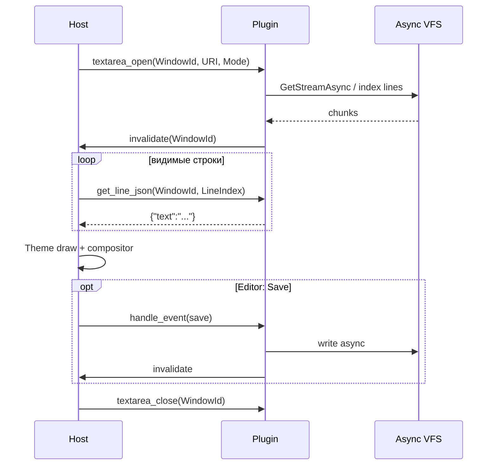

# Взаимодействие Text Area (Viewer / Editor) с плагином

> **Роль документа:** контракт многострочной текстовой области с плагином (просмотр и редактирование).  
> **Серия:** [UI_PRIMITIVES.md](UI_PRIMITIVES.md).  
> **Контекст:** [readme.md](SDS.md) §5–6, [ARCHITECTURE.md](ARCHITECTURE.md) (потоковый Viewer).

---

## 1. Область и роли

Text Area — MDI-окно или область внутри окна для просмотра/правки текста (и hex в специализированном режиме).

```text
TTerminalWindow (Viewer | Editor)
├── URI / Mode (text | hex | wrap)
├── Cursor / Scroll / Selection
└── Bound Plugin (WindowId)
    └── Document model (lines index, dirty, encoding)
```

| Участник | Ответственность |
|---|---|
| **Host** | Layout, scroll offset, курсор, selection, keymap (F3/F4, Save, Search), отрисовка видимых строк через тему; **вертикальная полоса прокрутки** (клик ▲/▼/трек) и chrome (F-keys, status). |
| **Плагин** | Документ: число строк/символов, выдача видимого диапазона, save/load через VFS, dirty-флаг. |
| **Async VFS** | Потоковое чтение/запись; файлы > 10 МБ не грузятся целиком в RAM. |
| **IThemeRenderer** | Рамка окна, gutter, **`DrawScrollBar`**, статусы/toolbar; подсветка синтаксиса — логические токены от плагина, цвета от темы (Post-MVP). |

---

## 2. Жизненный цикл



| Этап | Действие |
|---|---|
| **open** | Привязка URI/mode; старт фонового индексирования. |
| **pull lines** | Host запрашивает только видимый диапазон (+ строку курсора). |
| **edit** | Editor: Host шлёт логические правки; плагин обновляет модель. |
| **save / reload** | События; I/O в worker. |
| **close** | Cancel index/save jobs; запрос confirm при dirty. |

---

## 3. API и JSON

```pascal
function mtn_textarea_open(WindowId: Integer; const URI: PAnsiChar;
  Mode: Integer): Integer; cdecl;  // 0=view, 1=edit, 2=hex

procedure mtn_textarea_close(WindowId: Integer); cdecl;

function mtn_textarea_get_line_count(WindowId: Integer): Int64; cdecl;

procedure mtn_textarea_get_line_json(WindowId: Integer; LineIndex: Int64;
  OutBuffer: PAnsiChar; MaxLen: Integer); cdecl;

procedure mtn_textarea_get_meta_json(WindowId: Integer;
  OutBuffer: PAnsiChar; MaxLen: Integer); cdecl;

procedure mtn_plugin_handle_event(WindowId: Integer; EventType: Integer;
  Param1: Integer; Param2: Integer); cdecl;

procedure mtn_host_invalidate(WindowId: Integer); cdecl;
```

### 3.1. Метаданные документа

```json
{
  "uri": "file:///D:/Work/readme.md",
  "mode": "edit",
  "encoding": "utf-8",
  "crlf": true,
  "dirty": false,
  "read_only": false,
  "size": 32847,
  "indexing": false
}
```

### 3.2. JSON строки

```json
{
  "text": "Hello, MTN2",
  "line_ending": "lf"
}
```

Для hex-режима:

```json
{
  "offset": 256,
  "hex": "48 65 6C 6C 6F",
  "ascii": "Hello"
}
```

Плагин **не** возвращает цвета токенов в MVP. Post-MVP: массив логических spans `{ "start", "len", "token": "keyword" }` — тему мапит в цвета.

**Markdown Viewer (Post-MVP, cell-aware):** отдельный режим Text Area для `.md`. Плагин парсит разметку в worker и отдаёт видимые строки со spans (`heading`, `emphasis`, `code`, `link`, `list_item`, `quote`, …); Host/тема стилизуют ячейки. Изображения из MD — заявки Overlay ([OVERLAY_PLUGIN.md](OVERLAY_PLUGIN.md)). Это рендеринг в `TTerminalGrid`, не HTML/WYSIWYG-preview. См. roadmap SDS, Post-MVP.

---

## 4. События

| EventType | Имя | Param1 | Param2 | Семантика |
|---|---|---|---|---|
| 40 | `scroll` | FirstVisibleLine | 0 | Informational; pull и так по ScrollOffset Host |
| 41 | `caret` | Line | Column | Курсор сдвинут |
| 42 | `insert` | Line | Column | Вставка; текст — через `mtn_host_get_event_payload` |
| 43 | `delete` | Line | Column | Удаление; длина/диапазон в payload |
| 44 | `save` | 0 | 0 | Сохранить |
| 45 | `reload` | 0 | 0 | Перечитать с диска |
| 46 | `find` | 0 | 0 | Поиск; pattern в payload |
| 47 | `replace` | 0 | 0 | Замена (Editor) |
| 48 | `set_mode` | Mode | 0 | view/edit/hex |
| 49 | `close_query` | 0 | 0 | Запрос закрытия; плагин отвечает dirty через meta |

```pascal
procedure mtn_host_get_event_payload(WindowId: Integer;
  OutBuffer: PAnsiChar; MaxLen: Integer); cdecl;
```

MVP Editor: допустимо упростить — Host держит буфер малого файла целиком и дергает плагин только для load/save; контракт выше — целевой для крупных файлов и единообразия Pull.

---

## 5. Владение состоянием

| Состояние | Владелец |
|---|---|
| ScrollOffset (top line), caret, selection UI, hit-test scrollbar | **Host** |
| Содержимое / индекс строк / dirty / encoding | **Плагин** |
| URI окна | **Host** (источник истины для заголовка/сессии) |

**Scrollbar (MVP):** Host рисует вертикальную полосу в правом столбце тела окна (`Theme.DrawScrollBar`); позиция бегунка = `TopLine / max(0, LineCount − ViewHeight)`. Плагин не рисует scrollbar и не обрабатывает клики по нему. Viewer find и Editor clipboard/undo — Host.

Инвариант Architecture: файлы > 10 МБ — потоково; `get_line_json` не читает весь файл.

---

## 6. Потоки

1. `get_line_count` / `get_line_json` — UI-поток, O(1)/O(line), без I/O.
2. Индексация и save — worker; прогресс можно отразить в Status Line через Event Bus.
3. `Synchronize` запрещён.

---

## 7. Связь с ассоциациями

Host открывает Text Area по F3/F4 / ассоциациям. Плагин панели только отдаёт `uri`; выбор Viewer vs Editor — ядро.

---

## 8. Инварианты

1. Нет Canvas у плагина; нет цветов строк в MVP.
2. Pull только видимого диапазона.
3. Dirty + `close_query`: Host показывает confirm-диалог (примитив Dialog), не плагин напрямую.
4. При `close` — cancel всех job документа.
5. Scrollbar — Host/тема; плагин отдаёт только `LineCount` / строки.
